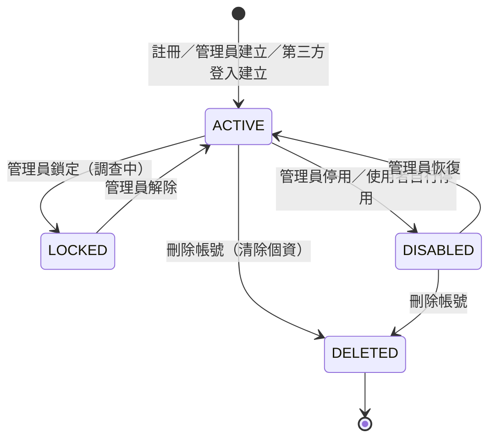
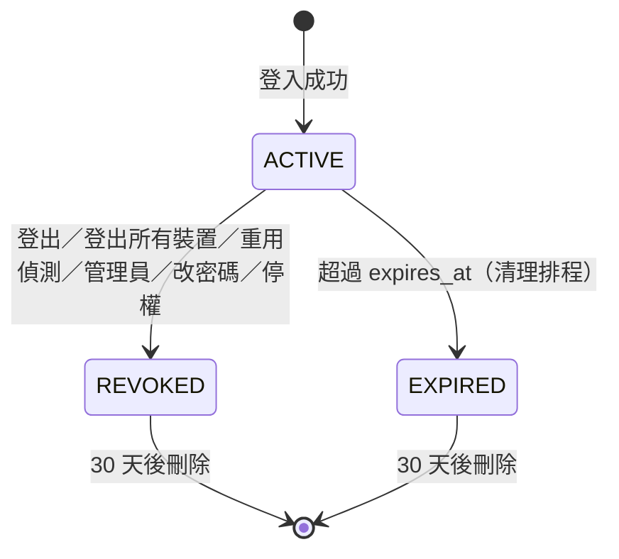
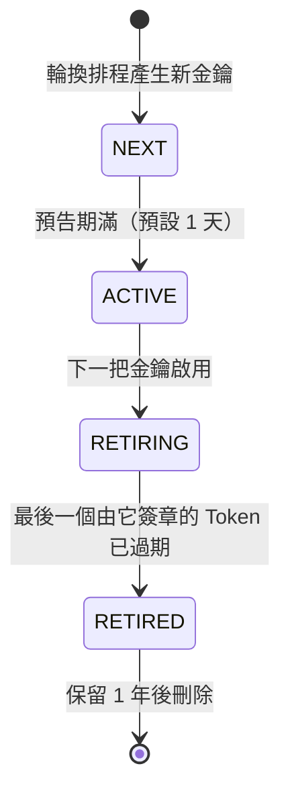
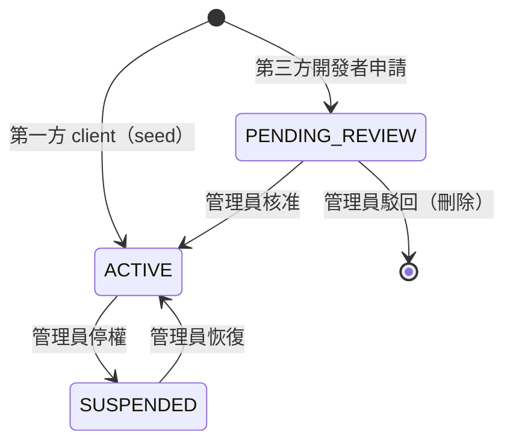

# Authorization Server 資料模型（表設計）

| 項目 | 內容 |
|---|---|
| 狀態 | 📝 詳細設計草案 |
| 日期 | 2026-10-07 |
| 資料庫 | **預設 SQLite**（零設定即可啟動）；正式環境可在 YAML 切換為 **PostgreSQL 16 以上**（[詳細設計 D22](auth-server-detailed-design.md#d22-資料庫抽象)） |
| 平台 | Spring Boot 4.1.1、Spring Security 7.1.1（內含 Authorization Server）、Spring Session 4.1.1 |
| 上層文件 | [Authorization Server 設計](auth-server-design.md)（架構與決策）；[詳細設計](auth-server-detailed-design.md)（元件與流程） |

本文件是 Authorization Server **資料表的唯一權威來源**。§4～§9 以 **PostgreSQL** 撰寫並說明每張表；**SQLite 版的完整 DDL 見 [§17](#17-sqlite-版-ddl)**。兩者的表、欄位、約束、索引一一對應，Java 程式碼完全相同（P8）。[Authorization Server 設計 §5](auth-server-design.md#5-資料表設計) 只保留摘要。

官方表（`oauth2_*`、`SPRING_SESSION*`）的 DDL 取自 Spring Security 7.1.1 與 Spring Session 4.1.1 jar 中隨附的 schema 檔，並依其註解調整為 PostgreSQL 版本（2026-10-07 查證）。

---

## 目錄

1. [設計原則與命名規則](#1-設計原則與命名規則)
2. [資料表總覽](#2-資料表總覽)
3. [關聯圖](#3-關聯圖)
4. [身分：使用者與外部帳號](#4-身分使用者與外部帳號)
5. [權限：角色、權限、scope](#5-權限角色權限scope)
6. [OAuth：Client 與授權（含官方表）](#6-oauthclient-與授權含官方表)
7. [Session、授權關聯與重用偵測](#7-session授權關聯與重用偵測)
8. [安全與稽核](#8-安全與稽核)
9. [Spring Session（官方表）](#9-spring-session官方表)
10. [狀態機](#10-狀態機)
11. [關鍵查詢](#11-關鍵查詢)
12. [初始資料](#12-初始資料)
13. [Flyway migration 規劃](#13-flyway-migration-規劃)
14. [資料保留、清理與容量估算](#14-資料保留清理與容量估算)
15. [與前一版設計的差異](#15-與前一版設計的差異)
16. [驗證紀錄](#16-驗證紀錄)
17. [SQLite 版 DDL](#17-sqlite-版-ddl)

---

## 1. 設計原則與命名規則

### 1.1 原則

| # | 原則 | 說明 |
|---|---|---|
| P1 | **AS 使用專屬資料庫** | 不與業務系統共用 schema。官方的 `JdbcOAuth2AuthorizationService` 把表名寫死為 `oauth2_authorization`（`TABLE_NAME` 常數，已查證），無法加前綴；專屬資料庫可以根本避免撞名 |
| P2 | **官方表不修改結構** | `oauth2_*` 與 `SPRING_SESSION*` 只做 PostgreSQL 型別調整與**新增索引**，不增刪欄位，確保 Spring 升級時不必改寫 |
| P3 | **擴充資料放在自建表** | 需要附加在官方表上的資料（例如 client 的信任等級），以 1 對 1 的擴充表存放 |
| P4 | **秘密只存雜湊** | 密碼（BCrypt）、一次性 token（SHA-256）、client secret（BCrypt）。唯一例外是 `oauth2_authorization` 中的 token 值，由官方實作以明文儲存（見 [§6.3](#63-oauth2_authorization官方)） |
| P5 | **使用者 ID 永不變更** | `app_user.id`（UUID）即 Token 的 `sub`，也是 Spring Security 的 principal name。帳號名稱、Email 可以變更，ID 不變 |
| P6 | **預設拒絕** | 狀態欄位一律有 `CHECK` 約束；未知狀態不可能寫入 |
| P7 | **時間一律 `TIMESTAMPTZ`** | 官方 schema 註解亦要求 PostgreSQL 使用 `timestamptz` |
| P8 | **應用程式碼與資料庫無關** | 所有 Java 程式碼（Repository、查詢）在每種資料庫上完全相同；差異只存在於 DDL（依資料庫分開的 Flyway migration）與極少數 SQL（[詳細設計 D22](auth-server-detailed-design.md#d22-資料庫抽象)） |
| P9 | **只使用可攜的欄位型別** | ID 為 `VARCHAR(36)`、IP 為 `VARCHAR(45)`、JSON 為 `TEXT`，不使用 PostgreSQL 的 `UUID`、`INET`、`JSONB`。原因：以字串綁定參數時，PostgreSQL 會拒絕寫入這些原生型別；官方表的 `principal_name` 本來就是字串，ID 也是字串才能直接比對 |
| P10 | **時間由應用程式寫入** | 不使用 `DEFAULT NOW()`、`NOW()`、`INTERVAL`。時間以參數傳入（`java.time.Clock` 產生），SQLite 也因此能以相同程式碼運作，測試時也能控制時間 |
| P11 | **格式驗證在應用程式** | 帳號、角色代碼、權限代碼、scope 代碼的格式以 Bean Validation 檢查；資料庫只保留可攜的約束（列舉 `CHECK`、長度、唯一、外鍵） |

### 1.2 命名規則

| 對象 | 規則 | 範例 |
|---|---|---|
| 表 | 小寫 snake_case，依領域加前綴 | `app_user`、`auth_session`、`client_profile` |
| 前綴 | `app_`：身分與權限；`auth_`：登入 Session；`client_`／`api_`：OAuth 擴充；官方表維持原名 | — |
| 主鍵 | 自建表使用 `UUID`（由應用程式以 UUIDv7 產生，具時間排序性）；稽核類大量資料使用 `BIGINT GENERATED ALWAYS AS IDENTITY` | `app_user.id`、`login_audit.id` |
| 外鍵 | `<被參照表單數>_id` | `user_id`、`role_id` |
| 唯一約束 | `ux_<表>_<欄位>` | `ux_app_user_username` |
| 一般索引 | `ix_<表>_<欄位>` | `ix_login_audit_ip_time` |
| CHECK | `ck_<表>_<欄位>` | `ck_app_user_status` |
| 布林 | `is_` 或形容詞 | `email_verified`、`built_in` |
| 時間 | `*_at` | `created_at`、`revoked_at` |

### 1.3 共通欄位

| 欄位 | 型別 | 說明 |
|---|---|---|
| `created_at` | `TIMESTAMPTZ NOT NULL`（SQLite：`INTEGER NOT NULL`） | 建立時間，**由應用程式寫入**（見 P10） |
| `updated_at` | 同上 | 由應用程式在更新時寫入（不使用 trigger，避免隱藏邏輯） |
| `row_version` | `BIGINT NOT NULL DEFAULT 0` | 樂觀鎖，只用在會被並發修改的表（`app_user`） |

---

## 2. 資料表總覽

| # | 表 | 分類 | 來源 | 預估筆數（10 萬使用者） | 階段 |
|---|---|---|---|---|---|
| 1 | `app_user` | 身分 | 自建 | 10 萬 | 1 |
| 2 | `user_federated_identity` | 身分 | 自建 | 10～15 萬 | 1 |
| 3 | `user_action_token` | 身分 | 自建 | 數千（短期） | 4 |
| 4 | `app_role` | 權限 | 自建 | 數十 | 1 |
| 5 | `app_permission` | 權限 | 自建 | 數百 | 1 |
| 6 | `app_user_role` | 權限 | 自建 | 10～30 萬 | 1 |
| 7 | `app_role_permission` | 權限 | 自建 | 數千 | 1 |
| 8 | `api_resource` | OAuth | 自建 | 數十 | 1 |
| 9 | `app_scope` | OAuth | 自建 | 數十～數百 | 1 |
| 10 | `app_scope_permission` | OAuth | 自建 | 數百 | 3 |
| 11 | `oauth2_registered_client` | OAuth | **官方** | 數十～數千 | 1 |
| 12 | `client_profile` | OAuth | 自建 | 同上 | 1 |
| 13 | `oauth2_authorization` | OAuth | **官方** | 活躍 Session 數 × client 數 | 1 |
| 14 | `oauth2_authorization_consent` | OAuth | **官方** | 第三方授權數 | 3 |
| 15 | `auth_session` | Session | 自建 | 活躍裝置數 | 1 |
| 16 | `session_authorization` | Session | 自建 | 同 #13 | 1 |
| 17 | `refresh_token_history` | Session | 自建 | 刷新次數 × 保留期 | 2 |
| 18 | `signing_key` | 安全 | 自建 | 數筆 | 1 |
| 19 | `login_audit` | 安全 | 自建 | 每月數十萬 | 2 |
| 20 | `admin_audit_log` | 安全 | 自建 | 每月數千 | 3 |
| 21 | `SPRING_SESSION` | Session | **官方** | 同時在線的 AS 瀏覽器 Session | 2 |
| 22 | `SPRING_SESSION_ATTRIBUTES` | Session | **官方** | 同上 × 屬性數 | 2 |
| 23 | `shedlock` | 維運 | ShedLock | 排程數量（< 10） | 1 |

「階段」對應 [Authorization Server 設計 §11](auth-server-design.md#11-分階段實作計畫)。為了避免之後頻繁 migration，**第 1 階段就建立 #1～#16、#18**，其餘依階段新增。

---

## 3. 關聯圖

```mermaid
erDiagram
    app_user {
        UUID id PK
        VARCHAR username UK
        VARCHAR email UK
        VARCHAR status
    }
    user_federated_identity {
        UUID id PK
        UUID user_id FK
        VARCHAR provider
        VARCHAR provider_subject
    }
    user_action_token {
        CHAR token_hash PK
        UUID user_id FK
        VARCHAR purpose
    }
    app_role {
        UUID id PK
        VARCHAR code UK
    }
    app_permission {
        UUID id PK
        VARCHAR code UK
    }
    app_user_role {
        UUID user_id PK
        UUID role_id PK
    }
    app_role_permission {
        UUID role_id PK
        UUID permission_id PK
    }
    api_resource {
        VARCHAR code PK
    }
    app_scope {
        VARCHAR code PK
        VARCHAR api_resource_code FK
    }
    app_scope_permission {
        VARCHAR scope_code PK
        UUID permission_id PK
    }
    oauth2_registered_client {
        VARCHAR id PK
        VARCHAR client_id UK
    }
    client_profile {
        VARCHAR registered_client_id PK
        VARCHAR trust_level
    }
    oauth2_authorization {
        VARCHAR id PK
        VARCHAR registered_client_id
        VARCHAR principal_name
    }
    oauth2_authorization_consent {
        VARCHAR registered_client_id PK
        VARCHAR principal_name PK
    }
    auth_session {
        UUID session_id PK
        UUID user_id FK
        VARCHAR status
    }
    session_authorization {
        VARCHAR authorization_id PK
        UUID session_id FK
    }
    refresh_token_history {
        CHAR token_hash PK
        VARCHAR authorization_id
        UUID session_id
    }
    signing_key {
        VARCHAR kid PK
        VARCHAR status
    }
    login_audit {
        BIGINT id PK
        UUID user_id FK
    }

    app_user ||--o{ user_federated_identity : "連結"
    app_user ||--o{ user_action_token : "擁有"
    app_user ||--o{ app_user_role : ""
    app_role ||--o{ app_user_role : ""
    app_role ||--o{ app_role_permission : ""
    app_permission ||--o{ app_role_permission : ""
    api_resource ||--o{ app_scope : "包含"
    app_scope ||--o{ app_scope_permission : ""
    app_permission ||--o{ app_scope_permission : ""
    oauth2_registered_client ||--|| client_profile : "擴充"
    oauth2_registered_client ||--o{ oauth2_authorization : "邏輯關聯"
    oauth2_registered_client ||--o{ oauth2_authorization_consent : "邏輯關聯"
    app_user ||--o{ oauth2_authorization : "principal_name = id"
    app_user ||--o{ auth_session : "登入"
    auth_session ||--o{ session_authorization : ""
    oauth2_authorization ||--o| session_authorization : ""
    auth_session ||--o{ refresh_token_history : "邏輯關聯"
    app_user ||--o{ login_audit : ""
```



「邏輯關聯」代表沒有資料庫外鍵：官方表不允許加外鍵（P2），或紀錄需要比被參照的資料活得更久（`refresh_token_history`）。

---

## 4. 身分：使用者與外部帳號

### 4.1 `app_user`

使用者主檔。一位使用者可以同時擁有密碼與多個外部帳號。

```sql
CREATE TABLE app_user (
    id                  VARCHAR(36)          PRIMARY KEY,
    username            VARCHAR(64),
    email               VARCHAR(255),
    email_verified      BOOLEAN       NOT NULL DEFAULT FALSE,
    password_hash       VARCHAR(255),
    display_name        VARCHAR(128),
    avatar_url          VARCHAR(1024),
    locale              VARCHAR(16),
    status              VARCHAR(16)   NOT NULL DEFAULT 'ACTIVE',
    failed_login_count  INT           NOT NULL DEFAULT 0,
    locked_until        TIMESTAMPTZ,
    password_changed_at TIMESTAMPTZ,
    last_login_at       TIMESTAMPTZ,
    created_at          TIMESTAMPTZ   NOT NULL,
    updated_at          TIMESTAMPTZ   NOT NULL,
    row_version         BIGINT        NOT NULL DEFAULT 0,
    CONSTRAINT ck_app_user_status   CHECK (status IN ('ACTIVE', 'LOCKED', 'DISABLED', 'DELETED')),
    CONSTRAINT ck_app_user_username CHECK (username IS NULL OR length(username) BETWEEN 3 AND 64),
    CONSTRAINT ck_app_user_failures CHECK (failed_login_count >= 0)
);
CREATE UNIQUE INDEX ux_app_user_username ON app_user (LOWER(username)) WHERE username IS NOT NULL;
CREATE UNIQUE INDEX ux_app_user_email    ON app_user (LOWER(email))    WHERE email IS NOT NULL;
CREATE INDEX        ix_app_user_status   ON app_user (status)          WHERE status <> 'ACTIVE';
```

| 欄位 | 型別 | NULL | 說明 |
|---|---|---|---|
| `id` | VARCHAR(36) | ✗ | 使用者 ID（UUIDv7 字串）。即 Token 的 `sub`、`oauth2_authorization.principal_name`、Spring Security 的 `Authentication#getName()` |
| `username` | VARCHAR(64) | ✓ | 帳號密碼登入用的帳號。只用第三方登入的使用者為 `NULL`。不分大小寫唯一 |
| `email` | VARCHAR(255) | ✓ | **只存已驗證的 Email**（[D06](auth-server-design.md#d06-帳號連結策略)）。不分大小寫唯一；也可作為登入帳號（實作時決定是否開放） |
| `email_verified` | BOOLEAN | ✗ | 寫入 ID Token 的 `email_verified` |
| `password_hash` | VARCHAR(255) | ✓ | `DelegatingPasswordEncoder` 格式，例如 `{bcrypt}$2a$10$...`。只用第三方登入時為 `NULL` |
| `display_name`、`avatar_url`、`locale` | — | ✓ | 寫入 ID Token 的 `name`、`picture`、`locale`（需 `profile` scope） |
| `status` | VARCHAR(16) | ✗ | 見 [§10.1](#101-app_userstatus) |
| `failed_login_count` | INT | ✗ | 連續密碼錯誤次數；成功登入時歸零 |
| `locked_until` | TIMESTAMPTZ | ✓ | 暫時鎖定的到期時間。`status` 不變，判斷時以 `locked_until > NOW()` 為準 |
| `password_changed_at` | TIMESTAMPTZ | ✓ | 變更密碼時撤銷該時間之前的所有 Session |
| `last_login_at` | TIMESTAMPTZ | ✓ | 顯示用 |
| `row_version` | BIGINT | ✗ | 樂觀鎖：同時有「登入失敗計數」與「管理員停權」時避免覆蓋 |

**應用層約束**（資料庫無法表達）：

- 使用者至少要有一種登入方式：`password_hash IS NOT NULL` 或至少一筆 `user_federated_identity`。解除最後一個外部帳號時必須檢查。
- `DELETED` 為軟刪除：個資欄位（`username`、`email`、`display_name`、`avatar_url`）清為 `NULL`，保留 `id` 讓稽核紀錄仍可關聯。

### 4.2 `user_federated_identity`

使用者與外部身分提供者帳號的連結。

```sql
CREATE TABLE user_federated_identity (
    id               VARCHAR(36)          PRIMARY KEY,
    user_id          VARCHAR(36)          NOT NULL REFERENCES app_user(id) ON DELETE CASCADE,
    provider         VARCHAR(32)   NOT NULL,
    provider_subject VARCHAR(255)  NOT NULL,
    email            VARCHAR(255),
    email_verified   BOOLEAN       NOT NULL DEFAULT FALSE,
    display_name     VARCHAR(128),
    avatar_url       VARCHAR(1024),
    raw_attributes   TEXT,
    linked_at        TIMESTAMPTZ   NOT NULL,
    last_login_at    TIMESTAMPTZ,
    CONSTRAINT ux_federated_provider_subject UNIQUE (provider, provider_subject),
    CONSTRAINT ux_federated_user_provider    UNIQUE (user_id, provider)
);
CREATE INDEX ix_federated_user ON user_federated_identity (user_id);
```

| 欄位 | 說明 |
|---|---|
| `provider` | 與 `spring.security.oauth2.client.registration.<id>` 的 `<id>` 相同，例如 `google`、`github`、`line` |
| `provider_subject` | 提供者的使用者 ID：Google／LINE／Apple 為 ID Token 的 `sub`，GitHub 為數字 `id`（以字串儲存）。**唯一識別外部帳號的欄位** |
| `email`、`email_verified` | 提供者回傳的資料，**只供參考與帳號連結判斷**，不作為識別 |
| `raw_attributes` | 提供者回傳的使用者資訊（UserInfo／ID Token claims），**寫入前移除任何 token 欄位**。用於除錯與日後補欄位 |
| `ux_federated_user_provider` | 一位使用者在同一個提供者只能連結一個帳號 |

### 4.3 `user_action_token`

一次性的帳號操作 token：重設密碼、Email 驗證、帳號連結確認。

```sql
CREATE TABLE user_action_token (
    token_hash  CHAR(64)     PRIMARY KEY,
    user_id     VARCHAR(36)         NOT NULL REFERENCES app_user(id) ON DELETE CASCADE,
    purpose     VARCHAR(32)  NOT NULL,
    payload     TEXT,
    expires_at  TIMESTAMPTZ  NOT NULL,
    used_at     TIMESTAMPTZ,
    created_at  TIMESTAMPTZ  NOT NULL,
    CONSTRAINT ck_action_token_purpose CHECK (purpose IN ('PASSWORD_RESET', 'EMAIL_VERIFY', 'LINK_ACCOUNT')),
    CONSTRAINT ck_action_token_expiry  CHECK (expires_at > created_at)
);
CREATE INDEX ix_action_token_user    ON user_action_token (user_id, purpose) WHERE used_at IS NULL;
CREATE INDEX ix_action_token_expires ON user_action_token (expires_at);
```

| `purpose` | 有效期 | `payload` 範例 |
|---|---|---|
| `PASSWORD_RESET` | 30 分鐘 | `null` |
| `EMAIL_VERIFY` | 24 小時 | `{"email": "alice@example.com"}` |
| `LINK_ACCOUNT` | 10 分鐘 | `{"provider": "google", "provider_subject": "1234", "email": "..."}`（D06-C 的待確認連結） |

明文 token 只出現在寄出的 Email 或重導向網址中；資料庫只存 `SHA-256(token)` 的十六進位字串。同一使用者、同一用途建立新 token 時，舊的未使用 token 一律標記為已使用。

---

## 5. 權限：角色、權限、scope

### 5.1 `app_role`、`app_permission`

```sql
CREATE TABLE app_role (
    id          VARCHAR(36)          PRIMARY KEY,
    code        VARCHAR(64)   NOT NULL,
    name        VARCHAR(128)  NOT NULL,
    description TEXT,
    built_in    BOOLEAN       NOT NULL DEFAULT FALSE,
    created_at  TIMESTAMPTZ   NOT NULL,
    updated_at  TIMESTAMPTZ   NOT NULL,
    CONSTRAINT ux_app_role_code UNIQUE (code)
);

CREATE TABLE app_permission (
    id          VARCHAR(36)          PRIMARY KEY,
    code        VARCHAR(128)  NOT NULL,
    name        VARCHAR(128)  NOT NULL,
    description TEXT,
    built_in    BOOLEAN       NOT NULL DEFAULT FALSE,
    created_at  TIMESTAMPTZ   NOT NULL,
    updated_at  TIMESTAMPTZ   NOT NULL,
    CONSTRAINT ux_app_permission_code UNIQUE (code)
);
```

| 規則 | 說明 |
|---|---|
| `code` **不含前綴** | `ADMIN`、`order:read`。`ROLE_`／`PERM_` 前綴由 Resource Server 端的 starter 加上，與 [JWT Claims 契約](jwt-claims.md) 一致 |
| 角色代碼 | 大寫英數與底線，例如 `ADMIN`、`CONTENT_MANAGER` |
| 權限代碼 | `資源:動作`，小寫，例如 `order:read`、`report:export`；可多層：`admin:user:write` |
| `built_in` | AS 自身需要的角色與權限（[§12](#12-初始資料)），不可刪除、不可改代碼 |

### 5.2 `app_user_role`、`app_role_permission`

```sql
CREATE TABLE app_user_role (
    user_id    VARCHAR(36)         NOT NULL REFERENCES app_user(id) ON DELETE CASCADE,
    role_id    VARCHAR(36)         NOT NULL REFERENCES app_role(id) ON DELETE RESTRICT,
    granted_by VARCHAR(36)         REFERENCES app_user(id) ON DELETE SET NULL,
    granted_at TIMESTAMPTZ  NOT NULL,
    expires_at TIMESTAMPTZ,
    PRIMARY KEY (user_id, role_id)
);
CREATE INDEX ix_user_role_role ON app_user_role (role_id);

CREATE TABLE app_role_permission (
    role_id       VARCHAR(36) NOT NULL REFERENCES app_role(id)       ON DELETE CASCADE,
    permission_id VARCHAR(36) NOT NULL REFERENCES app_permission(id) ON DELETE RESTRICT,
    PRIMARY KEY (role_id, permission_id)
);
CREATE INDEX ix_role_permission_permission ON app_role_permission (permission_id);
```

| 設計 | 理由 |
|---|---|
| 刪除角色時 `RESTRICT` | 仍有使用者擁有該角色時不可刪除，避免誤刪造成大量使用者失去權限 |
| 刪除權限時 `RESTRICT` | 仍有角色引用時不可刪除 |
| `expires_at` | 支援臨時授權（例如值班期間的 `ON_CALL` 角色）。查詢時以 `expires_at IS NULL OR expires_at > NOW()` 過濾 |
| 沒有「使用者直接授予權限」的表 | 一律透過角色授予，方便稽核與管理 |

### 5.3 `api_resource`、`app_scope`、`app_scope_permission`

`api_resource` 定義 Token 的 audience（[D07](auth-server-design.md#d07-access-token-的-aud-與內容)）；`app_scope` 定義 client 可以申請的 scope 與同意畫面的文字；`app_scope_permission` 定義第三方 client 透過 scope 可以取得哪些權限。

```sql
CREATE TABLE api_resource (
    code        VARCHAR(64)   PRIMARY KEY,
    name        VARCHAR(128)  NOT NULL,
    description TEXT,
    created_at  TIMESTAMPTZ   NOT NULL
);

CREATE TABLE app_scope (
    code              VARCHAR(128)  PRIMARY KEY,
    api_resource_code VARCHAR(64)   REFERENCES api_resource(code) ON DELETE RESTRICT,
    display_name      VARCHAR(128)  NOT NULL,
    description       TEXT,
    consent_required  BOOLEAN       NOT NULL DEFAULT TRUE,
    built_in          BOOLEAN       NOT NULL DEFAULT FALSE,
    created_at        TIMESTAMPTZ   NOT NULL
);
CREATE INDEX ix_app_scope_resource ON app_scope (api_resource_code);

CREATE TABLE app_scope_permission (
    scope_code    VARCHAR(128) NOT NULL REFERENCES app_scope(code)      ON DELETE CASCADE,
    permission_id VARCHAR(36)         NOT NULL REFERENCES app_permission(id) ON DELETE RESTRICT,
    PRIMARY KEY (scope_code, permission_id)
);
CREATE INDEX ix_scope_permission_permission ON app_scope_permission (permission_id);
```

| 欄位 | 說明 |
|---|---|
| `api_resource.code` | 即 `aud` 的值。第一版只有一筆共用的 `jacky917-api`（D07-B）；切換為 D07-C 時新增各 API 的代碼 |
| `app_scope.api_resource_code` | OIDC 標準 scope（`openid`、`profile`、`email`）為 `NULL` |
| `app_scope.consent_required` | `false` 的 scope 不顯示在同意畫面（例如 `openid`） |
| `app_scope_permission` | 只用於**第三方** client：Token 中的 `permissions` = 使用者同意的 scope 所對應的權限 ∩ 使用者本身的權限（[§11.3](#113-第三方-client-的權限計算)） |

---

## 6. OAuth：Client 與授權（含官方表）

### 6.1 `oauth2_registered_client`（官方）

由 `JdbcRegisteredClientRepository` 讀寫。PostgreSQL 版本（依官方註解：`timestamp` → `timestamptz`）：

```sql
CREATE TABLE oauth2_registered_client (
    id                            VARCHAR(100)  NOT NULL,
    client_id                     VARCHAR(100)  NOT NULL,
    client_id_issued_at           TIMESTAMPTZ   DEFAULT CURRENT_TIMESTAMP NOT NULL,
    client_secret                 VARCHAR(200)  DEFAULT NULL,
    client_secret_expires_at      TIMESTAMPTZ   DEFAULT NULL,
    client_name                   VARCHAR(200)  NOT NULL,
    client_authentication_methods VARCHAR(1000) NOT NULL,
    authorization_grant_types     VARCHAR(1000) NOT NULL,
    redirect_uris                 VARCHAR(1000) DEFAULT NULL,
    post_logout_redirect_uris     VARCHAR(1000) DEFAULT NULL,
    scopes                        VARCHAR(1000) NOT NULL,
    client_settings               VARCHAR(2000) NOT NULL,
    token_settings                VARCHAR(2000) NOT NULL,
    PRIMARY KEY (id)
);
-- 自行新增（不改變欄位）：client_id 唯一，官方 repository 以 client_id 查詢
CREATE UNIQUE INDEX ux_registered_client_client_id ON oauth2_registered_client (client_id);
```

| 欄位 | 本設計的使用方式 |
|---|---|
| `id` | UUID 字串（與 `client_id` 不同；`client_id` 對外公開） |
| `client_secret` | `{bcrypt}...`。public client（若有）為 `NULL`。**已實測**：`JdbcRegisteredClientRepository#save` 會拒絕與其他 client 相同的 secret（`Registered client must be unique. Found duplicate client secret`） |
| `client_authentication_methods` | 第一方 BFF：`client_secret_basic`；service account：`client_secret_basic` 或 `private_key_jwt` |
| `authorization_grant_types` | 逗號分隔：`authorization_code,refresh_token`（BFF）；`client_credentials`（service account）。見 [詳細設計 D15](auth-server-detailed-design.md#d15-支援的-grant-type) |
| `redirect_uris`、`post_logout_redirect_uris` | 逗號分隔，**完全比對**，不允許萬用字元 |
| `scopes` | 逗號分隔；必須都存在於 `app_scope` 中（由應用程式在寫入時檢查） |
| `client_settings` | JSON：`requireProofKey=true`（一律要求 PKCE）、`requireAuthorizationConsent`（第一方 `false`、第三方 `true`） |
| `token_settings` | JSON：AT 10 分鐘、RT 14 天、`reuseRefreshTokens=false`、授權碼 1 分鐘、ID Token 簽章演算法 RS256 |

> `client_settings`、`token_settings` 是 Spring Security 以 Jackson 序列化的 JSON，**不要手寫 SQL 修改**，一律透過 `RegisteredClientRepository#save` 寫入。

### 6.2 `client_profile`

```sql
CREATE TABLE client_profile (
    registered_client_id VARCHAR(100)  PRIMARY KEY,
    trust_level          VARCHAR(16)   NOT NULL,
    display_name         VARCHAR(128)  NOT NULL,
    description          TEXT,
    logo_url             VARCHAR(1024),
    homepage_url         VARCHAR(1024),
    privacy_policy_url   VARCHAR(1024),
    terms_url            VARCHAR(1024),
    owner_user_id        VARCHAR(36)          REFERENCES app_user(id) ON DELETE SET NULL,
    status               VARCHAR(16)   NOT NULL DEFAULT 'ACTIVE',
    created_at           TIMESTAMPTZ   NOT NULL,
    updated_at           TIMESTAMPTZ   NOT NULL,
    CONSTRAINT fk_client_profile_client FOREIGN KEY (registered_client_id)
        REFERENCES oauth2_registered_client(id) ON DELETE CASCADE,
    CONSTRAINT ck_client_profile_trust  CHECK (trust_level IN ('FIRST_PARTY', 'THIRD_PARTY')),
    CONSTRAINT ck_client_profile_status CHECK (status IN ('PENDING_REVIEW', 'ACTIVE', 'SUSPENDED')),
    CONSTRAINT ck_client_profile_third_party_policy
        CHECK (trust_level = 'FIRST_PARTY' OR privacy_policy_url IS NOT NULL)
);
CREATE INDEX ix_client_profile_owner ON client_profile (owner_user_id);
```

| 欄位 | 說明 |
|---|---|
| `trust_level` | 決定 Token 內容（D07）與是否需要同意畫面 |
| `status` | `SUSPENDED` 的 client 無法取得新 Token（由 repository 裝飾器在讀取時過濾）。見 [§10.4](#104-client_profilestatus) |
| `ck_client_profile_third_party_policy` | 第三方 client 必須提供隱私權政策網址 |

> 這是唯一一個對官方表設外鍵的地方：方向是**自建表 → 官方表**，不改變官方表本身（符合 P2）。

### 6.3 `oauth2_authorization`（官方）

由 `JdbcOAuth2AuthorizationService` 讀寫。每一筆代表「某使用者（或 client 本身）透過某 client 的一次授權」，同時保存授權碼、Access Token、Refresh Token、ID Token 的目前值。PostgreSQL 版本（依官方註解：`blob` → `text`、`timestamp` → `timestamptz`）：

```sql
CREATE TABLE oauth2_authorization (
    id                            VARCHAR(100)  NOT NULL,
    registered_client_id          VARCHAR(100)  NOT NULL,
    principal_name                VARCHAR(200)  NOT NULL,
    authorization_grant_type      VARCHAR(100)  NOT NULL,
    authorized_scopes             VARCHAR(1000) DEFAULT NULL,
    attributes                    TEXT          DEFAULT NULL,
    state                         VARCHAR(500)  DEFAULT NULL,
    authorization_code_value      TEXT          DEFAULT NULL,
    authorization_code_issued_at  TIMESTAMPTZ   DEFAULT NULL,
    authorization_code_expires_at TIMESTAMPTZ   DEFAULT NULL,
    authorization_code_metadata   TEXT          DEFAULT NULL,
    access_token_value            TEXT          DEFAULT NULL,
    access_token_issued_at        TIMESTAMPTZ   DEFAULT NULL,
    access_token_expires_at       TIMESTAMPTZ   DEFAULT NULL,
    access_token_metadata         TEXT          DEFAULT NULL,
    access_token_type             VARCHAR(100)  DEFAULT NULL,
    access_token_scopes           VARCHAR(1000) DEFAULT NULL,
    oidc_id_token_value           TEXT          DEFAULT NULL,
    oidc_id_token_issued_at       TIMESTAMPTZ   DEFAULT NULL,
    oidc_id_token_expires_at      TIMESTAMPTZ   DEFAULT NULL,
    oidc_id_token_metadata        TEXT          DEFAULT NULL,
    refresh_token_value           TEXT          DEFAULT NULL,
    refresh_token_issued_at       TIMESTAMPTZ   DEFAULT NULL,
    refresh_token_expires_at      TIMESTAMPTZ   DEFAULT NULL,
    refresh_token_metadata        TEXT          DEFAULT NULL,
    user_code_value               TEXT          DEFAULT NULL,
    user_code_issued_at           TIMESTAMPTZ   DEFAULT NULL,
    user_code_expires_at          TIMESTAMPTZ   DEFAULT NULL,
    user_code_metadata            TEXT          DEFAULT NULL,
    device_code_value             TEXT          DEFAULT NULL,
    device_code_issued_at         TIMESTAMPTZ   DEFAULT NULL,
    device_code_expires_at        TIMESTAMPTZ   DEFAULT NULL,
    device_code_metadata          TEXT          DEFAULT NULL,
    PRIMARY KEY (id)
);
```

**官方 schema 沒有任何索引**（只有主鍵），但 `findByToken` 會以 token 值查詢。以下索引為本設計新增（不改變欄位，符合 P2）：

```sql
-- 以 token 值查詢（換 Token、刷新、撤銷、內省、登出時的 id_token_hint）
-- token 值是長字串、只做等值比對，使用 HASH 索引（體積小；PostgreSQL 10 起已寫入 WAL）
CREATE INDEX ix_oauth2_authz_state        ON oauth2_authorization USING HASH (state);
CREATE INDEX ix_oauth2_authz_code         ON oauth2_authorization USING HASH (authorization_code_value);
CREATE INDEX ix_oauth2_authz_access       ON oauth2_authorization USING HASH (access_token_value);
CREATE INDEX ix_oauth2_authz_refresh      ON oauth2_authorization USING HASH (refresh_token_value);
CREATE INDEX ix_oauth2_authz_id_token     ON oauth2_authorization USING HASH (oidc_id_token_value);

-- 依使用者撤銷（登出所有裝置、停權、改密碼）
CREATE INDEX ix_oauth2_authz_principal    ON oauth2_authorization (principal_name, registered_client_id);

-- 清理排程（§14）
CREATE INDEX ix_oauth2_authz_refresh_exp  ON oauth2_authorization (refresh_token_expires_at);
CREATE INDEX ix_oauth2_authz_access_exp   ON oauth2_authorization (access_token_expires_at);
CREATE INDEX ix_oauth2_authz_code_exp     ON oauth2_authorization (authorization_code_expires_at);
```

| 欄位 | 本設計中的值 |
|---|---|
| `principal_name` | 使用者授權時為 `app_user.id`（UUID 字串，[詳細設計 D16](auth-server-detailed-design.md#d16-principal-標準化)）；`client_credentials` 時為 `client_id` |
| `attributes` | JSON：包含 principal（`UsernamePasswordAuthenticationToken` + `User`）、授權請求、PKCE 參數等 |
| `*_value` | **明文 token**。Access Token 與 ID Token 是 JWT（約 0.8～2 KB）；Refresh Token 與授權碼是隨機字串 |
| `user_code_*`、`device_code_*` | Device Authorization Grant 用；本設計不啟用，欄位保留為 `NULL` |

**安全注意**：token 以明文儲存是官方實作的行為。對策：專屬資料庫（P1）、最小權限的 DB 帳號、磁碟／備份加密、DB 存取稽核。若日後需要只存雜湊，要自行實作 `OAuth2AuthorizationService`（列為第 5 階段選項）。

### 6.4 `oauth2_authorization_consent`（官方）

```sql
CREATE TABLE oauth2_authorization_consent (
    registered_client_id VARCHAR(100)  NOT NULL,
    principal_name       VARCHAR(200)  NOT NULL,
    authorities          VARCHAR(1000) NOT NULL,
    PRIMARY KEY (registered_client_id, principal_name)
);
-- 自行新增：使用者在帳號設定頁列出、撤回已授權的第三方應用
CREATE INDEX ix_oauth2_consent_principal ON oauth2_authorization_consent (principal_name);
```

`authorities` 為逗號分隔的 `SCOPE_xxx`，代表使用者已同意的 scope。只有 `requireAuthorizationConsent=true`（第三方）的 client 會寫入。

---

## 7. Session、授權關聯與重用偵測

### 7.1 三種「Session」的區別

本設計中有三個容易混淆的概念：

| 名稱 | 存放位置 | 代表什麼 | 生命週期 | 對外的識別值 |
|---|---|---|---|---|
| **AS 瀏覽器 Session** | `SPRING_SESSION` | 使用者在 AS 網域上的 HttpSession（登入頁、授權頁） | 閒置 30 分鐘到期 | Cookie `SESSION` |
| **登入 Session**（`auth_session`） | `auth_session` | 「一次登入」：同一個裝置從登入到登出／撤銷的整段期間，跨越多次 Token 刷新 | 最長 90 天（D08） | Access Token 的 `asid` claim |
| **OIDC `sid`** | 由 Spring Security 從 AS 瀏覽器 Session 衍生 | OIDC 規範中的 Session ID，用於 RP-Initiated Logout 驗證 | 同 AS 瀏覽器 Session | ID Token 的 `sid` claim |

> **設計調整**：前一版設計把登入 Session 的 ID 放在 Access Token 的 `sid`。查證後發現 Spring Security 7.1.1 的 `JwtGenerator` 會依 AS 瀏覽器 Session 產生 ID Token 的 `sid`，`OidcLogoutAuthenticationProvider` 也以它驗證登出請求。若覆寫 `sid` 會破壞 OIDC 登出，因此登入 Session 的 ID 改用自訂 claim **`asid`**（auth session id），ID Token 的 `sid` 交由 Spring Security 管理。見 [詳細設計 D20](auth-server-detailed-design.md#d20-session-識別-claim)。

### 7.2 `auth_session`

```sql
CREATE TABLE auth_session (
    session_id     VARCHAR(36)          PRIMARY KEY,
    user_id        VARCHAR(36)          NOT NULL REFERENCES app_user(id) ON DELETE CASCADE,
    status         VARCHAR(16)   NOT NULL DEFAULT 'ACTIVE',
    login_method   VARCHAR(16)   NOT NULL,
    idp            VARCHAR(32)   NOT NULL DEFAULT 'local',
    amr            VARCHAR(64)   NOT NULL DEFAULT 'pwd',
    ip_address     VARCHAR(45),
    user_agent     VARCHAR(512),
    device_label   VARCHAR(128),
    created_at     TIMESTAMPTZ   NOT NULL,
    last_seen_at   TIMESTAMPTZ   NOT NULL,
    expires_at     TIMESTAMPTZ   NOT NULL,
    revoked_at     TIMESTAMPTZ,
    revoke_reason  VARCHAR(32),
    CONSTRAINT ck_auth_session_status CHECK (status IN ('ACTIVE', 'REVOKED', 'EXPIRED')),
    CONSTRAINT ck_auth_session_method CHECK (login_method IN ('PASSWORD', 'FEDERATED')),
    CONSTRAINT ck_auth_session_reason CHECK (revoke_reason IS NULL OR revoke_reason IN
        ('LOGOUT', 'LOGOUT_ALL', 'REUSE_DETECTED', 'ADMIN', 'PASSWORD_CHANGED', 'USER_DISABLED', 'EXPIRED')),
    CONSTRAINT ck_auth_session_revoked CHECK ((status = 'REVOKED') = (revoked_at IS NOT NULL)),
    CONSTRAINT ck_auth_session_expiry  CHECK (expires_at > created_at)
);
CREATE INDEX ix_auth_session_user_active ON auth_session (user_id, last_seen_at DESC) WHERE status = 'ACTIVE';
CREATE INDEX ix_auth_session_expires     ON auth_session (expires_at) WHERE status = 'ACTIVE';
CREATE INDEX ix_auth_session_revoked_at  ON auth_session (revoked_at) WHERE status <> 'ACTIVE';
```

| 欄位 | 說明 |
|---|---|
| `session_id` | 即 Access Token 的 `asid` |
| `login_method`、`idp` | 例如 `PASSWORD`／`local`、`FEDERATED`／`google`；寫入 Access Token 的 `idp` |
| `amr` | 驗證方式（RFC 8176），逗號分隔：`pwd`、`fed`；MFA 上線後為 `pwd,otp` |
| `ip_address` | `VARCHAR(45)`（IPv6 最長 45 字元）。為了跨資料庫一致，不使用 PostgreSQL 的 `INET` |
| `device_label` | 由 User-Agent 解析的顯示名稱，例如「Chrome on macOS」，用於帳號設定頁的「登入中的裝置」 |
| `last_seen_at` | 每次刷新 Token 時更新（[詳細設計 §5.4](auth-server-detailed-design.md#54-刷新-token-與重用偵測)） |
| `expires_at` | 絕對上限 = `created_at + 90 天`；到期後即使 Refresh Token 仍有效也拒絕刷新 |
| `ck_auth_session_revoked` | `REVOKED` 狀態與 `revoked_at` 必須同時存在 |

### 7.3 `session_authorization`

把官方的 `oauth2_authorization` 連結到 `auth_session`，用於「依登入 Session 撤銷所有授權」與「刷新時取得 `asid`」。

```sql
CREATE TABLE session_authorization (
    authorization_id     VARCHAR(100) PRIMARY KEY,
    session_id           VARCHAR(36)         NOT NULL REFERENCES auth_session(session_id) ON DELETE CASCADE,
    registered_client_id VARCHAR(100) NOT NULL,
    created_at           TIMESTAMPTZ  NOT NULL,
    CONSTRAINT fk_session_authz_authorization FOREIGN KEY (authorization_id)
        REFERENCES oauth2_authorization(id) ON DELETE CASCADE
);
CREATE INDEX ix_session_authz_session ON session_authorization (session_id);
```

| 設計 | 說明 |
|---|---|
| 一個登入 Session 對多個授權 | 使用者登入一次後，可能同時授權了網頁 BFF 與第三方應用（SSO） |
| 外鍵到官方表 | 方向為自建表 → 官方表（P2）。官方 service 刪除授權時，連結自動刪除 |
| 寫入時機 | 授權碼首次儲存時（瀏覽器請求中，可從 AS 瀏覽器 Session 取得 `asid`），見 [詳細設計 §5.2](auth-server-detailed-design.md#52-授權碼流程與-session-連結) |
| `client_credentials` | 沒有使用者 Session，不寫入 |

### 7.4 `refresh_token_history`

已被輪換掉的舊 Refresh Token，用於重用偵測（D08）。

```sql
CREATE TABLE refresh_token_history (
    token_hash           CHAR(64)      PRIMARY KEY,
    authorization_id     VARCHAR(100)  NOT NULL,
    session_id           VARCHAR(36),
    user_id              VARCHAR(36),
    registered_client_id VARCHAR(100)  NOT NULL,
    issued_at            TIMESTAMPTZ   NOT NULL,
    rotated_at           TIMESTAMPTZ   NOT NULL,
    expires_at           TIMESTAMPTZ   NOT NULL
);
CREATE INDEX ix_refresh_history_expires ON refresh_token_history (expires_at);
CREATE INDEX ix_refresh_history_session ON refresh_token_history (session_id);
```

| 欄位 | 說明 |
|---|---|
| `token_hash` | `SHA-256(舊 Refresh Token)` 十六進位字串 |
| `rotated_at` | 被輪換的時間。用於判斷是否在**寬限期**內（[詳細設計 D19](auth-server-detailed-design.md#d19-refresh-併發與寬限期)） |
| `expires_at` | 紀錄的保留期限 = `MIN(舊 token 原本的到期時間, rotated_at + refresh-history-retention)`，預設保留 24 小時（[§14.2](#142-容量估算10-萬使用者日活-2-萬平均-15-個裝置)）。超過後清除；之後再出現的舊 token 仍會因找不到而被拒絕，只是不再觸發「撤銷整個 Session」 |
| 不設外鍵 | 偵測到重用時會刪除 `oauth2_authorization` 與 `auth_session` 相關資料，但紀錄必須保留到 `expires_at` |

---

## 8. 安全與稽核

### 8.1 `signing_key`

```sql
CREATE TABLE signing_key (
    kid                   VARCHAR(64)  PRIMARY KEY,
    algorithm             VARCHAR(16)  NOT NULL DEFAULT 'RS256',
    key_size              INT          NOT NULL DEFAULT 3072,
    public_key            TEXT         NOT NULL,
    private_key_encrypted TEXT         NOT NULL,
    encryption_key_id     VARCHAR(64)  NOT NULL,
    status                VARCHAR(16)  NOT NULL,
    created_at            TIMESTAMPTZ  NOT NULL,
    activated_at          TIMESTAMPTZ,
    retiring_at           TIMESTAMPTZ,
    retired_at            TIMESTAMPTZ,
    CONSTRAINT ck_signing_key_status    CHECK (status IN ('NEXT', 'ACTIVE', 'RETIRING', 'RETIRED')),
    CONSTRAINT ck_signing_key_algorithm CHECK (algorithm IN ('RS256', 'ES256'))
);
CREATE UNIQUE INDEX ux_signing_key_single_active ON signing_key (status) WHERE status = 'ACTIVE';
CREATE UNIQUE INDEX ux_signing_key_single_next   ON signing_key (status) WHERE status = 'NEXT';
```

| 欄位 | 說明 |
|---|---|
| `kid` | JWT header 的 `kid`，例如 `2026-10-07-a1b2` |
| `key_size` | RSA 3072 bits（NIST 建議 2030 年後的最低強度）；ES256 時為 256 |
| `public_key` | PEM（X.509 SubjectPublicKeyInfo） |
| `private_key_encrypted` | PKCS#8 私鑰以 AES-256-GCM 加密後的 Base64，格式 `v1:<iv>:<ciphertext>` |
| `encryption_key_id` | 加密用的主金鑰識別，支援主金鑰輪換 |
| `ux_signing_key_single_*` | 同一時間最多只有一把 `ACTIVE`、一把 `NEXT`（對 `status` 建立的部分唯一索引：索引中的值都相同，因此只能有一筆；PostgreSQL 與 SQLite 皆適用） |

JWKS 端點公開 `NEXT`、`ACTIVE`、`RETIRING` 三種狀態的公鑰；只以 `ACTIVE` 簽章。狀態轉換見 [§10.3](#103-signing_keystatus)。

### 8.2 `login_audit`

```sql
CREATE TABLE login_audit (
    id                   BIGINT        GENERATED ALWAYS AS IDENTITY PRIMARY KEY,
    occurred_at          TIMESTAMPTZ   NOT NULL,
    event_type           VARCHAR(32)   NOT NULL,
    user_id              VARCHAR(36)          REFERENCES app_user(id) ON DELETE SET NULL,
    username_attempted   VARCHAR(255),
    login_method         VARCHAR(16),
    idp                  VARCHAR(32),
    registered_client_id VARCHAR(100),
    session_id           VARCHAR(36),
    success              BOOLEAN       NOT NULL,
    failure_reason       VARCHAR(32),
    ip_address           VARCHAR(45),
    user_agent           VARCHAR(512),
    CONSTRAINT ck_login_audit_event CHECK (event_type IN
        ('LOGIN', 'LOGOUT', 'TOKEN_REFRESH_REUSE', 'ACCOUNT_LOCKED', 'ACCOUNT_LINKED', 'ACCOUNT_UNLINKED', 'PASSWORD_CHANGED'))
);
CREATE INDEX ix_login_audit_ip_time   ON login_audit (ip_address, occurred_at DESC);
CREATE INDEX ix_login_audit_user_time ON login_audit (user_id, occurred_at DESC);
CREATE INDEX ix_login_audit_time_brin ON login_audit USING BRIN (occurred_at);
```

| `failure_reason` | 意義 |
|---|---|
| `BAD_CREDENTIALS` | 帳號不存在或密碼錯誤（兩者**不區分**） |
| `LOCKED` | 帳號暫時鎖定中 |
| `DISABLED` | 帳號停用 |
| `LINK_REQUIRED` | 第三方登入的 Email 對應既有帳號，等待確認連結 |
| `FEDERATION_ERROR` | 第三方回應錯誤（使用者取消、state 不符等） |
| `RATE_LIMITED` | 同一 IP 嘗試次數過多 |

| 設計 | 理由 |
|---|---|
| `username_attempted` | 帳號不存在時 `user_id` 為 `NULL`，仍需記錄嘗試的帳號以偵測帳號列舉攻擊 |
| BRIN 索引 | 依時間順序寫入的大表，BRIN 體積極小，適合時間範圍查詢與清理 |
| 第 5 階段選項 | 資料量大時改為依月份分區（`PARTITION BY RANGE (occurred_at)`），清理改為直接卸除分區 |

### 8.3 `admin_audit_log`

```sql
CREATE TABLE admin_audit_log (
    id               BIGINT        GENERATED ALWAYS AS IDENTITY PRIMARY KEY,
    occurred_at      TIMESTAMPTZ   NOT NULL,
    operator_user_id VARCHAR(36),
    operator_client  VARCHAR(100),
    action           VARCHAR(64)   NOT NULL,
    target_type      VARCHAR(32)   NOT NULL,
    target_id        VARCHAR(100),
    before_value     TEXT,
    after_value      TEXT,
    ip_address       VARCHAR(45),
    CONSTRAINT ck_admin_audit_target CHECK (target_type IN ('USER', 'ROLE', 'PERMISSION', 'CLIENT', 'SCOPE', 'SESSION', 'SIGNING_KEY'))
);
CREATE INDEX ix_admin_audit_target   ON admin_audit_log (target_type, target_id, occurred_at DESC);
CREATE INDEX ix_admin_audit_operator ON admin_audit_log (operator_user_id, occurred_at DESC);
```

| 設計 | 理由 |
|---|---|
| 不設外鍵 | 被操作的對象被刪除後，稽核紀錄仍要保留 |
| `before_value`／`after_value` | 變更前後的快照（**不含**密碼雜湊、client secret） |
| 只允許新增 | 應用程式的 DB 帳號對此表只授予 `INSERT`、`SELECT`（見 [§13.3](#133-資料庫帳號與權限)） |

### 8.4 `shedlock`

多實例部署時，確保清理與金鑰輪換排程同一時間只在一個實例執行（[詳細設計 §5.8](auth-server-detailed-design.md#58-清理排程)）。ShedLock 的 PostgreSQL 標準結構：

```sql
CREATE TABLE shedlock (
    name       VARCHAR(64)  PRIMARY KEY,
    lock_until TIMESTAMPTZ  NOT NULL,
    locked_at  TIMESTAMPTZ  NOT NULL,
    locked_by  VARCHAR(255) NOT NULL
);
```

| 排程（`name`） | 頻率 |
|---|---|
| `as-cleanup-authorizations` | 每 15 分鐘 |
| `as-cleanup-sessions`、`as-cleanup-refresh-history` | 每小時 |
| `as-cleanup-audit`、`as-cleanup-action-tokens` | 每天 |
| `as-signing-key-rotation` | 每天 |

---

## 9. Spring Session（官方表）

AS 有多個實例時共用 HttpSession（D10）。取自 `spring-session-jdbc` 4.1.1 的 `schema-postgresql.sql`，不做修改：

```sql
CREATE TABLE SPRING_SESSION (
    PRIMARY_ID            CHAR(36)     NOT NULL,
    SESSION_ID            CHAR(36)     NOT NULL,
    CREATION_TIME         BIGINT       NOT NULL,
    LAST_ACCESS_TIME      BIGINT       NOT NULL,
    MAX_INACTIVE_INTERVAL INT          NOT NULL,
    EXPIRY_TIME           BIGINT       NOT NULL,
    PRINCIPAL_NAME        VARCHAR(100),
    CONSTRAINT SPRING_SESSION_PK PRIMARY KEY (PRIMARY_ID)
);
CREATE UNIQUE INDEX SPRING_SESSION_IX1 ON SPRING_SESSION (SESSION_ID);
CREATE INDEX SPRING_SESSION_IX2 ON SPRING_SESSION (EXPIRY_TIME);
CREATE INDEX SPRING_SESSION_IX3 ON SPRING_SESSION (PRINCIPAL_NAME);

CREATE TABLE SPRING_SESSION_ATTRIBUTES (
    SESSION_PRIMARY_ID CHAR(36)     NOT NULL,
    ATTRIBUTE_NAME     VARCHAR(200) NOT NULL,
    ATTRIBUTE_BYTES    BYTEA        NOT NULL,
    CONSTRAINT SPRING_SESSION_ATTRIBUTES_PK PRIMARY KEY (SESSION_PRIMARY_ID, ATTRIBUTE_NAME),
    CONSTRAINT SPRING_SESSION_ATTRIBUTES_FK FOREIGN KEY (SESSION_PRIMARY_ID)
        REFERENCES SPRING_SESSION(PRIMARY_ID) ON DELETE CASCADE
);
```

| 注意 | 說明 |
|---|---|
| 第 1 階段 | 單一實例時可不啟用 Spring Session，使用容器內建的 HttpSession；表結構仍隨 V1 建立，第 2 階段只需開啟設定 |
| 屬性內容 | AS 瀏覽器 Session 中存放：Spring Security context、授權請求（`/oauth2/authorize` 參數）、`asid`（[詳細設計 §5.2](auth-server-detailed-design.md#52-授權碼流程與-session-連結)） |
| 清理 | Spring Session 內建排程依 `EXPIRY_TIME` 清理 |

---

## 10. 狀態機

### 10.1 `app_user.status`



| 狀態 | 可以登入 | 可以刷新 Token | 進入時的副作用 |
|---|---|---|---|
| `ACTIVE` | ✅（`locked_until` 未到期時除外） | ✅ | — |
| `LOCKED` | ❌ | ❌ | 撤銷所有 `auth_session`（`ADMIN`） |
| `DISABLED` | ❌ | ❌ | 撤銷所有 `auth_session`（`USER_DISABLED`） |
| `DELETED` | ❌ | ❌ | 撤銷所有 Session；刪除外部帳號連結、`oauth2_authorization_consent`；清除個資欄位 |

> 「密碼錯誤太多次」不改變 `status`，而是設定 `locked_until`，到期自動解除，不需要管理員介入。

### 10.2 `auth_session.status`



進入 `REVOKED` 時，必須在**同一個交易**中刪除該 Session 所有的 `oauth2_authorization`（透過 `session_authorization`），讓 Refresh Token 立即失效。

### 10.3 `signing_key.status`



| 狀態 | 在 JWKS 中公開 | 用於簽章 |
|---|---|---|
| `NEXT` | ✅（讓 Resource Server 預先快取） | ❌ |
| `ACTIVE` | ✅ | ✅ |
| `RETIRING` | ✅ | ❌ |
| `RETIRED` | ❌ | ❌ |

`RETIRING` 至少保留「ID Token 與 Access Token 的最長有效期 + Resource Server 的 JWKS 快取時間」（預設 10 分鐘 + 5 分鐘，取整為 1 小時）。

### 10.4 `client_profile.status`



進入 `SUSPENDED` 時，刪除該 client 所有的 `oauth2_authorization`。

---

## 11. 關鍵查詢

### 11.1 使用者目前的角色與權限（簽發 Token 時）

```sql
-- :user_id
SELECT r.code AS role_code, p.code AS permission_code
FROM app_user_role ur
JOIN app_role r                 ON r.id = ur.role_id
LEFT JOIN app_role_permission rp ON rp.role_id = r.id
LEFT JOIN app_permission p       ON p.id = rp.permission_id
WHERE ur.user_id = :user_id
  AND (ur.expires_at IS NULL OR ur.expires_at > :now);
```

每次簽發 Token（包含刷新）都會執行；使用索引 `app_user_role` 主鍵與 `app_role_permission` 主鍵。權限變更因此在下一次刷新（最多 10 分鐘）生效。

### 11.2 刷新前檢查 Session 與使用者狀態

```sql
-- :authorization_id
SELECT s.session_id, s.status AS session_status, s.expires_at,
       u.status AS user_status, u.locked_until, u.password_changed_at, s.created_at AS session_created_at
FROM session_authorization sa
JOIN auth_session s ON s.session_id = sa.session_id
JOIN app_user u     ON u.id = s.user_id
WHERE sa.authorization_id = :authorization_id;
```

任一條件成立即拒絕刷新：Session 非 `ACTIVE`、Session 已過 `expires_at`、使用者非 `ACTIVE`、`locked_until > :now`、`password_changed_at > session_created_at`（判斷在應用程式中進行）。

### 11.3 第三方 client 的權限計算

```sql
-- :user_id, :granted_scopes（使用者同意的 scope 清單，由 NamedParameterJdbcTemplate 展開為 IN 清單）, :now
SELECT DISTINCT p.code
FROM app_scope_permission sp
JOIN app_permission p ON p.id = sp.permission_id
WHERE sp.scope_code IN (:granted_scopes)
  AND p.id IN (
      SELECT rp.permission_id
      FROM app_user_role ur
      JOIN app_role_permission rp ON rp.role_id = ur.role_id
      WHERE ur.user_id = :user_id
        AND (ur.expires_at IS NULL OR ur.expires_at > :now)
  );
```

### 11.4 撤銷一個登入 Session

```sql
-- 同一個交易中執行；:session_id, :reason
UPDATE auth_session
   SET status = 'REVOKED', revoked_at = :now, revoke_reason = :reason
 WHERE session_id = :session_id AND status = 'ACTIVE';

DELETE FROM oauth2_authorization
 WHERE id IN (SELECT authorization_id FROM session_authorization WHERE session_id = :session_id);
-- session_authorization 由外鍵 ON DELETE CASCADE 一併刪除
```

> 這裡直接以 SQL 刪除官方表的資料，而不是逐筆呼叫 `OAuth2AuthorizationService#remove`，以確保在單一交易中完成。兩者效果相同（官方 `remove` 也只是 `DELETE ... WHERE id = ?`）。

### 11.5 撤銷使用者所有 Session（停權、改密碼、登出所有裝置）

```sql
UPDATE auth_session
   SET status = 'REVOKED', revoked_at = :now, revoke_reason = :reason
 WHERE user_id = :user_id AND status = 'ACTIVE';

DELETE FROM oauth2_authorization WHERE principal_name = :user_id_text;
```

### 11.6 帳號設定頁：登入中的裝置

```sql
SELECT session_id, idp, device_label, ip_address, created_at, last_seen_at
FROM auth_session
WHERE user_id = :user_id AND status = 'ACTIVE' AND expires_at > :now
ORDER BY last_seen_at DESC;
```

使用部分索引 `ix_auth_session_user_active`。

### 11.7 依 IP 的登入限流

```sql
SELECT COUNT(*) FROM login_audit
WHERE ip_address = :ip
  AND event_type = 'LOGIN' AND success = FALSE
  AND occurred_at > :one_minute_ago;
```

> 多實例且流量大時，限流計數改放 Redis（第 5 階段）；此查詢作為無 Redis 時的預設實作。

---

## 12. 初始資料

由 Flyway 的 `R__` 或 `V__` seed migration 寫入（[§13](#13-flyway-migration-規劃)）。

### 12.1 內建角色與權限（AS 自身的管理功能）

| 角色 | 權限 | 用途 |
|---|---|---|
| `AS_ADMIN` | `as:user:read`、`as:user:write`、`as:role:read`、`as:role:write`、`as:client:read`、`as:client:write`、`as:session:revoke`、`as:audit:read` | AS 管理員（Admin API，第 3 階段） |
| `AS_SUPPORT` | `as:user:read`、`as:session:revoke`、`as:audit:read` | 客服：查詢使用者、強制登出 |
| `USER` | （無） | 所有使用者預設擁有的角色 |

以 `as:` 開頭的權限只用於 AS 自己的 Admin API，與業務系統的權限分開。業務權限（例如 `order:read`）由各專案依需求新增。

### 12.2 內建 scope

| `code` | `api_resource_code` | `consent_required` | 說明 |
|---|---|---|---|
| `openid` | `NULL` | ✗ | OIDC 必要 |
| `profile` | `NULL` | ✓ | `name`、`picture`、`locale` |
| `email` | `NULL` | ✓ | `email`、`email_verified` |

### 12.3 內建 API resource

| `code` | 說明 |
|---|---|
| `jacky917-api` | 第一版所有 Resource Server 共用的 audience（D07-B） |

### 12.4 第一方 client（範例）

第一方 client 的 **secret 不寫在 migration 中**。Migration 只建立 client 本身，secret 由啟動時的 `ClientSecretInitializer` 讀取環境變數 `JACKY917_CLIENT_<CLIENT_ID>_SECRET`，以 BCrypt 雜湊後寫入（只在 `client_secret` 為 `NULL` 時寫入）。

| 欄位 | `web-bff` |
|---|---|
| `client_authentication_methods` | `client_secret_basic` |
| `authorization_grant_types` | `authorization_code,refresh_token` |
| `redirect_uris` | `https://app.example.com/login/oauth2/code/jacky917` |
| `post_logout_redirect_uris` | `https://app.example.com/` |
| `scopes` | `openid,profile,email` |
| `client_settings` | `requireProofKey=true`、`requireAuthorizationConsent=false` |
| `token_settings` | AT 10 分鐘、RT 14 天、`reuseRefreshTokens=false` |
| `client_profile.trust_level` | `FIRST_PARTY` |

### 12.5 第一位管理員

不寫在 migration 中。由啟動參數 `jacky917.security.authorization-server.bootstrap-admin.*` 在**資料庫中沒有任何 `AS_ADMIN` 時**建立一次，密碼由環境變數提供，並強制首次登入後變更（第 4 階段）。

---

## 13. Flyway migration 規劃

### 13.1 檔案結構

Starter 隨附 migration，**依資料庫分資料夾**，由 Spring Boot 的 `{vendor}` 佔位符自動選擇（已查證：Boot 4.1.1 的 Flyway 自動配置支援 `{vendor}`，`DatabaseDriver` 含 `SQLITE` 與 `POSTGRESQL`）：

```yaml
spring:
  flyway:
    locations: classpath:db/migration/jacky917-as/{vendor}   # 由 starter 預設，使用者不需設定
```

兩個資料夾的**檔名與版本號完全相同**，內容是同一份設計的兩種方言：

```
jacky917-security-authorization-server-autoconfigure/src/main/resources/
└── db/migration/jacky917-as/
    ├── postgresql/   （以下檔案）
    └── sqlite/       （同名檔案，SQLite 方言，§17）

    ├── V1_0_0__identity.sql            app_user、user_federated_identity
    ├── V1_0_1__authorization_model.sql app_role、app_permission、app_user_role、app_role_permission、
    │                                   api_resource、app_scope、app_scope_permission
    ├── V1_0_2__oauth2_official.sql     oauth2_registered_client、oauth2_authorization、
    │                                   oauth2_authorization_consent（PostgreSQL 版）+ 索引
    ├── V1_0_3__oauth2_extensions.sql   client_profile
    ├── V1_0_4__sessions.sql            auth_session、session_authorization、SPRING_SESSION*
    ├── V1_0_5__security.sql            signing_key、login_audit、shedlock
    ├── V1_0_6__seed.sql                內建角色、權限、scope、api_resource
    ├── V2_0_0__refresh_history.sql     （第 2 階段）refresh_token_history
    ├── V3_0_0__admin_audit.sql         （第 3 階段）admin_audit_log
    └── V4_0_0__action_tokens.sql       （第 4 階段）user_action_token
```

> CI 必須對兩種資料庫都執行 migration 與整合測試（[詳細設計 §10](auth-server-detailed-design.md#10-測試案例)），避免兩份 DDL 不一致。

| 規則 | 說明 |
|---|---|
| 版本號 | `V<階段>_<次版>_<修訂>`，與 AS 實作階段對應，方便對照 |
| 位置 | 預設 `classpath:db/migration/jacky917-as`，以 `spring.flyway.locations` 引用；業務專案若在同一個 AS 應用中有自己的表，放在不同路徑 |
| 歷史表 | 預設 `flyway_schema_history`（AS 為專屬資料庫，P1） |
| 已發佈的 migration 不可修改 | 任何調整都以新版本的 migration 進行；CI 以 `flyway validate` 檢查 checksum |
| 官方表升級 | Spring Security 升級若改變官方 schema，以新的 migration 補上（Release Notes 會說明） |

### 13.2 測試

| 測試 | 內容 |
|---|---|
| Migration 測試 | SQLite（暫存檔）與 PostgreSQL 16（Testcontainers）各從空資料庫執行全部 migration，再以 `flyway validate` 確認 |
| 一致性測試 | 比對兩種資料庫的表、欄位、索引、約束名稱清單（以 `information_schema` 與 `sqlite_master` 讀取），不一致即失敗 |
| Schema 相容測試 | 執行 migration 後，以官方 `JdbcRegisteredClientRepository`、`JdbcOAuth2AuthorizationService` 實際存取，確認欄位相容 |
| 約束測試 | 針對每個 `CHECK` 與唯一索引，寫入違規資料確認被拒絕 |

### 13.3 資料庫帳號與權限

| 帳號 | 權限 | 用途 |
|---|---|---|
| `as_migrator` | DDL（schema owner） | 只在部署時執行 Flyway |
| `as_app` | 一般表：`SELECT`、`INSERT`、`UPDATE`、`DELETE`；`admin_audit_log`、`login_audit`：只有 `SELECT`、`INSERT`（清理排程除外，見下） | AS 應用程式執行期 |
| `as_janitor` | `login_audit`、`admin_audit_log`：`DELETE` | 清理排程（若清理排程在應用程式內執行，則以獨立的 DataSource 使用此帳號） |
| `as_readonly` | 全部表 `SELECT`，但不含 `oauth2_authorization` 與 `user_action_token` | 報表、稽核查詢 |

---

## 14. 資料保留、清理與容量估算

### 14.1 清理規則

| 表 | 刪除條件 | 頻率 | 說明 |
|---|---|---|---|
| `oauth2_authorization` | 所有存在的 token（授權碼、AT、RT、ID Token）皆已過期 | 每 15 分鐘 | **官方實作不會自動刪除** |
| `refresh_token_history` | `expires_at < NOW()` | 每小時 | |
| `auth_session` | `status = 'ACTIVE' AND expires_at < NOW()` → 改為 `EXPIRED`；`status <> 'ACTIVE'` 且超過 30 天 → 刪除 | 每小時 | |
| `user_action_token` | `expires_at < NOW() - INTERVAL '7 days'` | 每天 | 保留 7 天以便查詢 |
| `login_audit` | 超過 180 天 | 每天 | 依法規與資安政策調整 |
| `admin_audit_log` | 超過 2 年 | 每月 | |
| `signing_key` | `RETIRED` 超過 1 年 | 每月 | |
| `SPRING_SESSION` | 依 `EXPIRY_TIME` | Spring Session 內建 | |

`oauth2_authorization` 的清理分成兩種：

```sql
-- (1) 已有 token、且所有 token 皆已過期
DELETE FROM oauth2_authorization
WHERE COALESCE(authorization_code_expires_at, access_token_expires_at,
               refresh_token_expires_at, oidc_id_token_expires_at) IS NOT NULL
  AND (authorization_code_expires_at IS NULL OR authorization_code_expires_at < :now)
  AND (access_token_expires_at       IS NULL OR access_token_expires_at       < :now)
  AND (refresh_token_expires_at      IS NULL OR refresh_token_expires_at      < :now)
  AND (oidc_id_token_expires_at      IS NULL OR oidc_id_token_expires_at      < :now);

-- (2) 還沒有任何 token 的授權（使用者停在同意畫面後離開）。
--     官方表沒有建立時間，改以 session_authorization.created_at 判斷存在多久
DELETE FROM oauth2_authorization
WHERE authorization_code_value IS NULL AND access_token_value IS NULL AND refresh_token_value IS NULL
  AND id IN (SELECT authorization_id FROM session_authorization WHERE created_at < :one_hour_ago);
```

> 第 (2) 種不能用第 (1) 種的條件處理：「所有過期時間都是 `NULL`」的授權可能正在等使用者按下同意，立即刪除會讓同意流程失敗。

每次最多刪除 1,000 筆（`DELETE ... WHERE id IN (SELECT id ... LIMIT :batch)`，PostgreSQL 與 SQLite 皆可用），避免長交易鎖表。多實例部署時以 ShedLock 確保同一時間只有一個實例執行。

### 14.2 容量估算（10 萬使用者、日活 2 萬、平均 1.5 個裝置）

| 表 | 筆數 | 單筆大小 | 總量 |
|---|---|---|---|
| `app_user` | 10 萬 | ~0.5 KB | ~50 MB |
| `oauth2_authorization` | 活躍 Session 約 3 萬 | ~5 KB（含 AT、ID Token 的 JWT 與 attributes） | ~150 MB |
| `auth_session` | ~3 萬活躍 + 30 天內撤銷 | ~0.4 KB | ~20 MB |
| `refresh_token_history` | 每日刷新約 2 萬 × 1.5 × 每天 50 次（10 分鐘一次、8 小時） × 保留 14 天 | ~0.3 KB | ~6 GB ⚠️ |
| `login_audit` | 每月 ~100 萬 | ~0.4 KB | 180 天 ~2.4 GB |

`refresh_token_history` 是最大的表。對策（依優先順序）：

1. `expires_at` 改存「舊 token 被輪換後 + 寬限期 + 最長合理重放時間（預設 24 小時）」，而不是 token 原本的到期時間。重用通常在被竊後很快發生；24 小時後的重放仍會因為找不到 token 而失敗，只是不會觸發「撤銷整個 Session」。資料量降為約 450 MB（每天約 150 萬筆 × 0.3 KB）。
2. 依天分區，清理改為卸除分區。

第 2 階段實作時採用第 1 點（設定 `refresh-history-retention`，預設 24 小時），並在 [詳細設計 D19](auth-server-detailed-design.md#d19-refresh-併發與寬限期) 中說明取捨。

---

## 15. 與前一版設計的差異

相對於 [Authorization Server 設計 §5](auth-server-design.md#5-資料表設計) 的初版：

| 變更 | 原因 |
|---|---|
| **取消表名前綴 `j917_`**，改為 AS 使用專屬資料庫 | 已查證官方 `JdbcOAuth2AuthorizationService` 的表名是寫死的常數，無法加前綴 |
| Access Token 的 Session claim 由 `sid` 改為 **`asid`** | `sid` 由 Spring Security 用於 OIDC 登出驗證，不可覆寫 |
| 新增 `oauth2_authorization` 的索引 | 官方 schema 沒有任何索引，但會以 token 值查詢 |
| 官方表改為 PostgreSQL 版本並列出完整 DDL | 依官方 schema 檔的註解調整 |
| `app_user` 新增 `DELETED` 狀態、`locale` | 軟刪除與 ID Token 的 `locale` |
| `app_user_role` 新增 `expires_at` | 支援臨時授權 |
| `auth_session` 新增 `amr`、`device_label`，`ip_address` 改為 `INET` | ID Token 的 `amr`、裝置顯示、網段查詢 |
| `signing_key` 新增 `key_size`、`encryption_key_id`、`retiring_at`，限制同時只有一把 `ACTIVE` | 金鑰輪換與主金鑰輪換 |
| `login_audit` 新增 `event_type`、`session_id`，主鍵改為 identity，加上 BRIN 索引 | 涵蓋登出、重用偵測等事件；大表效能 |
| `admin_audit_log` 改為 `before_value`／`after_value` | 完整的變更前後快照 |
| `refresh_token_history` 的保留期改為可設定（預設 24 小時） | 容量估算顯示原設計約 6 GB |
| 新增 Spring Session 官方 DDL、狀態機、關鍵查詢、seed、Flyway 規劃、DB 帳號權限 | 詳細設計 |
| **預設資料庫改為 SQLite，並支援 PostgreSQL**（§17） | 使用者決定（D22） |
| ID 由 `UUID` 改為 `VARCHAR(36)`、IP 由 `INET` 改為 `VARCHAR(45)`、JSON 由 `JSONB` 改為 `TEXT` | 可攜性（P9）：PostgreSQL 拒絕以字串寫入原生型別 |
| 移除 `DEFAULT NOW()`，查詢中的 `NOW()`／`INTERVAL` 改為參數 | 可攜性（P10）：時間由應用程式寫入 |
| 移除以正規表示式撰寫的格式 `CHECK` | 可攜性（P11）：SQLite 沒有正規表示式運算子；格式改由應用程式驗證 |
| `= ANY(陣列)` 改為 `IN (:list)`；`DELETE ... USING` 改為子查詢；分批刪除不再使用 `ctid` | 可攜性：兩種資料庫使用相同 SQL |

---

## 16. 驗證紀錄

2026-10-07 以**實際的資料庫**執行本文件的 DDL，並以 Spring Security 7.1.1 的官方 JDBC 類別存取（本機無 Docker，PostgreSQL 使用 embedded-postgres、SQLite 使用 xerial sqlite-jdbc 3.53.4.0 + HikariCP）。

### 16.1 PostgreSQL 16.15：40 項全部通過

| 類別 | 項目 |
|---|---|
| DDL | §4～§9 全部 19 個 DDL 區塊依序執行成功，建立 23 張表 |
| 官方類別相容性 | `JdbcRegisteredClientRepository`（`reuseRefreshTokens=false` 正確保存）；`JdbcOAuth2AuthorizationService` 以 refresh token、授權碼查詢；principal（`UsernamePasswordAuthenticationToken` + `User`）**不需自訂 mixin** 即可序列化與還原（D16） |
| 可攜性 | ID、IP 以一般字串綁定寫入成功（P9）；時間以參數傳入（P10）；沒有時間預設值時缺少 `created_at` 會被拒絕 |
| 關鍵查詢 | §11.1、§11.2、D19 的 `FOR UPDATE`、§11.4 撤銷 Session（授權刪除、連結連帶刪除）、§14.1 兩段清理 SQL、`ON CONFLICT DO NOTHING` |
| 約束 | 狀態 CHECK、帳號長度、Email 不分大小寫唯一、角色代碼唯一、角色被使用時不可刪除、第三方 client 必須有隱私權政策、`REVOKED` 必須有 `revoked_at`、只能有一把 `ACTIVE` 金鑰、外部帳號唯一。**每一項都確認是被目標約束擋下**（第一輪曾有一項是被測試 SQL 的語法錯誤擋下，已修正） |
| 附帶發現 | `JdbcRegisteredClientRepository` 拒絕重複的 client secret（已記入 §6.1） |

### 16.2 SQLite 3.53.4：23 項全部通過

| 類別 | 項目 |
|---|---|
| Flyway | §17 的 DDL 以 Flyway 12.4.0 執行成功（Flyway 核心已內建 SQLite 支援），建立 23 張表 |
| 連線設定 | `foreign_keys=ON`、`journal_mode=WAL` 由 JDBC URL 生效 |
| 官方類別相容性 | **官方 DDL 原樣**即可使用：`JdbcRegisteredClientRepository`、`JdbcOAuth2AuthorizationService`（token 值、時間、principal 皆正確還原） |
| 時間 | 官方表與自建表的時間欄位都存為 epoch 毫秒整數（`date_class=INTEGER`），可直接比較；以 `java.sql.Timestamp` 綁定，與 PostgreSQL 的程式碼相同 |
| 可攜查詢 | 與 PostgreSQL **相同的 SQL**：時間比較、兩段清理、`ON CONFLICT DO NOTHING` |
| D19 併發 | 兩個刷新交易同時進行時，第二個在第一個提交後才開始（約 900 ms 後），且看到舊 token 已被輪換；交易結束後沒有殘留的寫入鎖 |
| 外鍵 | `ON DELETE CASCADE` 正常；**未設定 `foreign_keys=true` 時，孤兒資料會被默默接受**（因此此參數為必要） |
| 約束 | 狀態 CHECK、Email 不分大小寫唯一、`REVOKED` 必須有 `revoked_at`、只能有一把 `ACTIVE` 金鑰、JSON 欄位必須是合法 JSON、外鍵 |

### 16.3 驗證過程中確認的 SQLite 規則

| 發現 | 規則 |
|---|---|
| 以 `SQLiteDataSource#setUrl` 建立連線時，URL 中的 `transaction_mode` 沒有生效（交易沒有序列化）；以 HikariCP（`DriverManager`）建立時則生效 | **一律透過 HikariCP 與 JDBC URL 設定**，不要直接使用 `SQLiteDataSource` |
| xerial 在 `IMMEDIATE` 模式下，`commit()` 後會**立刻開始新的交易並取得寫入鎖**；連線若停留在非自動提交狀態，寫入鎖會一直不釋放 | 連線池的 `auto-commit` 必須維持 `true`（預設值）；Spring 的交易管理在交易結束時會恢復自動提交，鎖會正常釋放 |
| Spring Security 在 SQLite 中以 `TEXT` 儲存 token 值 | 以 token 查詢時綁定字串 |

尚未驗證：Flyway 在 PostgreSQL 上的執行（DDL 已直接驗證）、大量資料下的效能、SQLite 在多個請求同時寫入時的吞吐量。

---

## 17. SQLite 版 DDL

### 17.1 型別對應

| 用途 | PostgreSQL | SQLite | 說明 |
|---|---|---|---|
| ID（UUID 字串）、一般字串 | `VARCHAR(n)` | `TEXT` | SQLite 不檢查長度；需要時以 `CHECK (length(x) ...)` 表達 |
| 布林 | `BOOLEAN` | `INTEGER` + `CHECK (x IN (0, 1))` | JDBC 以 `setBoolean` 綁定，兩者程式碼相同 |
| 時間 | `TIMESTAMPTZ` | `INTEGER`（epoch 毫秒） | 需要 `date_class=INTEGER`；以 `Timestamp` 綁定 |
| JSON | `TEXT` | `TEXT` + `CHECK (json_valid(x))` | SQLite 內建 JSON 函式，可順便驗證格式 |
| 自動遞增主鍵 | `BIGINT GENERATED ALWAYS AS IDENTITY` | `INTEGER PRIMARY KEY AUTOINCREMENT` | 只用於稽核表 |
| 二進位 | `BYTEA` | `BLOB` | 只有 Spring Session 使用 |
| HASH、BRIN 索引 | 使用 | 一般 B-tree 索引 | SQLite 只有 B-tree |
| 官方 `oauth2_*` 表 | 依官方註解調整型別 | **官方 DDL 原樣** | 已實測可用 |

部分索引（`WHERE ...`）、運算式唯一索引（`lower(email)`）、`ON CONFLICT DO NOTHING`、`ON DELETE CASCADE` 兩者皆支援。

### 17.2 連線設定（必要）

```yaml
spring:
  datasource:
    url: jdbc:sqlite:./data/jacky917-auth.db?foreign_keys=true&journal_mode=WAL&busy_timeout=5000&transaction_mode=IMMEDIATE&date_class=INTEGER
    hikari:
      auto-commit: true          # 預設值；不可改為 false（§16.3）
      maximum-pool-size: 4
```

| 參數 | 為什麼必要 |
|---|---|
| `foreign_keys=true` | SQLite **預設不檢查外鍵**；沒有它，`ON DELETE CASCADE` 不會發生，撤銷 Session 時授權連結會殘留 |
| `journal_mode=WAL` | 讀取不會被寫入阻擋 |
| `busy_timeout=5000` | 寫入鎖被占用時等待最多 5 秒，而不是立即失敗 |
| `transaction_mode=IMMEDIATE` | 交易開始時就取得寫入鎖，所有寫入交易依序執行。這是 SQLite 上 D19 列鎖的對等做法 |
| `date_class=INTEGER` | 時間存為 epoch 毫秒，與官方類別的寫入方式一致，才能互相比較 |

Starter 在使用者沒有設定 `spring.datasource.url` 時，自動使用上面的預設 URL；使用者自行設定 SQLite URL 時，啟動時檢查上述參數，缺少任何一項即**啟動失敗**並列出缺少的參數（[詳細設計 D22](auth-server-detailed-design.md#d22-資料庫抽象)）。

### 17.3 限制

| 限制 | 說明 |
|---|---|
| **只能單一實例** | SQLite 是本機檔案，無法讓多個 AS 實例共用。需要水平擴展或高可用時，改用 PostgreSQL |
| 寫入序列化 | 所有寫入交易依序執行。登入、換 token、刷新都是寫入；以每次寫入數毫秒估算，每秒可處理數百次，適合中小規模 |
| 沒有 `FOR UPDATE` | 由 `transaction_mode=IMMEDIATE` 達到相同效果（§16.2 已驗證） |
| 備份 | 使用 `VACUUM INTO` 或 SQLite 線上備份 API；**不可直接複製正在使用中的資料庫檔案**（WAL 檔案可能尚未合併） |
| 檔案權限 | 資料庫檔案中有明文 token 與加密後的私鑰：權限設為只有 AS 的執行帳號可讀寫（`chmod 600`） |
| 資料庫帳號（§13.3） | SQLite 沒有帳號與權限的概念，§13.3 的帳號分權只適用於 PostgreSQL |

### 17.4 DDL

以下即 `db/migration/jacky917-as/sqlite/` 中第 1 階段 migration 的完整內容（已於 §16.2 以 Flyway 實際執行驗證）。結尾的 `SPRING_SESSION*` 取自 `spring-session-jdbc` 4.1.1 隨附的 `schema-sqlite.sql`。

```sql
-- ============ 身分 ============
CREATE TABLE app_user (
    id                  TEXT     NOT NULL PRIMARY KEY CHECK (length(id) = 36),
    username            TEXT     CHECK (username IS NULL OR length(username) BETWEEN 3 AND 64),
    email               TEXT     CHECK (email IS NULL OR length(email) <= 255),
    email_verified      INTEGER  NOT NULL DEFAULT 0 CHECK (email_verified IN (0, 1)),
    password_hash       TEXT,
    display_name        TEXT,
    avatar_url          TEXT,
    locale              TEXT,
    status              TEXT     NOT NULL DEFAULT 'ACTIVE' CHECK (status IN ('ACTIVE', 'LOCKED', 'DISABLED', 'DELETED')),
    failed_login_count  INTEGER  NOT NULL DEFAULT 0 CHECK (failed_login_count >= 0),
    locked_until        INTEGER,
    password_changed_at INTEGER,
    last_login_at       INTEGER,
    created_at          INTEGER  NOT NULL,
    updated_at          INTEGER  NOT NULL,
    row_version         INTEGER  NOT NULL DEFAULT 0
);
CREATE UNIQUE INDEX ux_app_user_username ON app_user (lower(username)) WHERE username IS NOT NULL;
CREATE UNIQUE INDEX ux_app_user_email    ON app_user (lower(email))    WHERE email IS NOT NULL;
CREATE INDEX        ix_app_user_status   ON app_user (status)          WHERE status <> 'ACTIVE';

CREATE TABLE user_federated_identity (
    id               TEXT    NOT NULL PRIMARY KEY,
    user_id          TEXT    NOT NULL REFERENCES app_user(id) ON DELETE CASCADE,
    provider         TEXT    NOT NULL,
    provider_subject TEXT    NOT NULL,
    email            TEXT,
    email_verified   INTEGER NOT NULL DEFAULT 0 CHECK (email_verified IN (0, 1)),
    display_name     TEXT,
    avatar_url       TEXT,
    raw_attributes   TEXT    CHECK (raw_attributes IS NULL OR json_valid(raw_attributes)),
    linked_at        INTEGER NOT NULL,
    last_login_at    INTEGER,
    CONSTRAINT ux_federated_provider_subject UNIQUE (provider, provider_subject),
    CONSTRAINT ux_federated_user_provider    UNIQUE (user_id, provider)
);
CREATE INDEX ix_federated_user ON user_federated_identity (user_id);

CREATE TABLE user_action_token (
    token_hash TEXT    NOT NULL PRIMARY KEY CHECK (length(token_hash) = 64),
    user_id    TEXT    NOT NULL REFERENCES app_user(id) ON DELETE CASCADE,
    purpose    TEXT    NOT NULL CHECK (purpose IN ('PASSWORD_RESET', 'EMAIL_VERIFY', 'LINK_ACCOUNT')),
    payload    TEXT    CHECK (payload IS NULL OR json_valid(payload)),
    expires_at INTEGER NOT NULL,
    used_at    INTEGER,
    created_at INTEGER NOT NULL,
    CHECK (expires_at > created_at)
);
CREATE INDEX ix_action_token_user    ON user_action_token (user_id, purpose) WHERE used_at IS NULL;
CREATE INDEX ix_action_token_expires ON user_action_token (expires_at);

-- ============ 權限 ============
CREATE TABLE app_role (
    id          TEXT    NOT NULL PRIMARY KEY,
    code        TEXT    NOT NULL UNIQUE,
    name        TEXT    NOT NULL,
    description TEXT,
    built_in    INTEGER NOT NULL DEFAULT 0 CHECK (built_in IN (0, 1)),
    created_at  INTEGER NOT NULL,
    updated_at  INTEGER NOT NULL
);
CREATE TABLE app_permission (
    id          TEXT    NOT NULL PRIMARY KEY,
    code        TEXT    NOT NULL UNIQUE,
    name        TEXT    NOT NULL,
    description TEXT,
    built_in    INTEGER NOT NULL DEFAULT 0 CHECK (built_in IN (0, 1)),
    created_at  INTEGER NOT NULL,
    updated_at  INTEGER NOT NULL
);
CREATE TABLE app_user_role (
    user_id    TEXT    NOT NULL REFERENCES app_user(id) ON DELETE CASCADE,
    role_id    TEXT    NOT NULL REFERENCES app_role(id) ON DELETE RESTRICT,
    granted_by TEXT    REFERENCES app_user(id) ON DELETE SET NULL,
    granted_at INTEGER NOT NULL,
    expires_at INTEGER,
    PRIMARY KEY (user_id, role_id)
);
CREATE INDEX ix_user_role_role ON app_user_role (role_id);
CREATE TABLE app_role_permission (
    role_id       TEXT NOT NULL REFERENCES app_role(id)       ON DELETE CASCADE,
    permission_id TEXT NOT NULL REFERENCES app_permission(id) ON DELETE RESTRICT,
    PRIMARY KEY (role_id, permission_id)
);
CREATE INDEX ix_role_permission_permission ON app_role_permission (permission_id);

CREATE TABLE api_resource (
    code        TEXT    NOT NULL PRIMARY KEY,
    name        TEXT    NOT NULL,
    description TEXT,
    created_at  INTEGER NOT NULL
);
CREATE TABLE app_scope (
    code              TEXT    NOT NULL PRIMARY KEY,
    api_resource_code TEXT    REFERENCES api_resource(code) ON DELETE RESTRICT,
    display_name      TEXT    NOT NULL,
    description       TEXT,
    consent_required  INTEGER NOT NULL DEFAULT 1 CHECK (consent_required IN (0, 1)),
    built_in          INTEGER NOT NULL DEFAULT 0 CHECK (built_in IN (0, 1)),
    created_at        INTEGER NOT NULL
);
CREATE INDEX ix_app_scope_resource ON app_scope (api_resource_code);
CREATE TABLE app_scope_permission (
    scope_code    TEXT NOT NULL REFERENCES app_scope(code)      ON DELETE CASCADE,
    permission_id TEXT NOT NULL REFERENCES app_permission(id) ON DELETE RESTRICT,
    PRIMARY KEY (scope_code, permission_id)
);
CREATE INDEX ix_scope_permission_permission ON app_scope_permission (permission_id);

-- ============ OAuth（官方，原樣） ============
CREATE TABLE oauth2_registered_client (
    id varchar(100) NOT NULL,
    client_id varchar(100) NOT NULL,
    client_id_issued_at timestamp DEFAULT CURRENT_TIMESTAMP NOT NULL,
    client_secret varchar(200) DEFAULT NULL,
    client_secret_expires_at timestamp DEFAULT NULL,
    client_name varchar(200) NOT NULL,
    client_authentication_methods varchar(1000) NOT NULL,
    authorization_grant_types varchar(1000) NOT NULL,
    redirect_uris varchar(1000) DEFAULT NULL,
    post_logout_redirect_uris varchar(1000) DEFAULT NULL,
    scopes varchar(1000) NOT NULL,
    client_settings varchar(2000) NOT NULL,
    token_settings varchar(2000) NOT NULL,
    PRIMARY KEY (id)
);
CREATE UNIQUE INDEX ux_registered_client_client_id ON oauth2_registered_client (client_id);

CREATE TABLE client_profile (
    registered_client_id TEXT    NOT NULL PRIMARY KEY REFERENCES oauth2_registered_client(id) ON DELETE CASCADE,
    trust_level          TEXT    NOT NULL CHECK (trust_level IN ('FIRST_PARTY', 'THIRD_PARTY')),
    display_name         TEXT    NOT NULL,
    description          TEXT,
    logo_url             TEXT,
    homepage_url         TEXT,
    privacy_policy_url   TEXT,
    terms_url            TEXT,
    owner_user_id        TEXT    REFERENCES app_user(id) ON DELETE SET NULL,
    status               TEXT    NOT NULL DEFAULT 'ACTIVE' CHECK (status IN ('PENDING_REVIEW', 'ACTIVE', 'SUSPENDED')),
    created_at           INTEGER NOT NULL,
    updated_at           INTEGER NOT NULL,
    CHECK (trust_level = 'FIRST_PARTY' OR privacy_policy_url IS NOT NULL)
);
CREATE INDEX ix_client_profile_owner ON client_profile (owner_user_id);

CREATE TABLE oauth2_authorization (
    id varchar(100) NOT NULL,
    registered_client_id varchar(100) NOT NULL,
    principal_name varchar(200) NOT NULL,
    authorization_grant_type varchar(100) NOT NULL,
    authorized_scopes varchar(1000) DEFAULT NULL,
    attributes blob DEFAULT NULL,
    state varchar(500) DEFAULT NULL,
    authorization_code_value blob DEFAULT NULL,
    authorization_code_issued_at timestamp DEFAULT NULL,
    authorization_code_expires_at timestamp DEFAULT NULL,
    authorization_code_metadata blob DEFAULT NULL,
    access_token_value blob DEFAULT NULL,
    access_token_issued_at timestamp DEFAULT NULL,
    access_token_expires_at timestamp DEFAULT NULL,
    access_token_metadata blob DEFAULT NULL,
    access_token_type varchar(100) DEFAULT NULL,
    access_token_scopes varchar(1000) DEFAULT NULL,
    oidc_id_token_value blob DEFAULT NULL,
    oidc_id_token_issued_at timestamp DEFAULT NULL,
    oidc_id_token_expires_at timestamp DEFAULT NULL,
    oidc_id_token_metadata blob DEFAULT NULL,
    refresh_token_value blob DEFAULT NULL,
    refresh_token_issued_at timestamp DEFAULT NULL,
    refresh_token_expires_at timestamp DEFAULT NULL,
    refresh_token_metadata blob DEFAULT NULL,
    user_code_value blob DEFAULT NULL,
    user_code_issued_at timestamp DEFAULT NULL,
    user_code_expires_at timestamp DEFAULT NULL,
    user_code_metadata blob DEFAULT NULL,
    device_code_value blob DEFAULT NULL,
    device_code_issued_at timestamp DEFAULT NULL,
    device_code_expires_at timestamp DEFAULT NULL,
    device_code_metadata blob DEFAULT NULL,
    PRIMARY KEY (id)
);
CREATE INDEX ix_oauth2_authz_state       ON oauth2_authorization (state);
CREATE INDEX ix_oauth2_authz_code        ON oauth2_authorization (authorization_code_value);
CREATE INDEX ix_oauth2_authz_access      ON oauth2_authorization (access_token_value);
CREATE INDEX ix_oauth2_authz_refresh     ON oauth2_authorization (refresh_token_value);
CREATE INDEX ix_oauth2_authz_id_token    ON oauth2_authorization (oidc_id_token_value);
CREATE INDEX ix_oauth2_authz_principal   ON oauth2_authorization (principal_name, registered_client_id);
CREATE INDEX ix_oauth2_authz_refresh_exp ON oauth2_authorization (refresh_token_expires_at);
CREATE INDEX ix_oauth2_authz_access_exp  ON oauth2_authorization (access_token_expires_at);
CREATE INDEX ix_oauth2_authz_code_exp    ON oauth2_authorization (authorization_code_expires_at);

CREATE TABLE oauth2_authorization_consent (
    registered_client_id varchar(100) NOT NULL,
    principal_name varchar(200) NOT NULL,
    authorities varchar(1000) NOT NULL,
    PRIMARY KEY (registered_client_id, principal_name)
);
CREATE INDEX ix_oauth2_consent_principal ON oauth2_authorization_consent (principal_name);

-- ============ Session ============
CREATE TABLE auth_session (
    session_id    TEXT    NOT NULL PRIMARY KEY,
    user_id       TEXT    NOT NULL REFERENCES app_user(id) ON DELETE CASCADE,
    status        TEXT    NOT NULL DEFAULT 'ACTIVE' CHECK (status IN ('ACTIVE', 'REVOKED', 'EXPIRED')),
    login_method  TEXT    NOT NULL CHECK (login_method IN ('PASSWORD', 'FEDERATED')),
    idp           TEXT    NOT NULL DEFAULT 'local',
    amr           TEXT    NOT NULL DEFAULT 'pwd',
    ip_address    TEXT,
    user_agent    TEXT,
    device_label  TEXT,
    created_at    INTEGER NOT NULL,
    last_seen_at  INTEGER NOT NULL,
    expires_at    INTEGER NOT NULL,
    revoked_at    INTEGER,
    revoke_reason TEXT    CHECK (revoke_reason IS NULL OR revoke_reason IN
        ('LOGOUT', 'LOGOUT_ALL', 'REUSE_DETECTED', 'ADMIN', 'PASSWORD_CHANGED', 'USER_DISABLED', 'EXPIRED')),
    CHECK ((status = 'REVOKED') = (revoked_at IS NOT NULL)),
    CHECK (expires_at > created_at)
);
CREATE INDEX ix_auth_session_user_active ON auth_session (user_id, last_seen_at DESC) WHERE status = 'ACTIVE';
CREATE INDEX ix_auth_session_expires     ON auth_session (expires_at) WHERE status = 'ACTIVE';
CREATE INDEX ix_auth_session_revoked_at  ON auth_session (revoked_at) WHERE status <> 'ACTIVE';

CREATE TABLE session_authorization (
    authorization_id     TEXT    NOT NULL PRIMARY KEY REFERENCES oauth2_authorization(id) ON DELETE CASCADE,
    session_id           TEXT    NOT NULL REFERENCES auth_session(session_id) ON DELETE CASCADE,
    registered_client_id TEXT    NOT NULL,
    created_at           INTEGER NOT NULL
);
CREATE INDEX ix_session_authz_session ON session_authorization (session_id);

CREATE TABLE refresh_token_history (
    token_hash           TEXT    NOT NULL PRIMARY KEY CHECK (length(token_hash) = 64),
    authorization_id     TEXT    NOT NULL,
    session_id           TEXT,
    user_id              TEXT,
    registered_client_id TEXT    NOT NULL,
    issued_at            INTEGER NOT NULL,
    rotated_at           INTEGER NOT NULL,
    expires_at           INTEGER NOT NULL
);
CREATE INDEX ix_refresh_history_expires ON refresh_token_history (expires_at);
CREATE INDEX ix_refresh_history_session ON refresh_token_history (session_id);

-- ============ 安全與維運 ============
CREATE TABLE signing_key (
    kid                   TEXT    NOT NULL PRIMARY KEY,
    algorithm             TEXT    NOT NULL DEFAULT 'RS256' CHECK (algorithm IN ('RS256', 'ES256')),
    key_size              INTEGER NOT NULL DEFAULT 3072,
    public_key            TEXT    NOT NULL,
    private_key_encrypted TEXT    NOT NULL,
    encryption_key_id     TEXT    NOT NULL,
    status                TEXT    NOT NULL CHECK (status IN ('NEXT', 'ACTIVE', 'RETIRING', 'RETIRED')),
    created_at            INTEGER NOT NULL,
    activated_at          INTEGER,
    retiring_at           INTEGER,
    retired_at            INTEGER
);
CREATE UNIQUE INDEX ux_signing_key_single_active ON signing_key (status) WHERE status = 'ACTIVE';
CREATE UNIQUE INDEX ux_signing_key_single_next   ON signing_key (status) WHERE status = 'NEXT';

CREATE TABLE login_audit (
    id                   INTEGER PRIMARY KEY AUTOINCREMENT,
    occurred_at          INTEGER NOT NULL,
    event_type           TEXT    NOT NULL CHECK (event_type IN
        ('LOGIN', 'LOGOUT', 'TOKEN_REFRESH_REUSE', 'ACCOUNT_LOCKED', 'ACCOUNT_LINKED', 'ACCOUNT_UNLINKED', 'PASSWORD_CHANGED')),
    user_id              TEXT    REFERENCES app_user(id) ON DELETE SET NULL,
    username_attempted   TEXT,
    login_method         TEXT,
    idp                  TEXT,
    registered_client_id TEXT,
    session_id           TEXT,
    success              INTEGER NOT NULL CHECK (success IN (0, 1)),
    failure_reason       TEXT,
    ip_address           TEXT,
    user_agent           TEXT
);
CREATE INDEX ix_login_audit_ip_time   ON login_audit (ip_address, occurred_at DESC);
CREATE INDEX ix_login_audit_user_time ON login_audit (user_id, occurred_at DESC);
CREATE INDEX ix_login_audit_time      ON login_audit (occurred_at);

CREATE TABLE admin_audit_log (
    id               INTEGER PRIMARY KEY AUTOINCREMENT,
    occurred_at      INTEGER NOT NULL,
    operator_user_id TEXT,
    operator_client  TEXT,
    action           TEXT    NOT NULL,
    target_type      TEXT    NOT NULL CHECK (target_type IN ('USER', 'ROLE', 'PERMISSION', 'CLIENT', 'SCOPE', 'SESSION', 'SIGNING_KEY')),
    target_id        TEXT,
    before_value     TEXT    CHECK (before_value IS NULL OR json_valid(before_value)),
    after_value      TEXT    CHECK (after_value IS NULL OR json_valid(after_value)),
    ip_address       TEXT
);
CREATE INDEX ix_admin_audit_target   ON admin_audit_log (target_type, target_id, occurred_at DESC);
CREATE INDEX ix_admin_audit_operator ON admin_audit_log (operator_user_id, occurred_at DESC);

CREATE TABLE shedlock (
    name       TEXT    NOT NULL PRIMARY KEY,
    lock_until INTEGER NOT NULL,
    locked_at  INTEGER NOT NULL,
    locked_by  TEXT    NOT NULL
);
CREATE TABLE SPRING_SESSION (
	PRIMARY_ID CHARACTER(36) NOT NULL,
	SESSION_ID CHARACTER(36) NOT NULL,
	CREATION_TIME INTEGER NOT NULL,
	LAST_ACCESS_TIME INTEGER NOT NULL,
	MAX_INACTIVE_INTERVAL INTEGER NOT NULL,
	EXPIRY_TIME INTEGER NOT NULL,
	PRINCIPAL_NAME VARCHAR(100),
	CONSTRAINT SPRING_SESSION_PK PRIMARY KEY (PRIMARY_ID)
);

CREATE UNIQUE INDEX SPRING_SESSION_IX1 ON SPRING_SESSION (SESSION_ID);
CREATE INDEX SPRING_SESSION_IX2 ON SPRING_SESSION (EXPIRY_TIME);
CREATE INDEX SPRING_SESSION_IX3 ON SPRING_SESSION (PRINCIPAL_NAME);

CREATE TABLE SPRING_SESSION_ATTRIBUTES (
	SESSION_PRIMARY_ID CHAR(36) NOT NULL,
	ATTRIBUTE_NAME VARCHAR(200) NOT NULL,
	ATTRIBUTE_BYTES BLOB NOT NULL,
	CONSTRAINT SPRING_SESSION_ATTRIBUTES_PK PRIMARY KEY (SESSION_PRIMARY_ID, ATTRIBUTE_NAME),
	CONSTRAINT SPRING_SESSION_ATTRIBUTES_FK FOREIGN KEY (SESSION_PRIMARY_ID) REFERENCES SPRING_SESSION(PRIMARY_ID) ON DELETE CASCADE
);
```
