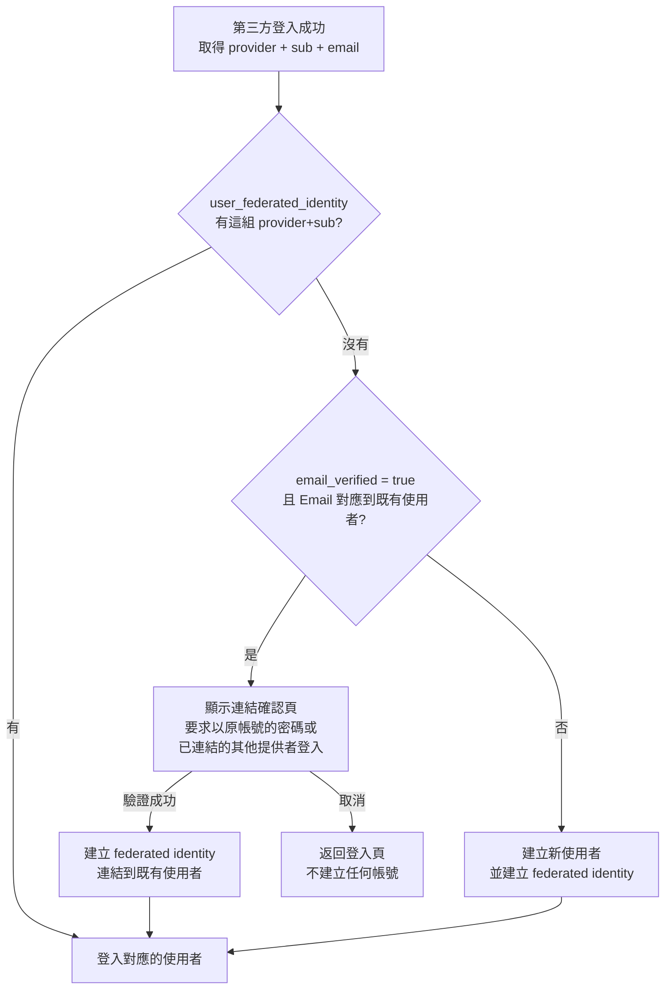
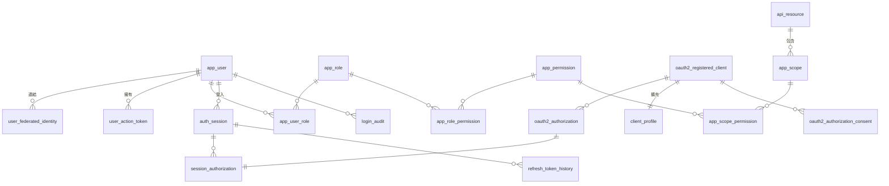
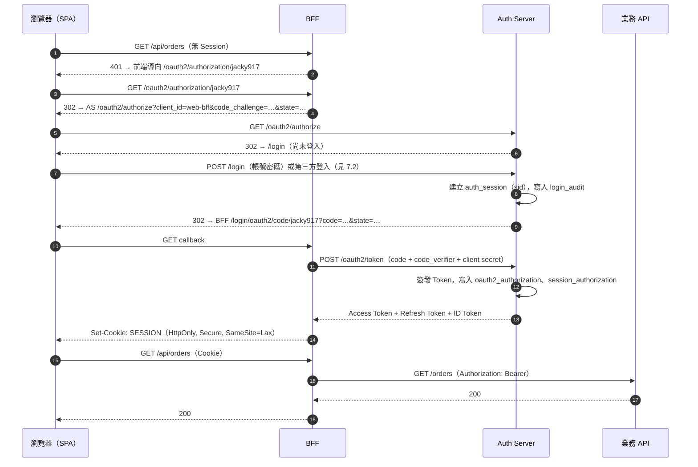
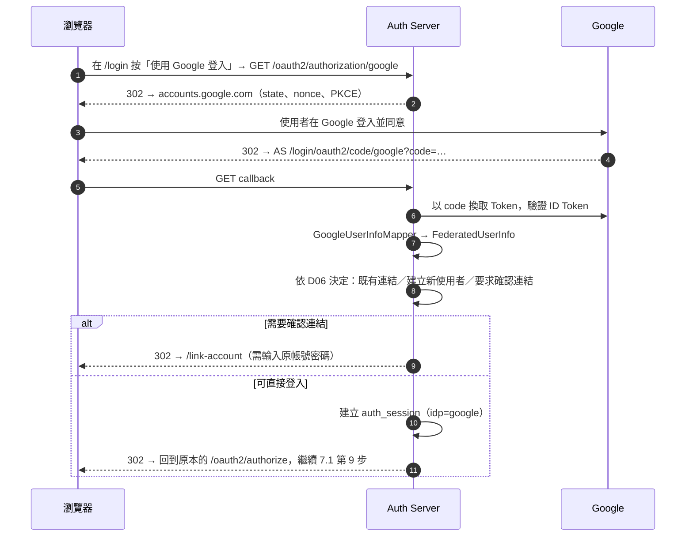
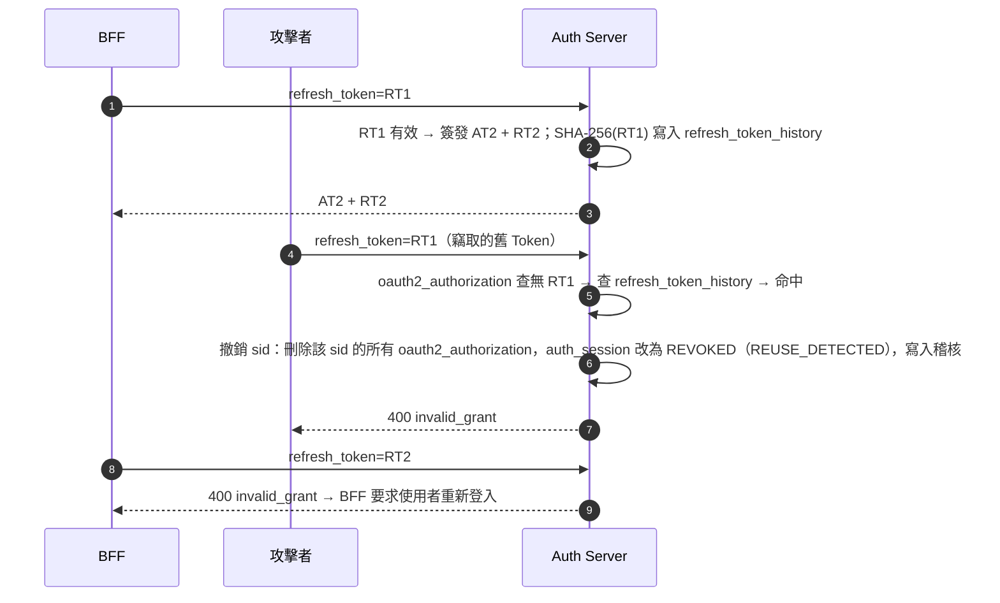
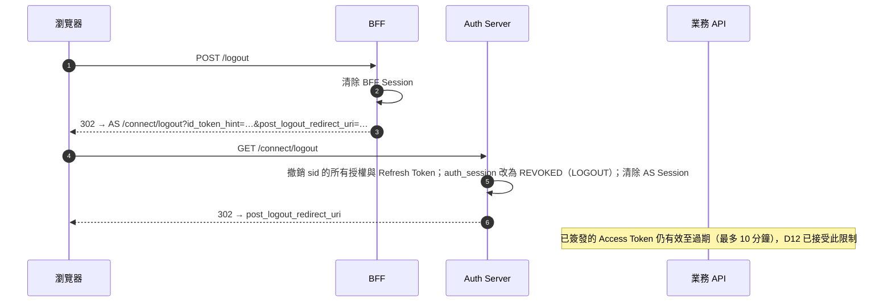

# Authorization Server 設計（方案 C：標準 OAuth 2.0／OIDC）

| 項目 | 內容 |
|---|---|
| 狀態 | 📝 設計草案，等待決策（見 [§12 待確認事項](#12-待確認事項)） |
| 日期 | 2026-10-07 |
| 範圍 | 新增 `jacky917-security-authorization-server-starter`：以 Spring Security 7 的 Authorization Server 為基礎，支援帳號密碼登入與第三方登入（Google 等） |
| 平台 | Spring Boot 4.1.1、Spring Security 7.1.1（D01 已決定） |
| 上層文件 | [2.0 總設計](v2-overview.md)；模組命名與 repo 結構以 [Repo 拆分設計](repo-structure-design.md) 為準 |
| 不在範圍 | 業務 API 端的授權（由現有的 `jacky917-security-starter` 負責，本設計不改變其定位） |

> **名詞約定**
> - **第三方登入（Federated Login）**：使用者以 Google、GitHub、LINE、Apple 等外部帳號登入**我們的** Auth Server。這是本設計的主要需求。
> - **第三方應用（Third-party Client）**：外部開發者的應用程式透過我們的 Auth Server 讓使用者登入、並存取我們的 API。方案 C 天生支援，但排在較後面的階段（見 [§11](#11-分階段實作計畫)）。
> - **AS**：Authorization Server。**RS**：Resource Server（業務 API）。**BFF**：Backend for Frontend。

---

## 目錄

1. [整體架構](#1-整體架構)
2. [決策總表](#2-決策總表)
3. [關鍵決策詳述](#3-關鍵決策詳述)
4. [模組與套件結構](#4-模組與套件結構)
5. [資料表設計](#5-資料表設計)
6. [Token 與 Claim 契約](#6-token-與-claim-契約)
7. [主要流程](#7-主要流程)
8. [端點清單](#8-端點清單)
9. [設定屬性與擴充點](#9-設定屬性與擴充點)
10. [安全設計檢查清單](#10-安全設計檢查清單)
11. [分階段實作計畫](#11-分階段實作計畫)
12. [待確認事項](#12-待確認事項)
13. [參考資料](#13-參考資料)

---

## 1. 整體架構

```mermaid
flowchart LR
    subgraph Browser[瀏覽器]
        SPA[前端 SPA]
    end

    subgraph Edge[我們的後端]
        BFF[BFF<br/>OAuth2 confidential client<br/>持有 Token，只給瀏覽器 Session Cookie]
        AS[Auth Server<br/>authorization-server-starter<br/>登入頁、簽發 Token、JWKS]
        RS1[訂單 API<br/>jacky917-security-starter]
        RS2[會員 API<br/>jacky917-security-starter]
        DB[(PostgreSQL<br/>使用者、授權、Session)]
    end

    subgraph IdP[外部身分提供者]
        G[Google]
        GH[GitHub]
        L[LINE / Apple]
    end

    TP[第三方應用<br/>（第 3 階段）]

    SPA -- Session Cookie --> BFF
    BFF -- Bearer Token --> RS1
    BFF -- Bearer Token --> RS2
    SPA -. 登入時導向 .-> AS
    BFF -- 換 Token／Refresh --> AS
    AS -- 第三方登入 --> G
    AS -- 第三方登入 --> GH
    AS -- 第三方登入 --> L
    AS --- DB
    RS1 -. 取公鑰 JWKS .-> AS
    RS2 -. 取公鑰 JWKS .-> AS
    TP -. OAuth 2.0 .-> AS
```

角色分工：

| 元件 | 職責 | 引入 |
|---|---|---|
| **Auth Server** | 登入頁、帳號密碼驗證、第三方登入、帳號連結、簽發 Token、Refresh Token Rotation、登出、JWKS、同意畫面 | `jacky917-security-authorization-server-starter`（新） |
| **BFF** | 代替瀏覽器走 OAuth 流程、保存 Token、把 API 請求轉發給 RS 並附上 Token | Spring Boot + `oauth2Login`（範例），或 Spring Cloud Gateway（`TokenRelay`），見 D03 |
| **業務 API（RS）** | 驗證 Token、授權 | `jacky917-security-starter`（現有，不改） |
| **前端 SPA** | 只持有 BFF 的 Session Cookie，**完全碰不到 Token** | — |

---

## 2. 決策總表

每項決策的完整比較見 [§3](#3-關鍵決策詳述)。標 ⚠️ 的項目需要你確認。

| # | 決策 | 選項 | 推薦 |
|---|---|---|---|
| ✅ D01 | 平台版本 | A. 全部維持 Boot 3.5／B. AS 用 Boot 4，starter 留 3.5／C. 先整個 repo 升 Boot 4 | **C：已決定，Boot 4.1.1** |
| D02 | 交付形式 | A. 只做一個應用／B. starter + 一個參考應用 | **B** |
| ⚠️ D03 | 網頁前端接入方式 | A. SPA public client + PKCE／B. **BFF**／C. 同網域 Cookie 直連 | **B** |
| D04 | 登入頁實作 | A. AS 內建 Thymeleaf 模板（可覆寫）／B. 獨立 SPA 部署在 AS 網域／C. 只提供 API | **A** |
| ⚠️ D05 | 第三方登入提供者 | Google、GitHub、LINE、Apple、Facebook | 第一版 **Google**，第二版 GitHub、LINE |
| D06 | 帳號連結策略 | A. 一律新建／B. Email 相同自動連結／C. Email 相同時要求登入原帳號確認／D. 只能手動連結 | **C + D** |
| D07 | Access Token 的 `aud` | A. SAS 預設（client_id）／B. 全部 API 共用一個 audience／C. 依 scope 對應到各 API | 第一版 **B**，表結構預留 **C** |
| D08 | Refresh Token 策略 | A. SAS 預設（可重複使用）／B. Rotation／C. **Rotation + 重用偵測** | **C** |
| D09 | 授權資料儲存 | A. SAS 官方 JDBC／B. Redis 自訂／C. JPA 自訂 | **A** + 定期清理 |
| D10 | 登入 Session 與水平擴展 | A. Sticky session／B. Spring Session JDBC／C. Spring Session Redis | 第一版 **B** |
| D11 | 簽章金鑰管理 | A. Keystore 檔案／B. **資料庫 + 加密 + 輪換**／C. KMS／Vault | **B**，介面預留 **C** |
| D12 | 登出 | A. 只清 AS Session／B. RP-Initiated Logout + 撤銷 sid／C. 再加 Back-channel Logout | **B** |
| D13 | Client 管理 | A. 設定檔／B. Flyway seed／C. Admin API／D. 動態註冊（DCR） | 第一方 **B**，第三方 **C**，**不開放 D** |
| ⚠️ D14 | 資料庫 | A. **PostgreSQL**／B. MySQL／C. 兩者都支援 | **A** |

---

## 3. 關鍵決策詳述

### D01 平台版本 ✅ 已決定

> **決定（2026-10-07）**：採用 C，先將整個 repo 升級到 **Spring Boot 4.1.1**（Spring Security 7.1.1），再開發 AS。升級細節見 [Spring Boot 4.1 升級設計](boot4-migration-design.md)。以下保留決策時的比較。

**背景事實**

- Spring Boot 3.5 的開源支援已於 **2026-06-30 結束**，之後不再有免費的安全性修補。
- Spring Authorization Server（SAS）**1.5.x 是最後一個獨立版本**，之後併入 Spring Security 7.0。Maven 座標不變，只有版本號改為 `7.x`。
- 本 repo 規範的硬性決策是「Spring Boot 3.5.10」，而且 parent 目前是 `3.5.10-SNAPSHOT`。

| 選項 | 說明 | 優點 | 缺點 |
|---|---|---|---|
| A. 全部維持 Boot 3.5（SAS 1.5.5） | 不升級 | 無遷移成本 | **新建一個安全關鍵服務，卻建立在已停止支援的版本上**；之後一定要再遷移一次 |
| B. AS 用 Boot 4，現有 starter 留在 3.5 | 同一 repo、兩種 parent | AS 一開始就在新版 | 共用的 `core` 模組要同時相容兩個版本；版本管理複雜；現有 starter 的風險仍在 |
| **C. 先把整個 repo 升到 Boot 4，再開發 AS** | 第 0 階段先遷移 | 全部模組在受支援的版本上；只遷移一次 | 需要先完成遷移（Jackson 3、Spring Security 7 的 API 變更等） |

**推薦 C**。現有 starter 的程式量小（約 600 行），遷移成本低；反過來說，AS 是整個系統安全性最關鍵的元件，不應建立在已停止支援的版本上。專案規範中的「Spring Boot 3.5.10」硬性決策需同步更新。

> 本文件中的「SAS」指 Spring Security 7 內建的 Authorization Server（Maven 座標 `org.springframework.security:spring-security-oauth2-authorization-server:7.1.1`；Boot starter 為 `spring-boot-starter-security-oauth2-authorization-server`）。

### D02 交付形式

| 選項 | 說明 |
|---|---|
| A. 只做一個 AS 應用 | 適合整個組織只有一個 AS |
| **B. starter + 參考應用** | starter 提供可覆寫的自動配置；`demo-authorization-server` 改寫為引入 starter 的參考應用 |

**推薦 B**，符合你「多個獨立專案、拿來就用」的需求。但要強調：**starter 是用來建置「一個」獨立部署的 AS，業務 API 絕不能引入它**。

### D03 網頁前端接入方式 ⚠️

這是對前端影響最大的決策。

**背景事實**：SAS **不會發 Refresh Token 給 public client**（沒有 client secret 的 client，例如純前端 SPA）。官方建議改用 BFF 模式。

| 選項 | 流程 | Token 存放 | Access Token 過期後 | 安全性 |
|---|---|---|---|---|
| A. SPA public client + PKCE | 前端直接走授權碼流程 | **瀏覽器**（記憶體） | 沒有 Refresh Token，只能整頁跳轉重新授權，或用隱藏 iframe 靜默授權（第三方 Cookie 被瀏覽器封鎖時會失效） | XSS 可偷走 Token |
| **B. BFF** | BFF 是 confidential client，代替瀏覽器走流程 | **BFF 伺服器端**；瀏覽器只有 `HttpOnly` Session Cookie | BFF 自動用 Refresh Token 續期，前端無感 | Token 永遠不進瀏覽器，XSS 偷不到 |
| C. 同網域 Cookie 直連 | AS 直接把 Token 寫成 Cookie 給 API 使用 | Cookie | 自行設計 | 不是標準 OAuth，RS 要改成讀 Cookie，不建議 |

**推薦 B**，也是 IETF〈OAuth 2.0 for Browser-Based Applications〉建議的做法。

BFF 實作再分兩種：

| BFF 實作 | 說明 | 推薦 |
|---|---|---|
| Spring Cloud Gateway + `TokenRelay` filter | 設定為主，幾乎不用寫程式；同時負責路由到各 RS | 多個 RS 時理想，但見下方相容性說明 |
| **Spring Boot + `oauth2Login()` + `RestClient`** | 不需要 Spring Cloud；BFF 本身也可以有業務邏輯 | ✅ **範例先採用** |

> **相容性（2026-10-07 查證）**：Spring Cloud 對 Spring Boot 4.1 的發佈列車在 Maven Central 上只有 `2026.0.0-M1`，正式相容版本尚未發佈。因此 `example-bff` 先以 Spring Boot 實作，Spring Cloud 正式支援 Boot 4.1 後再評估是否改用 Gateway。

**行動裝置 App**（若有）：屬於 public client，同樣拿不到 Refresh Token。第一版不納入範圍，之後需另行決策（見 [§12](#12-待確認事項)）。

### D04 登入頁實作

標準 OAuth 的登入頁由 AS 提供（理由見先前討論：密碼只在 AS 網域輸入）。

| 選項 | 說明 | 優點 | 缺點 |
|---|---|---|---|
| **A. AS 內建 Thymeleaf 模板，可覆寫** | starter 提供預設的登入、同意、帳號連結頁；專案可放同名模板覆寫，或只換 CSS 與 logo | 開箱即用；Spring Security 的 CSRF、表單登入原生支援 | 前端團隊要寫 Thymeleaf |
| B. 獨立 SPA 部署在 AS 網域 | 登入頁是 React／Vue，靜態檔放在 AS 上，以表單 POST 到 `/login` | 前端團隊熟悉的技術 | 要自行處理 CSRF token、錯誤訊息、第三方登入按鈕的導向 |
| C. 只提供 API | 不提供頁面 | — | 違背標準 OAuth 的安全前提，不採用 |

**推薦 A**，並提供三層客製方式：

1. 設定屬性：品牌名稱、logo、主色（不必改模板）
2. 覆寫 CSS
3. 覆寫整個模板（`templates/jacky917/login.html` 等）

### D05 第三方登入提供者 ⚠️

| 提供者 | 協定 | 唯一識別 | Email | 特殊注意事項 |
|---|---|---|---|---|
| **Google** | OIDC | `sub` | 有，並提供 `email_verified` | 最標準，第一版首選 |
| GitHub | OAuth 2.0（**非 OIDC**） | 數字 `id` | 可能不公開，需另外呼叫 `/user/emails` 取得已驗證的 Email | 沒有 ID Token，需自行對應使用者資訊 |
| LINE | OIDC | `sub` | 需另外向 LINE 申請 Email 權限 | 台灣、日本使用者多 |
| Apple | OIDC | `sub` | 使用者可選擇「隱藏 Email」（轉寄地址） | client secret 是**定期過期的 JWT**，需自動產生；姓名**只在第一次登入**時提供 |
| Facebook | OAuth 2.0 | `id` | 可能沒有 | 審核流程較繁瑣 |

**設計原則**：

- 一律以 **(provider, provider_subject)** 識別外部帳號，**絕不以 Email 識別**（Email 可能變更、重複或未驗證）。
- 提供者設定沿用 Spring Security 標準屬性 `spring.security.oauth2.client.registration.*`，不另創格式。
- 提供**通用 OIDC mapper**：符合 OIDC 標準的提供者（`sub`、`email`、`email_verified`、`name`、`picture`）**只要設定、不用寫程式**。
- 不符合 OIDC 的提供者，各自實作一個 `FederatedUserInfoMapper`，把回應格式轉成統一的 `FederatedUserInfo`。
- 登入頁的按鈕依 `spring.security.oauth2.client.registration.*` 自動產生，新增提供者不必改模板。
- 新增提供者**不需要修改資料表**（`user_federated_identity.provider` 是字串欄位）。

**新增提供者的成本**：

| 類型 | 例子 | 需要做的事 |
|---|---|---|
| 標準 OIDC | Google、LINE、Microsoft、GitLab、Yahoo! JAPAN | 設定 client-id／secret（非 Spring 內建的提供者另需設定 `issuer-uri`），加一個 WireMock 測試 |
| OAuth 2.0（非 OIDC） | GitHub、Facebook、Discord、X | 設定端點 + 一個 mapper 類別（約 50～100 行）+ 測試 |
| 非標準流程 | Apple（client secret 是定期過期的 JWT、`form_post` 回呼）、WeChat（參數名稱不同） | 自訂請求與回應轉換，工作量較大 |
| 不適用 | **Instagram**：個人帳號的第三方 API 已於 2024-12-04 停用，現行 API 只供商業／創作者帳號管理內容，**不能作為一般使用者的登入方式** | 改用 Facebook（Meta）登入 |

**推薦**：第一版只做 Google（驗證整條流程），第二版加 GitHub 與 LINE，Apple 依需求再加。

### D06 帳號連結策略

情境：使用者原本以 `alice@gmail.com` 註冊了帳號密碼，之後第一次按「用 Google 登入」，Google 回傳的 Email 也是 `alice@gmail.com`。

| 選項 | 行為 | 風險 |
|---|---|---|
| A. 一律建立新帳號 | 產生兩個 alice | 使用者困惑，資料分散 |
| B. Email 相同就自動連結 | 直接登入原帳號 | 🔴 **帳號接管**：若某提供者的 Email 未經驗證，攻擊者可用受害者的 Email 註冊該提供者，就能直接登入受害者的帳號 |
| **C. Email 相同時，要求登入原帳號確認** | 顯示「此 Email 已有帳號，請輸入原密碼以連結」 | 安全；多一個步驟 |
| **D. 只能在帳號設定中手動連結** | 已登入狀態下按「連結 Google」 | 最安全 |

**推薦 C + D**：



其他規則：

- `email_verified` 不為 `true` 的 Email **不參與比對**，也不寫入 `app_user.email`。
- 使用者至少要保留一種登入方式：只剩最後一個時，不允許解除連結。
- 第三方登入建立的使用者 `password_hash` 為 `NULL`，可之後再設定密碼。

### D07 Access Token 的 `aud` 與內容

**背景事實**：SAS 預設把 `aud` 設成 **client_id**（例如 `web-bff`）。但 RS 應驗證「這個 Token 是發給我的」，`aud` 是 client_id 時，RS 只能列出所有可能的 client_id，非常難維護。

| 選項 | `aud` 的值 | RS 設定 | 評估 |
|---|---|---|---|
| A. SAS 預設 | `web-bff` | `audiences: web-bff, mobile-app, ...` | 每新增一個 client，所有 RS 都要改設定 ❌ |
| **B. 共用 audience** | `jacky917-api` | `audiences: jacky917-api` | 簡單；但同一個 Token 可以存取所有 API |
| C. 依 scope 對應到 API | `["order-api"]` | 各 RS 只設定自己的代碼 | 最精確；需要 scope 與 API 的對應表 |

**推薦**：第一版用 **B**（以 `OAuth2TokenCustomizer` 覆寫 `aud`），資料表預先建立 `api_resource` 與 `app_scope.api_resource_code`（見 §5），之後切換到 **C** 不需要改表。

**Token 中的權限**（依 client 的信任等級不同）：

| Client 類型 | `roles`／`permissions` claim | `scope` claim |
|---|---|---|
| 第一方（`FIRST_PARTY`，自家 BFF） | 放入使用者的全部角色與權限 | 依設定 |
| 第三方（`THIRD_PARTY`） | **不放**角色；`permissions` = 使用者同意的 scope 所對應的權限 ∩ 使用者本身擁有的權限 | 使用者同意的 scope |

這樣第三方應用永遠無法取得超過使用者同意範圍的權限，而現有 starter 的 `@RequirePerm`、`@RequireScope` 不用改就能運作。

### D08 Refresh Token 策略

| 選項 | 說明 | 被竊取時 |
|---|---|---|
| A. SAS 預設（`reuseRefreshTokens = true`） | 同一個 Refresh Token 可重複使用直到過期 | 攻擊者可長期使用，無從察覺 |
| B. Rotation（`reuseRefreshTokens = false`） | 每次刷新都換新的 | 攻擊者與使用者誰先用誰贏，另一方失效，但**系統不知道發生過竊取** |
| **C. Rotation + 重用偵測** | 記錄已輪換的舊 Token；舊 Token 再次出現時，撤銷整個登入 Session | 雙方都被登出，並留下安全事件紀錄 |

**推薦 C**。SAS 內建 Rotation，但**沒有內建重用偵測**，需以裝飾器包裝 `OAuth2AuthorizationService`：

- 輪換時，把舊 Refresh Token 的 SHA-256 寫入 `refresh_token_history`。
- 收到找不到的 Refresh Token 時，查 `refresh_token_history`；查到即代表重用，撤銷該 `sid` 的所有授權與 Session。

有效期建議：

| Token | 有效期 | 說明 |
|---|---|---|
| Access Token | 10 分鐘 | RS 無法即時撤銷，越短越安全 |
| Refresh Token | 14 天（每次刷新重新計算） | 閒置超過 14 天需重新登入 |
| 登入 Session 絕對上限 | 90 天 | 無論是否持續使用，90 天後都要重新登入（`auth_session.expires_at`） |
| ID Token | 10 分鐘 | 只用於登入當下 |
| 授權碼 | 1 分鐘 | 一次性 |

### D09 授權資料儲存

| 選項 | 說明 | 優點 | 缺點 |
|---|---|---|---|
| **A. SAS 官方 `JdbcOAuth2AuthorizationService`** | 使用官方提供的 schema | 官方維護、升級容易 | 官方 schema 以 `blob` 撰寫，PostgreSQL 需改欄位型別；**過期資料不會自動刪除**；Token 值以明文儲存 |
| B. Redis 自訂實作 | 以 TTL 自動過期 | 速度快、自動清理 | 要自己實作與維護序列化；Redis 資料遺失等於全員登出 |
| C. JPA 自訂實作 | — | 可完全控制 | 工作量大，容易出錯 |

**推薦 A**，並補上：

- 定期清理過期的 `oauth2_authorization`（見 §5.7）。
- 資料庫層啟用加密（TDE 或磁碟加密），並限制 DB 帳號權限，因為 Token 值是明文。
- 自訂的 principal 物件要註冊 Jackson mixin，否則 JDBC 儲存時無法序列化（SAS 的 Jackson 反序列化有白名單限制）。Spring Security 7.1.1 的 JDBC 實作已支援 **Jackson 3**（內建 `AuthorizationServerJacksonModule`），mixin 也要以 Jackson 3 撰寫。

> **已查證**：Spring Security 7.1.1 隨附的 `oauth2-authorization-schema.sql` 註明，PostgreSQL 需將所有 `blob` 欄位改為 `text`、`timestamp` 改為 `timestamptz`；MySQL 則需在 JDBC URL 加上 `preserveInstants=true&connectionTimeZone=UTC&forceConnectionTimeZoneToSession=true`。

### D10 登入 Session 與水平擴展

授權碼流程中，「已登入但尚未完成授權」的狀態存放在 AS 的 `HttpSession`。AS 有多個實例時，必須共用 Session。

| 選項 | 說明 | 評估 |
|---|---|---|
| A. Load balancer sticky session | 同一使用者固定到同一實例 | 實例重啟會丟失登入中的狀態 |
| **B. Spring Session JDBC** | Session 存在 PostgreSQL | 不需要額外的基礎設施 |
| C. Spring Session Redis | Session 存在 Redis | 效能最好，但多一個要維運的元件 |

**推薦**：第一版用 **B**，流量大時改為 **C**（只需更換依賴與設定）。

### D11 簽章金鑰管理

| 選項 | 說明 | 評估 |
|---|---|---|
| A. Keystore 檔案 | 啟動時從檔案或環境變數載入 | 簡單，但輪換需要重新部署，所有實例要同步 |
| **B. 資料庫 + 加密 + 自動輪換** | 私鑰以主金鑰加密後存入 `signing_key`；排程每 90 天產生新金鑰 | 多實例自動同步；可無停機輪換 |
| C. KMS／HashiCorp Vault | 私鑰永遠不離開 KMS，簽章時呼叫 KMS | 最安全，但每次簽發 Token 都要呼叫外部服務，且依雲端廠商 |

**推薦 B**，定義 `SigningKeyStore` 介面讓之後可換成 C。

輪換流程（以 RS256 為例）：

```
第 0 天   產生 K2（狀態 NEXT）      JWKS 公開 K1、K2；仍以 K1 簽發
第 1 天   K2 改為 ACTIVE，K1 改為 RETIRING   以 K2 簽發；JWKS 仍公開 K1（舊 Token 還要能驗證）
K1 簽發的最後一個 Token 過期後   K1 改為 RETIRED   JWKS 不再公開 K1
```

先公開、後使用，是為了讓 RS 在新金鑰開始簽發前，就已經快取到新的公鑰。

### D12 登出

| 選項 | 說明 | 評估 |
|---|---|---|
| A. 只清除 AS 的 Session | — | Refresh Token 仍有效，BFF 還能繼續續期 ❌ |
| **B. RP-Initiated Logout + 撤銷 sid** | BFF 導向 AS 的 `/connect/logout`；AS 撤銷該 `sid` 的所有授權與 Refresh Token，並清除 Session | 標準做法；SAS 支援 RP-Initiated Logout |
| C. 再加 Back-channel Logout | AS 主動通知所有 client 該 Session 已登出 | SAS 未內建發送端，需自行實作；第一版不做 |

**推薦 B**。要接受的限制：已簽發的 Access Token 在 RS 端仍有效到過期為止（最多 10 分鐘）。若需要即時失效，之後再疊加先前討論的方案 D（權限中心／撤銷清單）。

「登出所有裝置」：撤銷該使用者所有 `auth_session`。

### D13 Client 管理

| 選項 | 適用 |
|---|---|
| A. 寫在 `application.yml` | 簡單，但 client secret 會出現在設定檔 |
| **B. Flyway seed migration** | **第一方 client**（BFF 等），數量少、隨程式版本管理；secret 透過環境變數注入 |
| **C. Admin API** | **第三方 client**，由管理員或開發者自助申請、審核 |
| D. OIDC 動態註冊（DCR） | 任何人都能註冊 client。除非要做開放平台，否則**不開放** |

### D14 資料庫 ⚠️

| 選項 | 優點 | 缺點 |
|---|---|---|
| **A. PostgreSQL** | `JSONB`、`TIMESTAMPTZ`、部分索引（例如「Email 不為空才唯一」）；與現有 [database-schema.md](database-schema.md) 一致 | 現有 demo 使用 MySQL |
| B. MySQL | 與現有 demo 一致 | SAS 官方 schema 的 `blob` 欄位與部分語法需調整；缺少部分索引 |
| C. 兩者都支援 | 使用者選擇多 | 兩套 Flyway migration、兩套測試，維護成本加倍 |

**推薦 A**，之後真的需要再補 MySQL migration。

---

## 4. 模組與套件結構

整個 repo 的結構、命名與依賴規則見 [Repo 拆分設計](repo-structure-design.md#3-目標結構)。本節只列 AS 相關的部分：

```
authorization-server/
├── jacky917-security-authorization-server-autoconfigure/
│   └── jacky917.security.authorizationserver
│       ├── config/          自動配置；SecurityFilterChain（SAS 協定端點、登入與帳號頁面）
│       ├── user/            UserAccountService（SPI）、JDBC 實作、密碼登入
│       ├── federation/      第三方登入：FederatedIdentityService、通用 OIDC mapper、GitHub 等專用 mapper、帳號連結
│       ├── token/           Jacky917TokenCustomizer、AudienceResolver、AuthorityResolver
│       ├── refresh/         ReuseDetectingAuthorizationService（裝飾器）、refresh_token_history
│       ├── session/         AuthSessionService（sid）、登出處理
│       ├── keys/            SigningKeyStore、輪換排程、JWKSource
│       ├── protection/      登入失敗計數、鎖定、rate limit
│       ├── web/             登入、同意、帳號連結、帳號設定頁的 controller
│       ├── admin/           Admin API（第 3 階段）
│       ├── jobs/            過期資料清理排程
│       └── properties/      jacky917.security.authorization-server.*
│   └── resources/
│       ├── db/migration/jacky917/   V1__init.sql …（Flyway）
│       ├── templates/jacky917/      login.html、consent.html、link-account.html、account.html
│       └── static/jacky917/         預設 CSS、logo
└── jacky917-security-authorization-server-starter/   ← AS 應用引入這個

core/jacky917-security-core/                     ← claim 名稱、權限前綴、TrustLevel（與 RS 共用）

examples/
├── example-authorization-server/                ← 原 demo-authorization-server，改為引入 AS starter
├── example-bff/                                 ← 新：Spring Boot oauth2Login + RestClient（見 D03）
└── example-resource-server/                     ← 原 demo-resource-server，改為信任 AS 的 JWKS

e2e-tests/                                       ← AS + BFF + RS 端對端測試
```

AS starter 會用到的 Spring Boot 4.1 starter（皆已在 Maven Central 確認存在）：

| 用途 | Starter |
|---|---|
| Authorization Server | `spring-boot-starter-security-oauth2-authorization-server` |
| 第三方登入 | `spring-boot-starter-security-oauth2-client` |
| 登入頁 | `spring-boot-starter-thymeleaf` |
| Migration | `spring-boot-starter-flyway` |
| 共用 Session（D10） | `spring-boot-starter-session-jdbc` |
| 測試 | `spring-boot-starter-security-test`、`spring-boot-starter-webmvc-test`、Testcontainers 2.0.5 |

AS 內部的兩條 filter chain：

| Order | Filter chain | 負責路徑 | 設定 |
|---|---|---|---|
| 1 | SAS 協定 | `/oauth2/**`、`/.well-known/**`、`/userinfo`、`/connect/**` | SAS 預設；未登入時導向 `/login` |
| 2 | 登入與帳號 | `/login`、`/login/oauth2/**`、`/account/**`、`/link-account/**` | 表單登入、`oauth2Login()`、**啟用 CSRF**、Session |
| 3（第 3 階段） | Admin API | `/admin/api/**` | Bearer Token，以現有 `@RequirePerm` 授權 |

---

## 5. 資料表設計

PostgreSQL 16 以上。表名在實作時加上可設定的前綴（預設 `j917_`），本節為了易讀省略前綴。

### 5.1 總覽

| 分類 | 表 | 來源 | 用途 |
|---|---|---|---|
| 身分 | `app_user` | 自建 | 使用者 |
| 身分 | `user_federated_identity` | 自建 | 第三方帳號連結 |
| 身分 | `user_action_token` | 自建 | 重設密碼、Email 驗證的一次性 Token |
| 權限 | `app_role`、`app_permission` | 自建 | 角色、權限 |
| 權限 | `app_user_role`、`app_role_permission` | 自建 | 對應關係 |
| OAuth | `oauth2_registered_client` | **SAS 官方** | Client 註冊資料 |
| OAuth | `oauth2_authorization` | **SAS 官方** | 授權碼、Access／Refresh Token 狀態 |
| OAuth | `oauth2_authorization_consent` | **SAS 官方** | 使用者對第三方 client 的同意紀錄 |
| OAuth | `client_profile` | 自建 | Client 的擴充資料（信任等級、顯示名稱、擁有者） |
| OAuth | `api_resource` | 自建 | API（audience）定義 |
| OAuth | `app_scope`、`app_scope_permission` | 自建 | Scope 定義與 scope → 權限對應 |
| Session | `auth_session` | 自建 | 一次登入（一個裝置）＝一個 `sid` |
| Session | `session_authorization` | 自建 | `sid` ↔ `oauth2_authorization` 對應，用於依 `sid` 撤銷 |
| Session | `refresh_token_history` | 自建 | 已輪換的舊 Refresh Token，用於重用偵測 |
| Session | `SPRING_SESSION`、`SPRING_SESSION_ATTRIBUTES` | **Spring Session 官方** | AS 的 HttpSession（D10） |
| 安全 | `signing_key` | 自建 | 簽章金鑰與輪換狀態 |
| 安全 | `login_audit` | 自建 | 登入紀錄、暴力破解防護 |
| 安全 | `admin_audit_log` | 自建 | 管理操作稽核 |

官方表請使用對應版本隨附的 DDL，不要自行改寫（只調整 PostgreSQL 不相容的欄位型別）。

### 5.2 關聯圖



### 5.3 身分與權限

```sql
CREATE TABLE app_user (
    id                  UUID         PRIMARY KEY,                    -- 即 Token 的 sub，永不變更
    username            VARCHAR(64)  UNIQUE,                         -- 第三方登入建立的使用者可為 NULL
    email               VARCHAR(255),
    email_verified      BOOLEAN      NOT NULL DEFAULT FALSE,
    password_hash       VARCHAR(255),                                -- {bcrypt}... ；只有第三方登入時為 NULL
    display_name        VARCHAR(128),
    avatar_url          VARCHAR(1024),
    status              VARCHAR(16)  NOT NULL DEFAULT 'ACTIVE',      -- ACTIVE / LOCKED / DISABLED
    failed_login_count  INT          NOT NULL DEFAULT 0,
    locked_until        TIMESTAMPTZ,
    password_changed_at TIMESTAMPTZ,
    last_login_at       TIMESTAMPTZ,
    created_at          TIMESTAMPTZ  NOT NULL DEFAULT NOW(),
    updated_at          TIMESTAMPTZ  NOT NULL DEFAULT NOW(),
    row_version         BIGINT       NOT NULL DEFAULT 0,             -- 樂觀鎖
    CONSTRAINT ck_app_user_status CHECK (status IN ('ACTIVE', 'LOCKED', 'DISABLED'))
);
-- Email 不分大小寫唯一，且只限已驗證的 Email（未驗證的 Email 不寫入此欄，見 D06）
CREATE UNIQUE INDEX ux_app_user_email ON app_user (LOWER(email)) WHERE email IS NOT NULL;

CREATE TABLE user_federated_identity (
    id               UUID         PRIMARY KEY,
    user_id          UUID         NOT NULL REFERENCES app_user(id) ON DELETE CASCADE,
    provider         VARCHAR(32)  NOT NULL,                          -- google / github / line / apple
    provider_subject VARCHAR(255) NOT NULL,                          -- 提供者的使用者 ID（Google sub、GitHub id）
    email            VARCHAR(255),                                   -- 提供者回傳的 Email（僅供參考，不作識別）
    email_verified   BOOLEAN      NOT NULL DEFAULT FALSE,
    display_name     VARCHAR(128),
    avatar_url       VARCHAR(1024),
    raw_attributes   JSONB,                                          -- 原始回應（除錯用；不得包含 Token）
    linked_at        TIMESTAMPTZ  NOT NULL DEFAULT NOW(),
    last_login_at    TIMESTAMPTZ,
    CONSTRAINT ux_federated_provider_subject UNIQUE (provider, provider_subject),
    CONSTRAINT ux_federated_user_provider    UNIQUE (user_id, provider)  -- 每個提供者只能連結一個帳號
);
CREATE INDEX ix_federated_user ON user_federated_identity (user_id);

CREATE TABLE user_action_token (
    token_hash CHAR(64)    PRIMARY KEY,                              -- SHA-256，不存明文
    user_id    UUID        NOT NULL REFERENCES app_user(id) ON DELETE CASCADE,
    purpose    VARCHAR(32) NOT NULL,                                 -- PASSWORD_RESET / EMAIL_VERIFY / LINK_ACCOUNT
    payload    JSONB,                                                -- 例如待連結的 provider + subject
    expires_at TIMESTAMPTZ NOT NULL,
    used_at    TIMESTAMPTZ,
    created_at TIMESTAMPTZ NOT NULL DEFAULT NOW()
);
CREATE INDEX ix_action_token_user ON user_action_token (user_id, purpose);

CREATE TABLE app_role (
    id          UUID         PRIMARY KEY,
    code        VARCHAR(64)  NOT NULL UNIQUE,                        -- ADMIN（不含 ROLE_）
    name        VARCHAR(128) NOT NULL,
    description TEXT,
    built_in    BOOLEAN      NOT NULL DEFAULT FALSE,                 -- 內建角色不可刪除
    created_at  TIMESTAMPTZ  NOT NULL DEFAULT NOW()
);

CREATE TABLE app_permission (
    id          UUID         PRIMARY KEY,
    code        VARCHAR(128) NOT NULL UNIQUE,                        -- order:read（不含 PERM_）
    name        VARCHAR(128) NOT NULL,
    description TEXT,
    created_at  TIMESTAMPTZ  NOT NULL DEFAULT NOW()
);

CREATE TABLE app_user_role (
    user_id    UUID        NOT NULL REFERENCES app_user(id) ON DELETE CASCADE,
    role_id    UUID        NOT NULL REFERENCES app_role(id) ON DELETE CASCADE,
    granted_by UUID        REFERENCES app_user(id) ON DELETE SET NULL,
    granted_at TIMESTAMPTZ NOT NULL DEFAULT NOW(),
    PRIMARY KEY (user_id, role_id)
);
CREATE INDEX ix_user_role_role ON app_user_role (role_id);

CREATE TABLE app_role_permission (
    role_id       UUID NOT NULL REFERENCES app_role(id)       ON DELETE CASCADE,
    permission_id UUID NOT NULL REFERENCES app_permission(id) ON DELETE CASCADE,
    PRIMARY KEY (role_id, permission_id)
);
CREATE INDEX ix_role_permission_permission ON app_role_permission (permission_id);
```

### 5.4 OAuth 擴充

```sql
-- oauth2_registered_client、oauth2_authorization、oauth2_authorization_consent：使用 SAS 官方 DDL

CREATE TABLE client_profile (
    registered_client_id VARCHAR(100) PRIMARY KEY
                         REFERENCES oauth2_registered_client(id) ON DELETE CASCADE,
    trust_level          VARCHAR(16)   NOT NULL,                     -- FIRST_PARTY / THIRD_PARTY（D07）
    display_name         VARCHAR(128)  NOT NULL,                     -- 同意畫面顯示的名稱
    logo_url             VARCHAR(1024),
    homepage_url         VARCHAR(1024),
    privacy_policy_url   VARCHAR(1024),                              -- 第三方 client 必填（由程式檢查）
    terms_url            VARCHAR(1024),
    owner_user_id        UUID          REFERENCES app_user(id) ON DELETE SET NULL,
    status               VARCHAR(16)   NOT NULL DEFAULT 'ACTIVE',    -- PENDING_REVIEW / ACTIVE / SUSPENDED
    created_at           TIMESTAMPTZ   NOT NULL DEFAULT NOW(),
    updated_at           TIMESTAMPTZ   NOT NULL DEFAULT NOW(),
    CONSTRAINT ck_client_trust CHECK (trust_level IN ('FIRST_PARTY', 'THIRD_PARTY'))
);

CREATE TABLE api_resource (
    code        VARCHAR(64)  PRIMARY KEY,                            -- 即 aud 的值，例如 order-api
    name        VARCHAR(128) NOT NULL,
    description TEXT,
    created_at  TIMESTAMPTZ  NOT NULL DEFAULT NOW()
);

CREATE TABLE app_scope (
    code              VARCHAR(128) PRIMARY KEY,                      -- order.read；openid、profile、email 為內建
    api_resource_code VARCHAR(64)  REFERENCES api_resource(code),    -- OIDC 標準 scope 為 NULL
    display_name      VARCHAR(128) NOT NULL,                         -- 同意畫面：「讀取你的訂單」
    description       TEXT,
    consent_required  BOOLEAN      NOT NULL DEFAULT TRUE,
    built_in          BOOLEAN      NOT NULL DEFAULT FALSE
);

CREATE TABLE app_scope_permission (
    scope_code    VARCHAR(128) NOT NULL REFERENCES app_scope(code)      ON DELETE CASCADE,
    permission_id UUID         NOT NULL REFERENCES app_permission(id) ON DELETE CASCADE,
    PRIMARY KEY (scope_code, permission_id)
);
```

### 5.5 Session、授權關聯與重用偵測

```sql
CREATE TABLE auth_session (
    session_id     UUID         PRIMARY KEY,                         -- 即 Token 的 sid
    user_id        UUID         NOT NULL REFERENCES app_user(id) ON DELETE CASCADE,
    status         VARCHAR(16)  NOT NULL DEFAULT 'ACTIVE',           -- ACTIVE / REVOKED / EXPIRED
    login_method   VARCHAR(16)  NOT NULL,                            -- PASSWORD / FEDERATED
    idp            VARCHAR(32)  NOT NULL DEFAULT 'local',            -- local / google / github …
    ip_address     VARCHAR(45),
    user_agent     TEXT,
    created_at     TIMESTAMPTZ  NOT NULL DEFAULT NOW(),
    last_seen_at   TIMESTAMPTZ  NOT NULL DEFAULT NOW(),              -- 每次 refresh 時更新
    expires_at     TIMESTAMPTZ  NOT NULL,                            -- 絕對上限（D08：90 天）
    revoked_at     TIMESTAMPTZ,
    revoke_reason  VARCHAR(32),                                      -- LOGOUT / LOGOUT_ALL / REUSE_DETECTED / ADMIN / PASSWORD_CHANGED
    CONSTRAINT ck_auth_session_status CHECK (status IN ('ACTIVE', 'REVOKED', 'EXPIRED'))
);
CREATE INDEX ix_auth_session_user_active ON auth_session (user_id) WHERE status = 'ACTIVE';
CREATE INDEX ix_auth_session_expires     ON auth_session (expires_at);

-- 一個 sid 可能對應多個 client 的授權（例如同時登入網頁 BFF 與第三方應用）
CREATE TABLE session_authorization (
    authorization_id     VARCHAR(100) PRIMARY KEY
                         REFERENCES oauth2_authorization(id) ON DELETE CASCADE,
    session_id           UUID         NOT NULL REFERENCES auth_session(session_id) ON DELETE CASCADE,
    registered_client_id VARCHAR(100) NOT NULL,
    created_at           TIMESTAMPTZ  NOT NULL DEFAULT NOW()
);
CREATE INDEX ix_session_authorization_session ON session_authorization (session_id);

-- 已被輪換掉的舊 Refresh Token（D08）
CREATE TABLE refresh_token_history (
    token_hash           CHAR(64)     PRIMARY KEY,                   -- SHA-256(舊 Refresh Token)
    authorization_id     VARCHAR(100) NOT NULL,                      -- 不設 FK：授權被刪除後仍需保留以偵測重用
    session_id           UUID         NOT NULL,
    user_id              UUID         NOT NULL,
    registered_client_id VARCHAR(100) NOT NULL,
    rotated_at           TIMESTAMPTZ  NOT NULL DEFAULT NOW(),
    expires_at           TIMESTAMPTZ  NOT NULL                       -- = 舊 Token 原本的到期時間，過期後可清除
);
CREATE INDEX ix_refresh_history_expires ON refresh_token_history (expires_at);
```

> **為什麼 `refresh_token_history` 不設外鍵？** 偵測到重用時會刪除 `oauth2_authorization`，但之後攻擊者可能再次嘗試同一個舊 Token，紀錄必須保留到該 Token 原本的到期時間。

### 5.6 安全與稽核

```sql
CREATE TABLE signing_key (
    kid                   VARCHAR(64) PRIMARY KEY,
    algorithm             VARCHAR(16) NOT NULL DEFAULT 'RS256',
    public_key            TEXT        NOT NULL,                      -- PEM
    private_key_encrypted TEXT        NOT NULL,                      -- 以主金鑰（環境變數或 KMS）加密
    status                VARCHAR(16) NOT NULL,                      -- NEXT / ACTIVE / RETIRING / RETIRED
    created_at            TIMESTAMPTZ NOT NULL DEFAULT NOW(),
    activated_at          TIMESTAMPTZ,
    retired_at            TIMESTAMPTZ,
    CONSTRAINT ck_signing_key_status CHECK (status IN ('NEXT', 'ACTIVE', 'RETIRING', 'RETIRED'))
);
-- 同一時間只能有一把 ACTIVE
CREATE UNIQUE INDEX ux_signing_key_active ON signing_key (status) WHERE status = 'ACTIVE';

CREATE TABLE login_audit (
    id                 BIGSERIAL    PRIMARY KEY,
    user_id            UUID         REFERENCES app_user(id) ON DELETE SET NULL,
    username_attempted VARCHAR(255),                                 -- 帳號不存在時仍記錄
    login_method       VARCHAR(16)  NOT NULL,                        -- PASSWORD / FEDERATED
    idp                VARCHAR(32)  NOT NULL DEFAULT 'local',
    registered_client_id VARCHAR(100),
    success            BOOLEAN      NOT NULL,
    failure_reason     VARCHAR(32),                                  -- BAD_CREDENTIALS / LOCKED / DISABLED / LINK_REQUIRED
    ip_address         VARCHAR(45),
    user_agent         TEXT,
    created_at         TIMESTAMPTZ  NOT NULL DEFAULT NOW()
);
CREATE INDEX ix_login_audit_ip_time   ON login_audit (ip_address, created_at);   -- 依 IP 限流
CREATE INDEX ix_login_audit_user_time ON login_audit (user_id, created_at);

CREATE TABLE admin_audit_log (
    id               BIGSERIAL   PRIMARY KEY,
    operator_user_id UUID,
    action           VARCHAR(64) NOT NULL,                           -- GRANT_ROLE / DISABLE_USER / CREATE_CLIENT …
    target_type      VARCHAR(32) NOT NULL,                           -- USER / ROLE / CLIENT
    target_id        VARCHAR(100),
    detail           JSONB,
    ip_address       VARCHAR(45),
    created_at       TIMESTAMPTZ NOT NULL DEFAULT NOW()
);
CREATE INDEX ix_admin_audit_target ON admin_audit_log (target_type, target_id, created_at);
```

### 5.7 資料保留與清理排程

SAS 與 Spring Session 都**不會自動刪除** `oauth2_authorization` 的過期資料，需要排程清理：

| 表 | 清理條件 | 建議頻率 |
|---|---|---|
| `oauth2_authorization` | 授權碼、Access Token、Refresh Token 全部過期 | 每小時 |
| `refresh_token_history` | `expires_at < NOW()` | 每天 |
| `auth_session` | `status <> 'ACTIVE'` 且超過 30 天，或 `expires_at` 已過 | 每天 |
| `user_action_token` | `expires_at < NOW()` | 每天 |
| `login_audit` | 超過 180 天（依法規調整） | 每週 |
| `signing_key` | `RETIRED` 超過 1 年 | 每月 |
| `SPRING_SESSION` | Spring Session 內建清理 | 內建 |

多實例部署時，清理排程需要分散式鎖（例如 ShedLock），避免同時執行。

---

## 6. Token 與 Claim 契約

claim 名稱定義在 `jacky917-security-core` 的 `Jacky917ClaimNames`，簽發端與驗證端共用。

### 6.1 Access Token（給 RS）

| Claim | 範例 | 說明 |
|---|---|---|
| `iss` | `https://auth.example.com` | AS 的 issuer |
| `sub` | `3f2a…`（`app_user.id`） | **永遠是我們的使用者 ID**，不是 Google 的 `sub` |
| `aud` | `["jacky917-api"]` | D07 |
| `exp`、`iat`、`nbf`、`jti` | — | 標準 |
| `client_id` | `web-bff` | 由哪個 client 取得 |
| `scope` | `["openid","profile","order.read"]` | 現有 starter 會轉成 `SCOPE_*` |
| `sid` | `9b1c…`（`auth_session.session_id`） | 登入 Session |
| `roles` | `["ADMIN"]` | **只有第一方 client** |
| `permissions` | `["order:read","order:write"]` | 第一方：全部權限；第三方：scope 對應權限 ∩ 使用者權限 |
| `idp` | `google` | 本次登入方式，`local` 代表帳號密碼 |

現有 `jacky917-security-starter` 不需要修改即可解析以上 claim。

### 6.2 ID Token（給 client）

| Claim | 條件 |
|---|---|
| `iss`、`sub`、`aud`（= client_id）、`exp`、`iat`、`auth_time`、`nonce`、`sid` | 一律 |
| `name`、`picture` | scope 含 `profile` |
| `email`、`email_verified` | scope 含 `email`，且 Email 已驗證 |
| `amr` | `["pwd"]` 或 `["fed"]`；第 4 階段加入 MFA 時為 `["pwd","otp"]` |

ID Token **不放**角色與權限，避免 client 誤用 ID Token 呼叫 API。

---

## 7. 主要流程

### 7.1 網頁登入（BFF + 授權碼 + PKCE）



### 7.2 第三方登入（以 Google 為例）



注意：Google 回傳的 Token **只在登入當下使用**，不保存。我們的 AS 只需要知道「這是哪個 Google 使用者」。

### 7.3 Refresh Token 輪換與重用偵測



### 7.4 登出



---

## 8. 端點清單

### 8.1 SAS 標準端點

| 端點 | 用途 |
|---|---|
| `GET /.well-known/openid-configuration` | OIDC Discovery，RS 以 `issuer-uri` 自動探索 |
| `GET /.well-known/oauth-authorization-server` | OAuth 2.0 Authorization Server Metadata |
| `GET /oauth2/authorize` | 授權端點 |
| `POST /oauth2/token` | 換取／刷新 Token |
| `POST /oauth2/revoke` | 撤銷 Token |
| `POST /oauth2/introspect` | Token 內省（給不想自行驗證 JWT 的 client） |
| `GET /oauth2/jwks` | 公鑰 |
| `GET /userinfo` | OIDC UserInfo |
| `GET /connect/logout` | RP-Initiated Logout |
| `POST /connect/register` | 動態註冊：**停用**（D13） |

### 8.2 Spring Security OAuth2 Client 端點（第三方登入）

| 端點 | 用途 |
|---|---|
| `GET /oauth2/authorization/{provider}` | 開始第三方登入 |
| `GET /login/oauth2/code/{provider}` | 第三方登入回呼 |

### 8.3 自訂頁面與 API

| 端點 | 階段 | 用途 |
|---|---|---|
| `GET/POST /login` | 1 | 登入頁 |
| `GET/POST /link-account` | 2 | 帳號連結確認（D06-C） |
| `GET /account` | 2 | 個人資料、已連結的第三方帳號、登入中的裝置 |
| `POST /account/identities/{provider}/link`、`DELETE …` | 2 | 手動連結／解除連結（D06-D） |
| `DELETE /account/sessions/{sid}` | 2 | 登出指定裝置 |
| `POST /account/sessions/revoke-all` | 2 | 登出所有裝置 |
| `GET/POST /oauth2/consent` | 3 | 第三方應用的同意畫面 |
| `/admin/api/users/**`、`/roles/**`、`/clients/**` | 3 | 管理 API |
| `GET/POST /register`、`/password/forgot`、`/password/reset` | 4 | 註冊、忘記密碼 |

---

## 9. 設定屬性與擴充點

### 9.1 設定屬性（草案）

```yaml
spring:
  security:
    oauth2:
      client:
        registration:                 # 第三方登入：沿用 Spring 標準屬性（D05）
          google:
            client-id: ${GOOGLE_CLIENT_ID}
            client-secret: ${GOOGLE_CLIENT_SECRET}
            scope: openid, profile, email

jacky917:
  security:
    authorization-server:            # 前綴見 Repo 拆分設計 R-D5
      issuer: https://auth.example.com
      table-prefix: j917_
      token:
        access-token-ttl: 10m
        refresh-token-ttl: 14d
        session-max-age: 90d
        audience: jacky917-api           # D07-B
        audience-strategy: SHARED        # SHARED / PER_SCOPE（D07-C）
      keys:
        algorithm: RS256
        rotation-period: 90d
        master-key: ${JACKY917_KEY_ENCRYPTION_KEY}
      account-linking:
        mode: CONFIRM_WITH_EXISTING_LOGIN   # D06：CONFIRM_WITH_EXISTING_LOGIN / MANUAL_ONLY
      login-protection:
        max-failures: 5
        lock-duration: 15m
        max-attempts-per-ip-per-minute: 20
      branding:
        product-name: Jacky917
        logo-url: /jacky917/logo.svg
        primary-color: "#2563eb"
      cleanup:
        enabled: true
```

### 9.2 擴充點（SPI）

| 介面 | 預設實作 | 何時需要替換 |
|---|---|---|
| `UserAccountService` | JDBC，使用 `app_user` | 已有自己的使用者表，或使用者資料在其他服務 |
| `FederatedUserInfoMapper` | 通用 OIDC mapper；GitHub、Apple 專用 mapper | 新增非 OIDC 的提供者 |
| `AccountLinkingPolicy` | 依 `account-linking.mode` | 自訂連結規則 |
| `AuthorityResolver` | 依角色、權限、scope 計算 Token 中的權限（D07） | 權限來源不同（例如外部權限系統） |
| `AudienceResolver` | 依 `audience-strategy` | 自訂 `aud` 規則 |
| `Jacky917TokenClaimsContributor` | 無 | 加入業務自訂 claim（例如 `tenant_id`） |
| `SigningKeyStore` | 資料庫（D11-B） | 改用 KMS／Vault |
| `LoginEventListener` | 寫入 `login_audit` | 接到 SIEM、發送異常登入通知 |
| 模板 `templates/jacky917/*.html` | 內建 | 客製登入頁 |

---

## 10. 安全設計檢查清單

| 類別 | 項目 |
|---|---|
| OAuth 流程 | 所有 client（包含 confidential）一律要求 PKCE；`redirect_uri` 完全比對，不允許萬用字元；授權碼一次性且 1 分鐘過期 |
| OAuth 流程 | 第三方登入檢查 `state` 與 `nonce`；只接受 ID Token 中 `iss`、`aud` 正確者 |
| 帳號 | 以 (provider, subject) 識別外部帳號；未驗證的 Email 不參與連結（D06） |
| 帳號 | 密碼使用 `DelegatingPasswordEncoder`（預設 BCrypt）；登入失敗訊息不區分「帳號不存在」與「密碼錯誤」 |
| 暴力破解 | 每帳號失敗 5 次鎖定 15 分鐘；每 IP 限流；鎖定不揭露給攻擊者 |
| Session | AS 與 BFF 的 Cookie：`HttpOnly`、`Secure`、`SameSite=Lax`；登入成功後更換 Session ID（防 Session fixation） |
| CSRF | 登入、同意、帳號頁面啟用 CSRF；`/oauth2/token` 等協定端點依 SAS 預設 |
| 點擊劫持 | 登入與同意頁 `X-Frame-Options: DENY`、`Content-Security-Policy: frame-ancestors 'none'` |
| 開放重導向 | 登出後的 `post_logout_redirect_uri` 必須事先在 client 註冊 |
| 金鑰 | 私鑰加密儲存；主金鑰只從環境變數或 KMS 取得；定期輪換（D11） |
| 資料 | `oauth2_authorization` 中的 Token 為明文：DB 加密、最小權限帳號、備份加密（D09） |
| 日誌 | 不記錄密碼、Token、授權碼、client secret；第三方的原始回應移除 Token 後才存入 `raw_attributes` |
| 第三方 client | 必須有隱私權政策網址；需經審核才能啟用；權限上限為使用者同意的 scope（D07） |
| 相依套件 | 使用仍在支援期內的 Spring 版本（D01）；訂閱 Spring Security 安全公告 |

---

## 11. 分階段實作計畫

| 階段 | 內容 | 完成條件 |
|---|---|---|
| **0. 準備** | 對應 [2.0 總設計](v2-overview.md#3-執行順序與里程碑) 的 M0～M3：升級到 Boot 4.1、repo 重構、建立 core 與 BOM | `2.0.0` 發佈 |
| **1. MVP** | auth-server-starter 骨架；SAS + JDBC 儲存（D09）；Flyway V1；帳號密碼登入；**Google 登入**（新使用者自動建立）；Token customizer（`aud`、`sid`、`roles`、`permissions`、`idp`）；資料庫金鑰（不含自動輪換）；`example-authorization-server`；`example-bff`（Spring Boot `oauth2Login`）；`e2e-tests` | E2E：瀏覽器 → BFF → AS（Google 或密碼）→ BFF → `example-resource-server` 回 200；RS 以 `issuer-uri` 驗證並檢查 `aud` |
| **2. 安全強化** | Refresh Token 重用偵測（D08）；`sid` 登出與 RP-Initiated Logout（D12）；登入保護與 `login_audit`；帳號連結（D06）；**GitHub、LINE**；帳號設定頁；清理排程；金鑰自動輪換；Spring Session JDBC（D10） | 重用偵測、帳號連結、登出的整合測試通過；兩個 AS 實例下登入正常 |
| **3. 第三方應用** | `client_profile`、`api_resource`、`app_scope`；同意畫面；第三方 Token 權限規則（D07）；Admin API；`aud` 切換為 PER_SCOPE | 第三方 client 只能取得同意範圍內的權限 |
| **4. 帳號功能** | 註冊、Email 驗證、忘記密碼；MFA（TOTP）；Apple 登入 | 依需求 |
| **5. 選用** | 即時撤銷（權限中心／撤銷清單）；Spring Session Redis；KMS 金鑰；行動 App 支援 | 依需求 |

測試策略：

| 層級 | 工具 | 重點 |
|---|---|---|
| 單元測試 | JUnit 6 | 帳號連結規則、權限計算（D07）、重用偵測邏輯 |
| 整合測試 | Spring Boot Test + MockMvc + **Testcontainers PostgreSQL** | Flyway migration、SAS 端點、Token 內容 |
| 第三方登入 | **WireMock** 模擬 Google 的 OIDC 端點 | 不依賴真實 Google 帳號即可測試完整流程 |
| E2E | 啟動 AS + BFF + RS | 對應 §7 的每個流程 |

---

## 12. 待確認事項

開始實作前需要你決定：

| # | 問題 | 影響 |
|---|---|---|
| ~~1~~ | ~~是否先將整個 repo 升級到 Spring Boot 4（D01）？~~ ✅ 已決定：Spring Boot 4.1.1 | — |
| 2 | **第一版要支援哪些第三方登入提供者？**（推薦只做 Google） | 第 1、2 階段的範圍 |
| 3 | **資料庫使用 PostgreSQL 嗎？**（現有 demo 是 MySQL） | Flyway migration 與 demo 環境 |
| 4 | **網頁前端是否接受 BFF 架構（D03）？** 前端將改為呼叫 BFF，不再直接持有 Token | 前端整合方式 |
| 5 | **是否有行動 App？** SAS 不發 Refresh Token 給 public client，App 需另外設計 | 是否需要額外的決策 |
| 6 | 帳號密碼註冊是否必須在第一版就提供？或是初期只開放第三方登入與管理員建立帳號？ | 第 1 階段的範圍 |
| 7 | 是否有既有的使用者資料需要匯入？ | `UserAccountService` 與 migration 設計 |
| 8 | AS 預計的網域（例如 `auth.example.com`）與前端、BFF 是否在同一個主網域下？ | Cookie 的 `SameSite` 設定與 CORS |

---

## 13. 參考資料

- [Spring Authorization Server moving to Spring Security 7.0](https://spring.io/blog/2025/09/11/spring-authorization-server-moving-to-spring-security-7-0)
- [Spring Boot 3.5 EOL（HeroDevs）](https://www.herodevs.com/blog-posts/spring-boot-3-5-is-officially-end-of-life-here-is-what-that-means-for-teams-still-running-it)
- [Spring Authorization Server：How-to: Authenticate using a Single Page Application with PKCE](https://docs.spring.io/spring-authorization-server/reference/guides/how-to-pkce.html)（public client 不發 Refresh Token、建議 BFF）
- [Spring Authorization Server：How-to: Customize Claims and Authorities](https://docs.spring.io/spring-authorization-server/reference/1.5-SNAPSHOT/guides/how-to-custom-claims-authorities.html)
- IETF：OAuth 2.0 for Browser-Based Applications（BFF 模式）
- 本專案：[Refresh Token Rotation](refresh-rotation.md)、[資料表設計（早期版本）](database-schema.md)、[JWT Claims 契約](jwt-claims.md)
