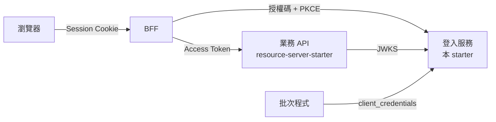

# Authorization Server 使用指南（2.1.0 preview）

`jacky917-security-authorization-server-starter` 把 Spring Authorization Server 組裝成一個可以直接使用的登入服務：帳號密碼與 Google 登入、OAuth 2.0／OpenID Connect、簽章金鑰管理，資料預設存在 SQLite，只改設定就能切換到 PostgreSQL。

> [!IMPORTANT]
> **預覽版（第 1 階段）**：不隨 2.0.0 發佈（2.1.0 起發佈到 GitHub Packages）。目前請 clone 本 repo 後執行 `mvn -DskipTests install` 在本機使用。上線前請先讀 [§9 目前的限制](#9-目前的限制第-1-階段)。

## 目錄

1. [架構](#1-架構)
2. [建立登入服務](#2-建立登入服務)
3. [設定參考](#3-設定參考)
4. [資料庫](#4-資料庫)
5. [Client（BFF、批次程式、App）](#5-clientbff批次程式app)
6. [第三方登入（Google）](#6-第三方登入google)
7. [Token 內容](#7-token-內容)
8. [業務 API 與 BFF 的設定](#8-業務-api-與-bff-的設定)
9. [目前的限制（第 1 階段）](#9-目前的限制第-1-階段)
10. [上線檢查清單](#10-上線檢查清單)

---

## 1. 架構



| 角色 | 引入 | 說明 |
|---|---|---|
| 登入服務 | `jacky917-security-authorization-server-starter` | 本文件 |
| 業務 API | `jacky917-security-resource-server-starter` | 驗證 Access Token，見 [Resource Server 使用指南](../resource-server/getting-started.md) |
| 網頁前端 | BFF（例如 [`example-bff`](../../examples/example-bff)） | 瀏覽器只持有 Session Cookie，token 留在伺服器端 |

完整的設計與決策見 [Authorization Server 設計](../design/auth-server-design.md) 與 [詳細設計](../design/auth-server-detailed-design.md)。

---

## 2. 建立登入服務

### 2.1 依賴

```xml
<dependency>
    <groupId>io.github.jacky917</groupId>
    <artifactId>jacky917-security-authorization-server-starter</artifactId>
    <version>2.0.0</version>   <!-- 預覽版：不在 GitHub Packages 上，只能在本機 mvn install 後使用 -->
</dependency>
```

> Authorization Server 模組**不隨 2.0.0 發佈**，也還不在 `jacky917-security-bom` 中，因此需要明確指定版本。2.1.0 起會發佈並加入 BOM。

Starter 已包含 Spring Web MVC、Spring Authorization Server、OAuth2 Client（第三方登入）、JDBC、Flyway、Thymeleaf（登入頁）與 SQLite 驅動。

### 2.2 最小設定

```yaml
jacky917:
  security:
    authorization-server:
      issuer: https://auth.example.com          # 必填；Token 的 iss，業務 API 的 issuer-uri 必須完全相同
      keys:
        encryption-key: ${AS_ENCRYPTION_KEY}    # 必填；加密簽章私鑰的主金鑰（openssl rand -base64 32）
      bootstrap-admin:
        username: admin
        password: ${AS_ADMIN_PASSWORD}          # 只在沒有任何 AS_ADMIN 時建立一次
      clients:
        web-bff:
          secret: ${WEB_BFF_SECRET}
          redirect-uris: https://app.example.com/login/oauth2/code/jacky917
          post-logout-redirect-uris: https://app.example.com/
          scopes: openid,profile,email
```

```java
@SpringBootApplication
public class AuthServerApplication {
    public static void main(String[] args) {
        SpringApplication.run(AuthServerApplication.class, args);
    }
}
```

啟動後：

| 網址 | 內容 |
|---|---|
| `/login` | 登入頁（依瀏覽器語言顯示繁體中文或英文） |
| `/jacky917/signed-in` | 直接開啟登入頁並登入後的頁面（Starter 的頁面都在 `/jacky917/` 之下，不會與應用程式的頁面衝突） |
| `/.well-known/openid-configuration` | OIDC discovery |
| `/oauth2/jwks` | 公鑰（業務 API 以此驗證簽章） |
| `/oauth2/authorize`、`/oauth2/token`、`/userinfo`、`/connect/logout` | 標準 OAuth 2.0／OIDC 端點 |

可執行的範例：[`examples/example-authorization-server`](../../examples/example-authorization-server)。

### 2.3 啟動時會做的事

| 步驟 | 說明 |
|---|---|
| 資料庫 | 未設定 `spring.datasource.url` 時使用 `./data/jacky917-auth.db`（SQLite），並執行全部 migration |
| 簽章金鑰 | 沒有任何金鑰時產生一把（RS256，3072 位元），私鑰以主金鑰加密後存入資料庫 |
| Client | 依 `clients.*` 建立或更新 |
| 第一位管理員 | 依 `bootstrap-admin.*`，沒有任何 `AS_ADMIN` 時建立 |
| 資料庫檔案權限 | 使用預設的 SQLite 檔案時，在寫入任何機密資料前把權限設為 `600` |
| 設定檢查 | `issuer`、主金鑰、client 的 redirect URI 等設定錯誤時**啟動失敗**，訊息指出要修改的地方 |

---

## 3. 設定參考

前綴：`jacky917.security.authorization-server`。

| 屬性 | 預設 | 說明 |
|---|---|---|
| `enabled` | `true` | 停用整個自動配置 |
| `issuer` | **必填** | `https`（`localhost` 可用 `http`），不可含 query 或 fragment |
| `database.dialect` | `auto` | `auto`（依 JDBC URL）、`postgresql`、`sqlite` |
| `database.sqlite.path` | `./data/jacky917-auth.db` | 只在未設定 `spring.datasource.url` 時使用 |
| `token.access-token-ttl` | `10m` | 1 分鐘～1 小時 |
| `token.refresh-token-ttl` | `14d` | 1 小時～90 天；每次刷新換發新的 Refresh Token |
| `token.authorization-code-ttl` | `1m` | 30 秒～5 分鐘 |
| `token.session-max-age` | `90d` | 登入 Session 的絕對上限；不得短於 Refresh Token |
| `token.audience` | `jacky917-api` | Access Token 的 `aud` |
| `refresh.reuse-grace-period` | `30s` | 0～2 分鐘。已輪換的 Refresh Token 在此期間內再次出現時視為併發刷新：拒絕，但不撤銷登入 Session |
| `refresh.history-retention` | `24h` | 1 小時～`token.refresh-token-ttl`。已輪換的 Refresh Token 保留多久以偵測重用；超過後再次出現仍會被拒絕，只是不撤銷 Session |
| `keys.algorithm` | `RS256` | 新金鑰的演算法：`RS256`、`ES256`。Token 一律以**目前金鑰**的演算法簽章，修改此設定只影響之後產生的金鑰 |
| `keys.encryption-key` | **必填** | Base64 的 32 bytes；**不可寫在設定檔中** |
| `keys.encryption-key-id` | `v1` | 主金鑰的識別碼，更換主金鑰時一併修改 |
| `password.min-length` | `12` | 8～64 |
| `account-linking.mode` | `confirm-with-existing-login` | 第三方登入的已驗證 Email 屬於既有帳號時：`confirm-with-existing-login`（登入原帳號確認後連結）或 `manual-only`（拒絕，只能從帳號頁連結） |
| `login-protection.max-failures` | `5` | 1～20。連續密碼錯誤達此次數時鎖定帳號（只阻擋密碼登入，已登入的裝置不受影響） |
| `login-protection.lock-duration` | `15m` | 1 分鐘～24 小時 |
| `login-protection.max-failures-per-ip-per-minute` | `20` | 1～10000。同一個 IP 最近一分鐘失敗達此次數後，該 IP 的登入一律拒絕（顯示「嘗試次數過多」）。IP 取自 `getRemoteAddr()`，在反向代理之後必須設定 `server.forward-headers-strategy` |
| `password.bcrypt-strength` | `12` | 10～14；調高後，使用者下次登入時自動重新雜湊 |
| `bootstrap-admin.username`／`password`／`email` | — | 第一位管理員 |
| `branding.product-name` | `jacky917` | 登入頁上的產品名稱 |
| `branding.logo-url` | — | `https://` 網址或本伺服器上的路徑 |
| `branding.primary-color` | `#2563eb` | `#rgb` 或 `#rrggbb` |
| `login.providers` | — | 登入頁顯示的第三方登入按鈕（registration id，依此順序）。未設定時顯示全部（依名稱排序）；使用無法列出所有 registration 的自訂 repository（例如存在資料庫中）時必須設定 |
| `clients.<client-id>.*` | — | 見 [§5](#5-clientbff批次程式app) |

---

## 4. 資料庫

### 4.1 SQLite（預設）

不需要任何設定。若自行設定 SQLite 的 URL，必須包含以下參數，否則**啟動失敗**：

```yaml
spring:
  datasource:
    url: jdbc:sqlite:/var/lib/auth/auth.db?foreign_keys=true&journal_mode=WAL&busy_timeout=5000&transaction_mode=IMMEDIATE&date_class=INTEGER
```

| 參數 | 原因 |
|---|---|
| `foreign_keys=true` | SQLite 預設不檢查外鍵，連帶刪除會靜默失效 |
| `journal_mode=WAL` | 讀取不被寫入阻擋 |
| `transaction_mode=IMMEDIATE` | 寫入依序執行（併發刷新時的鎖定） |
| `date_class=INTEGER` | 時間的儲存格式與 Spring Security 一致 |

連線池的 `auto-commit` 必須維持 `true`（預設值）。SQLite **只支援單一實例**；資料庫檔案（以及 `-wal`、`-shm`）中有 token 與加密後的私鑰。使用預設路徑時，Starter 會把自己建立的資料夾設為 `700`、資料庫檔案與 `-wal`、`-shm` 設為 `600`；自訂路徑時請自行限制權限。備份請用 `VACUUM INTO`，不要直接複製使用中的檔案。

### 4.2 PostgreSQL

加入驅動並設定 URL，程式碼不需修改：

```xml
<dependency>
    <groupId>org.postgresql</groupId>
    <artifactId>postgresql</artifactId>
    <scope>runtime</scope>
</dependency>
```

```yaml
spring:
  datasource:
    url: jdbc:postgresql://db.example.com:5432/auth
    username: as_app
    password: ${AS_DB_PASSWORD}
```

Starter 會自動選擇 PostgreSQL 版的 migration。建議使用 Authorization Server 專屬的資料庫（表名固定為 Spring Security 的官方名稱，例如 `oauth2_authorization`）。

### 4.3 自己的資料表

Starter 以**自己的 Flyway 與歷史表**（`jacky917_as_schema_history`）執行它的 migration，不使用、也不改變應用程式的 Flyway 設定。登入服務若有自己的表，照常放在 `src/main/resources/db/migration`，由 Spring Boot 的 Flyway 執行（歷史表 `flyway_schema_history`），兩邊的版本號互不影響。

兩者共用同一個資料庫，因此 Starter 把 `spring.flyway.baseline-on-migrate` 與 `spring.flyway.baseline-version` 預設為 `true` 與 `0`：應用程式的 Flyway 看到 Starter 的表時以版本 0 建立 baseline，`V1` 起的 migration 仍會全部執行。應用程式自行設定這兩個屬性時以應用程式的設定為準。

---

## 5. Client（BFF、批次程式、App）

第 1 階段的 client 在設定中宣告，每次啟動時建立或更新（以設定為準）。

```yaml
jacky917:
  security:
    authorization-server:
      clients:
        web-bff:                                  # 網頁前端的 BFF（confidential client）
          display-name: 網站
          secret: ${WEB_BFF_SECRET}
          redirect-uris: https://app.example.com/login/oauth2/code/jacky917
          post-logout-redirect-uris: https://app.example.com/
          scopes: openid,profile,email
        report-batch:                             # 服務對服務
          secret: ${REPORT_BATCH_SECRET}
          grant-types: client_credentials
          scopes: report.generate
        mobile-app:                               # 原生 App（public client，不會取得 Refresh Token）
          authentication-method: none
          grant-types: authorization_code
          redirect-uris: com.example.app:/callback
          scopes: openid,profile
```

| 屬性 | 預設 | 說明 |
|---|---|---|
| `display-name` | client id | 顯示名稱 |
| `secret` | — | confidential client 必填；請以 `${…}` 引用環境變數。以 BCrypt 雜湊儲存；以 `{bcrypt}` 開頭的值視為已雜湊。修改後下次啟動即更換 |
| `authentication-method` | `client-secret-basic` | `client-secret-basic`、`client-secret-post`、`none`（public client） |
| `grant-types` | `authorization-code,refresh-token` | 另可用 `client-credentials` |
| `redirect-uris` | — | 完全比對。`https`（`localhost` 可用 `http`），不可有 fragment；原生 App 可用反向網域名稱的 scheme |
| `post-logout-redirect-uris` | — | 登出後可導回的網址，完全比對 |
| `scopes` | `openid` | `openid` 只能用於授權碼流程 |

**一律套用、無法關閉**：所有 client 都必須使用 PKCE；Refresh Token 每次使用都會換發新的（舊的立即失效）。有效期取自 `token.*`。

**停權**：把 `client_profile.status` 改為 `SUSPENDED`，該 client 換 Token 時會得到 `invalid_client`（Admin API 於第 3 階段提供）。

---

## 6. 第三方登入（Google）

使用 Spring Boot 標準的 OAuth2 Client 設定，有設定時登入頁會出現「使用 Google 登入」：

```yaml
spring:
  security:
    oauth2:
      client:
        registration:
          google:
            client-id: ${GOOGLE_CLIENT_ID}
            client-secret: ${GOOGLE_CLIENT_SECRET}
            scope: openid,profile,email
```

在 Google Cloud Console 的 OAuth 用戶端設定 redirect URI：`https://auth.example.com/login/oauth2/code/google`。其他 OpenID Connect 提供者（Microsoft、LINE 等）的設定方式相同；非 OIDC 的提供者需要提供 `FederatedUserInfoMapper` Bean。

| 情況 | 結果 |
|---|---|
| 第一次以這個 Google 帳號登入 | 建立新使用者（角色 `USER`）；只有 Google 已驗證的 Email 才會儲存 |
| 已連結的 Google 帳號 | 登入同一位使用者；停用或被管理員鎖定的使用者會被拒絕 |
| Google 已驗證的 Email 屬於既有帳號 | **不會自動連結**（D06）。導向 `/jacky917/link-account`：使用者輸入原帳號的密碼，或以原帳號已連結的其他提供者登入，確認後才連結並登入；取消或 10 分鐘內未確認則什麼都不建立。設定 `account-linking.mode: manual-only` 時改為直接拒絕（「此 Email 已有帳號」），只能從帳號頁連結 |
| 已登入的使用者在帳號頁按「連結」 | 以該提供者登入後連結到目前的使用者；已屬於其他使用者的外部帳號會被拒絕 |
| 帳號頁「解除連結」 | 移除連結；若它是唯一的登入方式（沒有密碼、也沒有其他連結）則拒絕 |

連結確認頁輸入的密碼與登入頁相同：錯誤會計入帳號鎖定與 IP 限流。連結與解除連結都寫入稽核紀錄（`ACCOUNT_LINKED`、`ACCOUNT_UNLINKED`）。

Google 的 token 只用於取得使用者資料，用完立即丟棄，不會儲存。

---

## 7. Token 內容

使用者的 Access Token（第一方 client）：

```json
{
  "iss": "https://auth.example.com",
  "sub": "0192a6f4-5c8e-7b3a-9d21-4f6e8a1c2b3d",
  "aud": ["jacky917-api"],
  "client_id": "web-bff",
  "scope": ["openid", "profile", "email"],
  "asid": "0192a6f4-6d01-7e44-8c11-2a3b4c5d6e7f",
  "idp": "local",
  "roles": ["USER", "AS_SUPPORT"],
  "permissions": ["as:user:read", "as:session:revoke", "as:audit:read"]
}
```

| Claim | 說明 |
|---|---|
| `sub` | 使用者 ID（UUID）。不論以帳號密碼或 Google 登入都相同 |
| `asid` | 登入 Session ID：同一次登入（同一個裝置）簽發的所有 token 相同 |
| `idp` | `local`（帳號密碼）或提供者名稱（`google`） |
| `roles`、`permissions` | 不含前綴；Resource Server starter 會轉成 `ROLE_*`、`PERM_*`。**每次簽發與刷新時都從資料庫重新讀取**，權限變更在下一次刷新（最多 10 分鐘）生效 |

- `client_credentials` 的 Token 只有 `aud`、`client_id`、`scope`，`sub` 為 client id。
- ID Token 有 `name`、`picture`、`locale`（`profile` scope）、`email`（`email` scope 且已驗證）、`amr`（`pwd` 或 `fed`），**不含**角色與權限。
- 使用者被停用或被管理員鎖定、在其他地方變更了密碼、或登入 Session 已失效時，刷新會得到 `invalid_grant`（前兩種情況會同時撤銷該登入 Session）。連續登入失敗造成的暫時鎖定只阻擋密碼登入，不影響已登入的裝置。
- **重用偵測**：每次刷新都會換發新的 Refresh Token。舊的 Refresh Token 在寬限期（`refresh.reuse-grace-period`，預設 30 秒）之後再次出現，代表它可能已外洩：整個登入 Session 立即撤銷（最新的 Refresh Token 也失效），並寫入稽核紀錄（`login_audit` 的 `TOKEN_REFRESH_REUSE`）。BFF 請確保同一個使用者的刷新依序執行（[`example-bff`](../../examples/example-bff) 有示範），否則併發的刷新會有一個失敗。
- 自訂 claim：提供 `TokenClaimsContributor` Bean。

---

## 8. 業務 API 與 BFF 的設定

業務 API（引入 Resource Server starter）：

```yaml
spring:
  security:
    oauth2:
      resourceserver:
        jwt:
          issuer-uri: https://auth.example.com        # 與登入服務的 issuer 完全相同
          jwk-set-uri: https://auth.example.com/oauth2/jwks   # 同時設定時，啟動時不需要連到登入服務
          audiences: jacky917-api                      # 拒絕發給其他服務的 token
```

BFF（Spring Boot OAuth2 Client）：

```yaml
spring:
  security:
    oauth2:
      client:
        registration:
          jacky917:
            client-id: web-bff
            client-secret: ${WEB_BFF_SECRET}
            authorization-grant-type: authorization_code
            redirect-uri: "{baseUrl}/login/oauth2/code/{registrationId}"
            scope: openid,profile,email
        provider:
          jacky917:
            issuer-uri: https://auth.example.com
```

完整的 BFF 範例（API 代理、自動刷新、同一位使用者的刷新依序執行、RP-Initiated Logout）：[`examples/example-bff`](../../examples/example-bff)。

### 登入保護與稽核紀錄

- 連續密碼錯誤 `login-protection.max-failures` 次（預設 5）後，帳號鎖定 `login-protection.lock-duration`（預設 15 分鐘）。鎖定期間正確的密碼也無法登入，也不會延長鎖定；登入成功時失敗次數歸零。
- 同一個 IP 最近一分鐘失敗 `login-protection.max-failures-per-ip-per-minute` 次（預設 20）後，該 IP 的登入在檢查密碼之前就被拒絕。
- 登入頁對所有失敗顯示相同的訊息（不透露帳號是否存在或被鎖定），真正的原因寫入 `login_audit`：

| `event_type` | 何時 | `failure_reason` |
|---|---|---|
| `LOGIN` | 每次登入（密碼或第三方），成功或失敗 | `BAD_CREDENTIALS`、`UNKNOWN_USER`、`LOCKED`、`DISABLED`、`RATE_LIMITED`、`FEDERATION`、`USER_CANNOT_LOG_IN`、`ACCOUNT_EXISTS` |
| `ACCOUNT_LOCKED` | 連續失敗造成鎖定 | — |
| `LOGOUT` | 登出（見下一節） | — |
| `TOKEN_REFRESH_REUSE` | 偵測到 Refresh Token 重用 | `REUSE_DETECTED` |

稽核事件同時以 Spring 的 `ApplicationEvent`（`LoginAuditEvent`）發布，應用程式可以另外監聽並轉送到 SIEM。寫入失敗只記錄錯誤日誌，不影響登入。

### 登出與帳號頁

| 方式 | 結果 |
|---|---|
| BFF 導向 `/connect/logout?id_token_hint=…&post_logout_redirect_uri=…`（RP-Initiated Logout） | 撤銷該次登入的登入 Session（刪除其授權，Refresh Token 立即失效），結束登入服務的瀏覽器登入，導回 `post_logout_redirect_uri`（必須是 client 設定的 `post-logout-redirect-uris` 之一） |
| 登入服務的瀏覽器 Session 已過期 | 仍以 `id_token_hint` 找到並撤銷登入 Session；ID Token 本身過期也可以 |
| 帳號頁 `/jacky917/account` | 列出登入中的裝置（登入方式、時間、IP、瀏覽器），可以登出單一裝置或「登出所有裝置」；也可以連結或解除連結第三方帳號（見 [§6](#6-第三方登入google)） |
| 登入服務的 `POST /logout` | 撤銷目前的登入 Session，回到 `/login?logout` |

每次登出都寫入稽核紀錄（`login_audit` 的 `LOGOUT`）。已簽發的 Access Token 仍有效至到期（最長 `token.access-token-ttl`），見 [限制 §6](../resource-server/limitations.md#6-token-無法撤銷)。帳號頁的時間以伺服器的預設時區顯示。

> [!WARNING]
> 在同一台主機上以不同埠號執行登入服務與 BFF 時（例如 `localhost:9000` 與 `localhost:8082`），兩者預設的 `JSESSIONID` Cookie 會互相覆蓋（瀏覽器的 Cookie 不區分埠號），登入流程會失敗。請為登入服務設定不同的 Cookie 名稱：`server.servlet.session.cookie.name: JACKY917_AS_SESSION`。

---

## 9. 目前的限制（第 1 階段）

| 項目 | 現況 | 預計 |
|---|---|---|
| 金鑰輪換、資料清理 | 沒有排程；過期的授權不會自動刪除 | 第 2 階段 |
| 多實例 | 登入頁的 Session 存在記憶體中，多實例需要黏性 Session；SQLite 只能單一實例 | 第 2 階段：PostgreSQL 搭配 Spring Session JDBC |
| 第三方 client、同意畫面、Admin API | 不支援（設定第三方 client 會啟動失敗） | 第 3 階段 |
| 註冊、忘記密碼 | 不支援 | 依需求 |
| MySQL | 不支援 | 第 5 階段 |

---

## 10. 上線檢查清單

- [ ] `issuer` 為正式的 `https` 網址，所有業務 API 的 `issuer-uri` 與它完全相同
- [ ] `keys.encryption-key`、client secret、管理員密碼都從環境變數或密鑰管理服務注入，沒有寫在設定檔或版本控制中
- [ ] 主金鑰另外備份：遺失後無法解密已儲存的私鑰，啟動會失敗（需刪除金鑰、重新產生，所有使用者的 token 隨之失效）
- [ ] SQLite：只有一個實例；資料庫檔案權限為 `600`；有定期以 `VACUUM INTO` 備份
- [ ] PostgreSQL：專屬資料庫、應用程式帳號只有必要權限（[資料模型 §13.3](../design/auth-server-data-model.md#133-資料庫帳號與權限)）
- [ ] 全程 HTTPS；反向代理有正確傳遞 `X-Forwarded-*`（`server.forward-headers-strategy`）
- [ ] 第一位管理員登入後已變更密碼
- [ ] 已了解 [§9 目前的限制](#9-目前的限制第-1-階段)
