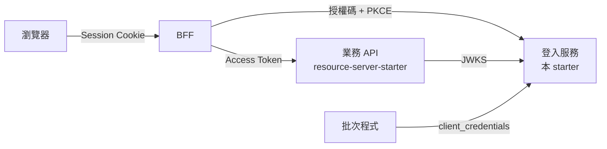

# Authorization Server 使用指南（2.1.0 preview）

`jacky917-security-authorization-server-starter` 把 Spring Authorization Server 組裝成一個可以直接使用的登入服務：帳號密碼與 Google、GitHub、LINE 登入、OAuth 2.0／OpenID Connect、Refresh Token 重用偵測、登出與帳號頁、登入保護與稽核、簽章金鑰的自動輪換，資料預設存在 SQLite，只改設定就能切換到 PostgreSQL（可多實例）。

> [!IMPORTANT]
> **預覽版（第 1、2 階段已實作，尚未發佈）**：不隨 2.0.0 發佈（2.1.0 起發佈到 GitHub Packages）。目前請 clone 本 repo 後執行 `mvn -DskipTests install` 在本機使用。上線前請先讀 [§10 目前的限制](#10-目前的限制)。

## 目錄

1. [架構](#1-架構)
2. [建立登入服務](#2-建立登入服務)
3. [設定參考](#3-設定參考)
4. [資料庫](#4-資料庫)
5. [Client（BFF、批次程式、App）](#5-clientbff批次程式app)
6. [第三方登入（Google、GitHub、LINE）](#6-第三方登入googlegithubline)
7. [Token 內容](#7-token-內容)
8. [業務 API 與 BFF 的設定](#8-業務-api-與-bff-的設定)
9. [管理 API](#9-管理-api)
10. [目前的限制](#10-目前的限制)
11. [上線檢查清單](#11-上線檢查清單)

---

## 1. 架構



| 角色 | 引入 | 說明 |
|---|---|---|
| 登入服務 | `jacky917-security-authorization-server-starter` | 本文件 |
| 業務 API | `jacky917-security-resource-server-starter` | 驗證 Access Token，見 [Resource Server 使用指南](../resource-server/getting-started.md) |
| 網頁前端 | BFF（例如 [`example-bff`](../../examples/example-bff)） | 瀏覽器只持有 Session Cookie，token 留在伺服器端 |

完整的設計與決策見 [Authorization Server 設計](../design/auth-server-design.md) 與 [詳細設計](../design/auth-server-detailed-design.md)。

---

## 2. 建立登入服務

### 2.1 依賴

```xml
<dependency>
    <groupId>io.github.jacky917</groupId>
    <artifactId>jacky917-security-authorization-server-starter</artifactId>
    <version>2.0.0</version>   <!-- 預覽版：不在 GitHub Packages 上，只能在本機 mvn install 後使用 -->
</dependency>
```

> Authorization Server 模組**不隨 2.0.0 發佈**，也還不在 `jacky917-security-bom` 中，因此需要明確指定版本。2.1.0 起會發佈並加入 BOM。

Starter 已包含 Spring Web MVC、Spring Authorization Server、OAuth2 Client（第三方登入）、JDBC、Flyway、Thymeleaf（登入頁）與 SQLite 驅動。

### 2.2 最小設定

```yaml
jacky917:
  security:
    authorization-server:
      issuer: https://auth.example.com          # 必填；Token 的 iss，業務 API 的 issuer-uri 必須完全相同
      keys:
        encryption-key: ${AS_ENCRYPTION_KEY}    # 必填；加密簽章私鑰的主金鑰（openssl rand -base64 32）
      bootstrap-admin:
        username: admin
        password: ${AS_ADMIN_PASSWORD}          # 只在沒有任何 AS_ADMIN 時建立一次
      clients:
        web-bff:
          secret: ${WEB_BFF_SECRET}
          redirect-uris: https://app.example.com/login/oauth2/code/jacky917
          post-logout-redirect-uris: https://app.example.com/
          scopes: openid,profile,email
```

```java
@SpringBootApplication
public class AuthServerApplication {
    public static void main(String[] args) {
        SpringApplication.run(AuthServerApplication.class, args);
    }
}
```

啟動後：

| 網址 | 內容 |
|---|---|
| `/login` | 登入頁（依瀏覽器語言顯示繁體中文或英文） |
| `/jacky917/signed-in` | 直接開啟登入頁並登入後的頁面（Starter 的頁面都在 `/jacky917/` 之下，不會與應用程式的頁面衝突） |
| `/.well-known/openid-configuration` | OIDC discovery |
| `/oauth2/jwks` | 公鑰（業務 API 以此驗證簽章） |
| `/oauth2/authorize`、`/oauth2/token`、`/userinfo`、`/connect/logout` | 標準 OAuth 2.0／OIDC 端點 |

可執行的範例：[`examples/example-authorization-server`](../../examples/example-authorization-server)。

### 2.3 啟動時會做的事

| 步驟 | 說明 |
|---|---|
| 資料庫 | 未設定 `spring.datasource.url` 時使用 `./data/jacky917-auth.db`（SQLite），並執行全部 migration |
| 簽章金鑰 | 沒有任何金鑰時產生一把（RS256，3072 位元），私鑰以主金鑰加密後存入資料庫 |
| Client | 依 `clients.*` 建立或更新 |
| 第一位管理員 | 依 `bootstrap-admin.*`，沒有任何 `AS_ADMIN` 時建立 |
| 資料庫檔案權限 | 使用預設的 SQLite 檔案時，在寫入任何機密資料前把權限設為 `600` |
| 設定檢查 | `issuer`、主金鑰、client 的 redirect URI 等設定錯誤時**啟動失敗**，訊息指出要修改的地方 |

---

## 3. 設定參考

前綴：`jacky917.security.authorization-server`。

| 屬性 | 預設 | 說明 |
|---|---|---|
| `enabled` | `true` | 停用整個自動配置 |
| `issuer` | **必填** | `https`（`localhost` 可用 `http`），不可含 query 或 fragment |
| `database.dialect` | `auto` | `auto`（依 JDBC URL）、`postgresql`、`sqlite` |
| `database.sqlite.path` | `./data/jacky917-auth.db` | 只在未設定 `spring.datasource.url` 時使用 |
| `token.access-token-ttl` | `10m` | 1 分鐘～1 小時 |
| `token.refresh-token-ttl` | `14d` | 1 小時～90 天；每次刷新換發新的 Refresh Token |
| `token.authorization-code-ttl` | `1m` | 30 秒～5 分鐘 |
| `token.session-max-age` | `90d` | 登入 Session 的絕對上限；不得短於 Refresh Token |
| `token.audience` | `jacky917-api` | Access Token 的 `aud` |
| `token.audience-strategy` | `shared` | `shared`：所有 Access Token 的 `aud` 都是 `token.audience`；`per-scope`：見 [§7](#7-token-內容) |
| `refresh.reuse-grace-period` | `30s` | 0～2 分鐘。已輪換的 Refresh Token 在此期間內再次出現時視為併發刷新：拒絕，但不撤銷登入 Session |
| `refresh.history-retention` | `24h` | 1 小時～`token.refresh-token-ttl`。已輪換的 Refresh Token 保留多久以偵測重用；超過後再次出現仍會被拒絕，只是不撤銷 Session |
| `keys.algorithm` | `RS256` | 新金鑰的演算法：`RS256`、`ES256`。Token 一律以**目前金鑰**的演算法簽章，修改此設定只影響之後產生的金鑰 |
| `keys.encryption-key` | **必填** | Base64 的 32 bytes；**不可寫在設定檔中** |
| `keys.encryption-key-id` | `v1` | 主金鑰的識別碼，更換主金鑰時一併修改 |
| `keys.rotation-enabled` | `true` | 是否自動輪換簽章金鑰（見 [§4.4](#44-排程工作金鑰輪換清理)） |
| `keys.rotation-period` | `90d` | 一把金鑰簽章多久後被取代，至少 7 天 |
| `keys.announce-period` | `1d` | 新公鑰在開始簽章前先公開的時間，至少 5 分鐘且短於輪換週期 |
| `cleanup.enabled` | `true` | 是否定期刪除過期的資料 |
| `cleanup.batch-size` | `1000` | 每個刪除陳述式的筆數，10～10000 |
| `cleanup.login-audit-retention` | `180d` | `login_audit` 的保留期間 |
| `cleanup.admin-audit-retention` | `730d` | `admin_audit_log` 的保留期間 |
| `password.min-length` | `12` | 8～64 |
| `account-linking.mode` | `confirm-with-existing-login` | 第三方登入的已驗證 Email 屬於既有帳號時：`confirm-with-existing-login`（登入原帳號確認後連結）或 `manual-only`（拒絕，只能從帳號頁連結） |
| `login-protection.max-failures` | `5` | 1～20。連續密碼錯誤達此次數時鎖定帳號（只阻擋密碼登入，已登入的裝置不受影響） |
| `login-protection.lock-duration` | `15m` | 1 分鐘～24 小時 |
| `login-protection.max-failures-per-ip-per-minute` | `20` | 1～10000。同一個 IP 最近一分鐘失敗達此次數後，該 IP 的登入一律拒絕（顯示「嘗試次數過多」）。IP 取自 `getRemoteAddr()`，在反向代理之後必須設定 `server.forward-headers-strategy` |
| `password.bcrypt-strength` | `12` | 10～14；調高後，使用者下次登入時自動重新雜湊 |
| `bootstrap-admin.username`／`password`／`email` | — | 第一位管理員 |
| `bootstrap-admin.password-change-required` | `true` | 第一位管理員首次登入時必須先變更密碼 |
| `account.registration.enabled` | `false` | 開放以 Email 註冊（見 [帳號自助功能](#帳號自助功能)）；需要寄信方式，否則啟動失敗 |
| `account.email-verification-ttl` | `24h` | 1 小時～7 天。註冊驗證連結的有效期 |
| `account.password-reset-ttl` | `1h` | 10 分鐘～24 小時。重設密碼連結的有效期 |
| `account.mail.from` | — | 寄件者；使用 `spring.mail.*` 寄信時必填 |
| `account.mail.log-links` | `false` | 沒有 SMTP 時把信件連結寫入日誌（只用於開發） |
| `mfa.issuer-name` | `branding.product-name` | 驗證器 App 中顯示的名稱（見 [兩步驟驗證](#兩步驟驗證)） |
| `mfa.required-roles` | — | 必須使用兩步驟驗證的角色，例如 `AS_ADMIN` |
| `branding.product-name` | `jacky917` | 登入頁上的產品名稱 |
| `branding.logo-url` | — | `https://` 網址或本伺服器上的路徑 |
| `branding.primary-color` | `#2563eb` | `#rgb` 或 `#rrggbb` |
| `login.providers` | — | 登入頁顯示的第三方登入按鈕（registration id，依此順序）。未設定時顯示全部（依名稱排序）；使用無法列出所有 registration 的自訂 repository（例如存在資料庫中）時必須設定 |
| `clients.<client-id>.*` | — | 見 [§5](#5-clientbff批次程式app) |
| `admin-api.enabled` | `true` | 管理 API（見 [§9](#9-管理-api)） |
| `admin-api.audience` | `token.audience` 的第一個值 | 呼叫管理 API 的 token 必須包含的 `aud` |

---

## 4. 資料庫

### 4.1 SQLite（預設）

不需要任何設定。若自行設定 SQLite 的 URL，必須包含以下參數，否則**啟動失敗**：

```yaml
spring:
  datasource:
    url: jdbc:sqlite:/var/lib/auth/auth.db?foreign_keys=true&journal_mode=WAL&busy_timeout=5000&transaction_mode=IMMEDIATE&date_class=INTEGER
```

| 參數 | 原因 |
|---|---|
| `foreign_keys=true` | SQLite 預設不檢查外鍵，連帶刪除會靜默失效 |
| `journal_mode=WAL` | 讀取不被寫入阻擋 |
| `transaction_mode=IMMEDIATE` | 寫入依序執行（併發刷新時的鎖定） |
| `date_class=INTEGER` | 時間的儲存格式與 Spring Security 一致 |

連線池的 `auto-commit` 必須維持 `true`（預設值）。SQLite **只支援單一實例**；資料庫檔案（以及 `-wal`、`-shm`）中有 token 與加密後的私鑰。使用預設路徑時，Starter 會把自己建立的資料夾設為 `700`、資料庫檔案與 `-wal`、`-shm` 設為 `600`；自訂路徑時請自行限制權限。備份請用 `VACUUM INTO`，不要直接複製使用中的檔案。

### 4.2 PostgreSQL

加入驅動並設定 URL，程式碼不需修改：

```xml
<dependency>
    <groupId>org.postgresql</groupId>
    <artifactId>postgresql</artifactId>
    <scope>runtime</scope>
</dependency>
```

```yaml
spring:
  datasource:
    url: jdbc:postgresql://db.example.com:5432/auth
    username: as_app
    password: ${AS_DB_PASSWORD}
```

Starter 會自動選擇 PostgreSQL 版的 migration。建議使用 Authorization Server 專屬的資料庫（表名固定為 Spring Security 的官方名稱，例如 `oauth2_authorization`）。

#### 多個實例

授權、登入 Session、金鑰都存在資料庫中；多個實例另外需要共用**瀏覽器 Session**（登入頁的 CSRF、被中斷的授權請求）。加入 Spring Session JDBC 即可，資料表已由 starter 的 migration 建立：

```xml
<dependency>
    <groupId>org.springframework.boot</groupId>
    <artifactId>spring-boot-starter-session-jdbc</artifactId>
</dependency>
```

- 有 Spring Session 時，starter 會以它追蹤 OpenID Connect 的 Session，ID Token 的 `sid` 與登出檢查在不同實例間也正確。
- 負載平衡器不需要黏性 Session。在反向代理之後請設定 `server.forward-headers-strategy`，讓登入服務以對外的網址產生重導。
- 排程工作（[§4.4](#44-排程工作金鑰輪換清理)）以資料庫鎖確保每個週期只在一個實例執行。
- SQLite 只能單一實例；單一實例不需要 Spring Session（瀏覽器 Session 存在記憶體中較快）。

### 4.3 自己的資料表

Starter 以**自己的 Flyway 與歷史表**（`jacky917_as_schema_history`）執行它的 migration，不使用、也不改變應用程式的 Flyway 設定。登入服務若有自己的表，照常放在 `src/main/resources/db/migration`，由 Spring Boot 的 Flyway 執行（歷史表 `flyway_schema_history`），兩邊的版本號互不影響。

兩者共用同一個資料庫，因此 Starter 把 `spring.flyway.baseline-on-migrate` 與 `spring.flyway.baseline-version` 預設為 `true` 與 `0`：應用程式的 Flyway 看到 Starter 的表時以版本 0 建立 baseline，`V1` 起的 migration 仍會全部執行。應用程式自行設定這兩個屬性時以應用程式的設定為準。

---

### 4.4 排程工作（金鑰輪換、清理）

Starter 以自己的執行緒執行下列工作（不會啟用應用程式的 `@Scheduled`）。每個工作在啟動後經過一個週期才第一次執行；多個實例時，以 `shedlock` 表確保每個週期只有一個實例執行。工作失敗時記錄 `ERROR` 日誌、計入 `jacky917.as.maintenance.failures`，並釋放鎖，任何實例的下一次排程都會重試；同一個工作的各個清理步驟各自執行，一步失敗不會跳過其他步驟。

重新部署的頻率高於工作週期時（例如每天部署），每日清理永遠等不到第一次執行；這種情況請由管理工作呼叫 `DataCleanup#runAll()`。

| 工作 | 週期 | 內容 |
|---|---|---|
| 金鑰輪換 | 每小時檢查 | 目前的金鑰使用滿 `rotation-period − announce-period` 時建立 `NEXT` 金鑰並公開；公開滿 `announce-period` 後開始簽章，舊金鑰改為 `RETIRING`（仍公開，已簽發的 token 仍可驗證）；它可能簽發的 token 全部到期、再加上 5 分鐘緩衝（涵蓋其他實例最多 1 分鐘的金鑰快取）後改為 `RETIRED`，不再公開。使用者不需要重新登入 |
| 清理授權 | 15 分鐘 | 所有 token 皆已過期的授權；沒有任何 token、超過 1 小時的授權（使用者在同意畫面離開） |
| 清理 Session | 每小時 | 已輪換的 Refresh Token 紀錄；超過絕對有效期的登入 Session 改為 `EXPIRED`；撤銷或過期超過 30 天的登入 Session |
| 每日清理 | 每天 | 到期超過 7 天的操作 token、超過保留期的稽核紀錄、退役超過一年的金鑰 |

可能大量累積的資料表每次最多刪除 `cleanup.batch-size` 筆，不會長時間鎖住資料表；登入 Session 改為 `EXPIRED` 與刪除退役金鑰影響的筆數很少，以單一陳述式執行。

### 4.5 監控（metrics、健康檢查、事件）

應用程式有 Micrometer 時（例如 `spring-boot-starter-actuator`），starter 提供下列 metrics：

| 名稱 | 類型 | 標籤 | 用途 |
|---|---|---|---|
| `jacky917.as.login` | counter | `idp`、`result`（`success` 或失敗原因） | 登入成功率、暴力破解偵測 |
| `jacky917.as.token.issued` | counter | `grant_type`、`client_id` | 簽發量（計的是簽發嘗試：之後儲存失敗的也會計入） |
| `jacky917.as.refresh.reuse_detected` | counter | `client_id` | **告警**：大於 0 代表 Refresh Token 可能外洩 |
| `jacky917.as.refresh.grace_rejected` | counter | `client_id` | 併發刷新；持續增加代表 client 沒有讓同一個使用者的刷新依序執行 |
| `jacky917.as.refresh.rejected` | counter | `reason` | 重用偵測拒絕的刷新（Spring 本身的拒絕，例如 Refresh Token 已過期，不計入）；登出後再出現的 Refresh Token 計為 `unknown_token` |
| `jacky917.as.session.active` | gauge | — | 有效的登入 Session 數 |
| `jacky917.as.signing_key.age` | gauge（天） | — | 目前金鑰的使用天數；**超過 `keys.rotation-period` + 2 天時告警**（輪換排程沒有執行）。沒有 `ACTIVE` 金鑰時為無限大，同一條告警也會觸發 |
| `jacky917.as.cleanup.deleted` | counter | `target`（`authorizations`、`refresh_token_history`、`expired_sessions`、`sessions`、`action_tokens`、`audits`、`signing_keys`） | 清理是否正常；`expired_sessions` 是改為 `EXPIRED` 的筆數 |
| `jacky917.as.audit.write_failures` | counter | `type` | **告警**：大於 0 代表稽核紀錄不完整，IP 限流也看不到這些登入失敗 |
| `jacky917.as.maintenance.failures` | counter | `task`（工作名稱或 `cleanup.<target>`） | **告警**：排程工作或清理步驟失敗 |

有 Spring Boot 的健康檢查時，`/actuator/health` 另外包含 `signingKey`：沒有 `ACTIVE` 簽章金鑰時為 `DOWN`；詳細資料有金鑰 ID、演算法、使用天數，以及啟用輪換時的 `rotationOverdue`（輪換逾期時狀態仍為 `UP`，請以 `signing_key.age` 告警；不含任何金鑰內容）。資料庫連線由 Spring Boot 本身的檢查回報。可以 `management.health.signingkey.enabled=false` 關閉。

應用程式也可以直接監聽 starter 發布的事件（例如轉送到 SIEM）：`LoginAuditEvent`（所有登入、登出、連結與重用的稽核）、`AccessTokenIssuedEvent`、`RefreshTokenRejectedEvent`、`DataCleanupEvent`、`LoginAuditWriteFailedEvent`、`MaintenanceFailedEvent`。Metrics 的 listener 失敗只記錄日誌，不會影響登入或 token 請求。

## 5. Client（BFF、批次程式、App）

自己的應用程式（第一方 client）在設定中宣告，每次啟動時建立或更新（以設定為準）。合作廠商等第三方應用可以寫在設定中，也可以透過[管理 API](#9-管理-api) 建立。

```yaml
jacky917:
  security:
    authorization-server:
      clients:
        web-bff:                                  # 網頁前端的 BFF（confidential client）
          display-name: 網站
          secret: ${WEB_BFF_SECRET}
          redirect-uris: https://app.example.com/login/oauth2/code/jacky917
          post-logout-redirect-uris: https://app.example.com/
          scopes: openid,profile,email
        report-batch:                             # 服務對服務
          secret: ${REPORT_BATCH_SECRET}
          grant-types: client_credentials
          scopes: report.generate
        mobile-app:                               # 原生 App（public client，不會取得 Refresh Token）
          authentication-method: none
          grant-types: authorization_code
          redirect-uris: com.example.app:/callback
          scopes: openid,profile
        partner-app:                              # 第三方應用（使用者必須同意）
          trust-level: third-party
          display-name: 合作夥伴 App
          secret: ${PARTNER_APP_SECRET}
          redirect-uris: https://partner.example.com/callback
          scopes: openid,profile
          privacy-policy-url: https://partner.example.com/privacy
```

| 屬性 | 預設 | 說明 |
|---|---|---|
| `display-name` | client id | 顯示名稱 |
| `secret` | — | confidential client 必填；請以 `${…}` 引用環境變數。以 BCrypt 雜湊儲存；以 `{bcrypt}` 開頭的值視為已雜湊。修改後下次啟動即更換 |
| `authentication-method` | `client-secret-basic` | `client-secret-basic`、`client-secret-post`、`none`（public client） |
| `grant-types` | `authorization-code,refresh-token` | 另可用 `client-credentials` |
| `redirect-uris` | — | 完全比對。`https`（`localhost` 可用 `http`），不可有 fragment；原生 App 可用反向網域名稱的 scheme |
| `post-logout-redirect-uris` | — | 登出後可導回的網址，完全比對 |
| `scopes` | `openid` | `openid` 只能用於授權碼流程 |
| `trust-level` | `first-party` | `third-party`：見下方 |
| `description`、`logo-url`、`homepage-url`、`privacy-policy-url`、`terms-url` | — | 顯示在同意畫面上；網址必須是 `https` |

**第三方 client**（`trust-level: third-party`）：使用者第一次授權時會看到同意畫面（`/oauth2/consent`：應用程式的名稱、Logo、說明、隱私權政策與服務條款，以及要求的 scope 的名稱與說明），可以只勾選部分 scope；之後只在要求新的 scope 時再次詢問。Scope 的名稱與說明以[管理 API](#9-管理-api) 的 `/admin/api/scopes` 設定，`consentRequired: false` 的 scope 不詢問；必須有 `privacy-policy-url`；不可使用 `client-credentials`（沒有使用者可以同意）；不可要求以 `as:` 開頭的 scope（會授予管理權限）。Token 不含角色，`permissions` 只有「使用者同意的 scope 對應的權限」中使用者也擁有的部分（見 [§7](#7-token-內容)）。

**一律套用、無法關閉**：所有 client 都必須使用 PKCE；Refresh Token 每次使用都會換發新的（舊的立即失效）。有效期取自 `token.*`。

設定中的 client 由設定管理：管理 API 可以讀取，但不能修改、停權或刪除（`409`）。停權的 client 換 Token 時會得到 `invalid_client`。

---

## 6. 第三方登入（Google、GitHub、LINE）

使用 Spring Boot 標準的 OAuth2 Client 設定，有設定的提供者會出現在登入頁（「使用 Google 登入」等）：

```yaml
spring:
  security:
    oauth2:
      client:
        registration:
          google:
            client-id: ${GOOGLE_CLIENT_ID}
            client-secret: ${GOOGLE_CLIENT_SECRET}
            scope: openid,profile,email
          github:
            client-id: ${GITHUB_CLIENT_ID}
            client-secret: ${GITHUB_CLIENT_SECRET}
            scope: read:user,user:email        # user:email 才能取得已驗證的 Email
          line:
            client-name: LINE
            client-id: ${LINE_CHANNEL_ID}
            client-secret: ${LINE_CHANNEL_SECRET}
            scope: openid,profile,email
            authorization-grant-type: authorization_code
            redirect-uri: "{baseUrl}/login/oauth2/code/{registrationId}"
        provider:
          line:
            issuer-uri: https://access.line.me
            user-name-attribute: sub
```

各提供者後台設定的 redirect URI 為 `https://auth.example.com/login/oauth2/code/<registration id>`（例如 `.../code/google`）。

| 提供者 | 說明 |
|---|---|
| Google 與其他 OpenID Connect 提供者 | 以 ID Token 的 `sub` 識別；`email_verified` 為 true 的 Email 才視為已驗證 |
| GitHub | 以數字 `id` 識別（登入名稱可能變更）；Email 取自 `/user/emails` 中**主要且已驗證**的地址，需要 `user:email` scope，沒有時使用者沒有 Email（仍可登入）。GitHub 故障（逾時、5xx、速率限制）時登入失敗，請使用者重試，避免已有帳號的使用者得到重複的帳號。公開個人資料中的 Email 一律不採信。GitHub Enterprise Server 也適用：registration id 為 `github`，或使用者資訊端點以 `/api/v3/user` 結尾 |
| LINE | 網頁登入的 ID Token 以 channel secret 簽 HS256，starter 會自動改用 HS256 驗證（registration id 為 `line` 或 issuer 為 `https://access.line.me`）。LINE 不提供 `email_verified`，因此 LINE 的 Email 不會用於比對既有帳號 |
| 其他非 OIDC 的提供者 | 提供 `FederatedUserInfoMapper` Bean |

| 情況 | 結果 |
|---|---|
| 第一次以這個外部帳號登入 | 建立新使用者（角色 `USER`）；只有已驗證的 Email 才會儲存 |
| 已連結的外部帳號 | 登入同一位使用者；停用或被管理員鎖定的使用者會被拒絕 |
| 外部帳號已驗證的 Email 屬於既有帳號 | **不會自動連結**（D06）。導向 `/jacky917/link-account`：使用者輸入原帳號的密碼，或以原帳號已連結的其他提供者登入，確認後才連結並登入；取消或 10 分鐘內未確認則什麼都不建立。設定 `account-linking.mode: manual-only` 時改為直接拒絕（「此 Email 已有帳號」），只能從帳號頁連結 |
| 已登入的使用者在帳號頁按「連結」 | 以該提供者登入後連結到目前的使用者；已屬於其他使用者的外部帳號會被拒絕 |
| 帳號頁「解除連結」 | 移除連結；若它是唯一的登入方式（沒有密碼、也沒有其他連結）則拒絕 |

連結確認頁輸入的密碼與登入頁相同：錯誤會計入帳號鎖定與 IP 限流。連結與解除連結都寫入稽核紀錄（`ACCOUNT_LINKED`、`ACCOUNT_UNLINKED`）。

提供者的 token 只用於取得使用者資料，用完立即丟棄，不會儲存。

---

## 7. Token 內容

使用者的 Access Token（第一方 client）：

```json
{
  "iss": "https://auth.example.com",
  "sub": "0192a6f4-5c8e-7b3a-9d21-4f6e8a1c2b3d",
  "aud": ["jacky917-api"],
  "client_id": "web-bff",
  "scope": ["openid", "profile", "email"],
  "asid": "0192a6f4-6d01-7e44-8c11-2a3b4c5d6e7f",
  "idp": "local",
  "roles": ["USER", "AS_SUPPORT"],
  "permissions": ["as:user:read", "as:session:revoke", "as:audit:read"]
}
```

| Claim | 說明 |
|---|---|
| `sub` | 使用者 ID（UUID）。不論以帳號密碼或 Google 登入都相同 |
| `asid` | 登入 Session ID：同一次登入（同一個裝置）簽發的所有 token 相同 |
| `idp` | `local`（帳號密碼）或提供者名稱（`google`） |
| `roles`、`permissions` | 不含前綴；Resource Server starter 會轉成 `ROLE_*`、`PERM_*`。**每次簽發與刷新時都從資料庫重新讀取**，權限變更在下一次刷新（最多 10 分鐘）生效 |

- `aud`：預設為 `token.audience`。`token.audience-strategy: per-scope` 時改為授予的 scope 所屬的 API resource（`/admin/api/scopes` 的 `apiResource`，去除重複），只有在沒有任何 scope 屬於 API resource 時（例如只有 `openid profile`）才使用 `token.audience`；每個業務 API 把 `audiences` 設為自己的 API resource 代碼，就只接受要求了自己 scope 的 token。管理 API 檢查 `admin-api.audience`：呼叫管理 API 的 token 不要同時要求屬於其他 API resource 的 scope。
- `client_credentials` 的 Token 只有 `aud`、`client_id`、`scope`，`sub` 為 client id。
- ID Token 有 `name`、`picture`、`locale`（`profile` scope）、`email`（`email` scope 且已驗證）、`amr`（`pwd` 或 `fed`），**不含**角色與權限。
- 使用者被停用或被管理員鎖定、在其他地方變更了密碼、或登入 Session 已失效時，刷新會得到 `invalid_grant`（前兩種情況會同時撤銷該登入 Session）。連續登入失敗造成的暫時鎖定只阻擋密碼登入，不影響已登入的裝置。
- **重用偵測**：每次刷新都會換發新的 Refresh Token。舊的 Refresh Token 在寬限期（`refresh.reuse-grace-period`，預設 30 秒）之後再次出現，代表它可能已外洩：整個登入 Session 立即撤銷（最新的 Refresh Token 也失效），並寫入稽核紀錄（`login_audit` 的 `TOKEN_REFRESH_REUSE`）。BFF 請確保同一個使用者的刷新依序執行（[`example-bff`](../../examples/example-bff) 有示範），否則併發的刷新會有一個失敗。
- 自訂 claim：提供 `TokenClaimsContributor` Bean。

---

## 8. 業務 API 與 BFF 的設定

業務 API（引入 Resource Server starter）：

```yaml
spring:
  security:
    oauth2:
      resourceserver:
        jwt:
          issuer-uri: https://auth.example.com        # 與登入服務的 issuer 完全相同
          jwk-set-uri: https://auth.example.com/oauth2/jwks   # 同時設定時，啟動時不需要連到登入服務
          audiences: jacky917-api                      # 拒絕發給其他服務的 token
```

BFF（Spring Boot OAuth2 Client）：

```yaml
spring:
  security:
    oauth2:
      client:
        registration:
          jacky917:
            client-id: web-bff
            client-secret: ${WEB_BFF_SECRET}
            authorization-grant-type: authorization_code
            redirect-uri: "{baseUrl}/login/oauth2/code/{registrationId}"
            scope: openid,profile,email
        provider:
          jacky917:
            issuer-uri: https://auth.example.com
```

完整的 BFF 範例（API 代理、自動刷新、同一位使用者的刷新依序執行、RP-Initiated Logout）：[`examples/example-bff`](../../examples/example-bff)。

### 登入保護與稽核紀錄

- 連續密碼錯誤 `login-protection.max-failures` 次（預設 5）後，帳號鎖定 `login-protection.lock-duration`（預設 15 分鐘）。鎖定期間正確的密碼也無法登入，也不會延長鎖定；登入成功時失敗次數歸零。
- 只有密碼錯誤才計入鎖定。非預期的錯誤（例如資料庫無法使用）記錄為 `ERROR` 並稽核為 `ERROR`，不計入，因此不會鎖住輸入正確密碼的使用者。
- 同一個 IP 最近一分鐘失敗 `login-protection.max-failures-per-ip-per-minute` 次（預設 20）後，該 IP 的登入在檢查密碼之前就被拒絕。登入頁與帳號連結確認頁都受保護，路徑以解碼後的值比對（`/%6Cogin` 這類編碼無法略過）。
- 登入頁對所有密碼登入失敗顯示相同的訊息（不透露帳號是否存在或被鎖定），只有限流與第三方登入有各自的訊息；真正的原因寫入 `login_audit`：

| `event_type` | 何時 | `failure_reason` |
|---|---|---|
| `LOGIN` | 每次登入（密碼或第三方），成功或失敗 | `BAD_CREDENTIALS`、`UNKNOWN_USER`、`LOCKED`、`DISABLED`、`NO_PASSWORD`、`RATE_LIMITED`、`ERROR`、`FEDERATION`、`USER_CANNOT_LOG_IN`、`ACCOUNT_EXISTS`、`LINK_REQUIRED`、`MFA_FAILED` |
| `ACCOUNT_LOCKED` | 連續失敗造成鎖定 | — |
| `ACCOUNT_LINKED` | 連結第三方帳號，成功或失敗 | `LINK_EXPIRED`、`LINKED_TO_ANOTHER_USER`、`PROVIDER_ALREADY_LINKED`、`FEDERATION` |
| `ACCOUNT_UNLINKED` | 解除連結 | — |
| `LOGOUT` | 登出（見下一節） | — |
| `TOKEN_REFRESH_REUSE` | 偵測到 Refresh Token 重用（每次都寫入，即使 Session 已撤銷） | `REUSE_DETECTED` |
| `MFA_ENABLED`、`MFA_DISABLED` | 使用者啟用或停用兩步驟驗證 | — |
| `CONSENT_GRANTED`、`CONSENT_REVOKED` | 使用者同意第三方應用程式；在帳號頁移除存取權（或在同意畫面拒絕而刪除先前的同意） | — |

稽核事件同時以 Spring 的 `ApplicationEvent`（`LoginAuditEvent`）發布，應用程式可以另外監聽並轉送到 SIEM。寫入失敗不影響登入：整個事件（不含輸入的帳號）記錄在 `ERROR` 日誌中以便補回，並計入 `jacky917.as.audit.write_failures`。IP 限流計算的是寫入 `login_audit` 的失敗，寫入失敗期間看不到這些嘗試。

### 登出與帳號頁

| 方式 | 結果 |
|---|---|
| BFF 導向 `/connect/logout?id_token_hint=…&post_logout_redirect_uri=…`（RP-Initiated Logout） | 撤銷該次登入的登入 Session（刪除其授權，Refresh Token 立即失效），結束登入服務的瀏覽器登入，導回 `post_logout_redirect_uri`（必須是 client 設定的 `post-logout-redirect-uris` 之一） |
| 登入服務的瀏覽器 Session 已過期 | 仍以 `id_token_hint` 找到並撤銷登入 Session；ID Token 本身過期也可以 |
| 帳號頁 `/jacky917/account` | 列出登入中的裝置（登入方式、時間、IP、瀏覽器），可以登出單一裝置或「登出所有裝置」；也可以連結或解除連結第三方帳號（見 [§6](#6-第三方登入googlegithubline)），以及移除已授權之第三方應用程式的存取權（刪除同意紀錄與該應用程式的授權，Refresh Token 立即失效） |
| 登入服務的 `POST /logout` | 撤銷目前的登入 Session，回到 `/login?logout` |

每次登出都寫入稽核紀錄（`login_audit` 的 `LOGOUT`）。已簽發的 Access Token 仍有效至到期（最長 `token.access-token-ttl`），見 [限制 §6](../resource-server/limitations.md#6-token-無法撤銷)。帳號頁的時間以伺服器的預設時區顯示。

### 帳號自助功能

| 功能 | 路徑 | 需要 |
|---|---|---|
| 變更密碼 | `/jacky917/account/password`（帳號頁有連結） | — |
| 登入後強制變更密碼 | 登入後先導向變更密碼頁，變更後繼續原本的授權請求 | 使用者被標記為必須變更（第一位管理員預設如此） |
| 忘記密碼 | `/jacky917/password/forgot`（登入頁的「忘記密碼？」） | 寄信方式 |
| 註冊與 Email 驗證 | `/jacky917/register`（登入頁的「建立帳號」） | 寄信方式與 `account.registration.enabled=true` |

寄信方式依序選擇：應用程式自己的 `AccountMailer` Bean；有 `JavaMailSender`（加入 `spring-boot-starter-mail` 並設定 `spring.mail.host`）時以它寄出，此時 `account.mail.from` 必填；`account.mail.log-links=true` 時只把連結寫入日誌（開發用）；都沒有時不提供需要寄信的頁面。信件內容有英文與繁體中文（依使用者瀏覽器的語言）；要使用自己的版面或寄信服務時，提供自己的 `AccountMailer` Bean（`send(AccountMail)` 收到種類、收件者、語言、名稱、連結與有效期）。

- **變更密碼**：必須輸入目前的密碼（錯誤會計入帳號鎖定）。變更後其他裝置登出，進行變更的裝置維持登入，並寄出通知到已驗證的 Email。
- **忘記密碼**：只對可登入帳號的已驗證 Email 寄出連結；頁面一律顯示相同的訊息，不透露帳號是否存在。開啟連結只顯示表單，送出新密碼時才使用連結（郵件掃描器預先開啟不會用掉它）。設定後所有裝置登出，暫時鎖定解除。
- **註冊**：建立擁有 `USER` 角色、Email 未驗證的帳號，寄出驗證連結；驗證前無法登入。驗證時必須再輸入註冊時設定的密碼，因此以他人地址註冊的人無法在對方開啟連結時取得帳號。Email 已屬於其他帳號時不變更任何資料，改寄「帳號已存在」通知（附重設密碼連結）；未完成的註冊（未驗證、從未登入）可以被新的註冊取代。各種情況的畫面都相同。
- 同一位使用者、同一種信件 60 秒內最多寄一封。這些表單與登入頁共用 IP 限流。
- 稽核（`login_audit`）：`PASSWORD_CHANGED`（失敗時 `BAD_CREDENTIALS`）、`PASSWORD_RESET`、`USER_REGISTERED`、`EMAIL_VERIFIED`（密碼錯誤時 `BAD_CREDENTIALS`）。

### 兩步驟驗證

使用者在帳號頁的「兩步驟驗證」（`/jacky917/account/mfa`）以 Google Authenticator、Microsoft Authenticator 等驗證器 App 掃描 QR code 並輸入驗證碼後啟用，同時取得 10 組一次性復原碼（只顯示一次，可以用目前的驗證碼重新產生）。

- 啟用後，密碼登入與第三方登入（以及以密碼確認帳號連結）通過第一步後都會要求 6 位數驗證碼或復原碼；第二步通過之前瀏覽器不是已登入狀態，也不會建立登入 Session。待驗證的登入保留 5 分鐘。
- 驗證碼在前後各 30 秒內有效，且每個只能使用一次；復原碼也只能使用一次。
- 錯誤 5 次會結束這次登入並回到登入頁；每次錯誤都稽核為 `LOGIN`（`MFA_FAILED`）並計入帳號鎖定，與密碼錯誤共用 IP 限流。
- `mfa.required-roles` 中的角色尚未啟用時，登入過程中會先要求啟用，且不能停用。建議至少設定 `AS_ADMIN`。
- ID Token 的 `amr` 為 `["pwd","otp"]` 或 `["fed","otp"]`。
- 密鑰以 `keys.encryption-key` 加密儲存，復原碼只儲存雜湊。使用者同時遺失手機與復原碼時，管理員以 `DELETE /admin/api/users/{id}/mfa` 停用（見 [§9](#9-管理-api)）。

> [!WARNING]
> 在同一台主機上以不同埠號執行登入服務與 BFF 時（例如 `localhost:9000` 與 `localhost:8082`），兩者預設的 `JSESSIONID` Cookie 會互相覆蓋（瀏覽器的 Cookie 不區分埠號），登入流程會失敗。請為登入服務設定不同的 Cookie 名稱：`server.servlet.session.cookie.name: JACKY917_AS_SESSION`。

---

## 9. 管理 API

`/admin/api/**` 是 JSON REST API，用來管理使用者、角色、權限與查詢稽核紀錄。Starter 不提供管理畫面，請以自己的管理後台（例如透過 BFF）或腳本呼叫。

### 9.1 驗證與權限

呼叫時帶上本登入服務簽發的 Access Token（`Authorization: Bearer …`），`aud` 必須包含 `admin-api.audience`。

| 呼叫者 | 取得 token 的方式 | 權限來源 |
|---|---|---|
| 管理員 | 以第一方 client（例如管理後台的 BFF）登入 | 使用者的角色：內建 `AS_ADMIN` 擁有全部權限，`AS_SUPPORT` 擁有 `as:user:read`、`as:session:revoke`、`as:audit:read` |
| 機器帳號（例如從其他系統同步使用者） | `client_credentials` | client 的 scope 中以 `as:` 開頭的值，例如 `scopes: as:user:read,as:user:write` |

| 路徑 | 讀取（GET） | 寫入 |
|---|---|---|
| `/admin/api/users/**` | `as:user:read` | `as:user:write` |
| `/admin/api/users/{id}/sessions`、`/admin/api/sessions/**` | `as:user:read` | `as:session:revoke` |
| `/admin/api/roles/**`、`/admin/api/permissions/**` | `as:role:read` | `as:role:write` |
| `/admin/api/audit/**` | `as:audit:read` | — |

沒有 token 或 token 不符時回 `401`，權限不足時回 `403`。

### 9.2 端點

| 方法與路徑 | 說明 |
|---|---|
| `GET /admin/api/users?query=&status=&page=&size=` | 搜尋使用者（帳號、Email、顯示名稱，不分大小寫） |
| `POST /admin/api/users` | 建立使用者：`username`、`email`、`emailVerified`、`password`、`passwordChangeRequired`（預設 `true`）、`displayName`、`roles` |
| `GET /admin/api/users/{id}` | 使用者、角色（含到期時間）、已連結的外部帳號 |
| `PATCH /admin/api/users/{id}` | 只修改有出現的欄位：`username`、`email`、`emailVerified`、`displayName`、`status`（`ACTIVE`、`LOCKED`、`DISABLED`） |
| `DELETE /admin/api/users/{id}` | 刪除（狀態改為 `DELETED`，資料保留供稽核） |
| `POST /admin/api/users/{id}/unlock` | 解除登入失敗造成的暫時鎖定 |
| `PUT /admin/api/users/{id}/password` | 設定密碼：`password`、`changeRequired`（預設 `true`） |
| `PUT /admin/api/users/{id}/roles/{role}` | 指派角色；本文可帶 `expiresAt` 設定到期時間 |
| `DELETE /admin/api/users/{id}/roles/{role}` | 移除角色 |
| `GET`／`DELETE /admin/api/users/{id}/sessions` | 登入中的裝置；撤銷全部 |
| `GET`／`DELETE /admin/api/users/{id}/mfa` | 兩步驟驗證的狀態（是否啟用、剩餘復原碼、角色是否要求）；停用（使用者遺失手機與復原碼時） |
| `DELETE /admin/api/sessions/{asid}` | 撤銷一個登入 Session |
| `GET`／`POST /admin/api/roles`、`GET`／`PUT`／`DELETE /admin/api/roles/{code}` | 角色；`PUT` 取代名稱、說明與權限清單 |
| `GET`／`POST /admin/api/permissions`、`GET`／`PUT`／`DELETE /admin/api/permissions/{code}` | 權限 |
| `GET /admin/api/clients`、`GET /admin/api/clients/{clientId}` | 所有 client（含設定中的，`configured: true`） |
| `POST /admin/api/clients` | 建立第三方 client：`clientId`、`name`、`description`、`authenticationMethod`（`client_secret_basic`、`client_secret_post`、`none`）、`redirectUris`、`postLogoutRedirectUris`、`scopes`、`privacyPolicyUrl`（必填）、`logoUrl`、`homepageUrl`、`termsUrl`、`status`（`ACTIVE` 或 `PENDING_REVIEW`）。回傳的 `clientSecret` 只顯示這一次 |
| `PATCH /admin/api/clients/{clientId}` | 只修改有出現的欄位；選填網址傳空字串表示清除 |
| `POST /admin/api/clients/{clientId}/secret` | 重新產生 secret，舊的立即失效 |
| `POST /admin/api/clients/{clientId}/approve`、`/suspend`、`/activate` | 核准審核中的 client、停權（刪除它的所有授權）、重新啟用 |
| `DELETE /admin/api/clients/{clientId}` | 刪除 client、授權與同意紀錄 |
| `GET`／`POST /admin/api/scopes`、`GET`／`PUT`／`DELETE /admin/api/scopes/{code}` | scope：`displayName`、`description`（顯示在同意畫面上）、`consentRequired`（預設 `true`）、`apiResource`、`permissions` |
| `GET`／`POST /admin/api/api-resources`、`GET`／`PUT`／`DELETE /admin/api/api-resources/{code}` | API resource（Access Token 的 `aud` 的值） |
| `GET /admin/api/audit/logins?userId=&type=&from=&to=` | 登入稽核（`login_audit`），新的在前 |
| `GET /admin/api/audit/admin?targetType=&targetId=&operatorUserId=&from=&to=` | 管理操作稽核（`admin_audit_log`），新的在前 |

清單分頁：`?page=0&size=50`（`size` 最多 200），回傳 `{"items": [...], "page": 0, "size": 50, "total": 123}`。

```bash
curl -X POST https://auth.example.com/admin/api/users \
  -H "Authorization: Bearer $TOKEN" -H "Content-Type: application/json" \
  -d '{"username": "alice", "email": "alice@example.com", "emailVerified": true,
       "password": "an initial password", "roles": ["ORDER_VIEWER"]}'
```

### 9.3 規則

- 代碼格式：角色為大寫（`ORDER_VIEWER`），權限為小寫的 `資源:動作`（`order:read`）。以 `as:` 開頭的權限屬於登入服務本身，不能新增。
- 內建的角色與權限（`AS_ADMIN`、`AS_SUPPORT`、`USER`、`as:*`）不能刪除、不能改代碼；`AS_ADMIN` 一律擁有全部 `as:` 權限。仍有使用者的角色、仍被角色使用的權限不能刪除（`409`）。
- 讓使用者無法登入（`LOCKED`、`DISABLED`、刪除）或設定其密碼時，會撤銷其所有登入 Session，Refresh Token 立即失效。角色變更在使用者下一次取得 token（最長 `token.access-token-ttl`）時生效。
- 管理員不能停用或刪除自己，也不能移除自己最後一個擁有 `as:user:write` 的角色。
- 透過管理 API 建立的 client 一律是第三方 client，只使用授權碼流程（confidential client 另有 Refresh Token），scope 必須已在 `/admin/api/scopes` 定義且不可以 `as:` 開頭。第一方 client 請寫在設定中。
- Scope 不能對應 `as:` 權限；內建 scope（`openid`、`profile`、`email`）只能修改名稱與說明，不能刪除。仍有 client 可以要求的 scope、仍有 scope 屬於它或設定為 `token.audience` 的 API resource 不能刪除（`409`）。
- 每個寫入操作都寫入 `admin_audit_log`（操作者、client、IP、變更前後的快照，不含密碼雜湊與 client secret）。
- 錯誤以 [RFC 9457 Problem Details](https://www.rfc-editor.org/rfc/rfc9457) 回傳；欄位錯誤在 `errors` 中。
- 管理 API 直接操作預設的使用者資料表；以其他使用者來源取代 `UserAccountService` 時，請設定 `admin-api.enabled=false` 或自行提供。

---

## 10. 目前的限制

| 項目 | 現況 | 預計 |
|---|---|---|
| 管理畫面 | 不提供；以[管理 API](#9-管理-api) 自行整合 | — |
| MySQL | 不支援 | 第 5 階段 |

---

## 11. 上線檢查清單

- [ ] `issuer` 為正式的 `https` 網址，所有業務 API 的 `issuer-uri` 與它完全相同
- [ ] `keys.encryption-key`、client secret、管理員密碼都從環境變數或密鑰管理服務注入，沒有寫在設定檔或版本控制中
- [ ] 主金鑰另外備份：遺失後無法解密已儲存的私鑰，啟動會失敗（需刪除金鑰、重新產生，所有使用者的 token 隨之失效）
- [ ] SQLite：只有一個實例；資料庫檔案權限為 `600`；有定期以 `VACUUM INTO` 備份
- [ ] PostgreSQL：專屬資料庫、應用程式帳號只有必要權限（[資料模型 §13.3](../design/auth-server-data-model.md#133-資料庫帳號與權限)）
- [ ] 全程 HTTPS；反向代理有正確傳遞 `X-Forwarded-*`（`server.forward-headers-strategy`）
- [ ] 第一位管理員已登入並變更密碼（`bootstrap-admin.password-change-required` 預設會要求），之後從設定移除 `bootstrap-admin.password`
- [ ] `mfa.required-roles` 至少包含 `AS_ADMIN`
- [ ] 使用忘記密碼或註冊時：已設定 `spring.mail.*` 與 `account.mail.from`，正式環境沒有開啟 `account.mail.log-links`
- [ ] 已了解 [§10 目前的限制](#10-目前的限制)
