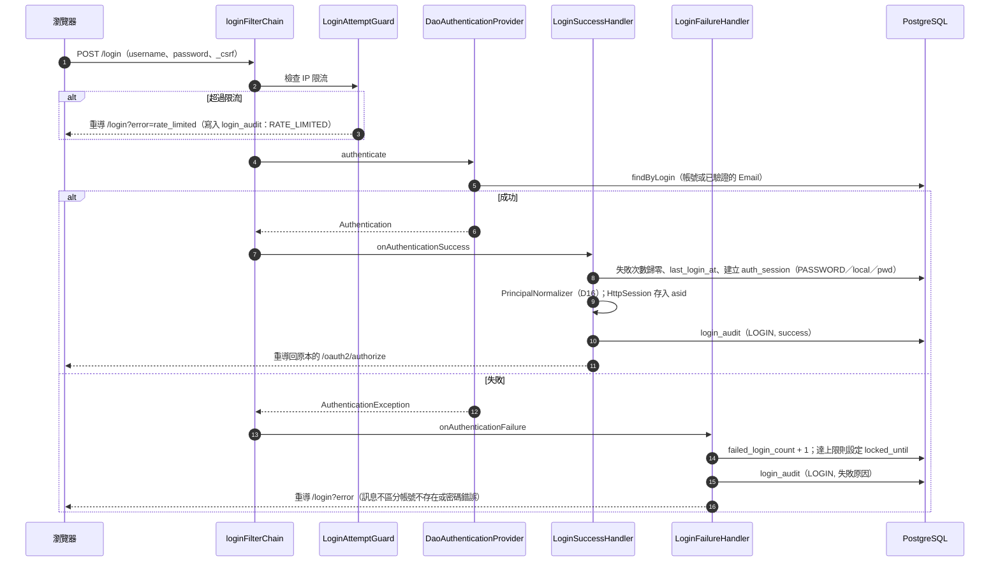
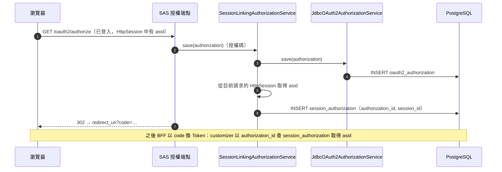
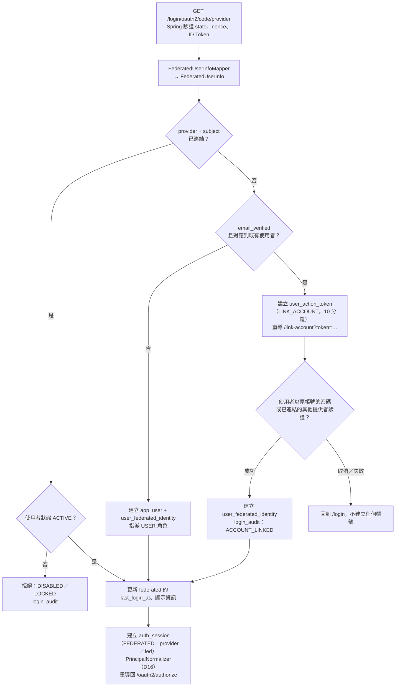
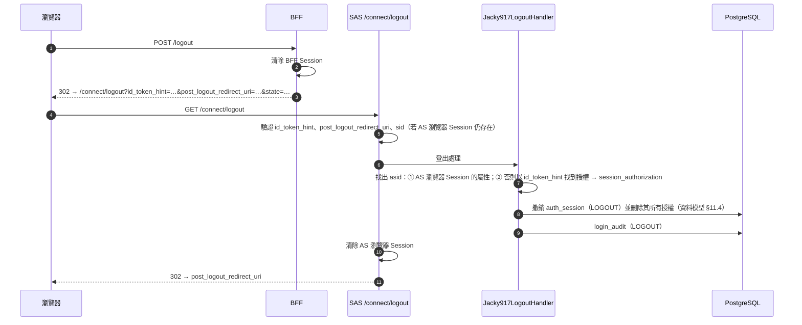

# Authorization Server 詳細設計（元件、流程、Token、維運）

| 項目 | 內容 |
|---|---|
| 狀態 | ✅ 第 1 階段已實作（2.1.0 preview），見 [§13 實施紀錄](#13-實施紀錄)；第 2 階段（工作 11～17）已實作 |
| 日期 | 2026-10-07 |
| 平台 | Spring Boot 4.1.1、Spring Security 7.1.1（Authorization Server 已內建於 Spring Security） |
| 上層文件 | [Authorization Server 設計](auth-server-design.md)（架構、D01～D14） |
| 姊妹文件 | [資料模型](auth-server-data-model.md)（表設計的唯一權威來源） |

本文件的類別、方法與預設值，凡標示「已查證」者，皆於 2026-10-07 對 Spring Security 7.1.1 的 jar 實際檢查。程式碼片段為**示意**，用來說明元件如何組合；實作時以當時的 API 為準。

---

## 目錄

1. [新增決策（D15～D22）](#1-新增決策d15d22)
2. [元件設計](#2-元件設計)
3. [SecurityFilterChain 設計](#3-securityfilterchain-設計)
4. [Token 設計](#4-token-設計)
5. [流程詳細設計](#5-流程詳細設計)
6. [設定屬性規格](#6-設定屬性規格)
7. [錯誤處理](#7-錯誤處理)
8. [稽核與可觀測性](#8-稽核與可觀測性)
9. [威脅模型](#9-威脅模型)
10. [測試案例](#10-測試案例)
11. [第 1、2 階段工作分解](#11-第-12-階段工作分解)
12. [待確認事項](#12-待確認事項)

---

## 1. 新增決策（D15～D22）

延續 [Authorization Server 設計](auth-server-design.md#2-決策總表) 的 D01～D14。

| # | 決策 | 推薦 |
|---|---|---|
| ✅ D15 | 支援的 grant type | `authorization_code`（強制 PKCE）、`refresh_token`、`client_credentials`（第 1 階段即包含，2026-10-07 使用者決定） |
| D16 | Principal 標準化 | 所有登入方式都轉成 `UsernamePasswordAuthenticationToken`，principal name = `app_user.id` |
| D17 | 資料庫與表名 | AS 使用專屬資料庫，取消表名前綴 |
| D18 | 權限計算時機 | 每次簽發 Token（含刷新）都從資料庫重新計算 |
| D19 | Refresh 併發與寬限期 | 列鎖序列化 + 30 秒寬限期內不視為攻擊 |
| D20 | Session 識別 claim | Access Token 使用自訂 claim `asid`；ID Token 的 `sid` 交給 Spring Security |
| D21 | 密碼雜湊與政策 | BCrypt（強度 12）+ 長度與外洩密碼檢查 |
| ✅ D22 | 資料庫抽象 | **預設 SQLite**，YAML 切換 PostgreSQL；程式碼與資料庫無關（2026-10-07 使用者決定） |

### D15 支援的 grant type

> ✅ **已決定（2026-10-07）**：第 1 階段即包含 `client_credentials`。

| Grant type | 支援 | 用途／理由 |
|---|---|---|
| `authorization_code` + PKCE | ✅ | 使用者登入的唯一方式。**所有 client 一律 `requireProofKey=true`**，包含 confidential client |
| `refresh_token` | ✅ | 只給 confidential client（BFF）。已查證：Spring Security 7.1.1 的 `OAuth2RefreshTokenGenerator` 不會發 Refresh Token 給以授權碼流程登入的 public client |
| `client_credentials` | ✅ | 服務對服務呼叫（例如批次程式呼叫 API）。Token 只帶 `scope`，不帶角色與權限 |
| `password`（Resource Owner Password） | ❌ | OAuth 2.1 已移除；Spring Security 不支援 |
| `implicit` | ❌ | OAuth 2.1 已移除 |
| `urn:ietf:params:oauth:grant-type:device_code` | ⏸ 暫不啟用 | 給電視、CLI 等無瀏覽器裝置。Spring Security 已支援，官方表也有欄位，需要時只需開啟 |
| Token Exchange（RFC 8693） | ⏸ 暫不啟用 | 服務代表使用者呼叫其他服務時使用 |
| Pushed Authorization Requests（PAR，RFC 9126） | ⏸ 第 3 階段評估 | Spring Security 7.1.1 已有對應的 configurer；可避免授權參數出現在瀏覽器網址中 |

### D16 Principal 標準化

**問題**：密碼登入時，Spring Security 的 `Authentication` 是 `UsernamePasswordAuthenticationToken`；第三方登入時則是 `OAuth2AuthenticationToken`，`getName()` 是 Google 的 `sub`。Authorization Server 會把 `Authentication#getName()` 寫入 `oauth2_authorization.principal_name`，並作為 Token 的 `sub`。若不處理，同一位使用者用不同方式登入，會得到不同的 `sub`。

| 選項 | 做法 | 問題 |
|---|---|---|
| A. 保留各自的 `Authentication` | — | `sub` 不一致；序列化第三方的 `OidcUser` 到 JDBC 需要額外處理 |
| B. 自訂 principal 類別 | 例如 `Jacky917Principal` | JDBC 儲存需要自行撰寫 Jackson 3 mixin，並加入允許清單 |
| **C. 統一轉成 `UsernamePasswordAuthenticationToken` + Spring 的 `User`** | 登入成功後，以 `User(username = app_user.id, authorities = …)` 建立新的 `Authentication` 放入 SecurityContext | 無；**已查證** Spring Security 7.1.1 內建 `UserMixin`、`UsernamePasswordAuthenticationTokenMixin`（Jackson 3） |

**推薦 C**。結果：

- 不論登入方式，`principal_name` 與 `sub` 都是 `app_user.id`（UUID 字串）。
- `oauth2_authorization.attributes` 可以直接以官方 JDBC 實作序列化，**不需要任何自訂 Jackson mixin**。
- `User` 中的 authorities 只用於 AS 自身的頁面授權；Token 中的權限依 D18 從資料庫重新計算。

### D17 資料庫與表名

見 [資料模型 §1.1 P1](auth-server-data-model.md#11-原則)：官方 `JdbcOAuth2AuthorizationService` 的表名是寫死的常數（**已查證** `TABLE_NAME = "oauth2_authorization"`），因此取消先前設計中的 `table-prefix` 設定，改為 **AS 使用專屬資料庫**。

### D18 權限計算時機

| 選項 | Token 中的權限來自 | 權限變更生效時間 |
|---|---|---|
| A. 登入時的 `Authentication` | 登入當下 | 重新登入後（最長 90 天） ❌ |
| **B. 每次簽發 Token 時查資料庫** | 簽發當下（[資料模型 §11.1](auth-server-data-model.md#111-使用者目前的角色與權限簽發-token-時)） | 下一次刷新（最長 10 分鐘） ✅ |

**推薦 B**。代價是每次刷新多一次查詢（三張表 JOIN，皆走主鍵索引），10 萬使用者規模下可忽略。刷新時同時檢查使用者與 Session 狀態（[§5.4](#54-刷新-token-與重用偵測)），停權在下一次刷新時就會生效。

### D19 Refresh 併發與寬限期

**問題**：BFF 可能在同一時間收到多個 API 請求，各自發現 Access Token 過期而**同時**刷新。Spring Security 的刷新流程是「讀取授權 → 產生新 token → 儲存」，沒有鎖定：

```
請求 A：讀到 RT1 ─────────── 產生 RT2 ── 儲存（RT2）
請求 B：  讀到 RT1 ───────── 產生 RT3 ────── 儲存（RT3，覆蓋 RT2）
結果：A 拿到的 RT2 已失效；下次 A 用 RT2 刷新 → 找不到 → 若視為重用，會錯誤地登出使用者
```

| 選項 | 做法 | 評估 |
|---|---|---|
| A. 不處理 | — | 正常使用者會被隨機登出 ❌ |
| B. 只在 BFF 端序列化 | BFF 同一個 Session 同時只允許一個刷新 | 必要，但 AS 不能假設所有 client 都這樣做 |
| **C. AS 端列鎖 + 寬限期，BFF 端也序列化** | 見下方 | ✅ |

**AS 端做法**：

1. **列鎖**（PostgreSQL）：以裝飾器包裝 Spring Security 的 `OAuth2RefreshTokenAuthenticationProvider`，在交易中先執行 `SELECT id FROM oauth2_authorization WHERE refresh_token_value = ? FOR UPDATE`，再交給原本的 provider。第二個併發請求會等待第一個完成，之後因為 RT1 已不存在而失敗，**不會產生 RT3 覆蓋 RT2**。
   **SQLite** 沒有 `FOR UPDATE`，改由連線參數 `transaction_mode=IMMEDIATE` 讓交易一開始就取得資料庫寫入鎖，效果相同（[資料模型 §16.2](auth-server-data-model.md#162-sqlite-353423-項全部通過) 已實測）。差異封裝在 D22 的 `AuthorizationServerDialect` 中。
2. **寬限期**：舊 Refresh Token 在被輪換後的 **30 秒內**再次出現，視為併發造成的正常情況：回傳 `invalid_grant`，但**不撤銷 Session**。超過 30 秒才視為重用攻擊。

**BFF 端做法**：同一個瀏覽器 Session 的刷新以 mutex 序列化（`example-bff` 示範）。

寬限期的風險：攻擊者若在合法輪換後 30 秒內重放，不會觸發撤銷。但因為列鎖，攻擊者也拿不到新的 token，只是「這次沒被偵測到」。30 秒是在誤判與偵測之間的取捨，可以設定（`refresh-reuse-grace-period`）。

### D20 Session 識別 claim

**已查證**：Spring Security 7.1.1 的 `JwtGenerator` 在產生 ID Token 時，從 AS 瀏覽器 Session（`SessionInformation`）產生 `sid`；`OidcLogoutAuthenticationProvider` 以 `SessionRegistry` 驗證登出請求中 ID Token 的 `sid`。

| 選項 | Access Token | ID Token | 評估 |
|---|---|---|---|
| A. 覆寫 ID Token 的 `sid` 為 `auth_session.session_id` | `sid` | `sid`（覆寫） | **破壞 OIDC 登出驗證** ❌ |
| B. Access Token 用 `sid` 放 `auth_session.session_id` | `sid`（我們的值） | `sid`（Spring 的值） | 兩個 token 的 `sid` 不同，容易誤用 |
| **C. Access Token 用自訂 claim `asid`** | `asid` | `sid`（Spring 的值） | 名稱不同，語意清楚 ✅ |

**推薦 C**。`asid`（auth session id）= `auth_session.session_id`。Resource Server 若需要知道「同一次登入」，讀取 `asid`。

> 現有 `demo-authorization-server` 簽發的 Token 中有 `sid` claim（只是示範用的固定值），改寫為 `example-authorization-server` 時一併調整。

### D21 密碼雜湊與政策

| 項目 | 設定 | 理由 |
|---|---|---|
| 演算法 | `DelegatingPasswordEncoder`，預設 `bcrypt`，強度 12 | 格式含演算法前綴（`{bcrypt}`），日後可無痛升級到 Argon2 |
| 自動升級 | 登入成功時若雜湊參數過舊，重新雜湊（`UserDetailsPasswordService`） | 調高強度後逐步更新 |
| 長度 | 最少 12 字元、最多 128 字元 | NIST SP 800-63B：重視長度，不強制組合規則 |
| 外洩密碼檢查 | 選用：Have I Been Pwned 的 k-anonymity API（只送雜湊前 5 碼） | 設定或變更密碼時檢查；預設關閉，避免對外連線 |
| 錯誤訊息 | 帳號不存在與密碼錯誤回傳**相同訊息** | 防止帳號列舉 |
| 計時攻擊 | 帳號不存在時仍執行一次假的 BCrypt 比對 | Spring 的 `DaoAuthenticationProvider` 已內建此行為 |

### D22 資料庫抽象

**需求（使用者決定）**：預設使用 SQLite，拿來就能啟動；正式環境只改 YAML 就能切換到其他資料庫。

| 選項 | 做法 | 評估 |
|---|---|---|
| A. JPA／Hibernate | 由 Hibernate 產生 SQL | 官方 `JdbcOAuth2AuthorizationService` 本來就是 JDBC；SQLite 只有社群版 dialect；多一層 ORM 卻省不了多少程式 ❌ |
| B. 每個資料庫一套 Repository 實作 | `PostgresUserRepository`、`SqliteUserRepository`… | 程式碼重複，容易不一致 ❌ |
| **C. 可攜 SQL + 每個資料庫一套 DDL + 極小的 dialect 介面** | Repository 只寫一份（`JdbcClient`）；DDL 依資料庫分資料夾；少數無法共用的 SQL 放在 dialect | ✅ |

**推薦 C**。做法：

| 層次 | 是否依資料庫而不同 | 做法 |
|---|---|---|
| DDL（Flyway migration） | **是** | `db/jacky917-as/{vendor}`，由 Starter 自己的 Flyway（歷史表 `jacky917_as_schema_history`）依方言選擇資料夾 |
| Repository 與查詢 | **否** | 只用可攜的 SQL（[資料模型 P8～P11](auth-server-data-model.md#11-原則)）：ID 與 IP 為字串、時間由應用程式以參數傳入、`IN (:list)` 取代陣列、子查詢取代 `DELETE ... USING` |
| 少數無法共用的行為 | **是**，集中在 `AuthorizationServerDialect` | 見下表 |
| Spring Security 官方表 | 否 | 官方 JDBC 類別本來就與資料庫無關 |

`AuthorizationServerDialect` 介面：

```java
public interface AuthorizationServerDialect {
    String vendor();                                  // "postgresql"、"sqlite"
    String lockAuthorizationByRefreshTokenSql();      // PostgreSQL：... FOR UPDATE；SQLite：不加 FOR UPDATE（IMMEDIATE 交易）
    boolean supportsMultipleInstances();              // SQLite：false
    void validate(DataSource dataSource);             // SQLite：檢查必要的連線參數，缺少即啟動失敗
}
```

依 JDBC URL 自動選擇（`DatabaseDriver.fromJdbcUrl`），也可以用 `database.dialect` 屬性指定。

**切換方式**：

```yaml
# 不設定任何 datasource → 預設 SQLite（./data/jacky917-auth.db），什麼都不用做
```

```yaml
# 切換到 PostgreSQL：改 YAML，並加入 PostgreSQL JDBC 驅動依賴
spring:
  datasource:
    url: jdbc:postgresql://db.example.com:5432/auth
    username: as_app
    password: ${AS_DB_PASSWORD}
```

```xml
<dependency>
    <groupId>org.postgresql</groupId>
    <artifactId>postgresql</artifactId>
    <scope>runtime</scope>
</dependency>
```

Flyway 會自動執行 PostgreSQL 版的 migration，程式碼不需修改。

**支援矩陣**：

| 資料庫 | 狀態 | 適合 | 多實例 |
|---|---|---|---|
| **SQLite** | ✅ 預設 | 開發、測試、單機與中小規模部署 | ❌ |
| **PostgreSQL 16+** | ✅ 支援 | 正式環境、水平擴展 | ✅ |
| MySQL 8.4 | ⏸ 第 5 階段 | — | ✅ |

MySQL 留待之後：官方表需要額外的連線參數；`ON CONFLICT` 要改為 `INSERT IGNORE`；**不支援部分索引**（`WHERE ...`），`ux_app_user_email`、`ux_signing_key_single_active` 等需改用 generated column。架構已預留（新增一個 dialect 與一個 migration 資料夾），但需要另外驗證。

**預設 SQLite 的實作細節**：

| 項目 | 做法 |
|---|---|
| SQLite 驅動 | `org.xerial:sqlite-jdbc` 為 AS starter 的直接依賴，引入 starter 即可使用 |
| 預設 URL | 以 `EnvironmentPostProcessor` 加入**最低優先序**的預設值：只有使用者完全沒有設定 `spring.datasource.url` 時才生效 |
| 資料庫檔案位置 | 預設 `./data/jacky917-auth.db`；不存在時自動建立資料夾，並把檔案權限設為 `600`（POSIX 系統） |
| 啟動檢查 | `SqliteDialect#validate`：`PRAGMA foreign_keys` 必須為 1、`journal_mode` 必須為 `wal`、URL 必須含 `transaction_mode=IMMEDIATE` 與 `date_class=INTEGER`、Hikari `auto-commit` 必須為 `true`。任何一項不符即啟動失敗，訊息列出應有的完整 URL |
| 排程鎖（ShedLock） | **不論資料庫一律使用**：單一實例時沒有副作用，且只有一條程式路徑，較容易測試（§5.8） |
| 共用 Session（Spring Session JDBC） | 只在 PostgreSQL 啟用（D10）。SQLite 為單一實例，使用容器內建的 HttpSession；`SPRING_SESSION*` 表仍隨 V1 建立但不使用。若偵測到 SQLite 搭配 `spring.session.store-type=jdbc`，啟動時輸出警告 |
| 對其他決策的影響 | D10（共用 Session）只在 PostgreSQL 適用；D19 在 SQLite 由 `IMMEDIATE` 交易達成 |

---

## 2. 元件設計

### 2.1 套件結構

```
jacky917.security.authorizationserver
├── autoconfigure/
│   ├── AuthorizationServerAutoConfiguration      主要自動配置（filter chain、SAS 元件）
│   ├── AuthorizationServerJdbcConfiguration      JDBC repository／service
│   ├── AuthorizationServerDatabaseConfiguration  D22：預設 SQLite、dialect 選擇、啟動檢查
│   ├── AuthorizationServerFederationConfiguration 第三方登入
│   └── AuthorizationServerJobsConfiguration      排程
├── properties/
│   └── AuthorizationServerProperties             jacky917.security.authorization-server.*
├── user/
│   ├── UserAccountService                        SPI：使用者查詢與更新
│   ├── JdbcUserAccountService                    預設實作
│   ├── UserAccount                               使用者模型（record）
│   ├── Jacky917UserDetailsService                給 DaoAuthenticationProvider 使用
│   └── PasswordPolicy                            密碼規則
├── authentication/
│   ├── PrincipalNormalizer                       D16：轉成標準 Authentication
│   ├── LoginSuccessHandler                       建立 auth_session、寫稽核、轉換 principal
│   ├── LoginFailureHandler                       失敗計數、鎖定、寫稽核
│   └── LoginAttemptGuard                         依 IP／帳號限流
├── federation/
│   ├── FederatedUserInfoMapper                   SPI：提供者回應 → FederatedUserInfo
│   ├── OidcFederatedUserInfoMapper               通用 OIDC（Google、LINE、Microsoft…）
│   ├── GitHubFederatedUserInfoMapper             GitHub（非 OIDC）
│   ├── FederatedIdentityService                  查詢／建立／連結外部帳號
│   ├── AccountLinkingPolicy                      SPI：D06 連結規則
│   └── FederatedLoginSuccessHandler              第三方登入成功後的處理
├── session/
│   ├── AuthSessionService                        auth_session 的建立、查詢、撤銷
│   ├── SessionLinkingAuthorizationService        裝飾器：儲存授權時建立 session_authorization
│   └── Jacky917LogoutHandler                     RP-Initiated Logout 時撤銷 auth_session
├── token/
│   ├── Jacky917TokenCustomizer                   OAuth2TokenCustomizer<JwtEncodingContext>
│   ├── AuthorityResolver                         SPI：D07 第一方／第三方權限計算
│   ├── AudienceResolver                          SPI：aud
│   └── TokenClaimsContributor                    SPI：業務自訂 claim
├── refresh/
│   ├── ReuseDetectingRefreshTokenProvider        裝飾器：D19 列鎖、重用偵測、狀態檢查
│   └── RefreshTokenHistoryRepository
├── client/
│   ├── ClientProfileRepository
│   ├── ActiveClientRegisteredClientRepository    裝飾器：過濾 SUSPENDED 的 client
│   └── ClientSecretInitializer                   第一方 client 的 secret 由環境變數寫入（各 client 必須不同；官方 repository 會拒絕重複的 secret）
├── keys/
│   ├── SigningKeyStore                           SPI：金鑰存取（預設資料庫，可換 KMS）
│   ├── JdbcSigningKeyStore
│   ├── KeyEncryptor                              AES-256-GCM 加解密私鑰
│   ├── RotatingJwkSource                         JWKSource<SecurityContext>
│   └── SigningKeyRotationJob
├── audit/
│   ├── AuditEventPublisher
│   └── JdbcAuditEventListener                    寫入 login_audit、admin_audit_log
├── database/
│   ├── AuthorizationServerDialect                SPI：D22
│   ├── PostgresqlDialect
│   ├── SqliteDialect
│   └── DefaultSqliteEnvironmentPostProcessor     沒有設定 datasource 時預設 SQLite
├── jobs/
│   └── CleanupJobs                               資料模型 §14 的清理排程
└── web/
    ├── LoginController                           /login
    ├── ConsentController                         /oauth2/consent（第 3 階段）
    ├── LinkAccountController                     /link-account
    └── AccountController                         /account（第 2 階段）
```

### 2.2 與 Spring Security Authorization Server 的整合點

| Spring Security 介面（已查證存在於 7.1.1） | 本設計的實作 | 說明 |
|---|---|---|
| `RegisteredClientRepository` | `ActiveClientRegisteredClientRepository`（包裝 `JdbcRegisteredClientRepository`） | 讀取時排除 `client_profile.status = 'SUSPENDED'` |
| `OAuth2AuthorizationService` | `SessionLinkingAuthorizationService`（包裝 `JdbcOAuth2AuthorizationService`） | `save` 時建立 `session_authorization`；`remove` 時記錄 |
| `OAuth2AuthorizationConsentService` | `JdbcOAuth2AuthorizationConsentService`（官方） | 第 3 階段才使用 |
| `OAuth2TokenCustomizer<JwtEncodingContext>` | `Jacky917TokenCustomizer` | `aud`、`asid`、`roles`、`permissions`、`idp`、ID Token 的使用者資料 |
| `JWKSource<SecurityContext>` | `RotatingJwkSource` | 從 `signing_key` 讀取 `NEXT`、`ACTIVE`、`RETIRING` |
| `AuthenticationProvider`（token 端點） | `ReuseDetectingRefreshTokenProvider` 包裝 `OAuth2RefreshTokenAuthenticationProvider` | 透過 `tokenEndpoint(...).authenticationProviders(...)` 替換 |
| `AuthorizationServerSettings` | 由 `issuer` 等屬性建立 | 端點路徑使用預設值 |
| `SessionRegistry` | 有 Spring Session 時為 `SpringSessionBackedSessionRegistry`，否則 Spring 預設的 `SessionRegistryImpl` | OIDC 登出驗證與 ID Token 的 `sid` 需要 |
| OIDC 登出回應（`logoutResponseHandler`） | 官方 `OidcLogoutAuthenticationSuccessHandler`，以 `setLogoutHandler` 加入 `Jacky917LogoutHandler`（已查證此方法存在） | 不改變 Spring 的登出回應，只在登出時撤銷 `auth_session` |
| `UserDetailsService` | `Jacky917UserDetailsService` | 帳號密碼登入；`username` 可為帳號或已驗證的 Email |
| `OAuth2UserService`、`OidcUserService` | 官方預設 | 第三方使用者資訊由 `FederatedUserInfoMapper` 轉換 |

### 2.3 SPI 介面

使用者可以用自己的 Bean 取代（`@ConditionalOnMissingBean`）。

```java
public interface UserAccountService {
    Optional<UserAccount> findById(UUID userId);
    Optional<UserAccount> findByLogin(String usernameOrEmail);   // 不分大小寫
    Optional<UserAccount> findByVerifiedEmail(String email);
    UserAccount createFederatedUser(FederatedUserInfo info);      // 第三方登入建立新使用者
    void recordLoginSuccess(UUID userId, Instant at);             // 失敗計數歸零、更新 last_login_at
    LoginFailureResult recordLoginFailure(UUID userId, Instant at); // 回傳是否因此被鎖定
    UserAuthorities loadAuthorities(UUID userId);                 // 資料模型 §11.1
}

public interface FederatedUserInfoMapper {
    boolean supports(String registrationId);                      // 例如 "github"
    FederatedUserInfo map(String registrationId, OAuth2User user, OAuth2AccessToken accessToken);
}

public record FederatedUserInfo(
        String provider, String subject,
        String email, boolean emailVerified,
        String displayName, String avatarUrl, String locale,
        Map<String, Object> rawAttributes) {}

public interface AccountLinkingPolicy {
    LinkingDecision decide(FederatedUserInfo info, Optional<UserAccount> userWithSameVerifiedEmail);
}
// LinkingDecision：USE_EXISTING_LINK / CREATE_NEW_USER / REQUIRE_CONFIRMATION / REJECT

public interface AuthorityResolver {
    ResolvedAuthorities resolve(UUID userId, RegisteredClient client, TrustLevel trustLevel, Set<String> grantedScopes);
}
// ResolvedAuthorities(Set<String> roles, Set<String> permissions)，皆不含前綴

public interface AudienceResolver {
    List<String> resolve(RegisteredClient client, Set<String> grantedScopes);
}

public interface TokenClaimsContributor {
    void contribute(JwtEncodingContext context, Optional<UserAccount> user);
}

public interface SigningKeyStore {
    List<SigningKey> findPublishable();      // NEXT、ACTIVE、RETIRING
    SigningKey findActive();
    void save(SigningKey key);
    void transition(String kid, SigningKeyStatus from, SigningKeyStatus to);
}
```

---

## 3. SecurityFilterChain 設計

| Order | 名稱 | 負責路徑 | 驗證方式 | CSRF | Session |
|---|---|---|---|---|---|
| 1 | `authorizationServerFilterChain` | SAS 端點：`/oauth2/**`、`/.well-known/**`、`/userinfo`、`/connect/**` | Client 驗證（token 端點）；使用者 Session（授權端點） | 依 SAS 預設 | 依需要 |
| 2 | `adminApiFilterChain`（第 3 階段） | `/admin/api/**` | Bearer Token（引入 Resource Server starter 的 converter） | 停用 | 無狀態 |
| 3 | `loginFilterChain` | 其餘：`/login`、`/login/oauth2/**`、`/oauth2/authorization/**`（第三方登入起點）、`/link-account/**`、`/account/**`、靜態資源 | 表單登入、`oauth2Login()` | **啟用** | 有 |

> 第三方登入的起點 `/oauth2/authorization/{provider}` 與 SAS 的 `/oauth2/authorize` 都在 `/oauth2/` 下，但由第 1 條的 `getEndpointsMatcher()` 精確比對 SAS 端點，其餘請求會落到第 3 條。

示意：

```java
@Bean
@Order(1)
SecurityFilterChain authorizationServerFilterChain(HttpSecurity http) throws Exception {
    // 已查證：Spring Security 7.1.1 的 OAuth2AuthorizationServerConfigurer 只有公開建構子，沒有靜態 factory
    OAuth2AuthorizationServerConfigurer as = new OAuth2AuthorizationServerConfigurer();
    http.securityMatcher(as.getEndpointsMatcher())
        .with(as, config -> config
            .registeredClientRepository(activeClientRepository)
            .authorizationService(sessionLinkingAuthorizationService)
            .tokenEndpoint(token -> token.authenticationProviders(this::wrapRefreshTokenProvider))
            .oidc(oidc -> oidc
                .logoutEndpoint(logout -> logout.logoutResponseHandler(oidcLogoutSuccessHandler()))
                .userInfoEndpoint(Customizer.withDefaults())))
        .authorizeHttpRequests(auth -> auth.anyRequest().authenticated())
        .exceptionHandling(ex -> ex.defaultAuthenticationEntryPointFor(
                new LoginUrlAuthenticationEntryPoint("/login"),
                new MediaTypeRequestMatcher(MediaType.TEXT_HTML)));
    return http.build();
}

// 保留 Spring 預設的登出回應（清除 Session、重導），只在其 LogoutHandler 中加入撤銷 auth_session 的邏輯
AuthenticationSuccessHandler oidcLogoutSuccessHandler() {
    OidcLogoutAuthenticationSuccessHandler handler = new OidcLogoutAuthenticationSuccessHandler();
    handler.setLogoutHandler(new CompositeLogoutHandler(jacky917LogoutHandler, new SecurityContextLogoutHandler()));
    return handler;
}

@Bean
@Order(3)
SecurityFilterChain loginFilterChain(HttpSecurity http) throws Exception {
    http.authorizeHttpRequests(auth -> auth
            .requestMatchers("/login", "/link-account/**", "/jacky917/**", "/error").permitAll()
            .anyRequest().authenticated())
        .formLogin(form -> form.loginPage("/login")
            .successHandler(loginSuccessHandler)
            .failureHandler(loginFailureHandler))
        .oauth2Login(oauth2 -> oauth2.loginPage("/login")
            .successHandler(federatedLoginSuccessHandler)
            .failureHandler(loginFailureHandler))
        .sessionManagement(sm -> sm.sessionFixation().changeSessionId())
        .headers(h -> h
            .frameOptions(f -> f.deny())
            .contentSecurityPolicy(csp -> csp.policyDirectives("default-src 'self'; frame-ancestors 'none'")));
    return http.build();
}
```

---

## 4. Token 設計

### 4.1 有效期

| Token | 有效期 | Spring Security 7.1.1 預設（已查證） | 設定位置 |
|---|---|---|---|
| 授權碼 | 1 分鐘 | 5 分鐘 | `token_settings` |
| Access Token | 10 分鐘 | 5 分鐘 | `token_settings` |
| Refresh Token | 14 天（每次刷新重新計算） | 60 分鐘 | `token_settings` |
| Refresh Token 重複使用 | `false`（每次刷新換新） | **`true`** | `token_settings.reuseRefreshTokens` |
| ID Token | 10 分鐘 | 與 Access Token 相同 | — |
| 登入 Session 絕對上限 | 90 天 | 無此概念 | `auth_session.expires_at` |
| AS 瀏覽器 Session 閒置 | 30 分鐘 | Servlet 容器預設 | `server.servlet.session.timeout` |

> Spring Security 預設 `reuseRefreshTokens=true`，**必須明確改為 `false`** 才會輪換。自動配置建立第一方 client 時一律設定；Admin API 建立 client 時也強制設定。

### 4.2 Claim 組裝規則

| Claim | Access Token（使用者，第一方） | Access Token（使用者，第三方） | Access Token（`client_credentials`） | ID Token |
|---|---|---|---|---|
| `iss`、`exp`、`iat`、`nbf`、`jti` | Spring 產生 | Spring 產生 | Spring 產生 | Spring 產生 |
| `sub` | `app_user.id` | `app_user.id` | `client_id` | `app_user.id` |
| `aud` | `AudienceResolver`（預設 `["jacky917-api"]`） | 同左 | 同左 | Spring 產生（= `client_id`） |
| `client_id` | ✅ | ✅ | ✅ | `azp`（Spring 產生） |
| `scope` | 授權的 scope | 使用者同意的 scope | client 註冊的 scope | — |
| `asid` | `auth_session.session_id` | 同左 | — | — |
| `sid` | — | — | — | Spring 產生（D20） |
| `idp` | `local`／`google`… | 同左 | — | — |
| `roles` | 全部角色 | — | — | — |
| `permissions` | 全部權限 | scope 對應權限 ∩ 使用者權限 | — | — |
| `name`、`picture`、`locale` | — | — | — | `profile` scope |
| `email`、`email_verified` | — | — | — | `email` scope，且 Email 已驗證 |
| `auth_time`、`amr` | — | — | — | `auth_session.created_at`、`auth_session.amr` |
| `nonce` | — | — | — | Spring 產生 |

**原則**：

- ID Token 不放角色與權限，避免 client 拿 ID Token 呼叫 API。
- 第三方 client 永遠拿不到角色，權限上限是使用者同意的範圍。
- Access Token 不放 Email、姓名等個資（Resource Server 需要時呼叫 `/userinfo`）。

### 4.3 `Jacky917TokenCustomizer` 演算法

```
customize(context):
    if context.tokenType == ACCESS_TOKEN:
        client  = context.registeredClient
        profile = clientProfileRepository.find(client.id)
        claims.aud = audienceResolver.resolve(client, context.authorizedScopes)

        if context.grantType == CLIENT_CREDENTIALS:
            return                                           # 只保留 scope

        userId     = UUID(context.principal.name)            # D16
        authzId    = context.authorization.id
        sessionId  = sessionAuthorizationRepository.findSessionId(authzId)   # D20
        session    = authSessionService.find(sessionId)

        claims.asid = sessionId
        claims.idp  = session.idp
        resolved = authorityResolver.resolve(userId, client, profile.trustLevel, context.authorizedScopes)  # D18
        if profile.trustLevel == FIRST_PARTY:
            claims.roles = resolved.roles
        claims.permissions = resolved.permissions

    if context.tokenType == ID_TOKEN:
        user    = userAccountService.findById(UUID(context.principal.name))
        session = （同上，以 authorization 找到 auth_session）
        claims.auth_time = session.createdAt
        claims.amr       = session.amr.split(",")
        if "profile" in scopes: claims.name, picture, locale
        if "email" in scopes and user.emailVerified: claims.email, email_verified

    for contributor in tokenClaimsContributors:
        contributor.contribute(context, user)
```

> Spring 的 `JwtGenerator` 先設定預設 claim（包含 ID Token 的 `sid`），再呼叫 customizer。customizer **不得移除或覆寫** `sid`、`nonce`、`azp`。

### 4.4 範例

第一方 BFF 的 Access Token payload：

```json
{
  "iss": "https://auth.example.com",
  "sub": "0192a6f4-5c8e-7b3a-9d21-4f6e8a1c2b3d",
  "aud": ["jacky917-api"],
  "client_id": "web-bff",
  "scope": ["openid", "profile", "email"],
  "asid": "0192a6f4-6d01-7e44-8c11-2a3b4c5d6e7f",
  "idp": "google",
  "roles": ["USER", "AS_SUPPORT"],
  "permissions": ["as:user:read", "as:session:revoke", "as:audit:read"],
  "iat": 1791360000, "nbf": 1791360000, "exp": 1791360600,
  "jti": "1f0e7c4a-…"
}
```

`client_credentials` 的 Access Token payload：

```json
{
  "iss": "https://auth.example.com",
  "sub": "report-batch",
  "aud": ["jacky917-api"],
  "client_id": "report-batch",
  "scope": ["report.generate"],
  "iat": 1791360000, "exp": 1791360600, "jti": "…"
}
```

---

## 5. 流程詳細設計

### 5.1 帳號密碼登入



| 規則 | 預設值 |
|---|---|
| 連續失敗鎖定 | 5 次，鎖定 15 分鐘 |
| IP 限流 | 每 IP 每分鐘 20 次失敗 |
| 鎖定期間的回應 | 與密碼錯誤相同的訊息（不揭露帳號存在與否）；另寄送通知信給帳號持有人（第 4 階段） |
| Session fixation | 登入成功後變更 Session ID |

### 5.2 授權碼流程與 Session 連結

`auth_session` 在**登入時**建立，但 `oauth2_authorization` 在**授權碼發出時**才建立。兩者透過 AS 瀏覽器 Session 中的 `asid` 連結：



| 情況 | 處理 |
|---|---|
| `save` 時沒有 HTTP 請求（例如 token 端點中的更新） | 已有連結，不重複建立（`INSERT … ON CONFLICT DO NOTHING`） |
| `save` 時有請求、但 HttpSession 中沒有 `asid` | 拋出例外並記錄錯誤：代表有人繞過登入成功處理，必須拒絕 |
| `client_credentials` | 不建立連結 |

### 5.3 第三方登入與帳號連結



| 規則 | 說明 |
|---|---|
| 提供者的 token | 只用於取得使用者資訊，**不儲存** |
| `raw_attributes` | 存入前移除名稱含 `token` 的欄位 |
| 顯示資訊更新 | 每次登入時，若使用者沒有手動修改過，以提供者的名稱與頭像更新 `app_user` |
| GitHub 的 Email | 使用者不公開 Email 時，`GitHubFederatedUserInfoMapper` 以 access token 呼叫 `/user/emails`，只取 `primary && verified` 的 Email（需要 `user:email` scope） |

### 5.4 刷新 Token 與重用偵測

`ReuseDetectingRefreshTokenProvider` 的處理順序：

```
authenticate(refreshRequest):
    tokenHash = sha256(refreshRequest.refreshToken)
    transaction:
        row = SELECT id FROM oauth2_authorization
              WHERE refresh_token_value = :token FOR UPDATE          # D19 列鎖

        if row is null:
            history = refreshTokenHistory.find(tokenHash)
            if history is null:
                throw invalid_grant                                   # 不存在或已過期太久
            if NOW() - history.rotatedAt <= gracePeriod:
                throw invalid_grant                                   # 併發造成，不撤銷
            authSessionService.revoke(history.sessionId, REUSE_DETECTED)   # 資料模型 §11.4
            audit(TOKEN_REFRESH_REUSE, history)
            metrics.increment("jacky917.as.refresh.reuse_detected")
            throw invalid_grant

        check = 資料模型 §11.2 的查詢(row.id)
        if check.sessionStatus != ACTIVE or check.sessionExpired
           or check.userStatus != ACTIVE or check.lockedUntil > NOW()
           or check.passwordChangedAt > check.sessionCreatedAt:
            authSessionService.revoke(check.sessionId, 對應原因)
            throw invalid_grant

        result = delegate.authenticate(refreshRequest)                # Spring 官方 provider：產生新 token、儲存
        refreshTokenHistory.insert(tokenHash, row.id, check.sessionId, …,
                                   expiresAt = min(舊 token 到期時間, NOW() + historyRetention))
        authSessionService.touch(check.sessionId)                     # last_seen_at
        return result
```

| 重點 | 說明 |
|---|---|
| 交易範圍 | 列鎖、官方 provider 的儲存、`refresh_token_history` 寫入在**同一個交易**。官方 `JdbcOAuth2AuthorizationService` 使用 `JdbcTemplate`，會加入 Spring 管理的交易 |
| `FOR UPDATE` 的效能 | 只鎖單一列；刷新請求本身就是低頻操作（每個 Session 約 10 分鐘一次） |
| 狀態檢查失敗時撤銷 | 例如使用者已停權：順便撤銷 Session，下次不必再檢查 |
| 回應 | 所有失敗一律回 `invalid_grant`，不揭露原因（重用寫入稽核；其他原因計入 `refresh.rejected{reason}` metric，因使用者無法登入而撤銷的 Session 另在 `auth_session.revoke_reason` 記錄原因） |

### 5.5 登出（RP-Initiated Logout）



| 情況 | 處理 |
|---|---|
| AS 瀏覽器 Session 已過期（閒置超過 30 分鐘，但 `auth_session` 仍有效） | 走第 ② 條路徑，以 ID Token 找到授權 |
| ID Token 已過期 | 已查證：Spring Security 7.1.1 的 `OidcLogoutAuthenticationProvider` 以 `id_token_hint` 的值查找授權，未檢查 ID Token 是否過期；只要授權仍存在即可處理（T-LOGOUT-04） |
| 授權已被清理（Refresh Token 也過期） | 找不到授權；只清除 AS 瀏覽器 Session。此時 `auth_session` 也必然已失去作用（沒有授權可刷新），由清理排程改為 `EXPIRED` |
| 已簽發的 Access Token | 有效至過期（最長 10 分鐘），見 [限制 §6](../resource-server/limitations.md#6-token-無法撤銷) |

### 5.6 其他撤銷情境

| 觸發 | `revoke_reason` | 範圍 | 呼叫 |
|---|---|---|---|
| 使用者在帳號頁登出某裝置 | `LOGOUT` | 單一 Session | 資料模型 §11.4 |
| 使用者按「登出所有裝置」 | `LOGOUT_ALL` | 使用者所有 Session | 資料模型 §11.5 |
| 變更密碼 | `PASSWORD_CHANGED` | **其他**所有 Session（保留目前這個） | §11.5，排除目前的 `asid` |
| 管理員停用／鎖定 | `USER_DISABLED`／`ADMIN` | 所有 Session | §11.5 |
| 管理員停權 client | — | 該 client 所有授權 | `DELETE FROM oauth2_authorization WHERE registered_client_id = ?` |
| 重用偵測 | `REUSE_DETECTED` | 單一 Session | §5.4 |

### 5.7 金鑰輪換

```
SigningKeyRotationJob（每天執行一次，ShedLock 保護）:
    active = store.findActive()
    if active is null:                                   # 首次啟動
        產生金鑰 → 直接 ACTIVE
    if NOW() - active.activatedAt >= rotationPeriod - announcePeriod and no NEXT:
        產生金鑰 → NEXT                                  # 預告：JWKS 先公開
    next = store.find(NEXT)
    if next and NOW() - next.createdAt >= announcePeriod:
        transaction: active → RETIRING；next → ACTIVE
    for key in RETIRING:
        if NOW() - key.retiringAt >= maxTokenLifetime + jwksCacheTtl:
            key → RETIRED
```

| 參數 | 預設 |
|---|---|
| `rotation-period` | 90 天 |
| `announce-period` | 1 天（新公鑰在開始簽章前先公開的時間） |
| `max-token-lifetime` | 取所有 client 的 AT 與 ID Token 有效期最大值（預設 10 分鐘） |
| `jwks-cache-ttl` | 5 分鐘（Resource Server 的 JWKS 快取時間，Spring 預設值） |

緊急輪換（私鑰外洩）：管理員 API 直接產生新金鑰並設為 `ACTIVE`，舊金鑰**直接**改為 `RETIRED`。舊金鑰簽發的 Access Token 與 ID Token 在 Resource Server 更新 JWKS 快取後（最多 5 分鐘）全部失效。使用者不需重新登入：Refresh Token 是隨機字串而非 JWT，BFF 刷新後即取得以新金鑰簽發的 Token。

### 5.8 清理排程

見 [資料模型 §14.1](auth-server-data-model.md#141-清理規則)。所有排程以 ShedLock（`shedlock` 表，加入 V1 migration）確保多實例下只執行一次，並以分批刪除避免長交易。

---

## 6. 設定屬性規格

前綴：`jacky917.security.authorization-server`（[Repo 拆分設計 R-D5](repo-structure-design.md#53-設定屬性前綴r-d5)）。

| 屬性 | 型別 | 預設 | 驗證 | 說明 |
|---|---|---|---|---|
| `enabled` | boolean | `true` | — | 停用整個 AS 自動配置 |
| `database.dialect` | enum | `auto` | `auto`／`postgresql`／`sqlite` | D22；`auto` 依 JDBC URL 判斷 |
| `database.sqlite.path` | Path | `./data/jacky917-auth.db` | 父資料夾可寫入 | 只在使用預設 SQLite URL 時使用 |
| `issuer` | URI | **必填** | `https`（`localhost` 除外） | Token 的 `iss`；Resource Server 的 `issuer-uri` 必須完全相同 |
| `token.access-token-ttl` | Duration | `10m` | 1 分鐘～1 小時 | 預設值；個別 client 可在 `token_settings` 覆寫 |
| `token.refresh-token-ttl` | Duration | `14d` | 1 小時～90 天 | 同上 |
| `token.authorization-code-ttl` | Duration | `1m` | 30 秒～5 分鐘 | |
| `token.session-max-age` | Duration | `90d` | ≥ `refresh-token-ttl` | `auth_session.expires_at` |
| `token.audience` | List\<String\> | `[jacky917-api]` | 必須存在於 `api_resource` | D07-B |
| `token.audience-strategy` | enum | `SHARED` | `SHARED`／`PER_SCOPE` | D07 |
| `refresh.reuse-grace-period` | Duration | `30s` | 0～2 分鐘 | D19 |
| `refresh.history-retention` | Duration | `24h` | 1 小時～`refresh-token-ttl` | [資料模型 §14.2](auth-server-data-model.md#142-容量估算10-萬使用者日活-2-萬平均-15-個裝置) |
| `keys.algorithm` | enum | `RS256` | `RS256`／`ES256` | |
| `keys.rotation-period` | Duration | `90d` | ≥ 7 天 | |
| `keys.announce-period` | Duration | `1d` | ≥ `jwks-cache-ttl` | |
| `keys.encryption-key` | String | **必填** | Base64、32 bytes | 加密私鑰的主金鑰；從環境變數或密鑰管理服務注入，**不可寫在設定檔中** |
| `keys.encryption-key-id` | String | `v1` | — | 主金鑰輪換時遞增 |
| `account-linking.mode` | enum | `CONFIRM_WITH_EXISTING_LOGIN` | 或 `MANUAL_ONLY` | D06 |
| `login-protection.max-failures` | int | `5` | 1～20 | |
| `login-protection.lock-duration` | Duration | `15m` | | |
| `login-protection.max-failures-per-ip-per-minute` | int | `20` | | |
| `password.min-length` | int | `12` | 8～64 | D21 |
| `password.bcrypt-strength` | int | `12` | 10～14 | |
| `password.breach-check.enabled` | boolean | `false` | | D21 |
| `branding.product-name`、`logo-url`、`primary-color` | String | — | | 登入頁 |
| `bootstrap-admin.username` | String | — | | 沒有任何 `AS_ADMIN` 時建立；密碼從 `bootstrap-admin.password`（環境變數）取得 |
| `cleanup.enabled` | boolean | `true` | | |
| `cleanup.batch-size` | int | `1000` | | |

設定錯誤（例如 `issuer` 未設定、`encryption-key` 長度錯誤）一律在**啟動時失敗**，以 `@Validated` 與自訂驗證器實作。

---

## 7. 錯誤處理

### 7.1 OAuth 端點

依 RFC 6749／OIDC 規範回傳，由 Spring Security 產生。本設計只決定「何時」回傳：

| 情況 | 錯誤 | HTTP |
|---|---|---|
| client 驗證失敗、client 已停權 | `invalid_client` | 401 |
| 授權碼過期、已使用、PKCE 驗證失敗 | `invalid_grant` | 400 |
| Refresh Token 無效、重用、Session 撤銷、使用者停權 | `invalid_grant`（**不揭露原因**） | 400 |
| 要求未註冊的 scope | `invalid_scope` | 400 |
| `redirect_uri` 不符 | **不重導**，直接顯示錯誤頁 | 400 |

### 7.2 登入頁

登入頁以 query 參數顯示錯誤，訊息走 `MessageSource`（`messages_zh_TW.properties`、`messages_en.properties`）：

| 參數 | 訊息 key | 預設文字 |
|---|---|---|
| `error` | `login.error.bad-credentials` | 帳號或密碼錯誤 |
| `error=rate_limited` | `login.error.rate-limited` | 嘗試次數過多，請稍後再試 |
| `error=federation` | `login.error.federation` | 第三方登入失敗，請再試一次 |
| `error=link_expired` | `login.error.link-expired` | 帳號連結未在期限內確認，請重新以第三方登入 |
| `error=linked_elsewhere` | `login.error.linked-elsewhere` | 此外部帳號已連結到其他使用者 |
| `error=provider_already_linked` | `login.error.provider-already-linked` | 您的帳號已連結此提供者的另一個帳號，請先到帳號頁解除連結 |
| `error=disabled` | `login.error.bad-credentials` | （與密碼錯誤相同，不揭露帳號狀態） |

---

## 8. 稽核與可觀測性

### 8.1 稽核事件

| 事件 | 寫入 | 觸發 |
|---|---|---|
| `LOGIN`（成功／失敗） | `login_audit` | §5.1、§5.3 |
| `LOGOUT` | `login_audit` | §5.5、§5.6 |
| `TOKEN_REFRESH_REUSE` | `login_audit` | §5.4 |
| `ACCOUNT_LOCKED` | `login_audit` | 連續失敗達上限 |
| `ACCOUNT_LINKED`／`ACCOUNT_UNLINKED` | `login_audit` | §5.3、帳號頁 |
| `PASSWORD_CHANGED` | `login_audit` | 帳號頁、重設密碼 |
| 管理操作 | `admin_audit_log` | Admin API（第 3 階段） |

稽核以 Spring 的 `ApplicationEventPublisher` 發布，`JdbcAuditEventListener` 在交易提交後（`@TransactionalEventListener(AFTER_COMMIT)`）寫入；寫入失敗只記錄錯誤日誌，**不影響登入流程**。業務專案可以另外監聽同一個事件轉發到 SIEM。

### 8.2 Metrics（Micrometer）

| 名稱 | 類型 | 標籤 | 用途 |
|---|---|---|---|
| `jacky917.as.login` | Counter | `idp`、`result`（`success`／失敗原因） | 登入成功率、暴力破解偵測 |
| `jacky917.as.token.issued` | Counter | `grant_type`、`client_id` | 簽發量 |
| `jacky917.as.refresh.reuse_detected` | Counter | `client_id` | **告警**：大於 0 即通知 |
| `jacky917.as.refresh.grace_rejected` | Counter | `client_id` | 併發刷新的頻率；過高代表 BFF 未序列化 |
| `jacky917.as.session.active` | Gauge | — | 活躍登入 Session 數 |
| `jacky917.as.signing_key.age` | Gauge | — | 目前金鑰使用天數；超過輪換週期 + 2 天即告警（代表輪換排程失效） |
| `jacky917.as.cleanup.deleted` | Counter | `target` | 清理是否正常 |
| `jacky917.as.audit.write_failures` | Counter | `type` | **告警**：稽核寫入失敗（IP 限流因此看不到這些失敗） |
| `jacky917.as.maintenance.failures` | Counter | `task` | **告警**：排程工作或清理步驟失敗 |

### 8.3 日誌

| 規則 | 說明 |
|---|---|
| 不記錄 | 密碼、token、授權碼、client secret、第三方的 token、私鑰 |
| MDC | `asid`、`client_id`、`user_id`（不記錄 username 或 Email） |
| 等級 | 登入失敗 `INFO`；重用偵測 `WARN`；金鑰輪換 `INFO`；設定錯誤 `ERROR` |

### 8.4 健康檢查

`/actuator/health` 加入：資料庫連線、是否有 `ACTIVE` 簽章金鑰。沒有 `ACTIVE` 金鑰時回報 `DOWN`。

---

## 9. 威脅模型

| 威脅 | 攻擊方式 | 對策 | 位置 |
|---|---|---|---|
| 帳號列舉 | 比對錯誤訊息或回應時間 | 相同訊息；帳號不存在時仍執行假的雜湊比對 | D21、§7.2 |
| 暴力破解、撞庫 | 大量嘗試密碼 | 帳號鎖定、IP 限流、外洩密碼檢查 | §5.1、D21 |
| 授權碼攔截 | 竊取 redirect 中的 code | 所有 client 強制 PKCE；授權碼 1 分鐘、一次性 | D15、§4.1 |
| 開放重導向 | 竄改 `redirect_uri`、`post_logout_redirect_uri` | 完全比對已註冊的網址 | 資料模型 §6.1 |
| CSRF 登入 | 讓受害者以攻擊者帳號登入 | 登入表單 CSRF；第三方登入的 `state` | §3 |
| 點擊劫持 | 把登入頁嵌入 iframe | `X-Frame-Options: DENY`、`frame-ancestors 'none'` | §3 |
| Session fixation | 預先植入 Session ID | 登入後更換 Session ID | §3 |
| 帳號接管（第三方） | 用受害者 Email 註冊未驗證的提供者帳號 | 只比對已驗證的 Email；連結需原帳號確認 | §5.3、D06 |
| Refresh Token 竊取 | XSS、裝置被盜 | BFF（瀏覽器拿不到 token）、輪換、重用偵測撤銷整個 Session | D03、D08、§5.4 |
| Access Token 竊取 | 中間人、日誌外洩 | 10 分鐘有效；全程 HTTPS；日誌不記錄 token | §4.1、§8.3 |
| Token 偽造 | 取得簽章私鑰 | 私鑰加密儲存、主金鑰不在設定檔、定期輪換、可緊急輪換 | §5.7、§6 |
| 資料庫外洩 | 備份或 SQL injection 外洩 | 密碼與一次性 token 只存雜湊；`oauth2_authorization` 中的 token 為明文 → 專屬 DB、加密、最小權限 | 資料模型 §1.1、§13.3 |
| 權限提升（第三方） | 第三方 client 要求更多權限 | 權限上限 = 同意的 scope ∩ 使用者權限；不給角色 | D07、§4.2 |
| 停權未即時生效 | 被停權者仍持有 token | 刷新時檢查狀態；Access Token 最長 10 分鐘 | D18、§5.4 |
| 稽核紀錄被竄改 | 刪除自己的操作紀錄 | 應用程式帳號對稽核表無 `DELETE` 權限 | 資料模型 §13.3 |

---

## 10. 測試案例

| ID | 範圍 | 案例 | 預期 |
|---|---|---|---|
| T-LOGIN-01 | 密碼登入 | 正確帳密 | 建立 `auth_session`；導回授權端點 |
| T-LOGIN-02 | | 帳號不存在 vs 密碼錯誤 | 訊息相同；兩者皆寫入稽核 |
| T-LOGIN-03 | | 連續失敗 5 次 | `locked_until` 被設定；第 6 次即使密碼正確也失敗 |
| T-LOGIN-04 | | 以已驗證的 Email 登入 | 成功 |
| T-LOGIN-05 | | IP 每分鐘超過 20 次失敗 | `rate_limited` |
| T-FED-01 | 第三方 | 全新的 Google 帳號 | 建立 `app_user` 與連結；`sub` 為新使用者的 UUID |
| T-FED-02 | | 已連結的 Google 帳號 | 登入既有使用者 |
| T-FED-03 | | Google Email 與既有帳號相同、`email_verified=true` | 導向確認頁；未確認不建立帳號 |
| T-FED-04 | | 提供者回傳 `email_verified=false` | 不參與比對，建立新使用者 |
| T-FED-05 | | GitHub 不公開 Email | 從 `/user/emails` 取得已驗證的主要 Email |
| T-FED-06 | | 使用者已停用 | 拒絕 |
| T-TOKEN-01 | Token | 第一方 Access Token 的 claim | 符合 §4.2；`aud=jacky917-api`、有 `asid`、`roles`、`permissions` |
| T-TOKEN-02 | | 第三方 Access Token | 無 `roles`；`permissions` ⊆ 同意的 scope 對應權限 |
| T-TOKEN-03 | | `client_credentials` | `sub=client_id`；只有 `scope` |
| T-TOKEN-04 | | ID Token | 有 Spring 產生的 `sid`；無角色與權限 |
| T-TOKEN-05 | | 移除使用者角色後刷新 | 新 Access Token 中已無該角色（D18） |
| T-REFRESH-01 | 刷新 | 正常刷新 | 新 RT；舊 RT 進入 `refresh_token_history` |
| T-REFRESH-02 | | 同一 RT 兩個請求併發 | 一個成功、一個 `invalid_grant`；Session 未撤銷（D19） |
| T-REFRESH-03 | | 輪換 31 秒後重用舊 RT | `invalid_grant`；Session 撤銷；新 RT 也失效；稽核與 metrics |
| T-REFRESH-04 | | 使用者停用後刷新 | `invalid_grant`；Session 撤銷 |
| T-REFRESH-05 | | 變更密碼後，其他裝置刷新 | `invalid_grant` |
| T-REFRESH-06 | | Session 超過 90 天 | `invalid_grant` |
| T-LOGOUT-01 | 登出 | RP-Initiated Logout | Session 撤銷、授權刪除、RT 失效 |
| T-LOGOUT-02 | | AS 瀏覽器 Session 已過期時登出 | 以 `id_token_hint` 找到 Session 並撤銷 |
| T-LOGOUT-03 | | 未註冊的 `post_logout_redirect_uri` | 拒絕重導 |
| T-LOGOUT-04 | | 以已過期的 ID Token 作為 `id_token_hint` | 只要授權仍存在，登出成功並撤銷 Session |
| T-KEY-01 | 金鑰 | 首次啟動 | 自動產生 `ACTIVE` 金鑰；JWKS 可取得 |
| T-KEY-02 | | 輪換流程 | `NEXT` 先出現在 JWKS；啟用後舊金鑰簽的 token 仍可驗證；`RETIRED` 後不再公開 |
| T-KEY-03 | | 私鑰在資料庫中 | 為密文；主金鑰錯誤時啟動失敗 |
| T-CLIENT-01 | Client | client 停權後換 token | `invalid_client` |
| T-CLIENT-02 | | 未帶 PKCE 的授權請求 | 拒絕 |
| T-CLEAN-01 | 清理 | 過期授權 | 被刪除；等待同意中的授權不被刪除 |
| T-E2E-01 | 端對端 | 瀏覽器 → BFF → AS（密碼）→ BFF → Resource Server | 200 |
| T-E2E-02 | | 同上，以 Google（WireMock）登入 | 200 |
| T-E2E-03 | | Resource Server 以 `issuer-uri` 自動探索並驗證 `aud` | 他服務的 audience 被拒絕 |
| T-DB-01 | 資料庫 | 不設定 datasource 啟動 | 建立 SQLite 檔案，migration 執行，可完成登入與換 token |
| T-DB-02 | | 自行設定缺少 `foreign_keys=true` 的 SQLite URL | 啟動失敗，訊息列出缺少的參數 |
| T-DB-03 | | 改 YAML 為 PostgreSQL | 不改程式碼即可啟動並通過全部整合測試 |
| T-DB-04 | | 兩種資料庫的 schema 一致性 | 表、欄位、索引、約束名稱相同 |

> 所有整合測試以 JUnit 參數化，**在 SQLite 與 PostgreSQL 各跑一次**。

測試工具：SQLite（暫存檔）與 Testcontainers PostgreSQL 16（migration 與 JDBC 行為，兩者都跑）、WireMock（模擬 Google 與 GitHub）、Spring Security Test、MockMvc。

---

## 11. 第 1、2 階段工作分解

| # | 工作 | 依賴 | 對應 |
|---|---|---|---|
| 1 | 模組骨架：`authorization-server-autoconfigure`、`-starter`；屬性類別與驗證 | M2 重構 | §2.1、§6 |
| 2 | D22：dialect、預設 SQLite、啟動檢查；Flyway V1 的 PostgreSQL 與 SQLite 兩個版本；migration 與一致性測試 | 1 | 資料模型、D22 |
| 3 | 金鑰：`SigningKeyStore`、`KeyEncryptor`、`RotatingJwkSource`（首次啟動產生金鑰） | 2 | §5.7（不含排程） |
| 4 | Client：JDBC repository、`client_profile`、`ClientSecretInitializer`、第一方 seed | 2 | 資料模型 §12.4 |
| 5 | 使用者：`UserAccountService`、`UserDetailsService`、密碼政策 | 2 | D21 |
| 6 | 登入：filter chain、登入頁、成功／失敗處理、`auth_session`、Principal 標準化 | 5 | §3、§5.1、D16 |
| 7 | 授權：`SessionLinkingAuthorizationService` | 6 | §5.2 |
| 8 | Token：`Jacky917TokenCustomizer`、`AuthorityResolver`、`AudienceResolver`；`client_credentials` 的 Token（只帶 `scope`，T-TOKEN-03） | 7 | §4、D15 |
| 9 | 第三方登入（Google）：通用 OIDC mapper、`FederatedIdentityService`、自動建立使用者 | 6 | §5.3（不含連結確認） |
| 10 | `example-authorization-server`、`example-bff`、E2E 測試 | 8、9 | T-E2E-01～03 |
| — | **第 1 階段完成（2.1.0 preview）** | | |
| 11 | 重用偵測：`ReuseDetectingRefreshTokenProvider`（`refresh_token_history` 已於 V1 建立） | 8 | §5.4、D19 |
| 12 | 登出：`Jacky917LogoutHandler`、帳號頁的裝置清單與登出 | 7 | §5.5、§5.6 |
| 13 | 登入保護：鎖定、IP 限流、`login_audit` | 6 | §5.1 |
| 14 | 帳號連結確認、GitHub 與 LINE、帳號頁的連結管理 | 9 | §5.3 |
| 15 | 排程：金鑰輪換、清理、ShedLock | 3 | §5.7、§5.8 |
| 16 | Spring Session JDBC、多實例測試 | 6 | D10 |
| 17 | Metrics、健康檢查 | 11～15 | §8 |
| — | **第 2 階段完成（2.2.0）** | | |

---

## 12. 待確認事項

本文件以推薦值撰寫。以下事項若有不同答案，需要調整設計：

| # | 問題 | 影響 | 目前假設 |
|---|---|---|---|
| ~~1~~ | ~~網頁前端是否採用 BFF？~~ ✅ **已決定**：採用 BFF（D03） | — | — |
| ~~2~~ | ~~第一版第三方登入提供者？（D05）~~ ✅ 第 1 階段 Google；第 2 階段 GitHub、LINE（工作 14 已實作） | — | — |
| ~~3~~ | ~~資料庫？~~ ✅ **已決定**：預設 SQLite，可在 YAML 切換為 PostgreSQL（D22） | — | — |
| ~~4~~ | ~~是否需要 `client_credentials`？~~ ✅ **已決定**：第 1 階段即包含（D15） | — | — |
| ~~5~~ | ~~是否允許以 Email 作為登入帳號？~~ ✅ **已決定**：允許（只限已驗證的 Email） | — | — |
| 6 | 稽核紀錄保留期（`login_audit` 180 天、`admin_audit_log` 2 年）是否符合法規？ | 清理排程 | 符合 |
| 7 | 是否需要多語系登入頁？ | §7.2 | 繁體中文 + 英文 |
| 8 | AS 預計的網域與 BFF、前端是否同一主網域？ | Cookie `SameSite`、CORS | 同一主網域（例如 `auth.example.com`、`app.example.com`） |

---

## 13. 實施紀錄

### 13.1 進度

| # | 工作 | 狀態 |
|---|---|---|
| 1 | 模組骨架、`AuthorizationServerProperties`（啟動時自我驗證） | ✅ |
| 2 | 資料庫：dialect、預設 SQLite、啟動檢查、Flyway V1（PostgreSQL 與 SQLite 各 7 個檔案） | ✅ |
| 3 | 簽章金鑰：`SigningKeyStore`、`KeyEncryptor`（AES-256-GCM）、`RotatingJwkSource`、首次啟動產生金鑰 | ✅ |
| 4 | Client：官方 JDBC repository + 停權過濾、`client_profile`、設定中宣告的第一方 client | ✅ |
| 5 | 使用者：`UserAccountService`、`Jacky917UserDetailsService`、密碼政策、第一位管理員 | ✅ |
| 6 | 登入：兩條 filter chain、登入頁（Thymeleaf，繁中／英文）、`LoginSuccessHandler`、`auth_session`；授權碼 + PKCE 完整流程 | ✅ |
| 7 | `SessionLinkingAuthorizationService`：授權與登入 Session 的連結 | ✅ |
| 8 | Token：`Jacky917TokenCustomizer`、`AuthorityResolver`（第一方與第三方）、`AudienceResolver`、`TokenClaimsContributor` | ✅ |
| 9 | 第三方登入（Google）：通用 OIDC mapper、`FederatedIdentityService`、自動建立使用者、`PrincipalNormalizer` | ✅ |
| 10 | `example-authorization-server`（改用 AS starter）、`example-bff`、`e2e-tests` | ✅ |
| 11 | 重用偵測：`RefreshTokenReuseDetector`（包裝 Spring 的刷新 provider）、`refresh_token_history`、`AuthSessionService#revoke`、稽核事件與 `login_audit` | ✅ |
| 12 | 登出：`Jacky917LogoutHandler`（RP-Initiated Logout 與 `POST /logout`）、帳號頁 `/jacky917/account`（裝置清單、登出單一或所有裝置） | ✅ |
| 13 | 登入保護：`LoginFailureHandler`（失敗計數、鎖定）、`LoginAttemptGuard`（IP 限流）、登入成功與失敗的稽核（密碼與第三方） | ✅ |
| 14 | 帳號連結：確認頁 `/jacky917/link-account`（原帳號密碼或已連結的提供者）、`account-linking.mode`、帳號頁的連結與解除連結；GitHub（`GitHubFederatedUserInfoMapper`）、LINE（HS256 ID Token） | ✅ |
| 15 | 排程：`SigningKeyRotation`、`DataCleanup`、`ScheduledJobLock`（`shedlock` 表）、`MaintenanceScheduler` | ✅ |
| 16 | 多實例：Spring Session JDBC（應用程式加入依賴即啟用）、`SpringSessionBackedSessionRegistry`、多實例 E2E 測試 | ✅ |
| 17 | Metrics（`AuthorizationServerMetrics`）、健康檢查（`SigningKeyHealthIndicator`）、事件（`AccessTokenIssuedEvent`、`RefreshTokenRejectedEvent`、`DataCleanupEvent`） | ✅ |
| — | **第 2 階段完成**（尚未發佈；原規劃為 2.2.0，見 §13.2 最後一列） | |

### 13.2 與設計不同的地方

| 項目 | 設計 | 實際 | 原因 |
|---|---|---|---|
| 設定屬性的驗證 | `@Validated` + 自訂驗證器 | 屬性類別實作 Spring 的 `Validator`，由 Spring Boot 在綁定時呼叫 | 不需要額外引入 Bean Validation；錯誤同樣在啟動時出現 |
| 設定屬性範圍 | §6 的全部屬性 | 只加入已實作功能使用的屬性（`enabled`、`issuer`、`database.*`、`token.*`） | 未實作的屬性會出現在 IDE 提示中，卻沒有任何作用；其餘屬性隨各工作加入 |
| SQLite 的錯誤轉換 | — | **新增** `SqliteExceptionTranslator`：依延伸結果碼轉成 `DuplicateKeyException`、`DataIntegrityViolationException`、`CannotAcquireLockException`，並套用到所有 `JdbcTemplate` | 實測發現：Spring 沒有 SQLite 的錯誤碼，SQLite 的約束違反只會變成 `UncategorizedSQLException`，攔截 `DuplicateKeyException` 的程式在兩種資料庫上的行為會不同 |
| PostgreSQL 測試 | Testcontainers | embedded-postgres（真正的 PostgreSQL 16.15 執行檔） | 不需要 Docker，本機與 CI 都能執行；仍是實際的 PostgreSQL |
| SQLite 驅動版本 | xerial 3.53.4.0（驗證時使用） | Spring Boot 管理的 3.53.2.1 | 與 Spring Boot 的版本管理一致；所需的連線參數兩版皆支援，已以測試確認 |
| 預設 SQLite 的連線池 | — | 只在使用預設 URL 時把 `maximum-pool-size` 設為 4 | 寫入依序執行，連線再多也只是排隊 |
| 簽章與 JWKS 分開 | `RotatingJwkSource` 同時供 JWKS 與簽章使用 | `JWKSource` Bean 只回傳公鑰（`NEXT`、`ACTIVE`、`RETIRING`），另以只看得到 `ACTIVE` 私鑰的 `JwtEncoder` 簽章 | 已查證：Spring Security 7.1.1 的 `NimbusJwtEncoder` 在多把 RSA 金鑰符合時拒絕簽章（輪換期間必然如此）；分開後私鑰也不會經由 `JWKSource` 外流。`NimbusJwtEncoder` 會自動在 header 加上 `kid` |
| 金鑰快取 | — | 讀取後快取 1 分鐘 | 金鑰很少變動；其他實例輪換後最晚 1 分鐘生效，期間仍以已公開為 `RETIRING` 的舊金鑰簽章，token 依然可驗證 |
| `SigningKeyStore#transition` | 回傳 `void` | 回傳 `boolean`（狀態不是預期值時為 `false`） | 多實例同時輪換時，由呼叫端判斷是否已被其他實例處理 |
| 私鑰加密格式 | AES-256-GCM | 另以 `kid` 作為附加驗證資料 | 密文被複製到其他列時無法解密 |
| 時鐘 | — | 新增 `Clock` Bean（使用者已有時沿用） | 測試可控制時間 |
| 第一方 client 的來源 | Migration 建立 client，`ClientSecretInitializer` 從環境變數 `JACKY917_CLIENT_<ID>_SECRET` 寫入 secret | 在設定中宣告（`clients.<client-id>.*`），由 `ClientRegistrationSynchronizer` 於每次啟動建立或更新；secret 以 `${…}` 佔位符引用環境變數 | Migration 中的範例網址不應出現在每個安裝中；redirect URI 等設定改了之後也要能生效。第 3 階段的 Admin API 管理其他 client |
| Secret 更新 | 只在 `client_secret` 為 `NULL` 時寫入 | 設定的 secret 與已儲存的雜湊不符時更換；相符時沿用（不重新雜湊） | 讓 secret 可以輪換；以 `PasswordEncoder#matches` 判斷，避免每次啟動產生新雜湊 |
| 第三方 client | 第 3 階段 | 設定中宣告 `third-party` 時啟動失敗 | 同意畫面尚未完成，接受設定卻無法正確運作比直接拒絕更危險 |
| Redirect URI 規則 | 完全比對 | 另檢查：`https`（`localhost` 可用 `http`）、無 fragment；原生 App 可用反向網域名稱的 scheme（RFC 8252 §7.1） | 設定錯誤在啟動時就發現 |
| 帳號密碼登入的 principal（D16） | 登入成功後由 `PrincipalNormalizer` 轉換 | `UserDetails` 的 username 直接使用 `app_user.id`，登入當下 `Authentication#getName()` 就是使用者 ID | 帳號密碼登入不需要額外轉換；`PrincipalNormalizer` 只用於第三方登入（工作 9） |
| 登入帳號 | 帳號或已驗證的 Email | 帳號不可含 `@`；輸入含 `@` 時只以 Email 查詢 | 兩種查詢不會互相混淆（A 的帳號不可能等於 B 的 Email） |
| `UserAccountService` 的方法 | §2.3 全部 | 第 1 階段：查詢、`createUser`、`recordLoginSuccess`、`updatePasswordHash`、`loadAuthorities`；`createFederatedUser` 於工作 9、`recordLoginFailure` 於工作 13 加入 | 只實作目前會用到的方法 |
| AS 頁面用的 authority | — | `ROLE_<角色>` 與 `PERM_<權限>`（前綴取自 core） | 與 Resource Server 的預設前綴一致。Spring Security 7 另外會加入 `FACTOR_PASSWORD` |
| 第一位管理員 | 第 4 階段強制首次登入後變更密碼 | 第 1 階段即建立（`bootstrap-admin.*`），只在沒有任何 `AS_ADMIN` 時建立一次 | 不開放註冊時，沒有它就無法登入；強制變更密碼仍留待第 4 階段 |
| 登入失敗處理 | `LoginFailureHandler`：失敗計數、鎖定、稽核 | 第 1 階段一律導向 `/login?error`；計數、鎖定、IP 限流與 `login_audit` 於工作 13 加入 | 依工作分解；暫時鎖定（`locked_until`）在第 1 階段已會擋下登入 |
| 登入頁的文字 | 應用程式的 `MessageSource`（`messages_zh_TW.properties` 等） | Starter 自己的訊息檔 `jacky917/authorization-server-messages`（英文預設、繁體中文），依請求語言顯示 | 不覆蓋、也不依賴應用程式的 `MessageSource` |
| 內容安全政策 | `default-src 'self'; frame-ancestors 'none'` | 另加 `img-src 'self' https: data:`（外部 logo）與 `form-action 'self'` | 主色無法以內嵌樣式設定，改由 `/jacky917/theme.css` 提供（只接受色碼，避免注入 CSS） |
| 直接登入後的頁面 | — | `GET /` 顯示「已登入」 | 直接開啟登入頁並登入時，Spring Security 會導向 `/` |
| 授權連結的判斷（§5.2） | 依「儲存時是否有 HTTP 請求」判斷 | 依「連結是否已存在」判斷：已存在則沿用；不存在時才從瀏覽器 Session 取得 `asid` | 換 Token 也有 HTTP 請求（來自 client），只是沒有瀏覽器 Session；原本的判斷會誤擋 |
| 連結的檢查 | — | 只連結到**同一位使用者**的 `ACTIVE` Session；授權與連結在同一個交易中儲存，連結失敗時授權一併回滾 | 避免留下沒有 Session 的授權（之後的 Token 無法帶 `asid`） |
| ID Token 的 `auth_time` | 由 customizer 設為 `auth_session.created_at` | 沿用 Spring Security 產生的值，不覆寫 | 已查證：Spring Security 7.1.1 的 `JwtGenerator` 以驗證時間設定 `auth_time`，刷新時從前一個 ID Token 沿用；與登入時間相同，覆寫只會增加不一致的風險 |
| 簽發時的狀態檢查 | 第 2 階段的 `ReuseDetectingRefreshTokenProvider`（§5.4） | 第 1 階段的 customizer 已先檢查：使用者可以登入、登入 Session 為 `ACTIVE` 且未到期，否則 `invalid_grant` | 停權與撤銷在下一次刷新就生效；§5.4 的重用偵測與撤銷仍於工作 11 加入 |
| 沒有 `client_profile` 的 client | — | 視為第三方（不給角色，權限受 scope 限制） | 最小權限：不是由本 starter 註冊的 client 不應自動取得第一方權限 |
| 第三方 client 的權限 | 第 3 階段 | `DefaultAuthorityResolver` 已實作資料模型 §11.3 的查詢 | 查詢簡單，先實作並以測試確認，第 3 階段只需加上同意畫面 |
| Claim 的集合型別 | — | customizer 最後把所有集合轉為 `ArrayList`／`LinkedHashMap`（包含 `TokenClaimsContributor` 加入的） | 實測發現：claim 會隨授權存入資料庫，刷新時以型別允許清單讀回；`List.of()` 等不可變集合不在清單中，刷新會失敗 |
| `token.audience-strategy`（`PER_SCOPE`） | 設定屬性 | 未提供；以替換 `AudienceResolver` Bean 達成 | 第 1 階段只需要共用 audience（D07-B） |
| 第三方登入時 Email 已屬於既有帳號 | 導向 `/link-account?token=…` 確認 | 第 1 階段直接拒絕；工作 14 起導向 `/jacky917/link-account` 確認（`manual-only` 時仍直接拒絕）。只比對已驗證的 Email | 見下方「連結確認的 token」 |
| 第三方登入的 factor authority | — | `PrincipalNormalizer` 在原登入沒有 factor authority 時加入帶登入時間的 `FACTOR_AUTHORIZATION_CODE` | 實測發現：Spring Security 7.1.1 的 `oauth2Login` 不會加入 factor authority，而 `JwtGenerator` 以它決定 `auth_time`、沒有時拒絕簽發 ID Token |
| 第三方的 token | 不儲存 | 登入成功處理後立即從 `OAuth2AuthorizedClientRepository` 移除 | Spring 預設把它留在記憶體中 |
| 第三方登入的設定 | — | 使用 Spring Boot 標準的 `spring.security.oauth2.client.registration.*`；有設定時才啟用 `oauth2Login`，登入頁自動顯示按鈕 | 不另外發明設定格式 |
| 測試中的 Google | WireMock | 以 JDK 內建 `HttpServer` 實作的假 OIDC 提供者（token、JWKS、userinfo，以自己的金鑰簽 ID Token） | 不需要額外依賴；Spring 的 oauth2Login 仍實際換 code、驗證簽章、nonce 與 aud |
| E2E 測試 | — | 四個應用程式（登入服務、兩個 Resource Server、BFF）在同一個 JVM 以隨機埠號啟動；以 `spring.config.name` 指定不存在的名稱，所有設定由參數提供 | 三個範例的 `application.yml` 同名，同一個 classpath 上只會載入其中一個；不需要 Docker |
| T-E2E-02（Google 的端對端） | E2E | 由 AS 模組的整合測試涵蓋（假的 OIDC 提供者，Spring 實際換 code 與驗證 ID Token） | E2E 已涵蓋 BFF → AS → RS 的串接；第三方登入只影響 AS 內部 |
| 同主機的 Session Cookie | — | 範例登入服務設定 `server.servlet.session.cookie.name: JACKY917_AS_SESSION`，並寫入使用指南 | 瀏覽器的 Cookie 不區分埠號，與同主機的 BFF 都用 `JSESSIONID` 時互相覆蓋（E2E 實作時確認） |
| Migration 的執行（PR #4 review） | Spring Boot 的 Flyway + `spring.flyway.locations` | Starter 自己的 Flyway 實例與歷史表 `jacky917_as_schema_history`；以 `DatabaseInitializerDetector` 讓 `JdbcTemplate` 等在 migration 之後建立 | 設定 `spring.flyway.locations` 會取代 Boot 的預設位置，應用程式的 migration 靜默不執行；共用歷史表時版本號會衝突 |
| 資料庫檔案權限 | `EnvironmentPostProcessor` 建立權限 600 的檔案 | 只建立資料夾；在 migration 之前（寫入任何機密資料前）把預設檔案設為 600 | 之後的 property source（例如測試）仍可能取代 URL，提前建立會留下多餘的檔案 |
| 登入 Session 失效但瀏覽器仍登入（PR #4 review） | 儲存授權時拋出例外 | `LoginSessionValidationFilter` 在授權端點檢查：登入 Session 已撤銷、過期或不屬於該使用者時結束瀏覽器登入，請求回到登入頁；連結時也檢查到期時間 | 原本會以 HTTP 500 結束，使用者只能清除 Cookie |
| 直接登入後的頁面 | `GET /` | `GET /jacky917/signed-in`（需要登入） | Starter 對應 `/` 會與應用程式自己的首頁衝突而啟動失敗 |
| 第三方登入的處理錯誤 | — | 任何無法處理的情況（例如沒有對應的 mapper、建立待確認連結或登入時資料庫失敗）都登出並回到 `/login?error=federation`，並寫入失敗稽核；從帳號頁發起的連結則還原原本的登入、回到帳號頁並帶錯誤。在取得提供者使用者之前就失敗的登入（例如 LINE 的 ID Token 驗證失敗、使用者在提供者端取消）由 `FederatedLoginFailureHandler` 以 `WARN` 記錄 OAuth 2.0 錯誤代碼並稽核 | 原本會以 HTTP 500 結束；Spring 預設的 `failureUrl` 只在 DEBUG 記錄原因，設定錯誤無從發現（多面向審查） |
| 測試方式 | — | 核心類別另有單元測試（Mockito、固定時鐘，每個分支一個案例）；整合測試以可推移的 `Clock` Bean 測試到期（T-REFRESH-06）；假的 OIDC 提供者每個測試類別各自啟動與關閉、每次登入以授權碼區分；E2E 只有登入服務事先決定埠號，其餘以 `server.port=0` 啟動並在埠號衝突時重試 | 隔離、確定性、錯誤路徑都要涵蓋 |
| 簽章演算法（第二次 review） | Access Token 依 Spring 的預設（RS256） | 以 `ActiveKeyJwtEncoder` 一律改用**目前金鑰**的演算法簽章 | 實測發現：Spring Authorization Server 對 Access Token 一律要求 RS256，設定 ES256 時每次簽發都失敗；改在 encoder 處理，演算法設定改變但舊金鑰仍在使用時也不會失敗。授權流程測試另以 ES256 金鑰完整執行一次 |
| SQLite 側檔權限（第二次 review） | — | 調整權限時一併處理 `-wal`、`-shm`；Starter 建立的資料夾為 `700` | SQLite 以主檔「建立當下」的權限建立側檔；實測在目前的啟動順序下側檔已是 600，但順序沒有保證 |
| 發佈範圍（第二次 review） | — | Authorization Server 模組設 `maven.deploy.skip`，並暫不列入 BOM，2.1.0 起發佈（使用者決定） | 2.0.0 只發佈 Resource Server |
| 登入頁的提供者按鈕（第二次 review） | — | 可設定 `login.providers`；未設定時列出全部並依名稱排序；repository 無法列出時於啟動時警告 | Spring Boot 預設的 repository 以雜湊表保存，順序不固定（測試發現）；自訂 repository 可能無法列出 |
| 一次換 Token 的查詢次數（第二次 review） | — | 同一次請求內重複使用使用者與登入 Session 的查詢結果（約 8 次降為 5 次） | 只在同一個請求內有效，不影響「每次簽發都從資料庫讀取」（D18） |
| `/userinfo` | — | SAS 端點的 filter chain 以 `oauth2ResourceServer().jwt()` 驗證 Access Token，`JwtDecoder` 由公開的金鑰建立 | OIDC userinfo 需要 Bearer Token |
| 停權 client 的同步 | — | 同步時使用未過濾的 repository | 實測發現：透過過濾後的 repository，已停權的 client 看起來不存在，重新啟動時會被重複新增而啟動失敗 |
| 列鎖（D19，工作 11） | `SELECT … WHERE refresh_token_value = ? FOR UPDATE` | 先以官方服務找到授權，再以**授權 ID** 鎖定該列（`lockAuthorizationSql`），鎖定後重新讀取一次 | 官方 `JdbcOAuth2AuthorizationService` 依欄位型別決定 token 值的繫結方式（PostgreSQL 為 TEXT、SQLite 為 BLOB），自行以 token 值查詢容易不一致；以 ID 鎖定兩種資料庫都簡單。重新讀取是為了發現等待期間已被輪換的 token |
| 重用偵測的實作位置（工作 11） | `ReuseDetectingRefreshTokenProvider` 包含全部邏輯 | 邏輯在 `RefreshTokenReuseDetector` Bean；provider 只是轉接，於 token 端點的 `authenticationProviders` 中取代 Spring 的刷新 provider | Spring 的刷新 provider 由 configurer 建立、不是 Bean；偵測器需要的依賴則都是 Bean，可以整個替換 |
| 稽核事件的發布時機（工作 11） | `@TransactionalEventListener(AFTER_COMMIT)` | 元件在交易**結束後**自行發布 `LoginAuditEvent`，`JdbcLoginAuditListener` 以一般 `@EventListener` 立即寫入 | xerial 在 `transaction_mode=IMMEDIATE` 下 commit 後會立刻開始新交易並持有寫入鎖（`SqliteDialect` 已記錄此行為），交易同步回調執行時連線尚未歸還，另一個連線的寫入會等到逾時；在交易外發布則兩種資料庫行為一致 |
| 刷新時的暫時鎖定（工作 11） | 資料模型 §11.2：`locked_until > NOW()` 即拒絕刷新 | 暫時鎖定只阻擋密碼登入；刷新只檢查 `status = ACTIVE`（管理員鎖定為 `LOCKED`，仍會拒絕並撤銷） | 暫時鎖定由連續登入失敗觸發（工作 13）。若它也阻擋刷新，任何知道帳號的人只要故意輸錯密碼，就能讓帳號持有人所有裝置被登出 |
| 刷新時 Session 已過期（工作 11） | 撤銷並寫入原因 | 只拒絕，不更改狀態 | 過期不是撤銷；由清理排程改為 `EXPIRED`（工作 15）。使用者停用、變更密碼仍會撤銷（`USER_DISABLED`、`PASSWORD_CHANGED`），並刪除其授權 |
| 登出處理的接入點（工作 12） | `Jacky917LogoutHandler` | 以 `OidcLogoutAuthenticationSuccessHandler#setLogoutHandler` 取代 Spring 預設的登出處理（原本只清除瀏覽器的登入），同一個處理器也加到登入頁 filter chain 的 `POST /logout` | Spring 的登出 provider 已驗證 `id_token_hint`、client 與 `post_logout_redirect_uri`；我們只需要在它成功後撤銷 Session |
| 登出時撤銷哪些 Session（工作 12） | ① 瀏覽器 Session 的 `asid`；② 否則以 `id_token_hint` 找 | 兩者都撤銷（去除重複）。瀏覽器的 `asid` 只有在屬於該瀏覽器登入的使用者時才撤銷 | 同一個瀏覽器重新登入後，BFF 手上的 ID Token 可能屬於較早的 Session；使用者要求登出時兩者都應結束 |
| 帳號頁（工作 12） | `/account` | `/jacky917/account`（DEC-088）；登出其他裝置用 `LOGOUT`，「登出所有裝置」用 `LOGOUT_ALL`；時間以伺服器的預設時區顯示 | 不與應用程式自己的頁面衝突。帳號連結管理於工作 14 加入 |
| 登入頁 filter chain 的 Session 檢查（工作 12） | — | `LoginSessionValidationFilter` 也加到登入頁的 filter chain | 在其他裝置按「登出所有裝置」後，這個瀏覽器開啟帳號頁時也應回到登入頁 |
| 失敗計數與鎖定（工作 13） | `LoginFailureHandler`：失敗次數 + 1；達上限設定 `locked_until` | 以兩個條件互斥的 `UPDATE`（未達上限時加一；達到上限時鎖定並歸零）完成，兩者都沒有命中時重試：併發的失敗不互相覆蓋，且只有實際鎖定的那一次發布 `ACCOUNT_LOCKED`。**鎖定時計數歸零**；只有 `BadCredentialsException` 且帳號存在、有密碼時才計數（`LoginFailureReason#countsTowardsLock`），對已鎖定帳號的嘗試不延長鎖定，非預期的錯誤記錄為 `ERROR` 不計數。登入頁與連結確認頁共用 `AccountLockout` | 解鎖後重新給予相同的次數；若已鎖定的嘗試也延長鎖定，攻擊者可以讓帳號永久無法以密碼登入；若資料庫錯誤也計數，資料庫短暫故障會鎖住輸入正確密碼的使用者（多面向審查） |
| IP 限流的實作（工作 13） | `LoginAttemptGuard` | 每次 `POST /login` 與 `POST /jacky917/link-account` 依資料模型 §11.7 查詢最近一分鐘的失敗；被拒絕的嘗試也寫入 `LOGIN`（`RATE_LIMITED`）並計入失敗。路徑以 `PathPatternRequestMatcher`（解碼後的路徑）比對，與表單登入、Spring MVC 一致。Filter 直接在登入頁的 filter chain 中建立，不是 Bean | 持續嘗試的 IP 會一直被拒絕；以原始 URI 比對時 `/%6Cogin` 會略過限流（多面向審查）；Spring Boot 會把 Filter Bean 自動註冊到所有請求 |
| 稽核的失敗原因（工作 13） | — | `LoginFailureReason`：`BAD_CREDENTIALS`、`UNKNOWN_USER`、`LOCKED`、`DISABLED`、`NO_PASSWORD`、`RATE_LIMITED`、`ERROR`、`FEDERATION`、`USER_CANNOT_LOG_IN`、`ACCOUNT_EXISTS`、`LINK_REQUIRED`、`LINK_EXPIRED`、`LINKED_TO_ANOTHER_USER`、`PROVIDER_ALREADY_LINKED`、`REUSE_DETECTED`；`LoginAuditEvent` 的失敗原因與登入方式以 enum 表示；失敗時記錄輸入的帳號（`username_attempted`），日誌中則不記錄 | 密碼登入失敗的頁面訊息一律相同（§7.2），原因只寫入稽核。日誌依 §8.3 不記錄 username |
| 稽核寫入失敗（多面向審查） | 只記錄錯誤日誌 | 只捕捉 `DataAccessException`；日誌包含整個事件（不含輸入的帳號）以便補回，並發布 `LoginAuditWriteFailedEvent`（`audit.write_failures` metric） | IP 限流依賴稽核紀錄，寫入持續失敗時限流等於關閉，必須能告警 |
| 連結失敗的回饋（多面向審查） | — | 用掉待確認的連結與建立連結在同一個交易中（`PendingLinkService#confirm`，連結以 savepoint 加入）；每個失敗都記錄日誌、寫入 `ACCOUNT_LINKED` 失敗稽核，並以具體原因的訊息回報（`link_expired`、`linked_elsewhere`、`provider_already_linked`）；以已連結的提供者確認但連結無法完成時，登入照常完成，原因顯示在帳號頁或已登入頁 | 原本多數失敗沒有日誌，且一律顯示「請再試一次」，重試也必定失敗 |
| 連結確認的 token（工作 14） | 放在網址 `?token=…` | 明文 token 只存在 AS 的瀏覽器 Session；`user_action_token` 存其 SHA-256、10 分鐘、只能使用一次 | 網址中的 token 可能出現在瀏覽器紀錄、代理伺服器日誌，或被轉寄給其他人；綁定在發起登入的瀏覽器上較安全 |
| 以已連結的提供者確認（工作 14） | 連結頁上的另一種驗證方式 | 連結頁列出原帳號已連結的提供者按鈕；以它登入後，第三方登入的成功處理器發現瀏覽器 Session 中有屬於同一位使用者的待確認連結，即完成連結 | 重用一般的第三方登入流程，不需要另一套回呼 |
| 連結頁的密碼（工作 14） | — | 與登入頁相同：錯誤計入帳號鎖定（`recordLoginFailure`）、寫入 `LOGIN` 失敗稽核，並受 IP 限流保護；確認後的登入 Session 為 `FEDERATED`、`amr=fed,pwd` | 連結頁不能成為繞過登入保護的密碼猜測入口 |
| 帳號頁的連結（工作 14，D06-D） | 已登入狀態下按「連結」 | 以 `LinkIntent`（使用者、提供者、原本的登入、時間）存在瀏覽器 Session 後走一般的第三方登入；成功處理器連結並**還原原本的登入**（不建立新的登入 Session），10 分鐘後失效 | 第三方登入會取代瀏覽器的 SecurityContext，連結完成後必須回到原使用者 |
| 解除連結（工作 14） | — | 只有在使用者仍有密碼或其他已連結的提供者時才允許 | 避免使用者把自己鎖在帳號外 |
| 第三方登入與暫時鎖定（工作 14） | `canLogIn` | 已連結帳號的第三方登入只要求 `status = ACTIVE` | 與 DEC-092 一致：暫時鎖定只阻擋密碼登入 |
| 頁面共用元件（工作 14） | — | `IdentityProviders`（登入頁與帳號頁共用的提供者清單）、`LoginCompletion`（第三方登入與連結確認共用的「完成登入」：建立登入 Session、標準 principal、`LOGIN` 稽核） | 避免兩處各自實作 |
| GitHub 的 Email（工作 14） | `/user/emails` 的 `primary && verified` | 同設計；Email 端點由 registration 的使用者資訊端點加上 `/emails` 推得；GitHub 回 403／404（沒有 `user:email` scope）時沒有 Email，仍可登入；其他錯誤（逾時、5xx、速率限制）讓登入失敗；公開個人資料的 `email` 不採信。支援 registration id 為 `github`、使用者資訊端點在 `api.github.com` 或以 `/api/v3/user` 結尾（GitHub Enterprise Server）的 registration | 沒有 Email 就無法判斷是否屬於既有帳號，GitHub 暫時故障時會建立重複的帳號（多面向審查）；公開 Email 未必經過驗證 |
| LINE（工作 14） | 通用 OIDC mapper | 通用 mapper 即可，但另外提供 `JwtDecoderFactory<ClientRegistration>`：LINE 的 ID Token 以 channel secret 驗證 HS256 | 已查證（LINE Developers 文件）：網頁登入的 ID Token 為 HS256、以 channel secret 簽署；Spring 預設以 RS256 驗證，LINE 登入會一律失敗。LINE 沒有 `email_verified`，Email 一律視為未驗證 |
| 排程鎖（工作 15） | ShedLock 函式庫 | 自行實作 `ScheduledJobLock`，使用 V1 已建立的 `shedlock` 表（相同欄位）；取得後持有到週期的 9 成，成功時不提早釋放，失敗時釋放 | 約 40 行即可，不必為所有使用者引入額外依賴；ShedLock 的 JDBC provider 未正式支援 SQLite。成功時不提早釋放：各實例的排程時間不一致時，每個週期仍只執行一次；失敗時釋放：任何實例的下一次排程即可重試，不必等到持有時間結束（多面向審查） |
| 排程名稱（工作 15） | 資料模型 §8.4：`as-cleanup-authorizations` 等 | `jacky917-as.signing-key-rotation`（每小時）、`jacky917-as.cleanup-authorizations`（15 分鐘）、`jacky917-as.cleanup-sessions`（每小時，含 Refresh Token 歷史、過期與舊的登入 Session）、`jacky917-as.cleanup-daily`（每天，含操作 token、稽核、退役金鑰） | 以 starter 名稱為前綴，避免與應用程式自己的 ShedLock 工作衝突；相關的清理合併為同一個工作，但每一步各自執行，失敗時發布 `MaintenanceFailedEvent` |
| 排程的執行方式（工作 15） | `@Scheduled` | `MaintenanceScheduler`（`SmartLifecycle`）以自己的單一 daemon 執行緒排程；不是 `TaskScheduler` Bean | `@EnableScheduling` 會啟用應用程式所有的 `@Scheduled`；`TaskScheduler` Bean 會讓 Spring Boot 的預設 scheduler 讓位 |
| 輪換頻率（工作 15） | 每天一次 | 每小時檢查；每一步都先檢查狀態，重複執行不會多做事 | 公開期間可以設定為數分鐘；每天檢查會讓實際時間最多晚一天 |
| 退役時間（工作 15） | `max-token-lifetime + jwks-cache-ttl` | `max(Access Token 有效期, 30 分鐘) + 5 分鐘`，不提供設定 | 已查證：Spring Authorization Server 的 `JwtGenerator` 以固定 30 分鐘簽發 ID Token。5 分鐘是緩衝：替換後其他實例最多 1 分鐘內（`SigningKeyService` 的快取）仍以舊金鑰簽章；Resource Server 的 JWKS 快取只影響公開期，與退役無關（多面向審查修正說明）。日後若有個別 client 的 Access Token 有效期，必須改以最長者計算 |
| 清理頻率（工作 15） | 管理稽核、退役金鑰每月 | 與每日清理一起執行 | 刪除條件以時間判斷，頻率較高只是每次刪得少 |
| 過期 Session（工作 15） | 改為 `EXPIRED` | 同時刪除其授權 | Refresh Token 已無法使用（Session 過期即拒絕刷新），提早釋放空間 |
| Spring Session JDBC（工作 16，D10） | Starter 一律使用 | **選用**：應用程式加入 `spring-boot-starter-session-jdbc` 時由 Spring Boot 啟用；`SPRING_SESSION` 表由 starter 的 migration 建立 | 單一實例（預設 SQLite）不需要，記憶體中的 Session 較快；Spring Boot 的自動配置在依賴存在時就會啟用，不必另外設定 |
| OIDC 的 Session registry（工作 16） | 第 2 階段改用 Spring Session 的實作 | 有 `FindByIndexNameSessionRepository` 時註冊 `SpringSessionBackedSessionRegistry` | 已查證：Spring Authorization Server 7.1.1 預設的 registry 在記憶體中，token 端點以它產生 ID Token 的 `sid`；token 請求落在另一個實例時會找不到 Session |
| 多實例測試（工作 16） | Testcontainers 啟動多個實例 | E2E 模組在同一個 JVM 啟動兩個登入服務（embedded PostgreSQL），前面放一個輪流轉送、沒有黏性的代理（`X-Forwarded-*`） | 經過代理的每個請求依序輪流分配（瀏覽器、BFF、Resource Server 共用計數器），比隨機分配更嚴格；以記憶體 Session 執行時兩個測試都失敗（已實測） |
| Metrics 的來源（工作 17） | 各元件直接呼叫 Micrometer | 元件發布 application event（`LoginAuditEvent`、`AccessTokenIssuedEvent`、`RefreshTokenRejectedEvent`、`DataCleanupEvent`、`LoginAuditWriteFailedEvent`、`MaintenanceFailedEvent`），`AuthorizationServerMetrics` 監聽並計數；gauge 在讀取時查詢資料庫。Listener 的失敗只記錄日誌，不會讓發布事件的請求失敗；`cleanup.deleted` 的標籤為 `target`（`CleanupTarget`） | 元件不依賴 Micrometer（選用依賴）；應用程式也能監聽同樣的事件。`refresh.rejected{reason}`、`audit.write_failures`、`maintenance.failures` 為新增的 metric；listener 同步執行，查詢 client 失敗時原本會讓 token 端點回 500（多面向審查） |
| `client_id` 標籤（工作 17） | — | 重用與併發的事件只帶 registered client 的內部 ID，metrics 以 `RegisteredClientRepository` 換成 `client_id` 並快取 | 標籤值與 Token 的 `client_id` 一致，便於查詢 |
| 健康檢查（工作 17，§8.4） | 資料庫連線、`ACTIVE` 金鑰 | 只新增 `signingKey`（啟用輪換時另有 `rotationOverdue` 詳細資料；輪換逾期仍為 `UP`）；資料庫由 Spring Boot 的 `db` 檢查負責 | 不重複實作 Spring Boot 已有的檢查；停用輪換時不回報逾期，避免永遠為真的誤報 |
| 第 2 階段的發佈版本 | 2.2.0（AS 轉為正式） | 第 2 階段在 2.1.0 發佈前就已合併到 `main`，目前隨 2.1.0 一起發佈；是否在 2.1.0 即轉為正式（不再標示預覽）**待使用者決定** | 2.1.0 尚未發佈 |

