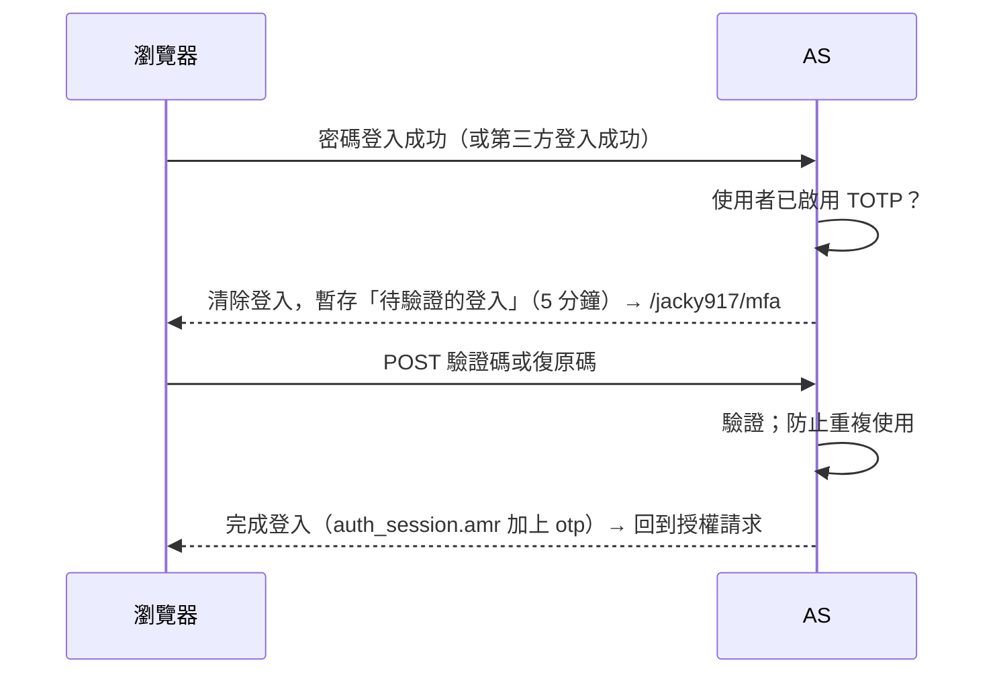

# Authorization Server 第 3、4 階段詳細設計

> 狀態：設計完成，依 §9 的工作項目逐一實作（分支 `claude/as-phase-3`）。
> 前提：[總設計](auth-server-design.md)、[詳細設計（第 1、2 階段）](auth-server-detailed-design.md)、[資料模型](auth-server-data-model.md)。本文只描述新增與變更的部分。

目標是「加入 starter、寫幾行設定就能上線」：管理員能管理使用者與權限，使用者能自行註冊、找回密碼、啟用兩步驟驗證，第三方應用能在使用者同意後取得受限的權限。

## 目錄

1. [範圍](#1-範圍)
2. [新增決策（D23～D31）](#2-新增決策d23d31)
3. [資料表變更](#3-資料表變更)
4. [Admin API](#4-admin-api)
5. [帳號自助功能](#5-帳號自助功能)
6. [第三方應用](#6-第三方應用)
7. [兩步驟驗證（TOTP）](#7-兩步驟驗證totp)
8. [設定屬性](#8-設定屬性)
9. [工作分解](#9-工作分解)
10. [測試案例](#10-測試案例)
11. [不在範圍內](#11-不在範圍內)

---

## 1. 範圍

| 群組 | 內容 | 原規劃 |
|---|---|---|
| A. 使用者與權限管理 | Admin API（使用者、角色、權限、登入 Session、稽核查詢）、`admin_audit_log` | 第 3 階段 |
| B. 帳號自助功能 | 註冊、Email 驗證、忘記密碼、變更密碼、強制變更密碼、寄信 SPI | 第 4 階段 |
| C. 第三方應用 | 第三方 client（設定檔與 Admin API）、同意畫面、撤回授權、scope 與 API resource 管理、`aud` 依 scope 決定（D07-C） | 第 3 階段 |
| D. 兩步驟驗證 | TOTP、復原碼、依角色強制啟用 | 第 4 階段 |
| E. 發佈準備 | BOM、文件、範例、E2E；**不實際發佈** | — |

---

## 2. 新增決策（D23～D31）

| # | 決策 | 選擇 | 理由 |
|---|---|---|---|
| D23 | Admin API 的驗證 | 本 AS 簽發的 Bearer Access Token；以 `permissions` claim 中的 `as:*` 權限授權（request 層級，不依賴方法級授權）；`client_credentials` 的 token 以 `as:` 開頭的 scope 授權 | 管理工具（例如管理後台的 BFF）以一般登入流程取得 token；機器帳號（例如從其他系統同步使用者）用 `client_credentials`。不引入 Resource Server starter，避免它的 filter chain 與 AS 衝突 |
| D24 | Admin API 的形式 | JSON REST，`/admin/api/**`，錯誤為 RFC 9457 Problem Details；清單分頁 `?page=0&size=50`，回傳 `{items, page, size, total}`；不提供管理畫面 | 管理畫面因專案而異；API 讓專案以自己的前端或腳本整合 |
| D25 | 管理操作的稽核 | 每個寫入操作在同一個交易中寫入 `admin_audit_log`（操作者、client、IP、變更前後的快照，不含密碼雜湊與 secret） | 資料模型 §8.3；與資料變更一起提交或回滾 |
| D26 | 寄信 | `AccountMailer` SPI。應用程式有 `JavaMailSender`（加入 `spring-boot-starter-mail` 並設定 `spring.mail.*`）時以它寄信；`account.mail.log-links=true` 時只把連結寫入日誌（**僅限開發**）；兩者皆無時，需要寄信的功能不提供：忘記密碼的連結不顯示，啟用註冊則啟動失敗 | 不強迫所有應用程式加入郵件依賴；設定錯誤時在啟動時就發現，而不是使用者收不到信 |
| D27 | 註冊 | 預設關閉（`account.registration.enabled`）。只用 Email 註冊；Email 驗證前無法登入（登入只接受已驗證的 Email）；同一個 Email 已有帳號時回應完全相同，並改寄「帳號已存在」的通知；尚未驗證的註冊可被新的註冊取代 | 不透露 Email 是否已註冊；避免有人先以他人的 Email 註冊而占用 |
| D28 | 一次性連結 | 沿用 `user_action_token`（`EMAIL_VERIFY` 24 小時、`PASSWORD_RESET` 1 小時，只存 SHA-256）；連結以 GET 顯示確認頁，按下按鈕（POST）才使用 token；同一使用者同一用途 60 秒內只寄一封 | 郵件安全掃描器會預先開啟連結，GET 不能有副作用；限制寄信頻率避免濫用 |
| D29 | 強制變更密碼 | `app_user.password_change_required`。第一位管理員、管理員設定的密碼預設為 `true`；以密碼登入後，在變更之前任何頁面（包含授權端點）都導向變更密碼頁 | 資料模型 §12.5；避免管理員知道使用者的密碼 |
| D30 | 第三方 client | 設定檔（`trust-level: third-party`）或 Admin API 建立；一律要求同意（`requireAuthorizationConsent=true`）、必須有隱私權政策網址、不可申請 `as:` 開頭的 scope。設定檔中的 client 由設定檔管理，Admin API 不可修改 | D13；`as:` scope 會授予管理權限，不能交給第三方 |
| D31 | 兩步驟驗證 | 自行實作 TOTP（RFC 6238：HMAC-SHA1、30 秒、6 位數、前後各容許 1 個時間步），密鑰以主金鑰加密（沿用 `KeyEncryptor`）；10 組一次性復原碼（只存 SHA-256）；QR code 以 ZXing 產生。密碼與第三方登入在完成之前都會要求驗證碼；`mfa.required-roles` 中的角色未啟用時，登入過程中強制先啟用 | Spring Security 7.1 沒有內建 TOTP；演算法簡單、可完整測試。第三方登入也要求，避免以第三方登入繞過 |

---

## 3. 資料表變更

新增 migration，兩種資料庫各一份，名稱與約束一致（[資料模型 §13](auth-server-data-model.md#13-flyway-migration-規劃)）。已存在的 V1_0_x 不修改。

### V1_1_0（工作 18）：稽核事件與強制變更密碼

| 變更 | 內容 |
|---|---|
| `app_user.password_change_required` | `BOOLEAN NOT NULL DEFAULT FALSE` |
| `login_audit` 的 `ck_login_audit_event` | 加入 `USER_REGISTERED`、`EMAIL_VERIFIED`、`PASSWORD_RESET`、`MFA_ENABLED`、`MFA_DISABLED`、`CONSENT_GRANTED`、`CONSENT_REVOKED`。PostgreSQL 以 `ALTER TABLE … DROP/ADD CONSTRAINT`；SQLite 無法修改約束，重建資料表（建立新表、複製、刪除、改名、重建索引） |

### V1_1_1（工作 28）：兩步驟驗證

```sql
CREATE TABLE user_mfa_totp (
    user_id           VARCHAR(36)   PRIMARY KEY REFERENCES app_user(id) ON DELETE CASCADE,
    secret_encrypted  TEXT          NOT NULL,
    encryption_key_id VARCHAR(64)   NOT NULL,
    last_used_step    BIGINT        NOT NULL DEFAULT 0,
    enabled_at        TIMESTAMPTZ   NOT NULL
);

CREATE TABLE user_recovery_code (
    user_id    VARCHAR(36)  NOT NULL REFERENCES app_user(id) ON DELETE CASCADE,
    code_hash  CHAR(64)     NOT NULL,
    used_at    TIMESTAMPTZ,
    created_at TIMESTAMPTZ  NOT NULL,
    PRIMARY KEY (user_id, code_hash)
);
```

`last_used_step` 防止同一個驗證碼在有效期間內被重複使用（RFC 6238 §5.2）。

---

## 4. Admin API

### 4.1 Filter chain 與權限

新增 Order 2 的 filter chain，只處理 `/admin/api/**`：無狀態、無 CSRF、`oauth2ResourceServer().jwt()`（以本 AS 的公鑰驗證，`iss` 必須為本 AS，`aud` 必須包含 `admin-api.audience`，預設為 `token.audience` 的第一個值）。

權限來源（D23）：

| Token | 權限 |
|---|---|
| 使用者的 token（有 `asid`） | `permissions` claim 中以 `as:` 開頭的值 |
| `client_credentials` 的 token | `scope` 中以 `as:` 開頭的值 |

| 路徑 | 讀取（GET） | 寫入（POST、PUT、PATCH、DELETE） |
|---|---|---|
| `/admin/api/users/**` | `as:user:read` | `as:user:write` |
| `/admin/api/users/*/sessions/**`、`/admin/api/sessions/**` | `as:user:read` | `as:session:revoke` |
| `/admin/api/roles/**`、`/admin/api/permissions/**` | `as:role:read` | `as:role:write` |
| `/admin/api/clients/**`、`/admin/api/scopes/**`、`/admin/api/api-resources/**` | `as:client:read` | `as:client:write` |
| `/admin/api/audit/**` | `as:audit:read` | — |

內建角色 `AS_ADMIN` 擁有全部權限；`AS_SUPPORT` 擁有 `as:user:read`、`as:session:revoke`、`as:audit:read`（資料模型 §12.1，V1 已建立）。

### 4.2 端點

| 方法與路徑 | 說明 |
|---|---|
| `GET /admin/api/users?query=&status=` | 依帳號、Email、顯示名稱搜尋（不分大小寫，部分比對） |
| `POST /admin/api/users` | 建立使用者：`username`、`email`、`emailVerified`、`password`（選填；有值時預設必須在登入後變更）、`displayName`、`roles` |
| `GET /admin/api/users/{id}` | 使用者、角色（含到期時間）、已連結的外部帳號、是否啟用兩步驟驗證 |
| `PATCH /admin/api/users/{id}` | `displayName`、`email`、`emailVerified`、`status`（改為 `LOCKED`、`DISABLED` 時撤銷所有登入 Session，原因 `USER_DISABLED`） |
| `DELETE /admin/api/users/{id}` | 軟刪除（`status=DELETED`），撤銷所有登入 Session |
| `POST /admin/api/users/{id}/unlock` | 解除暫時鎖定（`locked_until`、失敗次數歸零） |
| `PUT /admin/api/users/{id}/password` | 設定密碼：`password`、`changeRequired`（預設 `true`）；撤銷所有登入 Session（`PASSWORD_CHANGED`） |
| `DELETE /admin/api/users/{id}/mfa` | 重設兩步驟驗證（使用者遺失裝置與復原碼時） |
| `PUT /admin/api/users/{id}/roles/{role}`、`DELETE …` | 指派（可帶 `expiresAt`）或移除角色 |
| `GET /admin/api/users/{id}/sessions`、`DELETE /admin/api/users/{id}/sessions` | 登入中的裝置；撤銷全部（`ADMIN`） |
| `DELETE /admin/api/sessions/{asid}` | 撤銷單一登入 Session（`ADMIN`） |
| `GET/POST /admin/api/roles`、`GET/PUT/DELETE /admin/api/roles/{code}` | 角色；`PUT` 可改名稱、說明與權限清單。內建角色不可刪除、不可改代碼；仍有使用者的角色不可刪除 |
| `GET/POST /admin/api/permissions`、`PUT/DELETE /admin/api/permissions/{code}` | 權限；內建權限不可刪除；仍被角色或 scope 引用時不可刪除 |
| `GET /admin/api/audit/logins?userId=&type=&from=&to=` | `login_audit`，新到舊 |
| `GET /admin/api/audit/admin?targetType=&targetId=&from=&to=` | `admin_audit_log`，新到舊 |
| Client、scope、API resource | 見 [§6.4](#64-admin-api) |

規則：

- 不能停用、刪除自己，也不能移除自己最後一個擁有 `as:user:write` 的角色（避免把自己鎖在外面）。
- 角色與權限代碼的格式沿用資料模型 §5.1；`as:` 開頭的權限只能是內建的。
- 錯誤：`400`（驗證失敗，`errors` 列出欄位）、`404`、`409`（代碼重複、仍被引用、受設定檔管理）。

### 4.3 稽核（D25）

`AdminAuditService#record(action, targetType, targetId, before, after)`：在呼叫端的交易中寫入；操作者取自目前的 token（使用者 ID 或 client id），IP 取自目前的請求。`action` 例如 `USER_CREATED`、`USER_UPDATED`、`ROLE_ASSIGNED`、`CLIENT_SUSPENDED`。快照為 JSON，排除 `password_hash`、`client_secret`。

---

## 5. 帳號自助功能

所有頁面沿用登入頁的版型、品牌設定與語系（繁中、英文），受 CSRF 保護。

### 5.1 寄信（D26）

```java
public interface AccountMailer {
    boolean isAvailable();
    void send(AccountMail mail);   // 失敗時拋出例外，由呼叫端記錄並回應相同的訊息
}
public record AccountMail(Type type, String to, Locale locale, @Nullable String displayName, @Nullable String link) {
    enum Type { EMAIL_VERIFICATION, PASSWORD_RESET, ACCOUNT_EXISTS, PASSWORD_CHANGED }
}
```

信件內容來自 starter 的訊息檔，可以覆寫；連結以 `issuer` 為基底。

### 5.2 變更密碼與強制變更（D29）

| 頁面 | 行為 |
|---|---|
| `GET/POST /jacky917/account/password` | 輸入目前的密碼與新密碼（密碼政策 D21）。目前的密碼錯誤計入帳號鎖定。成功後更新 `password_changed_at`、撤銷**其他**登入 Session（`PASSWORD_CHANGED`）、稽核 `PASSWORD_CHANGED`、寄出通知信（有寄信時） |
| 強制變更 | 以密碼登入時，`password_change_required=true` 會在瀏覽器 Session 中加上標記；`PasswordChangeRequiredFilter` 把其他請求（登出與靜態資源除外）導向變更頁；變更後回到原本的授權請求 |
| 沒有密碼的使用者 | 帳號頁顯示「設定密碼」，透過忘記密碼的流程設定（需要已驗證的 Email） |

### 5.3 忘記密碼

1. `GET/POST /jacky917/password/forgot`：輸入 Email。只有已驗證的 Email、且帳號不是 `DISABLED`／`DELETED` 時才寄出重設連結；畫面一律顯示「如果帳號存在，已寄出信件」。
2. `GET /jacky917/password/reset?token=…`：token 有效時顯示新密碼表單（token 放在隱藏欄位）；無效或過期顯示錯誤。
3. `POST /jacky917/password/reset`：設定新密碼、清除暫時鎖定與失敗次數、`password_change_required=false`、使用 token、撤銷所有登入 Session、稽核 `PASSWORD_RESET`、寄出通知信。

登入頁在可以寄信時顯示「忘記密碼？」。

### 5.4 註冊與 Email 驗證（D27）

1. `GET/POST /jacky917/register`（`account.registration.enabled=true` 時才存在）：Email、顯示名稱、密碼、確認密碼。
   - Email 沒有帳號：建立使用者（`email_verified=false`、角色 `USER`），寄出驗證信，稽核 `USER_REGISTERED`。
   - Email 屬於尚未驗證、從未登入、沒有帳號名稱的註冊：更新其密碼與顯示名稱，重新寄出驗證信（取代未完成的註冊）。
   - Email 屬於其他帳號：不變更任何資料，寄出「帳號已存在」通知（附忘記密碼的連結）。
   - 三種情況的畫面完全相同：「請到信箱完成驗證」，並可重新寄送。
2. `GET /jacky917/verify-email?token=…` 顯示確認按鈕；`POST` 後設定 `email_verified=true`、稽核 `EMAIL_VERIFIED`，顯示「完成，請登入」。
3. 登入頁在註冊開啟時顯示「建立帳號」。

### 5.5 濫用防護

- 同一使用者、同一用途 60 秒內最多寄一封（以 `user_action_token.created_at` 判斷）；超過時畫面相同、不寄信。
- 註冊、忘記密碼、重設密碼的 POST 與登入共用 IP 限流（`LoginAttemptGuard`）。

---

## 6. 第三方應用

### 6.1 第三方 client（D30）

| 來源 | 規則 |
|---|---|
| 設定檔 `clients.<id>.trust-level: third-party` | 必須有 `privacy-policy-url`；`authentication-method` 可為 `none`（public client）；不可使用 `client_credentials`（沒有使用者可同意）；scope 不可以 `as:` 開頭 |
| Admin API | 同上；建立時回傳 client secret（只顯示一次）；狀態依資料模型 §10.4：可建立為 `PENDING_REVIEW` 或 `ACTIVE` |

第三方 client 的 `client_settings.requireAuthorizationConsent=true`。Token 不含角色；`permissions` = 同意的 scope 對應的權限 ∩ 使用者的權限（D07，已於第 1 階段實作）。

### 6.2 同意畫面

- Spring Authorization Server 以 `authorizationEndpoint().consentPage("/oauth2/consent")` 指向自訂頁面。
- `GET /oauth2/consent?client_id&scope&state`：顯示 client 的名稱、Logo、首頁、隱私權政策、服務條款；需要同意的 scope（`app_scope.consent_required`）以顯示名稱與說明列出，已同意過的標示為「已授權」；不需要同意的 scope（例如 `openid`）不列出。
- 「允許」以 `POST /oauth2/authorize` 送出勾選的 scope（Spring 的標準格式）；「拒絕」不送 scope，client 收到 `access_denied`。
- 同意結果由官方 `JdbcOAuth2AuthorizationConsentService` 儲存；以裝飾器在儲存後發布 `CONSENT_GRANTED` 稽核事件。

### 6.3 帳號頁：已授權的應用

列出使用者同意過的第三方 client（`oauth2_authorization_consent` 以 `principal_name` 查詢，索引已於 V1 建立）與同意的 scope。「撤回」刪除同意紀錄與該 client 對此使用者的所有授權（Refresh Token 立即失效），稽核 `CONSENT_REVOKED`。

### 6.4 Admin API

| 方法與路徑 | 說明 |
|---|---|
| `GET /admin/api/clients`、`GET /admin/api/clients/{clientId}` | 列出 client（含 `trustLevel`、`status`、是否由設定檔管理） |
| `POST /admin/api/clients` | 建立第三方 client，回傳 `clientSecret`（confidential client） |
| `PATCH /admin/api/clients/{clientId}` | 名稱、說明、網址、redirect URI、scope |
| `POST /admin/api/clients/{clientId}/secret` | 重新產生 secret（舊的立即失效） |
| `POST /admin/api/clients/{clientId}/approve`、`/suspend`、`/activate` | 狀態轉換；停權時刪除該 client 的所有授權 |
| `DELETE /admin/api/clients/{clientId}` | 刪除 client、授權與同意紀錄 |
| `GET/POST /admin/api/api-resources`、`PUT/DELETE …/{code}` | API resource（`aud` 的值） |
| `GET/POST /admin/api/scopes`、`GET/PUT/DELETE …/{code}` | scope：顯示名稱、說明、是否需要同意、所屬 API resource、對應的權限（不可對應 `as:` 權限）；內建 scope 不可刪除 |

由設定檔管理的 client 只能讀取（`409`）。

### 6.5 `aud` 依 scope 決定（D07-C）

`token.audience-strategy`：

| 值 | `aud` |
|---|---|
| `shared`（預設） | `token.audience`（現行行為） |
| `per-scope` | 授予的 scope 所屬 API resource 的代碼（去除重複）；沒有任何 scope 屬於 API resource 時（例如只有 `openid`），使用 `token.audience` |

以 `ScopeAudienceResolver` 實作（`AudienceResolver` SPI，第 1 階段已有）。各 Resource Server 設定自己的 API resource 代碼作為 audience。

---

## 7. 兩步驟驗證（TOTP）

### 7.1 啟用與管理（帳號頁）

| 頁面 | 行為 |
|---|---|
| `GET /jacky917/account/mfa` | 未啟用：產生密鑰（暫存於瀏覽器 Session），顯示 QR code 與可手動輸入的金鑰；已啟用：顯示啟用時間、剩餘復原碼數量 |
| `POST /jacky917/account/mfa` | 輸入驗證碼確認後啟用；顯示 10 組復原碼（只顯示一次）；稽核 `MFA_ENABLED` |
| `POST /jacky917/account/mfa/recovery-codes` | 以驗證碼確認後重新產生復原碼 |
| `POST /jacky917/account/mfa/disable` | 以驗證碼確認後停用；`mfa.required-roles` 中的角色不可停用；稽核 `MFA_DISABLED` |

### 7.2 登入時的驗證



- 「待驗證的登入」存在瀏覽器 Session（`PendingLogin`：使用者、登入方式、身分提供者、`amr`、原本的 Authentication），此時**沒有**建立登入 Session，也不是已登入狀態。
- 錯誤 5 次：放棄待驗證的登入、回到登入頁；每次錯誤稽核 `LOGIN`（`MFA_FAILED`）並計入帳號鎖定。
- 已使用的復原碼不可再用；剩餘 0 組時提醒重新產生。
- `mfa.required-roles` 中的角色尚未啟用時：待驗證的登入改導向啟用頁，啟用後完成登入。
- ID Token 的 `amr`：`["pwd","otp"]`、`["fed","otp"]`。

---

## 8. 設定屬性

前綴 `jacky917.security.authorization-server`：

| 屬性 | 預設 | 說明 |
|---|---|---|
| `admin-api.enabled` | `true` | Admin API |
| `admin-api.audience` | `token.audience` 的第一個值 | Admin API 接受的 `aud` |
| `account.registration.enabled` | `false` | 註冊（需要寄信，D26） |
| `account.email-verification-ttl` | `24h` | 驗證連結有效期，1 小時～7 天 |
| `account.password-reset-ttl` | `1h` | 重設連結有效期，10 分鐘～24 小時 |
| `account.mail.from` | — | 寄件者；使用 `JavaMailSender` 時必填 |
| `account.mail.log-links` | `false` | 沒有 `JavaMailSender` 時把連結寫入日誌，**僅限開發** |
| `token.audience-strategy` | `shared` | `shared`／`per-scope`（§6.5） |
| `mfa.issuer-name` | `branding.product-name` | 驗證器 App 中顯示的名稱 |
| `mfa.required-roles` | `[]` | 必須啟用兩步驟驗證的角色，例如 `[AS_ADMIN]` |
| `clients.<id>.trust-level` | `first-party` | 可為 `third-party`（§6.1） |
| `clients.<id>.privacy-policy-url` 等 | — | 第三方 client 的顯示資訊：`privacy-policy-url`（必填）、`homepage-url`、`terms-url`、`logo-url`、`description` |

---

## 9. 工作分解

| # | 工作 | 群組 |
|---|---|---|
| 18 | Admin API 基礎：filter chain、權限、Problem Details、分頁、`AdminAuditService`；migration V1_1_0 | A |
| 19 | Admin API：使用者（建立、查詢、更新、停用、刪除、解鎖、設定密碼、角色指派、登入 Session） | A |
| 20 | Admin API：角色、權限、稽核查詢 | A |
| 21 | 寄信 SPI（`AccountMailer`）、`account.*` 屬性 | B |
| 22 | 變更密碼、強制變更密碼（第一位管理員與管理員設定的密碼） | B |
| 23 | 忘記密碼與重設密碼 | B |
| 24 | 註冊與 Email 驗證 | B |
| 25 | 第三方 client：設定檔支援、Admin API（client、scope、API resource） | C |
| 26 | 同意畫面、帳號頁的已授權應用與撤回 | C |
| 27 | `aud` 依 scope 決定（`per-scope`） | C |
| 28 | 兩步驟驗證（TOTP、復原碼、依角色強制）；migration V1_1_1 | D |
| 29 | 發佈準備：BOM、使用指南、範例、E2E、多面向審查、CHANGELOG（不發佈） | E |

每個工作一個 commit（中英雙語），更新 `PROGRESS.md` 與本文 §12 的實施紀錄。

---

## 10. 測試案例

延續詳細設計 §10 的編號方式；所有整合測試在 SQLite 與 PostgreSQL 各執行一次。

| ID | 案例 | 預期 |
|---|---|---|
| T-ADMIN-01 | 沒有 token、token 的 `aud` 不符、沒有對應權限 | 401／401／403 |
| T-ADMIN-02 | `AS_SUPPORT` 讀取使用者、嘗試建立使用者 | 200／403 |
| T-ADMIN-03 | `client_credentials` 帶 `as:user:read` scope | 可讀取使用者 |
| T-ADMIN-04 | 建立使用者並指派角色，使用者登入取得 token | token 有該角色與權限 |
| T-ADMIN-05 | 停用使用者 | 所有登入 Session 撤銷，Refresh Token 失效 |
| T-ADMIN-06 | 每個寫入操作 | `admin_audit_log` 有一筆，快照不含密碼雜湊 |
| T-ADMIN-07 | 停用自己、刪除內建角色、刪除仍有使用者的角色 | 400／409／409 |
| T-ACCT-01 | 變更密碼 | 其他裝置的 Refresh Token 失效，目前的裝置不受影響 |
| T-ACCT-02 | 第一位管理員首次登入 | 必須先變更密碼才能完成授權 |
| T-ACCT-03 | 忘記密碼：已驗證／未驗證／不存在的 Email | 只有第一種寄信；畫面相同 |
| T-ACCT-04 | 重設連結：GET 不使用 token；使用後再用、過期 | 不使用／失敗／失敗 |
| T-ACCT-05 | 註冊後未驗證就以 Email 登入；驗證後登入 | 失敗／成功 |
| T-ACCT-06 | 以已存在的 Email 註冊 | 畫面相同，寄出「帳號已存在」，原帳號不變 |
| T-ACCT-07 | 60 秒內重複要求寄信 | 只寄一封 |
| T-ACCT-08 | 註冊開啟但沒有寄信方式 | 啟動失敗，訊息說明 |
| T-3P-01 | 第三方 client 的授權請求 | 顯示同意畫面；允許後取得 token，`permissions` ⊆ scope 對應權限 ∩ 使用者權限，無 `roles` |
| T-3P-02 | 拒絕同意 | client 收到 `access_denied` |
| T-3P-03 | 再次授權相同 scope | 不再顯示同意畫面 |
| T-3P-04 | 帳號頁撤回授權 | 同意紀錄刪除，Refresh Token 失效，下次授權重新詢問 |
| T-3P-05 | 第三方 client 申請 `as:` scope、沒有隱私權政策 | 設定檔：啟動失敗；Admin API：400 |
| T-3P-06 | 停權第三方 client | 授權全部刪除，換 token 得到 `invalid_client` |
| T-3P-07 | `per-scope`：`order.read` 屬於 `order-api` | `aud=["order-api"]`；只有 `openid` 時為預設 audience |
| T-MFA-01 | 啟用 TOTP 後密碼登入 | 驗證碼正確才完成；`amr=["pwd","otp"]` |
| T-MFA-02 | 重複使用同一個驗證碼、使用復原碼兩次 | 第二次都失敗 |
| T-MFA-03 | 錯誤 5 次 | 回到登入頁，稽核 `MFA_FAILED`，計入鎖定 |
| T-MFA-04 | 第三方登入的使用者啟用 TOTP | 第三方登入後也要求驗證碼 |
| T-MFA-05 | `required-roles` 中的角色未啟用 | 登入時強制先啟用 |
| T-MFA-06 | 待驗證的登入時直接開啟授權端點 | 未登入（導向登入頁） |

TOTP 演算法另以 RFC 6238 附錄 B 的測試向量驗證。

---

## 11. 不在範圍內

| 項目 | 原因 |
|---|---|
| Apple 登入、即時撤銷 Access Token、Redis（Session、限流）、KMS／Vault 金鑰、MySQL | 選用（第 5 階段）；使用者未要求 |
| 管理畫面 | D24 |
| 開發者自助申請第三方 client、動態註冊（DCR） | D13：第三方 client 由管理員建立 |
| CAPTCHA | 需要外部服務；以寄信頻率限制與 IP 限流替代 |
| 變更 Email 的自助流程 | 由管理員透過 Admin API 修改 |

---

## 12. 實施紀錄

### 12.1 進度

| # | 工作 | 狀態 |
|---|---|---|
| 18 | Admin API 基礎：Order 2 filter chain（`AdminJwtAuthenticationConverter`）、Problem Details、分頁、`AdminAuditService`、稽核查詢端點；migration V1_1_0 | ✅ |
| 19 | 使用者管理：`UserAdminService`、`UserAdminController`（搜尋、建立、更新、刪除、解鎖、設定密碼、角色指派、登入 Session） | ✅ |
| 20 | 角色、權限：`RoleAdminService`、`RoleAdminController`；使用指南 §9 管理 API | ✅ |
| 21 | 寄信 SPI：`AccountMailer`（`SpringAccountMailer`、`LoggingAccountMailer`、`UnavailableAccountMailer`）、`AccountMailContent`、`ActionTokenService`、`AccountLinks`、`account.*` 屬性 | ✅ |
| 22 | 變更密碼、強制變更：`PasswordChangeService`、`AccountPasswordController`、`PasswordChangeRequiredFilter`（兩條 filter chain）、`bootstrap-admin.password-change-required` | ✅ |
| 23 | 忘記密碼：`PasswordResetController`（`/jacky917/password/forgot`、`/jacky917/password/reset`）、登入頁的連結、IP 限流涵蓋這些表單 | ✅ |
| 24 | 註冊與 Email 驗證：`RegistrationService`、`RegistrationController`（`/jacky917/register`、`/jacky917/verify-email`、`/jacky917/verify-email/resend`）、登入頁的連結；使用指南「帳號自助功能」 | ✅ |
| 25 | 第三方 client、scope、API resource 管理：設定檔 `trust-level: third-party`（`ClientUris`、`ClientDetails`）、`ClientAdminService`／`ClientAdminController`、`ScopeAdminService`／`ScopeAdminController`；使用指南 §5、§9 | ✅ |
| 26 | 同意畫面、撤回授權：`ConsentController`（`/oauth2/consent`）、`AuditingAuthorizationConsentService`、`ScopeDescriptions`、`AuthorizedApplicationService`、帳號頁「已授權的應用程式」 | ✅ |
| 27 | `aud` 依 scope 決定：`token.audience-strategy`（`shared`／`per-scope`）、`ScopeAudienceResolver`；使用指南 §3、§7 | ✅ |
| 28 | 兩步驟驗證：migration V1_1_1、`Totp`、`MfaService`、`MfaLoginFlow`（密碼、第三方、帳號連結三個入口）、`MfaChallengeController`、`AccountMfaController`、`QrCodes`、`MfaAdminController`；使用指南「兩步驟驗證」 | ✅ |
| 29 | 發佈準備（不發佈）：AS 模組移除 `maven.deploy.skip` 並加入 BOM；使用指南、README、CHANGELOG、範例、E2E 指南更新 | ✅ |

### 12.2 與設計不同的地方

| 項目 | 設計 | 實作 | 理由 |
|---|---|---|---|
| 稽核查詢的位置（工作 18） | 工作 20 | 與 Admin API 基礎一起於工作 18 實作 | 需要一個唯讀端點驗證 filter chain 與權限 |
| 刷新時的「密碼在登入後變更」檢查（工作 22） | 詳細設計 §5.4：`password_changed_at > session.created_at` 時拒絕並撤銷 | 移除此檢查；每一種變更密碼的方式（管理員設定、重設連結、使用者自行變更）都明確撤銷登入 Session（`PASSWORD_CHANGED`） | 使用者自行變更時必須保留進行變更的那一個 Session；原本的檢查會在下一次刷新時把它撤銷 |
| Email 驗證（工作 24） | §5.4：開啟連結後按確認即完成 | 確認時必須輸入註冊時設定的密碼 | 註冊時就設定密碼，若只靠連結驗證，以他人地址註冊的人在對方點開連結後就擁有該帳號；未完成的註冊被取代時也一樣。要求密碼後，必須同時擁有信箱與密碼才能完成 |
| 重新寄送驗證信（工作 24） | §5.4：可重新寄送 | 獨立的 `POST /jacky917/verify-email/resend`，只對未完成的註冊寄信，畫面一律相同 | 寄送畫面不保留密碼，重新寄送不能再走註冊表單 |
| 管理 API 建立的 client（工作 25） | §6.4：建立 client | 一律為第三方 client，grant type 由驗證方式決定（confidential：`authorization_code`、`refresh_token`；public：`authorization_code`）；scope 必須已在 `app_scope` 定義 | 第一方 client 由設定管理；讓同意畫面一定能顯示 scope 的名稱與說明 |
| 內建 scope 的更新（工作 25） | §6.4：內建 scope 不可刪除 | 內建 scope 也只能修改名稱與說明（不能改是否需要同意與權限對應） | `openid` 等 OIDC scope 的行為由規格決定 |
| 不需要同意的 scope（工作 26） | §6.2：不列出 | 不列出，並隨「允許」以隱藏欄位送出 | Spring Authorization Server 只自動核准 `openid`；其他 `consent_required=false` 的 scope 必須在同意請求中送出才會授予 |
| 撤回授權（工作 26） | §6.3：刪除同意紀錄與授權 | 以 SQL 刪除並自行稽核 `CONSENT_REVOKED`，不經過 `OAuth2AuthorizationConsentService` | `JdbcOAuth2AuthorizationConsentService` 讀取同意紀錄時要求 client 為啟用中，已停權 client 的同意紀錄因此無法撤回 |
| 內容安全政策（修正） | 詳細設計：`form-action 'self'` | 移除 `form-action`（DEC-116） | Chrome 對表單送出後的重導套用 `form-action`，登入與同意表單導回 client 時會被擋下 |
| QR code（工作 28） | D31：ZXing 產生 | 只用 ZXing `core`，自行輸出 SVG 並以 `data:` 網址嵌入 | 不需要 `javase` 模組與 `java.desktop`（AWT），也不需要另外的圖片端點 |
| 管理員查詢兩步驟驗證（工作 28） | §7：只有重設 | 另加 `GET /admin/api/users/{id}/mfa`（是否啟用、剩餘復原碼、角色是否要求） | 管理員重設前需要知道狀態；使用者摘要不必為此多一次查詢 |
| 登入時啟用的錯誤（工作 28） | §7.2：錯誤計入帳號鎖定 | 登入過程中啟用（`required-roles`）時輸入錯誤只計入 5 次的上限，不計入帳號鎖定、不稽核 `MFA_FAILED` | 此時的驗證碼只用來確認 App 已加入密鑰，不是驗證身分 |
| 完成登入後的後續（工作 28） | §7.2：回到授權請求 | 待驗證的登入記住入口（密碼、第三方、帳號連結）：密碼登入完成後仍套用強制變更密碼；第三方登入完成後仍完成等待中的帳號連結 | 第二步不能略過原本入口在建立登入 Session 之後要做的事 |
| 密碼長度上限（審查後修正） | 詳細設計：最多 128 個字元 | 最多 72 bytes（UTF-8） | Spring Security 拒絕雜湊超過 72 bytes 的密碼；原本會在用掉重設連結或註冊之後才 500 |
| 「帳號已存在」通知（審查後修正） | §5.4：寄給屬於其他帳號的地址 | 只寄給可登入帳號的已驗證地址；其他帳號的地址不寄任何信 | 通知附帶重設連結，寄到未驗證的地址會讓信箱持有人接管帳號 |
| 寄信（審查後修正） | D26：同步寄出 | 以 `AccountMailDispatcher` 在背景寄出；失敗時發布 `AccountMailFailedEvent`（metric `jacky917.as.mail.failures`） | 同步寄信的回應時間會透露帳號是否存在，郵件伺服器沒有回應時也會卡住請求執行緒 |
| 以密碼確認的帳號連結（審查後修正） | §7.2：第二步只延後登入 | 擁有者需要第二步時，第二步通過後才建立連結 | 只知道密碼的人不應能留下永久的連結 |
| 同意畫面的拒絕（審查後確認） | §6.2：拒絕時 client 收到 `access_denied` | 只有第一次同意如此；已同意過時按鈕為「不允許新的權限」，以先前同意的 scope 繼續 | Spring Authorization Server 的行為：已有同意紀錄時，不送 scope 的決定仍保留先前的同意 |
| `admin_audit_log` 的對象種類（工作 18） | 資料模型 §8.3 的 7 種 | V1_1_0 加入 `API_RESOURCE` | API resource 的管理也要稽核；SQLite 無法修改約束，與 `login_audit` 一起重建 |
