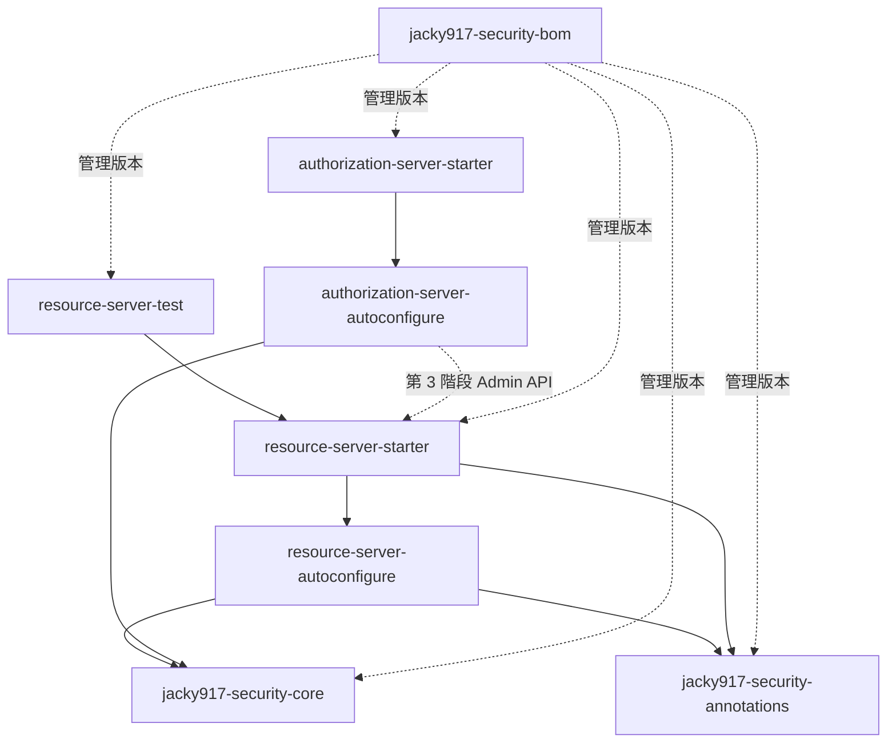

# Repo 拆分與建置設計

| 項目 | 內容 |
|---|---|
| 狀態 | ✅ 已實施（M2，分支 `claude/m2-restructure`）。與設計的差異見 [§11 實施紀錄](#11-實施紀錄) |
| 日期 | 2026-10-07 |
| 目標 | 在同時存在 Resource Server 與 Authorization Server 兩類 starter 的前提下，決定 repo 怎麼拆、模組怎麼命名、版本怎麼管、怎麼發佈 |
| 上層文件 | [2.0 總設計](v2-overview.md) |
| 相關文件 | [Spring Boot 4.1 升級設計](boot4-migration-design.md)、[Authorization Server 設計](auth-server-design.md) |

---

## 1. 現況

```
jacky917-security-starter（repo）
├── pom.xml                              parent 繼承 spring-boot-starter-parent:3.5.10-SNAPSHOT
├── jacky917-security-annotations        ✅ 發佈
├── jacky917-security-autoconfigure      ✅ 發佈
├── jacky917-security-starter            ✅ 發佈
├── demo-resource-server                 ❌
├── demo-authorization-server            ❌
└── docs/
```

接下來會新增 Authorization Server 的 starter、共用的 core、BOM、BFF 範例與 E2E 測試。現在的結構有幾個問題會被放大：

| 問題 | 說明 |
|---|---|
| 名稱不分角色 | `jacky917-security-starter` 實際上只是 Resource Server，加入 Auth Server 後會混淆 |
| 發佈的 POM 依賴 parent 鏈 | 使用者解析依賴時，需要我們的 parent，以及 Spring Boot 的 parent（目前還是 SNAPSHOT） |
| 沒有 CI | 只有發佈流程，PR 不會自動跑測試 |
| 沒有機制防止「業務 API 引入 Auth Server」 | 只靠文件約定 |

---

## 2. 拆分方案比較（R-D1）

| | A. 單一 repo、多模組、統一版本 | B. 兩個 repo | C. 三個 repo | D. 單一 repo、各自獨立版本 |
|---|---|---|---|---|
| 結構 | 全部在一個 repo | `security`（core + RS）、`auth-server`（AS） | core、RS、AS 各一 | 同 A，但 RS 與 AS 各有版本號 |
| 修改 claim 契約（core） | **一次 commit，兩邊一起編譯與測試** | 先發佈 core，再升級另一個 repo | 同 B，而且要協調三個 repo | 同 A |
| AS ↔ RS 的 E2E 測試 | **在同一次建置中執行** | 要跨 repo 取得另一邊的版本 | 同 B | 同 A |
| 使用者的版本管理 | **一個版本號，或一個 BOM** | 要查相容性對照表 | 同 B | 要查相容性對照表 |
| 發佈流程 | 一個 | 兩個 | 三個 | 一個 repo，但要分開觸發 |
| 適合 | **單一維護者或同一個團隊** | AS 與 RS 由不同團隊維護 | 大型組織 | 兩邊發佈節奏差異很大 |
| 主要缺點 | 只改 RS 也會一起發 AS 的新版本 | 跨 repo 的變更很痛苦 | 管理成本最高 | 版本相容性變複雜 |

**推薦 A**。目前只有一位維護者，而且 AS 與 RS 共用 claim 契約，這兩點都強烈傾向單一 repo。只改 RS 也會一起發佈 AS 新版本的缺點，在統一版本下成本很低（版本號一致，使用者反而好理解）。

### 何時該改成多個 repo

符合以下任一條件時再拆分（可以用 `git filter-repo` 保留歷史）：

- AS 與 RS 改由不同團隊負責
- AS 需要改為私有（例如變成商業產品），但 RS 維持公開
- 兩邊的發佈節奏長期差異很大（例如 RS 每月一版，AS 一年一版）
- CI 時間長到影響開發（例如超過 15 分鐘）

---

## 3. 目標結構

```
jacky917-security（repo，是否改名見 R-D2）
├── pom.xml                                          建置用的 parent + aggregator
├── jacky917-security-bom/                           ✅ BOM
├── core/
│   └── jacky917-security-core/                      ✅ claim 契約（純 Java）
├── resource-server/
│   ├── jacky917-security-annotations/               ✅ @Require*（不變）
│   ├── jacky917-security-resource-server-autoconfigure/   ✅
│   ├── jacky917-security-resource-server-starter/   ✅ 業務 API 引入這個
│   └── jacky917-security-resource-server-test/      ✅ 測試輔助（@WithJacky917User 等，2.x 後續）
├── authorization-server/
│   ├── jacky917-security-authorization-server-autoconfigure/  ✅
│   └── jacky917-security-authorization-server-starter/        ✅ 登入服務引入這個
├── relocation/
│   └── jacky917-security-starter/                   ✅ 只有 2.0.x 發佈：指向新名稱
├── examples/
│   ├── example-resource-server/                     ❌ 原 demo-resource-server
│   ├── example-authorization-server/                ❌ 原 demo-authorization-server，改為引入 AS starter
│   └── example-bff/                                 ❌ 新
├── e2e-tests/                                       ❌ AS + RS + BFF 的端對端測試
├── docs/
├── scripts/                                         文件連結檢查等工具
└── .github/workflows/
    ├── ci.yml                                       新：PR 與 push 時測試
    └── publish.yml
```

### 模組與依賴

| 模組 | 發佈 | 依賴 | 用途 |
|---|---|---|---|
| `jacky917-security-bom` | ✅ | — | 列出所有發佈模組的版本，使用者在 `dependencyManagement` 中 import |
| `jacky917-security-core` | ✅ | **無**（只依賴 JDK） | claim 名稱、權限前綴、`TrustLevel` 等常數與模型 |
| `jacky917-security-annotations` | ✅ | `spring-security-core` | `@RequireRole` 等註解 |
| `…-resource-server-autoconfigure` | ✅ | core、annotations、`spring-boot-security-oauth2-resource-server`；webmvc 為 optional | 現有的自動配置 |
| `…-resource-server-starter` | ✅ | autoconfigure、annotations、`spring-boot-starter-security-oauth2-resource-server` | 聚合 |
| `…-resource-server-test` | ✅ | `spring-boot-starter-security-test` | 測試輔助 |
| `…-authorization-server-autoconfigure` | ✅ | core、`spring-boot-security-oauth2-authorization-server`、OAuth2 Client、JDBC、Flyway、Thymeleaf、Spring Session JDBC（多為 optional） | AS 自動配置 |
| `…-authorization-server-starter` | ✅ | AS autoconfigure 與對應 starter | 聚合 |
| `relocation/jacky917-security-starter` | ✅（只到 2.0.x） | — | Maven relocation，見 [§5.1](#51-artifactidr-d3) |
| `examples/*`、`e2e-tests` | ❌ | — | 不發佈 |



### 依賴方向規則（以建置強制）

| 規則 | 理由 | 強制方式 |
|---|---|---|
| Resource Server 模組**不得**依賴任何 Authorization Server 模組 | 業務 API 絕不能帶入登入與簽發能力（見 [Auth Server 設計 D02](auth-server-design.md#d02-交付形式)） | `maven-enforcer-plugin` 的 `bannedDependencies` |
| `core` **不得**依賴 Spring | 讓 core 可以被任何 Java 程式使用，也不受 Spring 版本影響 | 同上 |
| AS **可以**依賴 RS starter | 第 3 階段的 Admin API 本身也是 Resource Server | — |

這讓「業務 API 不能引入 Auth Server」從文件約定變成**建置時的檢查**。

---

## 4. 建置設計

### 4.1 Parent POM 策略（R-D7）

| 選項 | 說明 | 使用者解析依賴時 |
|---|---|---|
| A. 繼承 `spring-boot-starter-parent`（現況） | 方便 | 需要我們的 parent + Spring Boot 的 parent；parent 一定要一起發佈 |
| **B. 自己的 parent + import `spring-boot-dependencies` BOM + `flatten-maven-plugin`** | 發佈時把 POM 攤平：移除 parent、把版本寫死在每個依賴上 | **只需要模組自己的 POM**，parent 不必發佈 |

**推薦 B**。好處：

- 根本解決先前「parent 沒一起發佈就無法解析」的問題（[限制 §16](../resource-server/limitations.md#16-發佈與依賴)）。
- 使用者不會被迫繼承我們的建置設定。
- 是函式庫的常見做法（Spring 官方的函式庫也不繼承 `spring-boot-starter-parent`）。

要自行補上 `spring-boot-starter-parent` 原本提供的設定：

| 設定 | 理由 |
|---|---|
| `maven-compiler-plugin`：`<release>21</release>`、`<parameters>true</parameters>` | `-parameters` 讓 SpEL 的 `#參數名` 可用 |
| `annotationProcessorPaths`：Lombok、configuration-processor | JDK 23 以上的必要設定（Step 9 已加） |
| UTF-8 編碼 | 中文 JavaDoc |

`examples/*` 是應用程式，需要 `spring-boot-maven-plugin` 的打包設定，可以改以 `spring-boot-starter-parent` 為 parent，透過 BOM 引用本專案模組。

### 4.2 版本號集中管理

使用 Maven 的 CI-friendly 版本：根 POM 定義 `<revision>2.0.0-SNAPSHOT</revision>`，所有模組寫 `<version>${revision}</version>`，由 `flatten-maven-plugin` 在發佈時代換成實際版本。**整個 repo 只有一個地方要改版本號。**

### 4.3 BOM

使用者引入多個模組時，只需要指定一次版本：

```xml
<dependencyManagement>
    <dependencies>
        <dependency>
            <groupId>io.github.jacky917</groupId>   <!-- groupId 見 R-D6 -->
            <artifactId>jacky917-security-bom</artifactId>
            <version>2.0.0</version>
            <type>pom</type>
            <scope>import</scope>
        </dependency>
    </dependencies>
</dependencyManagement>

<dependencies>
    <dependency>
        <groupId>io.github.jacky917</groupId>
        <artifactId>jacky917-security-resource-server-starter</artifactId>
    </dependency>
    <dependency>
        <groupId>io.github.jacky917</groupId>
        <artifactId>jacky917-security-resource-server-test</artifactId>
        <scope>test</scope>
    </dependency>
</dependencies>
```

---

## 5. 命名規則

2.0 本身已經因為 Spring Boot 4 而成為破壞性升級，**這是調整命名成本最低的時機**；錯過之後再改，就要等 3.0。

### 5.1 artifactId（R-D3）

| 選項 | Resource Server | Authorization Server |
|---|---|---|
| A. 保留現有名稱 | `jacky917-security-starter` | `jacky917-auth-server-starter` |
| **B. 依角色命名** | `jacky917-security-resource-server-starter` | `jacky917-security-authorization-server-starter` |

**推薦 B**：名稱直接說明「給誰用」，與 Spring 官方的 `spring-boot-starter-security-oauth2-resource-server`／`…-authorization-server` 一致，也不會有人誤以為 `jacky917-security-starter` 是「全部安全功能」。

為了降低使用者的遷移成本，2.0.x 額外發佈一個**只有 relocation 的 POM**：

```xml
<!-- relocation/jacky917-security-starter/pom.xml -->
<artifactId>jacky917-security-starter</artifactId>
<packaging>pom</packaging>
<distributionManagement>
    <relocation>
        <artifactId>jacky917-security-resource-server-starter</artifactId>
        <message>Renamed in 2.0. Use jacky917-security-resource-server-starter.</message>
    </relocation>
</distributionManagement>
```

使用者只改版本號也能運作，Maven 會顯示改名提示。3.0 時移除。

### 5.2 Java 套件（R-D4）

| 模組 | 現在 | 2.0 | 影響 |
|---|---|---|---|
| annotations | `jacky917.security.annotations` | **不變** | 使用者最常 import 的部分，維持不動 |
| RS autoconfigure | `jacky917.security.autoconfigure.*` | `jacky917.security.resourceserver.autoconfigure.*` | 只有擴充 `JwtAuthoritiesExtractor`、注入 `Jacky917SecurityProperties` 的使用者需要改 import |
| core | — | `jacky917.security.core` | 新增 |
| AS | — | `jacky917.security.authorizationserver.*` | 新增 |

### 5.3 設定屬性前綴（R-D5）

| 模組 | 前綴 | 說明 |
|---|---|---|
| Resource Server | `jacky917.security.*`（**不變**） | 改屬性名稱會讓所有使用者的設定檔失效，而且不像 artifactId 有 relocation 機制可以緩衝 |
| Authorization Server | `jacky917.security.authorization-server.*` | 新增；[Auth Server 設計](auth-server-design.md) 中的屬性草案改用此前綴 |

### 5.4 groupId（R-D6）⚠️

| 選項 | 說明 |
|---|---|
| A. 保留 `com.github.jacky917` | 不用改；但 **Maven Central 已不接受新的 `com.github.*` namespace**，日後無法發佈到 Maven Central |
| **B. 改為 `io.github.jacky917`** | Maven Central 對 GitHub 帳號開放的 namespace；GitHub Packages、JitPack 也都能用 |

**推薦 B（如果未來有任何可能上 Maven Central）**。groupId 只能在大版本時改，2.0 是唯一合理的時機。舊 groupId 無法用 relocation 完全遮蔽，升級說明中要寫清楚。

### 5.5 Repo 名稱（R-D2）

| 選項 | 說明 |
|---|---|
| A. 保留 `jacky917-security-starter` | 零風險；但 repo 已不只是一個 starter |
| B. 改為 `jacky917-security` | 名稱符合內容。GitHub 會自動轉址 git 與網頁 URL，但 **GitHub Packages 的 Maven URL 中包含 repo 名稱**，改名後需實際驗證舊 URL 是否仍可下載，並更新所有文件中的 repository URL |

**推薦**：若選擇 R-D6-B（改 groupId），代表 2.0 本來就要請使用者改依賴設定，可以一併改名（B）；否則保留（A）。

---

## 6. 文件結構

```
docs/
├── PROGRESS.md、PROJECT_STRUCTURE.md        位置不變（專案規範指定的路徑）
├── resource-server/                          使用者文件：getting-started、configuration、limitations、
│                                             troubleshooting、jwt-claims、authorization-model
├── authorization-server/                     使用者文件（實作後撰寫）
├── design/                                   v2-overview、boot4-migration-design、repo-structure-design、
│                                             auth-server-design、starter-design、refresh-rotation、database-schema
└── guides/                                   e2e-testing、github-packages、upgrade-to-2.0（新）
```

文件搬移放在重構步驟的最後，並以 `scripts/` 中的連結檢查工具確認沒有斷鏈。

---

## 7. 版本與分支策略

### 7.1 版本線（R-D8、R-D9）

| 版本線 | 分支 | Spring Boot | 內容 | 維護期 |
|---|---|---|---|---|
| `1.x` | `1.x` | 3.5.16 | 現有的 RS starter | 只修安全問題與嚴重 bug，至 **2.0.0 正式發佈後 6 個月** |
| `2.x` | `main` | 4.1.x | 重構後的 RS + 新的 AS | 主要開發 |

所有發佈模組**使用同一個版本號**（統一版本）。

### 7.2 2.x 的版本規劃

| 版本 | 內容 |
|---|---|
| `2.0.0-M1` | Spring Boot 4.1 升級（維持現有結構） |
| `2.0.0-M2` | Repo 重構、命名調整、core、BOM、破壞性清理 |
| `2.0.0-RC1` → `2.0.0` | 文件與升級說明完成 |
| `2.1.0` | AS 第 1 階段（MVP），標示為預覽（preview） |
| `2.2.0` | AS 第 2 階段（安全強化、GitHub／LINE 登入），AS 轉為正式 |
| `2.3.0` | AS 第 3 階段（第三方應用） |

AS 用小版本號推進，因為它是**新增**的 artifact，不會破壞既有的 RS 使用者。

### 7.3 版本號與 tag 的一致性

先前發生過 tag 是 `v1.0.1`、但 `pom.xml` 仍是 `1.0.0` 的情況。發佈流程加上檢查：**tag（去掉開頭的 `v`）必須等於 `${revision}`，否則中止發佈**。

---

## 8. CI 與發佈

### 8.1 `ci.yml`（新增）

| 項目 | 設定 |
|---|---|
| 觸發 | push 到 `main`、`1.x`；所有 PR |
| 測試矩陣 | Java 21、Java 25 |
| 指令 | `mvn -B verify`（包含 Testcontainers；GitHub 的 Ubuntu runner 內建 Docker） |
| 額外檢查 | 文件連結檢查（`scripts/check-doc-links.py`）；enforcer 的依賴方向規則 |
| 分支保護 | `main`、`1.x` 合併前必須通過 CI |

### 8.2 `publish.yml`（調整）

| 項目 | 現在 | 調整後 |
|---|---|---|
| 觸發 | GitHub Release published | 不變 |
| 版本檢查 | 無 | tag 必須等於 `${revision}`（§7.3） |
| 測試 | `-DskipTests` | **先跑完整測試**，通過才發佈 |
| 發佈範圍 | `-pl` 手動列出模組 | 整個 reactor；`examples`、`e2e-tests` 以 `maven.deploy.skip` 排除。新增模組時不用再改 workflow |
| 1.x 發佈 | — | 同一個 workflow，依 tag 所在分支執行 |

### 8.3 發佈目的地

維持 GitHub Packages。是否改用 JitPack 或 Maven Central 另行決定；R-D6 選 B 可以保留 Maven Central 的選項。

---

## 9. 重構實施步驟

**前提：[Spring Boot 4.1 升級](boot4-migration-design.md) 已完成（`2.0.0-M1`）**。先升級、再重構，是為了讓兩件事的問題可以分開定位：升級時結構不變，重構時版本不變。

每一步都要能獨立通過 `mvn clean verify`。

| 步驟 | 內容 | 驗證 |
|---|---|---|
| 1 | 根 POM 改為自有 parent：import Boot BOM、補上編譯設定、加入 `flatten-maven-plugin` 與 `${revision}` | `mvn verify` 通過；檢查 `target/.flattened-pom.xml` 中沒有 parent |
| 2 | `git mv` 模組到 `resource-server/`、`examples/`；artifactId 依 §5.1 改名 | 測試通過 |
| 3 | RS autoconfigure 的 Java 套件依 §5.2 搬移；更新 `AutoConfiguration.imports` | 測試通過；自動配置確實載入 |
| 4 | 新增 `core`，RS 改用 core 的常數 | 測試通過 |
| 5 | 新增 `bom`、`relocation/jacky917-security-starter` | 另建空專案驗證 relocation 與 BOM |
| 6 | 加入 enforcer 規則（§3 依賴方向） | 故意加入違規依賴，確認建置失敗 |
| 7 | 依 R-D6 調整 groupId；依 R-D2 決定是否改 repo 名稱 | 發佈 `2.0.0-M2` 到 GitHub Packages 並實際下載驗證 |
| 8 | 新增 `ci.yml`；調整 `publish.yml` | 開一個測試 PR 確認 CI 執行 |
| 9 | 2.0 的其他破壞性清理（見 [2.0 總設計 §4](v2-overview.md#4-20-的破壞性變更清單)） | 測試通過 |
| 10 | 文件依 §6 重新組織；撰寫 `guides/upgrade-to-2.0.md` | 連結檢查通過 |

---

## 10. 決策總表

| # | 決策 | 推薦 | 狀態 |
|---|---|---|---|
| R-D1 | Repo 數量 | 單一 repo、多模組 | ✅ 已實施 |
| R-D2 | Repo 名稱 | 依 R-D6 決定 | ✅ 決定改為 `jacky917-security`（M2 最後一步執行） |
| R-D3 | artifactId | 依角色命名 + relocation | ✅ 已實施 |
| R-D4 | Java 套件 | annotations 不變；RS autoconfigure 搬到 `resourceserver` | ✅ 已實施 |
| R-D5 | 設定屬性前綴 | RS 不變；AS 用 `jacky917.security.authorization-server` | ✅ 已決定 |
| R-D6 | groupId | 改為 `io.github.jacky917` | ✅ 已實施 |
| R-D7 | Parent 策略 | 自有 parent + BOM import + flatten | ✅ 已實施（調整：仍繼承 Spring Boot parent，見 §11） |
| R-D8 | 版本號 | 所有模組統一版本 | ✅ 已實施（`${revision}`） |
| R-D9 | 分支 | `main` = 2.x；`1.x` 維護 6 個月 | ✅ `1.x` 分支已建立 |
| R-D10 | 範例與 E2E | 放在同一 repo，不發佈 | ✅ 已實施（`examples/`；`e2e-tests/` 於 AS 第 1 階段建立） |

---

## 11. 實施紀錄

M2 於分支 `claude/m2-restructure` 依 §9 的步驟實施，每一步都以 `mvn clean verify` 驗證。

### 11.1 與設計不同的地方

| 項目 | 設計 | 實際 | 原因 |
|---|---|---|---|
| Parent 策略（R-D7） | 自有 parent，不繼承 `spring-boot-starter-parent` | **仍繼承 `spring-boot-starter-parent`**，發佈時以 `flatten-maven-plugin`（`ossrh` 模式）移除 parent | 達到相同目標（使用者不需要 parent 鏈），又能沿用 Spring Boot 管理的外掛版本、`-parameters` 等設定 |
| 繼承來的 POM 資訊 | — | 覆寫 `url`、`developers`、`scm` | `spring-boot-starter-parent` 會把 Spring 專案的開發者與 SCM 資訊帶進發佈的 POM |
| 授權條款 | — | **尚未決定**（TODO） | flatten 無法移除繼承來的 `licenses`；在專案宣告自己的授權條款前，發佈的 POM 會帶有 Apache License 2.0。**正式發佈 2.0.0 前必須決定** |
| `core` 的常數與設定預設值 | 設定類別直接引用 core 常數 | 設定類別保留字串常值，另以測試確認與 core 一致 | configuration processor 無法解析其他模組的常數，引用常數會讓 IDE 看不到預設值 |
| BOM | `${project.version}` 由 flatten 代換 | bom 模式保留原文；使用者 import 時由 Maven 以 BOM 自己的版本代換 | flatten 的 bom 模式不代換 `dependencyManagement`；已用外部專案實測可正確解析 |
| `@Secured` | 2.0 移除 | **保留** | 移除會讓既有的 `@Secured` 被靜默忽略（fail-open），見 [2.0 總設計 §4.2](v2-overview.md#42-建議一併處理已決定) |
| 文件結構（§6） | 另有 `authorization-server/` | 尚未建立 | AS 實作後再建立使用者文件 |

### 11.2 驗證

| 項目 | 方法 | 結果 |
|---|---|---|
| 發佈的 POM 不含 parent | 檢查 `.flattened-pom.xml` 與本機安裝的 POM | ✅ |
| BOM | 另建外部專案 import BOM，不指定版本引入 starter | ✅ 解析到 `2.0.0-SNAPSHOT` 與所有子模組 |
| 舊座標 relocation | 外部專案只宣告 `com.github.jacky917:jacky917-security-starter` | ✅ 導向新座標並顯示改名提示 |
| enforcer：RS 依賴 AS | 安裝假的 `jacky917-security-authorization-server-autoconfigure` 並加入依賴 | ✅ 建置失敗並顯示規則訊息 |
| enforcer：core 依賴 Spring | 對 core 加入 `spring-core` | ✅ 建置失敗並顯示規則訊息 |
| 文件連結 | `scripts/check-doc-links.py`（CI 也會執行） | ✅ |
| CI 的版本檢查 | 本機執行 `mvn help:evaluate -Dexpression=revision` | ✅ 回傳 `2.0.0-SNAPSHOT` |

