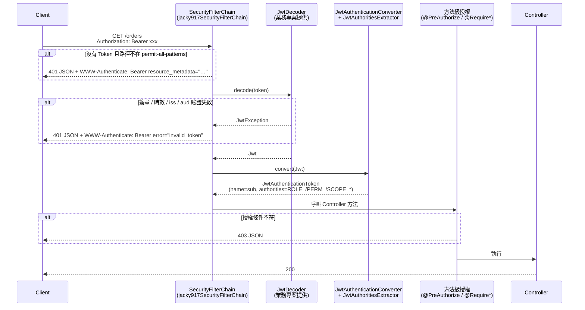

# Starter 設計理念與架構

本文件說明 `jacky917-security-starter` 的設計原則、模組結構、自動配置的實際運作方式，以及每個元件的擴充點。使用方式見 [使用指南](../resource-server/getting-started.md)。

---

## 設計原則

1. **約定優於配置**：引入依賴並提供 `JwtDecoder` 即可運作，其餘皆有預設值。
2. **預設安全**：未列入放行清單的請求一律需要驗證；`@RequireAny` / `@RequireAll` 在參數無效時一律拒絕。
3. **只做 Resource Server**：Starter 負責「驗證之後」的授權與錯誤格式。Token 簽發、Refresh Token、Session 管理屬於 Authorization Server，不放進 Starter（見 [Refresh Token Rotation](refresh-rotation.md)）。
4. **不重新發明驗證**：JWT 的簽章、時效、issuer 驗證完全交給 Spring Security 的 `JwtDecoder`，Starter 不碰。
5. **每個元件都可替換**：所有 Bean 都有 `@ConditionalOnMissingBean`。

---

## 模組結構

```
jacky917-security-starter          ← 業務專案引入這個（只有 pom，無程式碼）
├── jacky917-security-autoconfigure
│   ├── config/Jacky917SecurityAutoConfiguration        自動配置入口
│   ├── authentication/JwtAuthoritiesExtractor          claims → authorities
│   ├── methodsecurity/Jacky917AuthorityEvaluator       @RequireAny / @RequireAll 的判斷邏輯
│   └── properties/Jacky917SecurityProperties           jacky917.security.* 屬性
└── jacky917-security-annotations
    └── @RequireRole / @RequirePerm / @RequireScope / @RequireAny / @RequireAll
```

| 模組 | 依賴 | 說明 |
|---|---|---|
| `jacky917-security-annotations` | `spring-security-core` | 只有註解定義，可單獨引入到不想帶入自動配置的模組（例如共用的 API interface 模組） |
| `jacky917-security-autoconfigure` | `spring-boot-starter-security-oauth2-resource-server`、Jackson 3（`tools.jackson.core:jackson-databind`）；`spring-boot-starter-webmvc`、Lombok 為 optional | 自動配置與執行期邏輯 |
| `jacky917-security-starter` | 上面兩個 | 聚合依賴 |

自動配置透過 `META-INF/spring/org.springframework.boot.autoconfigure.AutoConfiguration.imports` 註冊。

---

## 請求處理流程



---

## 自動配置

### 啟用條件

`Jacky917SecurityAutoConfiguration` 需要以下條件**同時**成立：

| 條件 | 實作 |
|---|---|
| Servlet Web 應用 | `@ConditionalOnWebApplication(type = SERVLET)` |
| 未停用 | `@ConditionalOnProperty(name = "jacky917.security.enabled", havingValue = "true", matchIfMissing = true)` |

### 執行順序

以 `@AutoConfiguration(beforeName = {...})` 宣告在 Spring Boot 4 的下列自動配置之前執行：

- `org.springframework.boot.security.autoconfigure.SecurityAutoConfiguration`
- `org.springframework.boot.security.autoconfigure.web.servlet.ServletWebSecurityAutoConfiguration`
- `org.springframework.boot.security.oauth2.server.resource.autoconfigure.OAuth2ResourceServerAutoConfiguration`
- `org.springframework.boot.security.oauth2.server.resource.autoconfigure.web.OAuth2ResourceServerWebSecurityAutoConfiguration`

使用字串而不是 `Class`，是為了讓類別搬家或不存在時不會直接啟動失敗。代價是名稱打錯時不會有任何錯誤，因此由 `AutoConfigurationOrderingIntegrationTest` 檢查每個類別都存在。另外，Spring Boot 會先依類別名稱的字母順序排序，`jacky917.…` 本來就排在 `org.springframework.…` 之前；`beforeName` 是日後套件名稱改變時的保險。這確保：

- Starter 的 `SecurityFilterChain` 先註冊，Spring Boot 的預設 filter chain（`@ConditionalOnDefaultWebSecurity`）因此不會建立。
- Starter 的 `JwtAuthenticationConverter` 先註冊，Spring Boot 依 `spring.security.oauth2.resourceserver.jwt.authorit*` / `principal-claim-name` 建立的 converter 因此不會建立（見 [限制 §5](../resource-server/limitations.md#5-spring-boot-原生的-jwt-converter-屬性無效)）。
- Spring Boot 仍會依 `spring.security.oauth2.resourceserver.jwt.*` 建立 `JwtDecoder`，Starter 的 filter chain 會使用它。

### 自動配置建立的 Bean

| Bean 名稱 | 型別 | 條件 | 用途 |
|---|---|---|---|
| `jacky917SecurityFilterChain` | `SecurityFilterChain` | 沒有任何 `SecurityFilterChain` Bean | HTTP 安全規則 |
| `jwtAuthoritiesExtractor` | `JwtAuthoritiesExtractor` | 沒有同型別 Bean | claims → authorities |
| `jwtAuthenticationConverter` | `JwtAuthenticationConverter` | 沒有同型別 Bean | 把 `Jwt` 轉成 `JwtAuthenticationToken` |
| `jacky917AuthorityEvaluator` | `Jacky917AuthorityEvaluator` | 沒有**同名稱** Bean | 供 `@RequireAny` / `@RequireAll` 的 SpEL 呼叫 |
| `annotationTemplateExpressionDefaults` | `AnnotationTemplateExpressionDefaults` | 沒有同型別 Bean | 讓 `@Require*` 中的 `{value}` 佔位符生效；宣告為 `static` |
| （內部設定類別） | `MethodSecurityConfiguration` | `jacky917.security.method-security.enabled` 不為 `false` | `@EnableMethodSecurity(prePostEnabled = true, securedEnabled = true)` |

Starter 另外在自動配置類別上標註了 `@EnableWebSecurity`，並以 `@EnableConfigurationProperties` 註冊 `Jacky917SecurityProperties`。

### `jacky917SecurityFilterChain` 的內容

| 設定 | 值 | 理由 |
|---|---|---|
| Session | `STATELESS` | 每個請求自帶 Token，不需要伺服器端 Session |
| CSRF | 停用 | 不使用 Cookie 驗證，CSRF 無從發生 |
| 路由規則 | `permit-all-patterns` → `permitAll()`；其餘 → `authenticated()` | 預設拒絕 |
| Resource Server | `oauth2ResourceServer().jwt()`，使用 `jwtAuthenticationConverter` | |
| 401 處理 | JSON entry point，同時設定在 `oauth2ResourceServer` 與 `exceptionHandling` | 涵蓋「沒帶 Token」與「Token 無效」兩種情況 |
| 403 處理 | JSON access denied handler | |
| CORS | 未設定 | 交由業務專案或 Gateway 決定 |

401 entry point 會先呼叫 Spring Security 的 `BearerTokenAuthenticationEntryPoint` 寫入 RFC 6750 的 `WWW-Authenticate` 標頭（Spring Security 7 另帶 RFC 9728 的 `resource_metadata`），再以應用程式的 Jackson 3 `JsonMapper` 寫入 JSON 內容。

---

## 自訂註解的實作原理

`@Require*` 是以 Spring Security 6.3 起支援的**註解樣板（annotation template）**實作。以 `@RequireRole` 為例：

```java
@PreAuthorize("hasAuthority('ROLE_{value}')")
public @interface RequireRole {
    String value();
}
```

`AnnotationTemplateExpressionDefaults` Bean 存在時，Spring Security 會把 `{value}` 替換成註解屬性值，`@RequireRole("ADMIN")` 因此等同於 `@PreAuthorize("hasAuthority('ROLE_ADMIN')")`。

`@RequireAny` / `@RequireAll` 則呼叫 `jacky917AuthorityEvaluator` Bean：

```java
@PreAuthorize("@jacky917AuthorityEvaluator.hasAllAuthorities(authentication, '{value}')")
public @interface RequireAll { String value(); }
```

這個設計帶來的限制：

- 因為底層是 `@PreAuthorize`，同一個方法無法疊加多個（見 [限制 §1](../resource-server/limitations.md#1-同一個方法只能有一個授權註解)）。
- 前綴寫在註解字串中，不會跟著設定檔改變（見 [限制 §3](../resource-server/limitations.md#3-單一條件註解的前綴固定)）。
- 屬性值直接插入 SpEL 字串常值中，不可包含單引號。

---

## 擴充點總覽

| 想做的事 | 做法 | 範例 |
|---|---|---|
| 改 claim 名稱、前綴 | 屬性 `jacky917.security.jwt.*` | [設定參考](../resource-server/configuration.md#jwt-claim-與前綴) |
| 讀取巢狀 claim、加入額外 authority | 定義 `JwtAuthoritiesExtractor` 子類別 Bean | [使用指南 §8.2](../resource-server/getting-started.md#82-自訂-authority-映射例如-keycloak-的-realm_accessroles) |
| 改 principal 名稱 | 定義 `JwtAuthenticationConverter` Bean | [使用指南 §8.1](../resource-server/getting-started.md#81-改用-email-作為-principal-名稱) |
| HTTP method 規則、多條 chain、自訂錯誤格式 | 定義 `SecurityFilterChain` Bean | [使用指南 §8.3](../resource-server/getting-started.md#83-自訂-securityfilterchain) |
| 改 `@RequireAny` / `@RequireAll` 判斷邏輯 | 定義名為 `jacky917AuthorityEvaluator` 的 Bean | |
| 資源層級授權（ABAC） | 自訂 Bean + `@PreAuthorize("@bean.method(...)")` | [授權模型 — ABAC](../resource-server/authorization-model.md#abac資源屬性授權) |
| Token 驗證規則（aud、黑名單、多 issuer） | 自訂 `JwtDecoder` 與 `OAuth2TokenValidator` | [使用指南 §2](../resource-server/getting-started.md#2-提供-jwtdecoder必要) |
