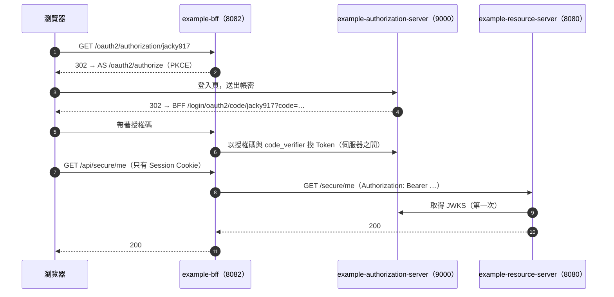

# E2E 測試指南（登入服務 + API + BFF）

本文件示範如何以三個範例走完整的流程：瀏覽器透過 `example-bff` 登入 `example-authorization-server`，再以 Access Token 呼叫 `example-resource-server`。



## 1. 自動化的端對端測試

`e2e-tests` 模組在同一個 JVM 中以隨機埠號啟動登入服務、Resource Server、audience 不同的第二個 Resource Server 與 BFF，再以保存 Cookie 的 HTTP client 模擬瀏覽器：

```bash
mvn -pl e2e-tests -am verify
```

| 測試 | 驗證內容 |
|---|---|
| alice 登入並呼叫 API | 登入頁（含 CSRF）→ 授權碼 → BFF 換 Token → `/api/secure/me` 200、`/api/secure/role-a` 200（詳細設計 T-E2E-01） |
| bob 沒有角色 A | Resource Server 回 403，BFF 原樣轉回 |
| audience 檢查 | 同一個 Token：`aud=jacky917-api` 的服務 200，設定為 `other-api` 的服務 401（T-E2E-03） |
| 登出 | BFF 結束 Session → 登入服務的 `/connect/logout` → 回到 BFF 首頁；之後兩邊都需要重新登入 |

CI 每次都會執行，不需要 Docker 或資料庫（登入服務使用暫存的 SQLite，Resource Server 使用 H2）。

## 2. 手動執行

### 前置需求

- JDK 21 以上、Maven 3.8 以上
- Docker（或本機 MySQL 8.4）：`example-resource-server` 執行時需要

### Step 0：啟動 MySQL 並安裝本地模組

```bash
docker run -d --name jacky917-demo-mysql -p 3307:3306 -e MYSQL_ROOT_PASSWORD=root -e MYSQL_DATABASE=demo_db mysql:8.4
```

```bash
mvn -DskipTests install
```

### Step 1：依序啟動三個服務

```bash
mvn -pl examples/example-authorization-server spring-boot:run
```

```bash
mvn -pl examples/example-resource-server spring-boot:run
```

```bash
mvn -pl examples/example-bff spring-boot:run
```

| 服務 | 網址 | 說明 |
|---|---|---|
| 登入服務 | <http://localhost:9000> | 資料存在 `examples/example-authorization-server/data/`（SQLite，第一次啟動時建立）；首次啟動建立示範使用者 |
| API | <http://localhost:8080> | 以登入服務的 JWKS 驗證 Token，並檢查 `iss` 與 `aud` |
| BFF | <http://localhost:8082> | 網頁與 API 代理 |

示範帳號（密碼皆為 `demo-password-123`，可用環境變數 `DEMO_USER_PASSWORD` 修改）：

| 帳號 | 角色 | 權限 |
|---|---|---|
| `alice` | `USER`、`A` | `bb`、`clip:read` |
| `bob` | `USER` | — |
| `admin` | `USER`、`AS_ADMIN` | `as:*`（密碼 `admin-password-123`） |

### Step 2：瀏覽器

1. 開啟 <http://localhost:8082>，按「登入」，以 `alice` 登入。
2. 按「GET /secure/role-a」：200。改以 `bob` 登入時為 403。
3. 按「登出」：同時登出 BFF 與登入服務，回到首頁。

瀏覽器只會看到 BFF 的 Session Cookie；Access Token 與 Refresh Token 保存在 BFF 的 Session 中。

### Step 3：服務對服務（client_credentials）

```bash
TOKEN=$(curl -s -u report-batch:batch-secret-for-local-demo -d grant_type=client_credentials -d scope=report.generate http://localhost:9000/oauth2/token | sed -E 's/.*"access_token":"([^"]+)".*/\1/')
```

```bash
curl -i -H "Authorization: Bearer $TOKEN" http://localhost:8080/secure/me
```

預期 200；`sub` 為 `report-batch`，Token 中只有 `scope`，沒有角色與權限。

### Step 4：錯誤情境

```bash
curl -i http://localhost:8080/secure/me
```

預期 401，`WWW-Authenticate: Bearer resource_metadata="…"`。

```bash
curl -i -H "Authorization: Bearer not-a-jwt" http://localhost:8080/secure/me
```

預期 401，`WWW-Authenticate` 帶 `error="invalid_token"`。

## 3. 疑難排解

| 症狀 | 原因 | 解法 |
|---|---|---|
| 登入後又回到登入頁、或出現 `authorization_request_not_found` | 登入服務與 BFF 在同一台主機、都使用 `JSESSIONID`，Cookie 互相覆蓋（瀏覽器的 Cookie 不區分埠號） | 為登入服務設定不同的 Cookie 名稱（範例已設定 `JACKY917_AS_SESSION`） |
| API 回 401，日誌顯示 `The iss claim is not valid` | API 的 `issuer-uri` 與登入服務的 `issuer` 不同（例如 `localhost` 與 `127.0.0.1`） | 兩者必須完全相同 |
| API 回 401，日誌顯示 `aud` 不符 | Token 不是發給這個服務的 | 檢查 `spring.security.oauth2.resourceserver.jwt.audiences` 與登入服務的 `token.audience` |
| `/secure/abac/demo-001` 回 403 | ABAC 比對 Token 的 `sub`（使用者 ID），示範資料的 owner 是字串 `alice` | 把 `clip.owner_id` 改成 alice 的使用者 ID |
| 登入服務啟動失敗：`Cannot decrypt signing key` | `JACKY917_AS_ENCRYPTION_KEY` 與建立資料庫時不同 | 使用原本的主金鑰；或刪除 `data/` 重新建立（所有 Token 失效） |
