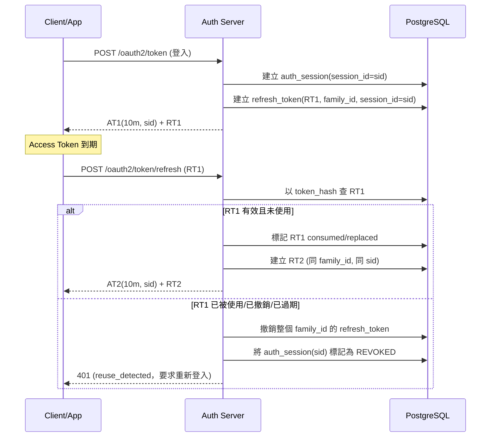

# Refresh Token Rotation 設計說明

本文件描述 Authorization Server 端的 Refresh Token 安全流程，重點包含：

- **10 分鐘短效 Access Token**
- **Refresh Token Rotation（每次刷新都換新）**
- **Reuse Detection（重用偵測）**
- **以 `sid` 做單裝置踢除，不影響其他裝置**

---

## 建議 Token 壽命

- Access Token：`10 分鐘`
- Refresh Token：`7 ~ 30 天`（依風險等級調整）

短效 AT 可降低外洩風險；RT 則透過 rotation + reuse detection 控制長期風險。

---

## 核心角色

- `sid`：Session ID，對應 `auth_session.session_id`
- `family_id`：同一次登入所產生的 RT 家族
- `token_hash`：Refresh Token 明文經 SHA-256 後儲存

---

## 整體時序（首次登入 + 正常刷新 + 重用偵測）

---

## Rotation 正常流程

1. 客戶端提交 RTx 至刷新端點
2. 伺服器驗證 RTx：
   - 存在
   - 未過期
   - 未撤銷
   - 未被使用（`consumed_at` / `replaced_by_token_id` 應為空）
3. 驗證通過後：
   - 發 ATx+1（仍 10 分鐘）
   - 發 RTx+1（新 token）
   - 將 RTx 標記為已使用並指向 RTx+1
4. 客戶端必須以 RTx+1 覆蓋舊 RTx

---

## Reuse Detection 處置邏輯

當 RTx 已經被消耗（rotation 完成）後又再次出現，視為高度疑似外洩。

### 觸發條件

- 查到 RTx 但：
  - `consumed_at` 不為空，或
  - `replaced_by_token_id` 不為空，或
  - `revoked_at` 不為空

### 處置策略（建議）

1. 立即拒絕此次刷新請求（401）
2. 將同 `family_id` 的所有 RT 標記撤銷（`revoke_reason='reuse_detected'`）
3. 將該 `sid` 對應 `auth_session` 標記為 `REVOKED`
4. 要求該裝置重新登入

> 若系統有高風險事件通知機制，建議同時觸發告警與使用者通知。

---

## sid 單裝置踢除（避免多設備互踢）

### 問題背景

傳統做法常用 `user_version` 全域失效，會造成同帳號多設備被一起踢出。

### 建議作法

- Access Token 內放 `sid`
- 資料庫以 `auth_session` 一筆代表一個裝置登入
- 登出單裝置時只撤銷該 `sid`：
  - `auth_session.status = REVOKED`
  - 撤銷該 `sid` 底下所有 RT

如此可達成：

- A 裝置登出，不影響 B 裝置
- Reuse Detection 也可定位到單一 `sid` / `family_id`
- 若要「全部登出」，再以 `user_id` 做全量撤銷

---

## 實作注意事項

1. Refresh Token 僅儲存 Hash（不可落地明文）
2. Rotation 更新與新 RT 建立需同交易（transaction）完成
3. 重用偵測查詢需命中索引（`token_hash`, `family_id`, `session_id`）
4. 清理排程需定期刪除過期且已撤銷的舊 RT
