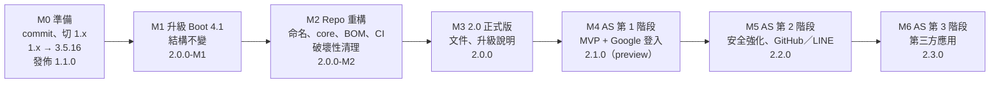

# 2.0 總設計

| 項目 | 內容 |
|---|---|
| 狀態 | 📝 設計草案，等待決策（見 [§7](#7-待確認事項)） |
| 日期 | 2026-10-07 |
| 範圍 | 兩大任務：① 升級到 Spring Boot 4.1；② 實作方案 C（標準 OAuth 2.0／OIDC Authorization Server） |

本文件是 2.0 的入口，說明目標、執行順序與里程碑。細節分別在三份子文件：

| 文件 | 內容 |
|---|---|
| [Spring Boot 4.1 升級設計](boot4-migration-design.md) | 版本對照、影響清單（已逐項對照程式碼）、做法、步驟、風險 |
| [Repo 拆分與建置設計](repo-structure-design.md) | repo 怎麼拆、模組與命名、建置與發佈、版本與分支、CI |
| [Authorization Server 設計](auth-server-design.md) | AS 的架構、14 項決策、資料表、流程、分階段計畫 |

---

## 1. 目標

| 目標 | 衡量方式 |
|---|---|
| 所有模組建立在**仍受支援**的 Spring 版本上 | Spring Boot 4.1.x（支援到 2027-07） |
| 提供可上線的 Authorization Server，支援第三方登入 | AS 第 2 階段完成：Google、GitHub、LINE 登入；Refresh Token 重用偵測；登出 |
| 業務 API 與登入服務的邊界**由建置強制** | Resource Server 模組無法依賴 AS 模組（enforcer 規則） |
| 使用者只需要一個版本號 | 統一版本 + BOM |
| 發佈的套件不依賴 SNAPSHOT 或未發佈的 parent | flatten 後的 POM 可獨立解析 |

### 非目標

- 不支援 WebFlux。
- 不自己實作 OAuth 2.0 協定（以 Spring Security 7 的 Authorization Server 為基礎）。
- 1.x 不加新功能。
- 本次不處理「發佈到 Maven Central」，但命名上保留這個選項。

---

## 2. 現況與目標對照

| 項目 | 現況（1.0.0） | 2.0 之後 |
|---|---|---|
| Spring Boot | 3.5.10-SNAPSHOT（已停止支援） | 4.1.x |
| Spring Security | 6.5 | 7.1（內含 Authorization Server） |
| 模組 | 3 個發佈模組 + 2 個 demo | 8 個發佈模組 + 3 個範例 + E2E 測試 |
| Resource Server starter | `jacky917-security-starter` | `jacky917-security-resource-server-starter`（舊名稱以 relocation 導向） |
| Authorization Server | 只有測試用 demo | `jacky917-security-authorization-server-starter` |
| 發佈的 POM | 依賴 parent 鏈 | 攤平，可獨立解析 |
| CI | 只有發佈流程 | PR 測試（Java 21、25）、文件檢查、依賴方向檢查 |
| 分支 | 只有 `main` | `main`（2.x）、`1.x`（維護） |

---

## 3. 執行順序與里程碑

| 里程碑 | 內容 | 詳細 | 完成條件 |
|---|---|---|---|
| **M0 準備** | commit 目前所有未提交的變更；建立 `1.x` 分支；`1.x` 的 parent 改為 3.5.16 正式版，發佈 `1.1.0`（含 Step 9 的 bug 修正） | [升級設計 §6 步驟 0](boot4-migration-design.md#6-實施步驟) | `1.1.0` 可被外部專案引入 |
| **M1 升級** | `main` 升級到 Boot 4.1.1，**不改結構** | [升級設計](boot4-migration-design.md) | 全部測試通過；行為回歸檢查通過 |
| **M2 重構** | 自有 parent + flatten、模組搬移與改名、core、BOM、relocation、enforcer、CI、破壞性清理 | [Repo 設計 §9](repo-structure-design.md#9-重構實施步驟) | 外部空專案可透過 BOM 引入 `2.0.0-M2` |
| **M3 2.0** | 文件重組、升級說明 | [Repo 設計 §6](repo-structure-design.md#6-文件結構) | 發佈 `2.0.0` |
| **M4 AS MVP** | AS starter、帳號密碼 + Google 登入、BFF 範例、E2E | [AS 設計 §11 第 1 階段](auth-server-design.md#11-分階段實作計畫) | 瀏覽器 → BFF → AS → RS 全流程成功 |
| **M5 AS 強化** | 重用偵測、登出、帳號連結、GitHub／LINE、金鑰輪換 | AS 設計第 2 階段 | AS 由 preview 轉為正式 |
| **M6 第三方應用** | 同意畫面、scope 權限、Admin API | AS 設計第 3 階段 | 第三方 client 只能取得同意範圍內的權限 |

### 為什麼是這個順序

| 順序 | 理由 |
|---|---|
| **先切 1.x，再動 main** | 現有使用者在 2.0 之前仍有可用、不依賴 SNAPSHOT 的版本 |
| **先升級，再重構** | 升級時結構不變、重構時版本不變。任何一步失敗都能清楚知道是哪件事造成的 |
| **先完成 2.0，再做 AS** | AS 直接建立在最終的結構、命名與 Spring 版本上，不必中途搬移。破壞性變更也集中在 2.0 一次完成，AS 只會是新增功能 |
| **AS 用小版本推進** | AS 是新增的 artifact，不影響 RS 使用者，不需要等大版本 |

---

## 4. 2.0 的破壞性變更清單

大版本是集中處理破壞性變更的唯一時機。以下分成「升級本身造成的」與「建議趁機一併處理的」。

### 4.1 必要（Spring Boot 4 造成）

| 變更 | 使用者要做的事 |
|---|---|
| 需要 Spring Boot 4.1 以上 | 升級應用程式 |
| 測試依賴改為 `spring-boot-starter-security-test`、`spring-boot-starter-webmvc-test` | 改 POM |
| `permit-all-patterns` 的 `**` 只能放在結尾 | 檢查設定 |
| 錯誤回應 JSON 改用應用程式的 Jackson 3 設定 | 通常不需要處理；有自訂 `spring.jackson.*` 時確認輸出格式 |

### 4.2 建議一併處理（待確認）

這些來自先前「建議新增或移除的功能」的整理：

| 變更 | 理由 | 使用者要做的事 |
|---|---|---|
| artifactId 依角色改名（R-D3） | 名稱清楚；有 relocation 緩衝 | 改 artifactId（不改也能用，會有提示） |
| groupId 改為 `io.github.jacky917`（R-D6） | 保留上 Maven Central 的可能 | 改 groupId |
| RS autoconfigure 的 Java 套件搬移（R-D4） | 與 AS 對稱 | 有擴充 `JwtAuthoritiesExtractor` 或注入 properties 的使用者改 import |
| `permit-all-patterns` 預設**不再放行 Swagger** | 預設安全 | 需要 Swagger 時自行加入 |
| 移除 `jacky917.security.method-security.enabled` | 關閉後註解靜默失效，風險大於用途 | 移除該設定 |
| 移除 `jacky917.security.debug-log`，改用標準 logger 等級 | 與 `logging.level` 重複，且容易灌爆日誌 | 改用 `logging.level.jacky917.security` |
| 移除 `@Secured` 支援 | 只保留一種授權寫法，避免組合錯誤 | 改用 `@PreAuthorize` 或 `@Require*` |
| `@RequireRole`／`@RequirePerm`／`@RequireScope` 跟隨 `jwt.prefix.*` 設定 | 修正 [限制 §3](limitations.md#3-單一條件註解的前綴固定) | 沒有修改過前綴的使用者不受影響 |

非破壞性的新功能（`CurrentUser`、測試輔助模組、啟動時偵測註解疊加等）可以在 2.x 的小版本陸續加入，不必擠進 2.0。

---

## 5. 決策索引

| 範圍 | 決策 | 已決定 | 待確認 |
|---|---|---|---|
| 平台 | Spring Boot 4.1、Java 21 | ✅ Boot 4.1（2026-10-07 使用者決定） | Java 基準是否降到 17（建議維持 21） |
| 升級 | [錯誤回應改用 Jackson 3 `JsonMapper`](boot4-migration-design.md#42-jackson-3) | — | 推薦方案 B |
| 升級 | 1.x 維護期 | — | 推薦 2.0.0 發佈後 6 個月 |
| Repo | [R-D1～R-D10](repo-structure-design.md#10-決策總表) | — | 全部待確認；R-D2、R-D6 影響最大 |
| AS | [D01～D14](auth-server-design.md#2-決策總表) | ✅ D01（Boot 4.1）、方案 C | D03、D05、D14 等 |
| 2.0 範圍 | [§4.2 建議一併處理的破壞性變更](#42-建議一併處理待確認) | — | 逐項確認 |

---

## 6. 風險

| 風險 | 影響 | 對策 |
|---|---|---|
| **範圍過大**：兩大任務加上重構，只有一位維護者 | 進度延宕，`main` 長時間不可發佈 | 每個里程碑都可以獨立發佈（M1、M2 各發一個 milestone 版本）；AS 拆成多個小版本 |
| 2.0 期間 1.x 使用者沒有新功能 | 低 | 1.x 定位就是維護；升級說明完整 |
| Spring Cloud 對 Boot 4.1 的正式相容版本尚未發佈（Maven Central 上 2026.0 目前只有 M1） | BFF 若以 Spring Cloud Gateway 實作，可能要等待 | BFF 範例先以 Spring Boot `oauth2Login` + `RestClient` 實作，見 [AS 設計 D03](auth-server-design.md#3-關鍵決策詳述) |
| 改 groupId、artifactId 後，使用者找不到新套件 | 中 | relocation POM；升級說明；README 醒目提示 |
| Spring Boot 4.2 在 2026-11 發佈 | 低 | 4.1 → 4.2 屬於小版本升級，在 2.x 內處理 |

---

## 7. 待確認事項

依「哪個里程碑開始前必須決定」排列：

| 需要在…之前決定 | # | 問題 | 推薦 |
|---|---|---|---|
| **M0** | 1 | 是否現在 commit 目前所有未提交的變更？（Step 9、10 的修正與文件都還沒 commit） | 是 |
| M0 | 2 | 1.x 的維護期多久？ | 2.0.0 發佈後 6 個月 |
| **M2** | 3 | groupId 是否改為 `io.github.jacky917`？（R-D6） | 是 |
| M2 | 4 | repo 是否改名為 `jacky917-security`？（R-D2） | 若 3 為是，則一併改 |
| M2 | 5 | artifactId 是否依角色改名？（R-D3） | 是 |
| M2 | 6 | [§4.2](#42-建議一併處理待確認) 的破壞性清理要納入哪些？ | 全部 |
| **M4** | 7 | 網頁前端是否接受 BFF 架構？（AS D03） | 是 |
| M4 | 8 | 第一版的第三方登入提供者？（AS D05） | Google |
| M4 | 9 | 資料庫用 PostgreSQL？（AS D14） | 是 |
| M4 | 10 | 是否有行動 App？是否需要第一版就開放註冊？是否有既有使用者要匯入？AS 的網域規劃？（AS §12） | — |

另外，`.cursor/rules/jacky917-security.mdc` 中「Spring Boot：3.5.10」的硬性決策，需要更新為 4.1。
